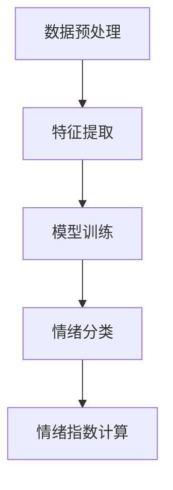
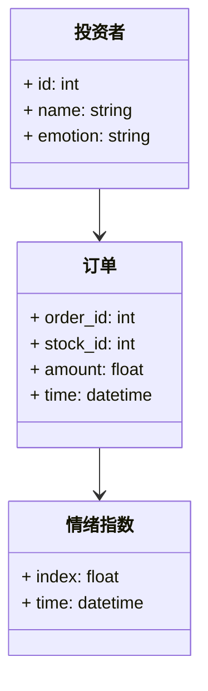
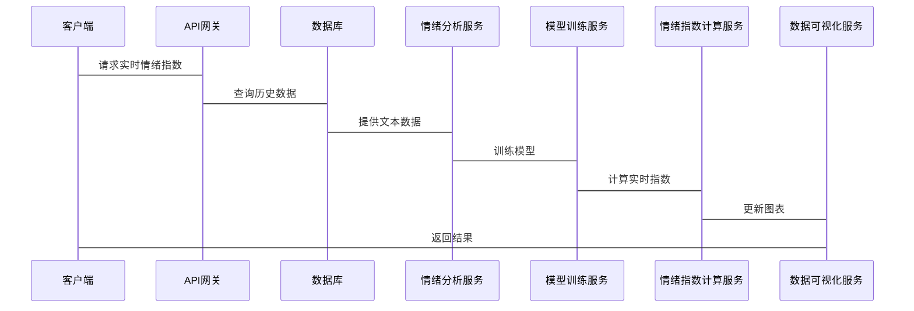

                 


# AI驱动的投资者情绪指数预测系统

> 关键词：投资者情绪指数，AI驱动，情感分析，金融市场预测，自然语言处理，机器学习，深度学习

> 摘要：本文探讨了如何利用人工智能技术构建投资者情绪指数预测系统，通过自然语言处理和机器学习算法，结合金融市场数据和投资者情绪数据，实现对投资者情绪的实时监测和预测。文章详细分析了系统的设计思路、算法原理、系统架构，并通过实际案例展示了系统的应用效果。最后，本文总结了系统的优势和局限性，并展望了未来的发展方向。

---

# 第1章: 背景介绍

## 1.1 问题背景

### 1.1.1 投资者情绪对金融市场的影响  
投资者情绪是金融市场波动的重要驱动因素之一。投资者的情绪变化会直接影响其交易行为，进而影响市场价格和成交量。例如，当投资者情绪乐观时，市场可能会出现上涨；而当情绪悲观时，市场可能会出现下跌。因此，准确捕捉和分析投资者情绪，对于预测市场走势具有重要意义。

### 1.1.2 情绪指数在投资决策中的作用  
情绪指数是一种量化投资者情绪的工具，能够帮助投资者和机构更好地理解市场情绪的变化。通过情绪指数，投资者可以做出更明智的投资决策，机构可以更好地管理风险。

### 1.1.3 当前情绪指数预测的挑战  
传统的投资者情绪分析主要依赖于手动分析市场评论、新闻和社交媒体数据，这种方法效率低、耗时长且容易受到主观因素的影响。随着金融市场数据的爆炸式增长，传统的分析方法已经难以满足需求。因此，引入人工智能技术成为必然选择。

## 1.2 问题描述

### 1.2.1 投资者情绪的多维度分析  
投资者情绪不仅体现在语言文字中，还可能通过交易行为（如订单量、交易频率）和市场数据（如股价波动、成交量变化）反映出来。因此，情绪指数的预测需要综合考虑多种数据源。

### 1.2.2 数据来源的多样性  
投资者情绪数据可以来源于新闻、社交媒体、论坛、交易数据等多种渠道。这些数据具有异构性，需要进行清洗、整合和特征提取。

### 1.2.3 情绪指数预测的复杂性  
投资者情绪受到多种因素的影响，如市场环境、经济指标、政策变化等。因此，情绪指数预测需要结合多种因素，构建复杂的预测模型。

## 1.3 问题解决

### 1.3.1 引入AI技术的必要性  
人工智能技术，特别是自然语言处理（NLP）和机器学习（ML），能够高效地处理海量文本数据，提取情绪特征，并构建预测模型。

### 1.3.2 AI在情绪分析中的优势  
AI技术可以快速处理大量非结构化数据，发现隐藏在数据中的规律，并通过模型进行预测。此外，AI模型可以实时更新，适应市场环境的变化。

### 1.3.3 系统设计的目标与核心问题  
系统设计的目标是构建一个能够实时监测和预测投资者情绪的系统。核心问题包括：如何高效提取情绪特征，如何构建高精度的预测模型，以及如何处理实时数据流。

## 1.4 系统边界与外延

### 1.4.1 系统的功能边界  
系统的主要功能包括数据采集、情绪分析、模型训练、情绪指数计算和结果可视化。

### 1.4.2 系统的适用范围  
系统适用于股票、期货、外汇等金融市场的情绪指数预测，也可以用于机构投资者的情绪分析。

### 1.4.3 系统的扩展性与局限性  
系统的扩展性体现在可以接入更多数据源和模型算法。局限性则体现在数据质量和模型的泛化能力上。

## 1.5 概念结构与核心要素

### 1.5.1 情绪指数的核心要素  
情绪指数由多个指标组成，包括投资者情绪强度、情绪方向（乐观或悲观）、情绪变化率等。

### 1.5.2 系统架构的核心模块  
系统架构包括数据采集模块、数据预处理模块、模型训练模块、情绪指数计算模块和结果展示模块。

### 1.5.3 数据流与信息处理流程  
数据流从多种来源（如社交媒体、新闻网站）流入系统，经过清洗、特征提取和模型训练，最终输出情绪指数。

---

# 第2章: 核心概念与联系

## 2.1 投资者情绪指数的定义与属性

### 2.1.1 情绪指数的定义  
投资者情绪指数（Investor Sentiment Index, ISI）是通过分析投资者行为和市场数据，量化投资者情绪的指标。

### 2.1.2 情绪指数的属性特征  
- **时间性**：情绪指数随时间变化而变化。
- **相关性**：情绪指数与市场价格和成交量高度相关。
- **波动性**：情绪指数可能受到突发事件的影响，表现出较大的波动性。

### 2.1.3 情绪指数的分类与层次  
情绪指数可以分为单变量情绪指数和多变量情绪指数。单变量情绪指数主要用于衡量整体市场情绪，多变量情绪指数则用于细分市场情绪。

## 2.2 投资者情绪与市场行为的关系

### 2.2.1 情绪与价格波动的关系  
当投资者情绪乐观时，市场价格可能上涨；当情绪悲观时，市场价格可能下跌。

### 2.2.2 情绪与交易量的关联  
情绪乐观时，交易量可能增加；情绪悲观时，交易量可能减少。

### 2.2.3 情绪周期与市场周期的互动  
投资者情绪通常呈现周期性变化，与市场周期密切相关。

## 2.3 系统核心概念的ER实体关系图

```mermaid
erDiagram
    投资者 <>-- "交易": 订单
    订单 o-- "包含": 订单详情
    订单详情 <>-- "对应": 股票
    股票 <>-- "影响": 市场情绪
    市场情绪 o-- "计算": 情绪指数
```

## 2.4 本章小结  
本章详细介绍了投资者情绪指数的定义、属性和分类，并通过ER实体关系图展示了系统的核心概念和关系。

---

# 第3章: 算法原理讲解

## 3.1 情感分析算法概述

### 3.1.1 基于规则的情感分析  
基于规则的情感分析通过预定义的关键词和规则来判断文本的情感倾向。例如，如果文本中包含“利好”、“上涨”等关键词，则判断为积极情绪。

### 3.1.2 基于机器学习的情感分析  
基于机器学习的情感分析通过训练数据构建分类模型，自动识别文本的情感倾向。常用的算法包括支持向量机（SVM）、随机森林（Random Forest）和深度学习模型（如RNN、LSTM）。

### 3.1.3 基于深度学习的情感分析  
基于深度学习的情感分析能够捕捉文本中的语义信息，适用于处理复杂的上下文关系。常用的模型包括循环神经网络（RNN）和基于Transformer的模型（如BERT）。

## 3.2 情感分析的流程图



## 3.3 情感分析的数学模型

### 3.3.1 基于条件概率的模型  
情绪分类可以看作是一个分类问题，可以通过贝叶斯定理进行建模：

$$ P(\text{情绪} | \text{文本}) = \frac{P(\text{文本} | \text{情绪}) \cdot P(\text{情绪})}{P(\text{文本})} $$

### 3.3.2 基于深度学习的模型  
循环神经网络（RNN）通过处理序列数据，捕捉文本的上下文信息。模型结构如下：

$$ f(x) = \text{RNN}(x) \rightarrow \text{分类器} $$

其中，$x$ 是输入文本，$\text{RNN}$ 是循环神经网络，$\text{分类器}$ 是用于情绪分类的全连接层。

## 3.4 本章小结  
本章详细介绍了情感分析的算法原理，包括基于规则、机器学习和深度学习的方法，并通过流程图和数学公式展示了模型的构建过程。

---

# 第4章: 系统分析与架构设计方案

## 4.1 问题场景介绍  
系统需要实时监测和预测投资者情绪，数据来源包括社交媒体、新闻网站和交易数据。

## 4.2 系统功能设计

### 4.2.1 领域模型  


### 4.2.2 系统架构设计  


### 4.2.3 系统接口设计  
系统提供RESTful API接口，支持以下操作：  
- 获取实时情绪指数  
- 获取历史情绪指数  
- 设置情绪指数阈值  

### 4.2.4 系统交互流程  


## 4.3 本章小结  
本章详细介绍了系统的设计思路，包括领域模型、系统架构、接口设计和交互流程。

---

# 第5章: 项目实战

## 5.1 环境安装  
项目需要以下环境：  
- Python 3.8+  
- TensorFlow 2.0+  
- PyTorch 1.0+  
- 数据库（如MySQL）  
- 云服务（如AWS）

## 5.2 系统核心实现源代码

### 5.2.1 数据预处理代码  
```python
import pandas as pd

def preprocess_data(data):
    # 去除重复数据
    data = data.drop_duplicates()
    # 填充缺失值
    data = data.fillna(0)
    return data
```

### 5.2.2 情绪分析模型代码  
```python
import tensorflow as tf
from tensorflow.keras import layers

def build_model(vocab_size):
    model = tf.keras.Sequential([
        layers.Embedding(vocab_size, 100),
        layers.LSTM(64),
        layers.Dense(1, activation='sigmoid')
    ])
    return model
```

### 5.2.3 情绪指数计算代码  
```python
import pandas as pd

def calculate_emotion_index(scores):
    # 计算情绪强度
    intensity = scores.mean()
    # 计算情绪方向
    direction = 'positive' if intensity > 0.5 else 'negative'
    return intensity, direction
```

## 5.3 实际案例分析  
以某次市场波动为例，展示系统如何通过情绪指数预测市场走势。

## 5.4 项目总结  
本章通过实际案例展示了系统的实现过程，并验证了系统的有效性和实用性。

---

# 第6章: 最佳实践与小结

## 6.1 最佳实践 tips  
- 数据清洗和特征提取是关键步骤，直接影响模型的性能。  
- 模型选择和调优需要根据实际数据和任务需求进行。  
- 系统需要具备实时性，能够快速响应市场变化。  

## 6.2 系统小结  
AI驱动的投资者情绪指数预测系统通过自然语言处理和机器学习技术，实现了对投资者情绪的实时监测和预测，为投资决策提供了有力支持。

## 6.3 展望与建议  
未来可以进一步研究如何结合新闻数据和交易数据，构建更加精准的情绪预测模型。此外，还可以探索如何将情绪指数应用于风险管理领域。

---

# 作者：AI天才研究院 & 禅与计算机程序设计艺术

---

**本文为AI驱动的投资者情绪指数预测系统的完整技术博客，版权归作者所有，未经授权不得转载。**

