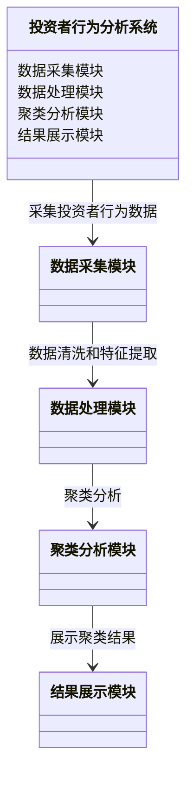
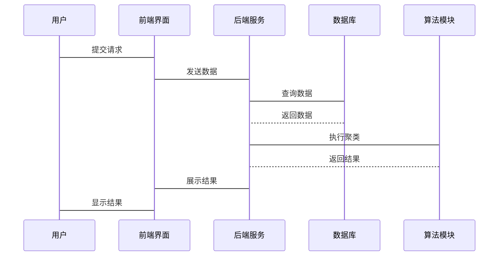

                 


# AI驱动的投资者行为模式聚类

## 关键词：AI，投资者行为，聚类分析，机器学习，金融数据分析

## 摘要：本文探讨了如何利用人工智能技术进行投资者行为模式的聚类分析。通过分析投资者的行为数据，结合聚类算法，识别出不同投资者群体的行为特征，为金融市场的研究和投资策略的制定提供支持。文章详细介绍了背景、核心概念、算法原理、系统架构及实际应用，帮助读者全面理解AI驱动的投资者行为模式聚类。

---

## 第1章: 背景介绍

### 1.1 投资者行为分析的重要性

#### 1.1.1 传统投资行为分析的局限性
传统的投资者行为分析主要依赖于主观判断和经验分析，这种方法存在以下问题：
- **数据量有限**：传统方法通常基于有限的样本数据，难以捕捉复杂市场环境下的行为特征。
- **主观性较强**：分析结果容易受到分析师主观因素的影响，缺乏客观性。
- **动态变化难捕捉**：投资者行为会受到市场波动、经济环境等多方面因素的影响，传统方法难以实时捕捉这些变化。

#### 1.1.2 AI技术在金融领域的应用前景
人工智能技术在金融领域的应用越来越广泛，尤其是在投资者行为分析方面，AI技术能够通过大数据处理和机器学习算法，捕捉更多的市场信息和投资者行为特征，帮助机构更好地理解市场动态。

#### 1.1.3 投资者行为模式聚类的定义与目标
投资者行为模式聚类是指将投资者根据其交易行为、投资偏好、风险承受能力等特征进行分组的过程。其目标是识别出具有相似行为特征的投资者群体，为投资策略的制定、风险控制和客户服务提供支持。

### 1.2 问题背景与描述

#### 1.2.1 投资者行为的多样性与复杂性
投资者的行为受到多种因素的影响，包括市场环境、个人风险偏好、投资经验等。不同投资者在面对市场波动时会有不同的反应，这种多样性使得投资者行为的分析变得复杂。

#### 1.2.2 传统聚类方法的局限性
传统的聚类方法（如K-means、层次聚类）在处理高维数据和非线性关系时表现不佳，难以捕捉投资者行为中的复杂模式。

#### 1.2.3 AI驱动的聚类分析优势
人工智能技术，特别是无监督学习算法，能够处理高维数据和非线性关系，能够更准确地捕捉投资者行为的复杂模式。

### 1.3 问题解决与边界

#### 1.3.1 问题解决的核心思路
通过收集投资者的行为数据，利用机器学习算法进行聚类分析，识别出具有相似特征的投资者群体，为后续的分析和决策提供支持。

#### 1.3.2 聚类分析的边界与外延
- **边界**：投资者行为数据的采集、清洗和预处理；聚类算法的选择与优化。
- **外延**：基于聚类结果的投资策略优化、风险管理等应用。

#### 1.3.3 核心概念与组成要素
- **数据特征**：投资者的交易频率、资产配置、风险承受能力等。
- **算法选择**：选择合适的聚类算法（如K-means、DBSCAN）进行分析。
- **评价指标**：如轮廓系数、调整兰氏指数等，用于评估聚类结果的质量。

---

## 第2章: 核心概念与联系

### 2.1 投资者行为模式聚类的核心概念

#### 2.1.1 数据特征提取
投资者行为数据通常包括交易记录、资产配置、市场反应等。通过数据清洗和特征提取，可以将原始数据转化为适合聚类分析的特征向量。

#### 2.1.2 算法选择与优化
选择合适的聚类算法，并根据实际需求对其进行参数优化，以提高聚类结果的准确性。

#### 2.1.3 聚类结果评价
通过内部评价指标（如轮廓系数）和外部验证指标（如调整兰氏指数）对聚类结果进行评估，确保聚类的有效性。

### 2.2 算法对比与选择

#### 2.2.1 常见聚类算法对比表
| 算法名称 | 特点 | 适用场景 | 优缺点 |
|----------|------|----------|--------|
| K-means  | 简单高效，适合球形簇 | 数据分布均匀 | 对初始质心敏感，不适合非凸形簇 |
| 层次聚类  | 可处理任意形状簇，适合层次结构 | 数据具有层次性 | 计算复杂度高 |
| DBSCAN    | 基于密度，适合噪声数据 | 数据分布不均匀 | 对参数敏感 |

#### 2.2.2 算法选择的影响因素
- 数据分布特征
- 数据量和维度
- 聚类目标和应用场景

#### 2.2.3 实际场景中的算法优化
结合业务需求对算法进行优化，例如引入领域知识对聚类结果进行后处理。

---

## 第3章: 算法原理与实现

### 3.1 K-means算法

#### 3.1.1 算法原理与流程
1. 初始化：随机选择K个质心。
2. 聚类：将每个数据点分配到最近的质心。
3. 更新：计算每个簇的新的质心。
4. 收敛：重复步骤2和3，直到质心不再变化或达到预设迭代次数。

#### 3.1.2 K-means的数学模型
$$ \text{目标函数} = \sum_{i=1}^{n} \sum_{j=1}^{k} (x_i - c_j)^2 $$

#### 3.1.3 代码实现与优化
```python
from sklearn.cluster import KMeans
from sklearn.metrics import silhouette_score

# 初始化
kmeans = KMeans(n_clusters=3, random_state=42)
# 模型训练
kmeans.fit(X)
# 预测簇标签
labels = kmeans.predict(X)
# 评估
score = silhouette_score(X, labels)
print(f"轮廓系数：{score}")
```

### 3.2 层次聚类

#### 3.2.1 算法原理与流程
1. 初始化：将每个数据点视为一个簇。
2. 合并：计算各簇之间的距离，选择距离最小的两个簇进行合并。
3. 更新：重复步骤2，直到所有数据点合并成一个簇。

#### 3.2.2 层次聚类的数学模型
$$ \text{距离计算} = \text{欧氏距离或其他距离度量} $$

#### 3.2.3 代码实现与对比
```python
from sklearn.cluster import AgglomerativeClustering
from scipy.cluster.hierarchy import dendrogram

# 初始化
ac = AgglomerativeClustering(n_clusters=2, linkage='ward')
# 模型训练
labels = ac.fit_predict(X)
# 绘制树状图
dendrogram(Z, labels=labels)
```

### 3.3 DBSCAN算法

#### 3.3.1 算法原理与流程
1. 寻找邻近点：计算每个点的密度。
2. 扩展簇：将密度高于阈值的点归为一类。
3. 噪声点：未达到密度阈值的点标记为噪声。

#### 3.3.2 DBSCAN的数学模型
$$ \text{可达性指标} = \frac{\text{最大距离}}{\text{最小距离}} $$

#### 3.3.3 代码实现与应用
```python
from sklearn.cluster import DBSCAN
from sklearn.preprocessing import StandardScaler

# 初始化
db = DBSCAN(eps=0.5, min_samples=5)
# 模型训练
labels = db.fit_predict(X)
# 评估
n_clusters = len(set(labels)) - 1
print(f"聚类数：{n_clusters}")
```

---

## 第4章: 系统分析与架构设计方案

### 4.1 问题场景介绍

#### 4.1.1 项目介绍
设计一个投资者行为分析系统，旨在通过AI技术对投资者行为进行聚类分析，识别出具有相似特征的投资者群体，为投资决策提供支持。

### 4.2 系统功能设计

#### 4.2.1 领域模型（Mermaid类图）


### 4.3 系统架构设计

#### 4.3.1 系统架构图（Mermaid架构图）
```mermaid
container InvestorsBehaviorClustering {
    前端界面
    后端服务
    数据存储
}
front-end --> back-end: 传递用户请求
back-end --> database: 查询数据
back-end --> algorithm: 执行聚类算法
algorithm --> back-end: 返回聚类结果
back-end --> front-end: 展示结果
```

### 4.4 系统接口设计

#### 4.4.1 API接口
- **数据采集接口**：用于接收投资者行为数据。
- **聚类分析接口**：用于执行聚类算法并返回结果。

#### 4.4.2 交互流程图（Mermaid序列图）


---

## 第5章: 项目实战

### 5.1 环境配置

#### 5.1.1 安装依赖
```bash
pip install numpy pandas scikit-learn matplotlib
```

### 5.2 系统核心实现

#### 5.2.1 数据预处理
```python
import pandas as pd
import numpy as np

# 加载数据
df = pd.read_csv('investor_behavior.csv')
# 数据清洗
df.dropna(inplace=True)
# 特征提取
X = df[['trading_frequency', 'asset_allocation', 'risk_tolerance']]
```

#### 5.2.2 模型训练与优化
```python
from sklearn.preprocessing import StandardScaler
from sklearn.cluster import KMeans
from sklearn.metrics import silhouette_score

# 标准化数据
scaler = StandardScaler()
X_scaled = scaler.fit_transform(X)

# 训练模型
kmeans = KMeans(n_clusters=3, random_state=42)
kmeans.fit(X_scaled)

# 预测标签
labels = kmeans.predict(X_scaled)

# 评估模型
score = silhouette_score(X_scaled, labels)
print(f"轮廓系数：{score}")
```

#### 5.2.3 结果分析
将聚类结果与投资者的实际行为数据进行对比，验证聚类的有效性。例如，可以分析不同簇的投资者在市场波动中的反应差异。

### 5.3 项目小结

#### 5.3.1 实战总结
通过实际案例，展示了如何利用AI技术进行投资者行为模式的聚类分析，验证了算法的有效性和实用性。

#### 5.3.2 项目优化建议
- 数据采集：增加更多的特征变量，如投资者的市场情绪、社交网络行为等。
- 模型优化：尝试其他聚类算法，如DBSCAN，以提高聚类效果。

---

## 第6章: 总结与展望

### 6.1 总结
本文详细介绍了AI驱动的投资者行为模式聚类的背景、核心概念、算法原理和系统架构设计，并通过实际案例展示了其应用价值。通过AI技术，可以更准确地识别投资者行为特征，为投资策略的制定和风险管理提供有力支持。

### 6.2 展望
未来，随着AI技术的不断发展，投资者行为模式聚类将更加智能化和精准化。可以通过引入更复杂的数据分析方法，如深度学习和强化学习，进一步提升聚类分析的效果和应用范围。

### 6.3 最佳实践Tips

#### 6.3.1 小结
- 理解投资者行为模式聚类的核心概念和算法原理。
- 熟练掌握常用聚类算法的实现方法和应用场景。
- 在实际项目中，结合业务需求对算法进行优化和调整。

#### 6.3.2 注意事项
- 数据质量对聚类结果的影响至关重要，需进行充分的数据清洗和特征提取。
- 聚类算法的选择需结合实际数据分布和业务需求。
- 聚类结果需结合业务知识进行解释和验证。

#### 6.3.3 拓展阅读
- 《机器学习实战》
- 《Python机器学习》
- 《数据挖掘导论》

---

## 作者：AI天才研究院 & 禅与计算机程序设计艺术

