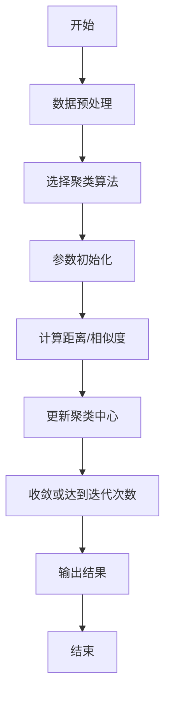
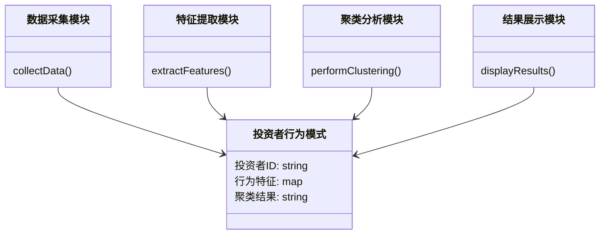
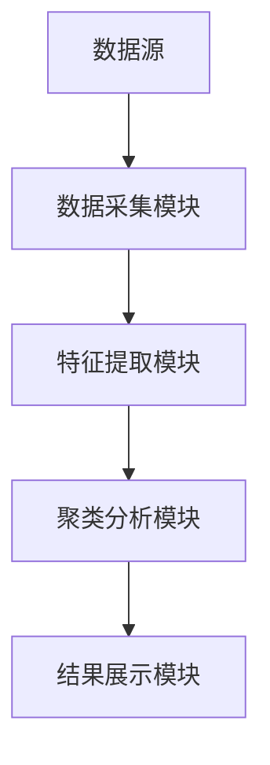

                 


# AI驱动的投资者行为模式聚类分析

## 关键词：投资者行为模式、聚类分析、机器学习、自然语言处理、深度学习

## 摘要：本文将详细探讨如何利用AI技术进行投资者行为模式的聚类分析，从背景介绍、核心概念、算法原理到系统设计和项目实战，逐步解析投资者行为模式分析的全过程，揭示AI在金融领域的强大应用潜力。

---

# 第一部分: 背景介绍与核心概念

## 第1章: 背景介绍与核心概念

### 1.1 投资者行为模式聚类的背景与意义

#### 1.1.1 问题背景与问题描述
投资者行为模式分析是金融学中的重要研究方向。投资者的行为特征、决策模式和交易策略往往受到心理、市场环境和历史数据的影响。然而，投资者行为的多样性使得传统的单一分析方法难以覆盖所有情况。通过聚类分析，可以将具有相似行为特征的投资者划分为不同的群体，从而为投资策略优化、风险控制和个性化服务提供数据支持。

#### 1.1.2 聚类分析在投资者行为分析中的应用价值
聚类分析是一种无监督学习方法，能够从数据中自动发现隐藏的模式和结构。在投资者行为分析中，聚类分析可以帮助识别不同类型的投资风格、风险偏好和交易习惯，从而为金融机构提供个性化的投资建议和服务。

#### 1.1.3 AI技术在投资者行为分析中的优势
AI技术的引入，使得投资者行为模式分析更加高效和精准。通过自然语言处理、深度学习和强化学习等技术，可以对海量的非结构化数据（如社交媒体评论、新闻报道）进行分析，提取投资者情绪、意图和行为特征。

---

### 1.2 核心概念与定义

#### 1.2.1 投资者行为模式的定义
投资者行为模式是指投资者在特定市场环境和心理驱动下表现出的决策和交易特征。这些特征可以通过交易数据、市场反应和投资者反馈等多维度进行建模和分析。

#### 1.2.2 聚类分析的基本概念
聚类分析是一种无监督学习方法，旨在将数据点划分为若干个簇，使得簇内数据点的相似性较高，而簇间数据点的相似性较低。常用的聚类算法包括K-means、层次聚类和DBSCAN等。

#### 1.2.3 AI驱动的投资者行为模式分析框架
AI驱动的投资者行为模式分析框架通常包括数据采集、特征提取、聚类分析、结果解释和应用优化五个阶段。

---

### 1.3 问题解决与边界

#### 1.3.1 问题解决思路
通过聚类分析，识别投资者行为的共性特征，分类投资者群体，为投资决策提供数据支持。

#### 1.3.2 分析的边界与外延
- 边界：仅分析投资者的行为模式，不涉及投资收益预测。
- 外延：投资者行为模式可能受到市场环境、政策变化等因素的影响，需结合具体场景进行分析。

#### 1.3.3 核心要素与组成结构
- 数据源：交易数据、社交媒体数据、市场数据。
- 分析方法：聚类算法、特征提取方法。
- 应用场景：投资策略优化、风险控制、个性化服务。

---

## 第2章: 核心概念与联系

### 2.1 聚类分析的基本原理

#### 2.1.1 聚类分析的原理概述
聚类分析的目标是将数据点划分为若干个簇，使得簇内数据点的相似性较高，而簇间数据点的相似性较低。常用的距离度量方法包括欧氏距离、曼哈顿距离和余弦相似度。

#### 2.1.2 聚类分析的核心算法
- K-means：基于距离的聚类算法，适用于球形簇。
- 层次聚类：基于层次结构的聚类方法，适用于任意形状的簇。
- DBSCAN：基于密度的聚类算法，适用于噪声较多的数据集。

#### 2.1.3 聚类分析的特征与优势
- 特征：无监督学习、数据驱动、簇内一致性高。
- 优势：能够发现数据中的潜在结构，适用于复杂场景。

---

### 2.2 投资者行为模式的特征分析

#### 2.2.1 投资者行为模式的属性特征
| 行为特征 | 描述 |
|----------|------|
| 交易频率 | 每天交易次数 |
| 风险偏好 | 高风险或低风险投资偏好 |
| 情绪波动 | 投资者情绪的波动性 |

#### 2.2.2 不同投资者行为模式的对比分析
| 行为模式 | 特征描述 |
|----------|----------|
| 追涨杀跌型 | 高交易频率，情绪波动大 |
| 长期价值型 | 低交易频率，风险偏好低 |

#### 2.2.3 投资者行为模式的ER实体关系图
```mermaid
erd
   投资者行为模式
    +-- 投资者ID: string
    +-- 行为特征: map
    +-- 聚类结果: string
```

---

## 第3章: 算法原理与数学模型

### 3.1 聚类分析算法原理

#### 3.1.1 K-means算法原理
K-means算法是一种基于距离的聚类算法，适用于球形簇。算法步骤如下：
1. 初始化聚类中心。
2. 计算每个数据点与聚类中心的距离。
3. 将数据点分配到最近的聚类中心。
4. 更新聚类中心。
5. 重复步骤2-4，直到收敛。

#### 3.1.2 层次聚类算法原理
层次聚类算法是一种基于层次结构的聚类方法，适用于任意形状的簇。算法步骤如下：
1. 计算所有数据点之间的距离。
2. 将距离最近的两个数据点合并成一个簇。
3. 重复步骤2，直到所有数据点合并成一个簇。

#### 3.1.3 DBSCAN算法原理
DBSCAN算法是一种基于密度的聚类算法，适用于噪声较多的数据集。算法步骤如下：
1. 选择一个未访问的数据点作为起点。
2. 找出与起点距离在一定范围内的所有数据点。
3. 将这些数据点合并成一个簇。
4. 重复步骤1-3，直到所有数据点处理完毕。

---

### 3.2 聚类分析的数学模型

#### 3.2.1 K-means算法的数学公式
$$ \text{目标函数} = \sum_{i=1}^{k} \sum_{j=1}^{n_i} \|x_j - c_i\|^2 $$
其中，$k$为聚类数，$n_i$为第$i$个簇中的数据点数，$x_j$为数据点，$c_i$为第$i$个簇的聚类中心。

#### 3.2.2 层次聚类算法的距离计算公式
$$ \text{距离} = \sqrt{(x_i - x_j)^2 + (y_i - y_j)^2} $$

---

### 3.3 算法流程图



---

## 第4章: 系统分析与架构设计

### 4.1 问题场景分析

#### 4.1.1 投资者行为数据的收集与处理
投资者行为数据的来源包括交易记录、社交媒体评论、市场新闻等。数据预处理包括数据清洗、特征提取和数据标准化。

#### 4.1.2 数据特征提取与预处理
特征提取是投资者行为分析的关键步骤，常用的特征包括交易频率、风险偏好和情绪波动等。

#### 4.1.3 系统功能需求分析
系统功能需求包括数据采集、特征提取、聚类分析和结果展示。

---

### 4.2 系统架构设计

#### 4.2.1 领域模型类图


#### 4.2.2 系统架构图


---

## 第5章: 项目实战

### 5.1 环境安装

#### 5.1.1 安装Python环境
```bash
python --version
pip install numpy
pip install scikit-learn
pip install matplotlib
```

#### 5.1.2 数据集准备
数据集包括投资者ID、交易记录和社交媒体评论。

---

### 5.2 系统核心实现

#### 5.2.1 数据预处理
```python
import pandas as pd
import numpy as np

# 数据清洗
data = pd.read_csv('investor_behavior.csv')
data.dropna(inplace=True)
```

#### 5.2.2 特征提取
```python
from sklearn.feature_extraction.text import TfidfVectorizer

vectorizer = TfidfVectorizer()
tfidf = vectorizer.fit_transform(data['comments'])
```

#### 5.2.3 聚类分析
```python
from sklearn.cluster import KMeans

kmeans = KMeans(n_clusters=5, random_state=0)
clusters = kmeans.fit_predict(tfidf)
```

---

### 5.3 代码解读与分析

#### 5.3.1 聚类分析结果可视化
```python
from sklearn.metrics import silhouette_score

silhouette_score(tfidf, clusters)
```

#### 5.3.2 聚类结果展示
```python
import matplotlib.pyplot as plt

plt.scatter(tfidf, clusters)
plt.show()
```

---

## 第6章: 最佳实践、小结与展望

### 6.1 最佳实践 Tips
- 数据预处理是关键，确保数据质量。
- 选择合适的聚类算法，避免过拟合。
- 结果解释是关键，结合业务场景进行分析。

### 6.2 小结
本文详细介绍了AI驱动的投资者行为模式聚类分析的全过程，从背景介绍、核心概念到算法实现和系统设计，为读者提供了全面的技术指导。

### 6.3 注意事项
- 数据隐私和安全问题需高度重视。
- 模型解释性需结合业务场景进行优化。

### 6.4 拓展阅读
- 《机器学习实战》
- 《深度学习导论》

---

## 作者：AI天才研究院/AI Genius Institute & 禅与计算机程序设计艺术 /Zen And The Art of Computer Programming

---

