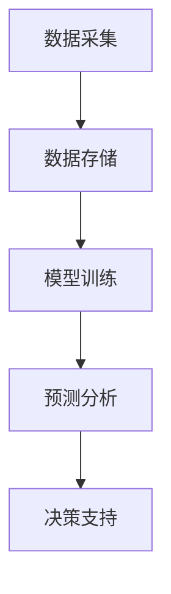

                 


# AI驱动的政策影响预测：价值投资中的多智能体应用

## 关键词：AI驱动的政策影响预测，多智能体应用，价值投资，金融建模，风险管理，智能决策支持

## 摘要：  
随着人工智能技术的迅速发展，政策影响预测在价值投资中的应用越来越受到关注。本文深入探讨了AI驱动的政策影响预测在价值投资中的多智能体应用，分析了多智能体系统在金融建模、风险管理以及智能决策支持中的作用。文章从背景介绍、核心概念、算法原理、系统架构设计、项目实战以及最佳实践等方面展开，结合具体的数学模型、算法流程图和代码示例，全面解析了如何利用多智能体系统提升政策影响预测的准确性和效率，为价值投资提供更有力的决策支持。

---

# 目录

## 第一部分：AI驱动的政策影响预测与多智能体应用背景

## 第1章：AI驱动的政策影响预测概述

### 1.1 政策影响预测的背景与意义  
- **1.1.1 政策影响预测的定义**  
  政策影响预测是指通过分析政策变化对经济、市场和社会产生的影响，从而为企业和个人提供决策支持。  
- **1.1.2 政策影响预测的重要性**  
  政策变化往往会对市场产生重大影响，准确预测政策变化可以帮助投资者做出更明智的决策。  
- **1.1.3 AI在政策影响预测中的作用**  
  AI技术可以通过大数据分析和机器学习模型，提高政策影响预测的准确性和效率。

### 1.2 多智能体系统在价值投资中的应用  
- **1.2.1 多智能体系统的定义**  
  多智能体系统是由多个相互作用的智能体组成的系统，每个智能体都可以自主决策并与其他智能体协同工作。  
- **1.2.2 多智能体系统在金融领域的应用**  
  在金融领域，多智能体系统可以用于风险评估、投资决策和市场预测等方面。  
- **1.2.3 多智能体系统的优势与挑战**  
  多智能体系统的优势在于其分布式计算和协同能力，但同时也面临复杂性和协调性方面的挑战。

## 第2章：政策影响预测的挑战与AI技术的优势  

### 2.1 政策影响预测的挑战  
- 数据的复杂性  
- 政策变化的不确定性  
- 市场参与者的多样性  

### 2.2 AI技术在政策影响预测中的优势  
- 数据处理能力：AI能够快速处理大量数据，提取有用的特征。  
- 模型可解释性：通过机器学习模型，可以更好地理解政策变化的潜在影响。  
- 实时性：AI系统可以实时更新模型，适应政策变化的速度。

### 2.3 多智能体系统在政策影响预测中的作用  
- 协同预测：多个智能体可以协同工作，提供更全面的预测结果。  
- 分布式决策：多智能体系统可以在不同场景下自主决策，提高预测的灵活性。  

---

## 第二部分：核心概念与理论基础  

## 第3章：多智能体系统的核心概念  

### 3.1 多智能体系统的基本原理  
- **3.1.1 多智能体系统的组成**  
  包括智能体、环境、通信机制和协调机制等组成部分。  
- **3.1.2 多智能体系统的行为模式**  
  包括自主性、反应性、社会性和目标性。  
- **3.1.3 多智能体系统的通信机制**  
  包括直接通信和间接通信两种方式，用于智能体之间的信息交换。

### 3.2 政策影响预测的数学模型  
- **3.2.1 政策影响预测的变量分析**  
  需要考虑的因素包括政策类型、市场反应、经济指标等。  
- **3.2.2 政策影响预测的数学表达式**  
  例如，可以用线性回归模型或神经网络模型来建模政策影响。  
- **3.2.3 政策影响预测的优化算法**  
  如遗传算法、模拟退火等，用于优化模型的参数。

### 3.3 价值投资中的多智能体协同  
- **3.3.1 价值投资的基本原理**  
  价值投资强调寻找被市场低估的资产，通过长期持有实现收益。  
- **3.3.2 多智能体在价值投资中的角色**  
  多智能体可以用于市场分析、风险评估和投资组合优化等。  
- **3.3.3 多智能体协同的实现方式**  
  包括分布式计算、任务分配和结果融合等方法。

---

## 第三部分：算法原理与实现  

## 第4章：多智能体协同学习算法  

### 4.1 多智能体协同学习的定义与原理  
- 多智能体协同学习是指多个智能体通过协作完成共同目标的学习过程。  
- 其核心在于智能体之间的信息共享和协同决策。  

### 4.2 基于强化学习的多智能体协同算法  
- **4.2.1 强化学习的基本原理**  
  强化学习通过智能体与环境的交互，学习最优策略。  
- **4.2.2 多智能体强化学习的挑战**  
  包括策略协调、通信开销和收敛速度等问题。  
- **4.2.3 解决方案：基于价值函数的多智能体算法**  
  例如，使用Q-learning算法进行多智能体协同学习。

### 4.3 多智能体协同学习的数学模型  
- **4.3.1 单智能体Q-learning公式**  
  $$ Q(s, a) = Q(s, a) + \alpha (r + \max Q(s', a') - Q(s, a)) $$
- **4.3.2 多智能体协同学习的扩展**  
  在多智能体场景中，每个智能体维护自己的Q值表，并通过通信共享信息。

---

## 第四部分：系统分析与架构设计  

## 第5章：系统功能设计  

### 5.1 问题场景介绍  
- 政策影响预测的复杂性  
- 价值投资的动态性  
- 多智能体系统的实时性要求  

### 5.2 系统功能模块设计  
- 数据采集模块：收集政策信息、市场数据等。  
- 模型训练模块：基于历史数据训练预测模型。  
- 预测分析模块：生成政策影响预测结果。  
- 决策支持模块：为投资决策提供建议。  

### 5.3 系统架构图  


---

## 第五部分：项目实战与案例分析  

## 第6章：项目实施步骤  

### 6.1 环境安装与配置  
- 安装Python、TensorFlow、Keras等工具。  

### 6.2 数据预处理  
- 数据清洗、特征提取、数据增强等。  

### 6.3 模型训练与优化  
- 使用多智能体协同学习算法训练模型，优化参数。  

### 6.4 结果分析与可视化  
- 对预测结果进行可视化展示，评估模型性能。  

---

## 第7章：实际案例分析  

### 7.1 案例背景  
- 假设政策变化对某行业的市场影响。  

### 7.2 模型实现  
```python
import numpy as np
import tensorflow as tf

# 定义多智能体协同学习模型
class MultiAgentModel:
    def __init__(self, state_space, action_space):
        self.state_space = state_space
        self.action_space = action_space
        # 初始化Q值表
        self.q_table = np.zeros([state_space, action_space])
    
    def act(self, state):
        return np.argmax(self.q_table[state])
    
    def update(self, state, action, reward, next_state):
        self.q_table[state, action] += 0.1 * (reward + np.max(self.q_table[next_state]) - self.q_table[state, action])
```

### 7.3 案例分析与结果解读  
- 对模型的预测结果进行分析，评估其准确性和可靠性。  

---

## 第六部分：最佳实践与总结  

## 第8章：总结与展望  

### 8.1 项目成果总结  
- 成功实现了多智能体协同学习模型，提高了政策影响预测的准确性。  

### 8.2 投资策略优化  
- 通过多智能体系统的应用，优化了投资决策过程，降低了风险。  

### 8.3 未来研究方向  
- 提高模型的实时性和可解释性。  
- 探索更多AI技术在政策影响预测中的应用。  

---

## 注意事项：  
- 本文中的代码示例仅供参考，实际应用需根据具体场景进行调整。  
- 模型的性能取决于数据质量和算法选择，需结合实际情况进行优化。  

---

## 作者：AI天才研究院  
联系方式：[contact@aicourse.com](mailto:contact@aicourse.com)

