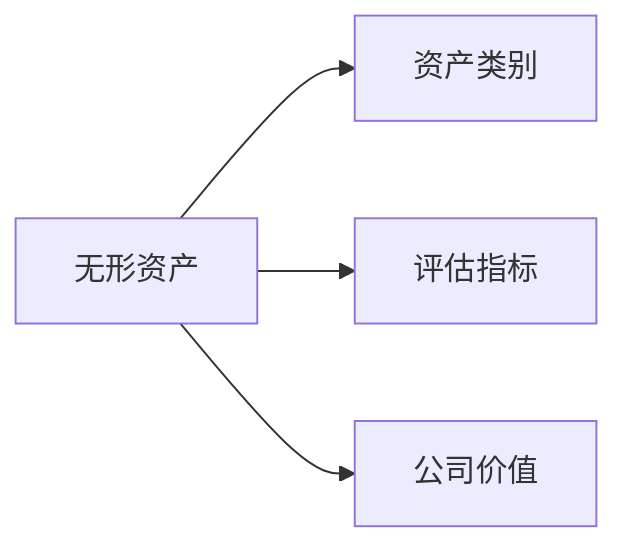
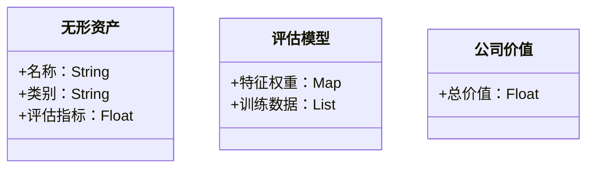

                 


# AI驱动的无形资产组合分析：全面评估公司价值

> 关键词：AI驱动，无形资产，公司价值，资产评估，组合分析

> 摘要：随着人工智能技术的迅速发展，对企业无形资产的评估和管理变得越来越重要。本文探讨如何利用AI技术进行无形资产的组合分析，以全面评估公司价值。通过系统地分析无形资产的核心概念、算法原理、系统架构，以及项目实战，本文为读者提供了一种基于AI的无形资产评估的新方法，帮助企业在竞争中占据优势。

---

# 第一部分: 背景与概念

## 第1章: 无形资产与AI驱动分析概述

### 1.1 无形资产的定义与分类
#### 1.1.1 无形资产的定义
无形资产是指企业拥有或控制的，没有实物形态，但能够为企业带来长期经济利益的资源。常见的无形资产包括专利权、商标权、商誉、版权、客户关系等。

#### 1.1.2 无形资产的分类
无形资产可以分为以下几类：
- **知识产权类**：专利、商标、版权等。
- **商誉类**：企业声誉、客户关系等。
- **技术类**：技术诀窍、研发成果等。
- **其他类**：品牌价值、人力资源等。

#### 1.1.3 无形资产在企业价值中的重要性
无形资产是企业价值的重要组成部分，尤其是在高科技行业和服务业。它们不仅影响企业的市场竞争力，还直接影响企业的估值和投资价值。

---

### 1.2 AI驱动分析的背景与意义
#### 1.2.1 传统无形资产评估的局限性
传统的无形资产评估方法通常依赖于财务数据和主观判断，存在以下问题：
- 数据维度有限，难以全面反映无形资产的价值。
- 评估过程复杂，耗时且成本高。
- 结果缺乏客观性，容易受到人为因素的影响。

#### 1.2.2 AI技术在无形资产评估中的优势
AI技术通过大数据分析和机器学习模型，能够从海量数据中提取有价值的信息，帮助评估者更准确地量化无形资产的价值。其优势包括：
- 数据处理能力强，能够整合多维度数据。
- 模型自动化，提高了评估效率。
- 结果客观性高，减少了人为误差。

#### 1.2.3 企业价值评估的新趋势
随着AI技术的普及，企业价值评估正在向数据驱动、智能化方向发展。AI驱动的无形资产组合分析成为企业评估自身价值的重要手段。

---

### 1.3 无形资产组合分析的核心问题
#### 1.3.1 组合分析的基本概念
无形资产组合分析是指通过对多种无形资产的综合评估，确定其对整体企业价值的贡献。这种分析方法能够帮助企业识别关键资产，并优化资源配置。

#### 1.3.2 组合分析的关键挑战
- 数据质量参差不齐。
- 模型选择复杂。
- 结果解释难度大。

#### 1.3.3 组合分析的目标与边界
目标是通过AI技术量化无形资产的价值，优化资产配置。边界包括数据范围、评估范围和时间范围。

---

## 第2章: 无形资产组合分析的核心概念

### 2.1 无形资产组合分析的原理
#### 2.1.1 组合分析的基本原理
通过构建数学模型，分析无形资产之间的相互作用，评估其对整体价值的贡献。

#### 2.1.2 AI驱动的组合分析方法
利用机器学习算法，从数据中提取特征，构建预测模型。

#### 2.1.3 组合分析的数学模型
$$ y = \beta_0 + \beta_1x_1 + \beta_2x_2 + \cdots + \beta_nx_n + \epsilon $$

---

### 2.2 无形资产组合分析的核心要素
#### 2.2.1 数据特征
- 数据维度：包括财务数据、市场数据、行业数据等。
- 数据来源：企业内部数据、公开数据、第三方数据等。

#### 2.2.2 模型特征
- 模型类型：线性回归、随机森林、神经网络等。
- 模型参数：特征权重、系数等。

#### 2.2.3 评估指标
- R²值：模型解释力。
- MAE：平均绝对误差。
- RMSE：均方根误差。

---

### 2.3 无形资产组合分析的ER实体关系图


---

## 第3章: 无形资产组合分析的算法原理

### 3.1 组合分析的数学模型
#### 3.1.1 线性回归模型
$$ y = \beta_0 + \beta_1x_1 + \beta_2x_2 + \cdots + \beta_nx_n + \epsilon $$

#### 3.1.2 多元回归分析
$$ y = \beta_0 + \beta_1x_1 + \beta_2x_2 + \cdots + \beta_nx_n + \epsilon $$

---

### 3.2 组合分析的算法流程


---

## 第4章: 无形资产组合分析的系统架构设计

### 4.1 问题场景介绍
通过对某科技公司的案例分析，展示如何利用AI技术进行无形资产组合分析。

### 4.2 系统功能设计
#### 4.2.1 领域模型类图


#### 4.2.2 系统架构图


#### 4.2.3 系统接口设计
- 数据接口：用于获取数据。
- 模型接口：用于训练和预测。
- 结果接口：用于输出评估结果。

#### 4.2.4 系统交互图


---

## 第5章: 项目实战

### 5.1 环境配置
安装所需的Python库，如pandas、numpy、scikit-learn等。

### 5.2 核心代码实现
```python
import pandas as pd
from sklearn.linear_model import LinearRegression

# 数据加载
data = pd.read_csv('assets.csv')

# 特征提取
X = data[['专利数', '商标数', '客户满意度']]
y = data['公司价值']

# 模型训练
model = LinearRegression()
model.fit(X, y)

# 结果输出
print('系数:', model.coef_)
print('截距:', model.intercept_)
```

### 5.3 案例分析
以某科技公司为例，展示如何利用代码进行无形资产组合分析。

### 5.4 代码应用解读与分析
解释代码的每个部分，展示如何通过代码实现模型训练和结果输出。

---

## 第6章: 总结

### 6.1 最佳实践 Tips
- 确保数据质量。
- 选择合适的模型。
- 定期更新模型。

### 6.2 小结
本文通过系统地分析无形资产组合分析的核心概念、算法原理和系统架构，展示了如何利用AI技术全面评估公司价值。

### 6.3 注意事项
- 数据隐私问题。
- 模型的可解释性。

### 6.4 拓展阅读
推荐相关书籍和论文，供读者深入学习。

---

# 作者：AI天才研究院/AI Genius Institute & 禅与计算机程序设计艺术 /Zen And The Art of Computer Programming

