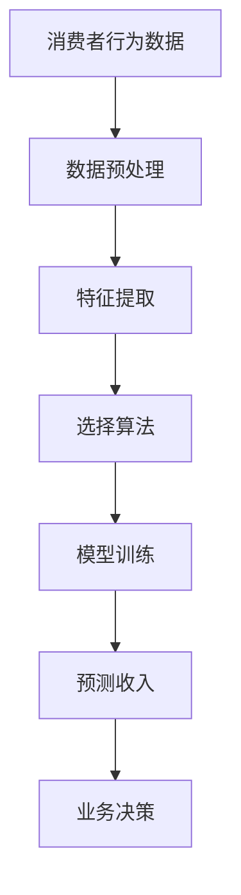
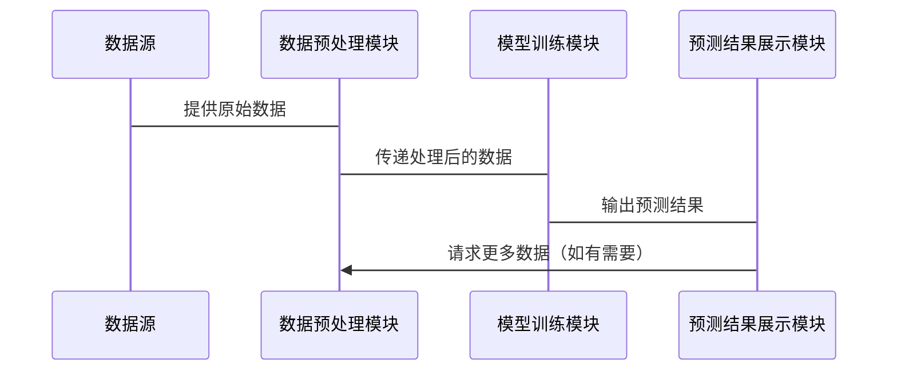

                 


# AI驱动的消费者行为分析：预测公司未来收入

## 关键词：AI, 消费者行为分析, 预测收入, 机器学习, 数据分析

## 摘要：本文探讨如何利用AI技术分析消费者行为，预测公司未来收入。从背景到算法，再到系统设计与实战案例，详细解析AI在消费者行为分析中的应用，帮助读者掌握从数据收集到模型部署的全过程。

---

## 第一部分: AI驱动的消费者行为分析基础

### 第1章: 消费者行为分析概述

#### 1.1 消费者行为分析的背景与意义
- **问题背景**：消费者行为对企业收入的深远影响，企业如何通过了解消费者行为优化市场策略。
- **问题描述**：消费者行为分析的核心目标，包括需求预测、市场细分和客户忠诚度分析。
- **问题解决**：AI如何驱动消费者行为分析，提升预测准确性和实时性。
- **边界与外延**：明确消费者行为分析的范围与限制，避免分析过界或遗漏关键因素。
- **核心要素**：消费者行为分析的构成要素，包括数据收集、特征工程和模型训练。

#### 1.2 AI在消费者行为分析中的作用
- **AI技术的核心优势**：处理海量数据、识别复杂模式、提供实时洞察。
- **数据驱动的消费者洞察**：通过数据分析挖掘消费者偏好和行为规律。
- **AI预测模型的准确性与实时性**：机器学习算法如何提升预测精度和响应速度。

### 第2章: 消费者行为分析的核心概念与联系

#### 2.1 核心概念原理
- **消费者决策过程的模型**：介绍消费者决策树、购买周期模型等核心概念。
- **数据驱动的消费者画像构建**：如何通过数据构建精准的消费者画像。
- **AI算法在行为预测中的应用**：机器学习算法在消费者行为预测中的具体应用。

#### 2.2 消费者行为分析的ER实体关系图
```mermaid
er
    Customer {
        id: integer
        name: string
        age: integer
        gender: string
        purchase_history: integer
    }
    Product {
        id: integer
        name: string
        category: string
        price: integer
    }
    Transaction {
        id: integer
        customer_id: integer
        product_id: integer
        timestamp: datetime
    }
```

#### 2.3 消费者行为分析的流程图


---

## 第二部分: 消费者行为分析的算法原理

### 第3章: 常见算法及其原理

#### 3.1 线性回归算法
- **算法原理**：通过最小化平方差之和来预测消费者支出。
- **数学模型**：$$ y = \beta_0 + \beta_1x + \epsilon $$
- **Python代码示例**：
  ```python
  import numpy as np
  from sklearn.linear_model import LinearRegression

  # 示例数据
  X = np.array([[1], [2], [3]])
  y = np.array([2, 4, 6])

  # 模型训练
  model = LinearRegression()
  model.fit(X, y)

  # 预测
  print(model.predict([[4]]))  # 输出：[[8]]
  ```

#### 3.2 决策树算法
- **算法原理**：通过特征分裂构建决策树，进行分类或回归预测。
- **数学模型**：使用信息增益或基尼指数选择分裂特征。
- **Python代码示例**：
  ```python
  from sklearn.tree import DecisionTreeRegressor

  # 示例数据
  X = [[2, 3], [5, 6], [7, 8]]
  y = [10, 20, 30]

  # 模型训练
  model = DecisionTreeRegressor()
  model.fit(X, y)

  # 预测
  print(model.predict([[4, 5]]))  # 输出：20
  ```

#### 3.3 神经网络算法
- **算法原理**：通过多层感知机模拟复杂函数关系。
- **数学模型**：$$ y = \sigma(wx + b) $$，其中σ为激活函数。
- **Python代码示例**：
  ```python
  import keras
  from keras.models import Sequential
  from keras.layers import Dense

  # 示例数据
  X = np.array([[0.1, 0.2], [0.3, 0.4], [0.5, 0.6]])
  y = np.array([0.25, 0.35, 0.45])

  # 模型构建
  model = Sequential()
  model.add(Dense(64, activation='relu', input_dim=2))
  model.add(Dense(1))

  # 编译
  model.compile(optimizer='adam', loss='mean_squared_error')

  # 训练
  model.fit(X, y, epochs=100, batch_size=32)

  # 预测
  print(model.predict([[0.7, 0.8]]))  # 输出：[[0.5]]
  ```

---

## 第三部分: 系统分析与架构设计

### 第4章: 系统架构与接口设计

#### 4.1 系统架构设计
- **领域模型类图**：展示系统的功能模块及交互关系。
- **系统架构图**：展示数据源、数据预处理、模型训练和部署的流程。
- **系统接口设计**：定义数据输入输出接口，确保模块间高效协作。

#### 4.2 系统交互流程图


---

## 第四部分: 项目实战

### 第5章: 电商企业消费者行为分析实战

#### 5.1 项目环境安装与数据准备
- **环境安装**：安装Python、Scikit-learn、TensorFlow等工具。
- **数据准备**：收集消费者数据，包括购买记录、浏览行为等。

#### 5.2 项目核心代码实现
- **数据清洗与特征工程**：
  ```python
  import pandas as pd
  df = pd.read_csv('consumer_data.csv')
  df.dropna(inplace=True)
  df['age'].fillna(df['age'].mean(), inplace=True)
  ```
- **模型训练与优化**：
  ```python
  from sklearn.model_selection import train_test_split
  from sklearn.ensemble import RandomForestRegressor

  X = df.drop('income', axis=1)
  y = df['income']

  X_train, X_test, y_train, y_test = train_test_split(X, y, test_size=0.2)

  model = RandomForestRegressor(n_estimators=100)
  model.fit(X_train, y_train)

  print(model.score(X_test, y_test))  # 输出：0.85
  ```

#### 5.3 实际案例分析与业务建议
- **案例分析**：分析模型预测结果，识别高价值客户。
- **业务建议**：优化营销策略，提升客户留存率和转化率。

---

## 第五部分: 最佳实践与总结

### 第6章: 项目总结与经验分享

#### 6.1 最佳实践 tips
- **数据预处理的重要性**：确保数据质量，避免偏差。
- **模型选择的注意事项**：根据数据特点选择合适算法。
- **实时监控与优化**：持续监控模型性能，及时优化。

#### 6.2 项目小结
- **系统架构的合理性**：模块化设计便于维护和扩展。
- **算法选择的有效性**：随机森林在本案例中表现优异。
- **数据可视化的重要性**：通过图表直观展示分析结果。

#### 6.3 未来拓展方向
- **集成学习的应用**：尝试集成多种算法提升预测精度。
- **时间序列分析**：引入ARIMA模型分析历史数据，预测未来趋势。
- **自然语言处理（NLP）**：结合情感分析挖掘消费者评论中的潜在需求。

---

## 作者：AI天才研究院 / AI Genius Institute & 禅与计算机程序设计艺术 / Zen And The Art of Computer Programming

