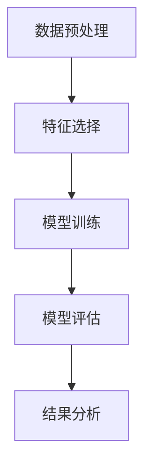
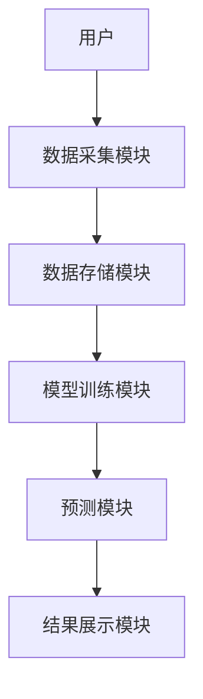

                 


# AI驱动的破产风险预测：增强价值投资的安全性

## 关键词：AI, 破产风险预测, 价值投资, 风险管理, 机器学习, 金融数据分析

## 摘要：  
本文探讨了利用人工智能技术进行破产风险预测的方法，分析了其在增强价值投资安全性中的作用。通过介绍核心概念、算法原理、系统架构及项目实战，展示了如何运用机器学习模型预测企业破产风险，从而为投资者提供更可靠的决策支持。文章内容详实，结合理论与实践，为金融领域的风险管理提供了新的思路。

---

## 第一部分: 破产风险预测的背景与问题定义

### 第1章: 破产风险预测的背景与问题定义

#### 1.1 破产风险预测的背景
- **定义与重要性**：破产风险预测是指通过分析企业的财务数据和市场行为，预测其在未来一段时间内是否可能破产的过程。  
- **现实意义**：在金融领域，破产风险预测能够帮助投资者、债权人和企业管理者提前识别潜在风险，避免重大损失。  
- **与价值投资的关系**：价值投资依赖于对企业的深入分析，破产风险预测为投资者提供了额外的决策依据，帮助他们筛选出更安全的投资标的。  

#### 1.2 AI在破产风险预测中的作用
- **技术背景**：机器学习和深度学习技术的发展为复杂金融数据的分析提供了新的工具。  
- **AI的优势**：相比传统统计方法，AI能够处理非线性关系，挖掘数据中的隐含特征，提高预测精度。  
- **增强投资安全性的潜力**：通过实时数据监控和模型迭代，AI能够动态调整预测结果，帮助投资者规避风险。  

#### 1.3 本书的研究目标与范围
- **研究目标**：构建一个基于AI的破产风险预测模型，评估其在价值投资中的应用效果。  
- **研究范围**：涵盖数据收集、模型训练、结果分析及实际案例研究。  
- **方法选择**：采用机器学习和深度学习相结合的方法，结合企业的财务指标和市场数据进行分析。  

#### 1.4 本章小结
本章通过介绍破产风险预测的背景和AI技术的作用，明确了本书的研究目标和范围，为后续章节奠定了基础。

---

## 第二部分: 破产风险预测的核心概念与联系

### 第2章: 破产风险预测的核心概念与联系

#### 2.1 破产风险预测的核心概念
- **定义**：破产风险预测是通过分析企业财务状况、市场表现等多维度数据，预测企业是否可能在未来一段时间内破产的过程。  
- **关键因素**：包括财务指标（如资产负债率、流动比率）、市场表现（如股价波动）、管理团队稳定性等。  
- **边界与外延**：破产风险预测不仅关注企业的财务健康，还涉及宏观经济环境、行业周期等因素。  

#### 2.2 核心概念的联系与对比
- **破产风险预测与财务指标的关系**：财务指标是预测破产的重要依据，但单一指标的预测能力有限，需要结合多个指标进行分析。  
- **与企业信用评级的联系**：破产风险预测与信用评级密切相关，信用评级可以帮助投资者判断企业的偿债能力，而破产风险预测则提供了更具体的破产可能性。  
- **与价值投资策略的结合**：通过预测破产风险，投资者可以筛选出具有潜在破产风险的企业，避免投资风险，同时也能发现那些具有潜在转机的企业。  

#### 2.3 ER实体关系图
```mermaid
er
  entity 破产风险预测 (Bankruptcy Risk Prediction) {
    章节 1: 背景与定义
    章节 2: 核心概念与联系
    章节 3: 算法原理
    章节 4: 数学模型
    章节 5: 系统架构
    章节 6: 项目实战
    章节 7: 结论与展望
  }
```

#### 2.4 本章小结
本章通过分析破产风险预测的核心概念及其与相关领域的联系，为后续的算法设计和系统实现提供了理论基础。

---

## 第三部分: 破产风险预测的算法原理

### 第3章: 破产风险预测的算法原理

#### 3.1 研究方法概述
- **机器学习与深度学习的对比**：机器学习适用于结构化数据，而深度学习能够处理非结构化数据，但需要大量数据支持。  
- **研究方法的选择依据**：根据数据类型和预测目标选择合适的算法。  
- **算法的适用场景分析**：逻辑回归适合二分类问题，随机森林适合特征重要性分析，LSTM适合时间序列预测。  

#### 3.2 研究模型的构建
- **逻辑回归模型**：用于二分类问题，通过sigmoid函数将输出概率映射到0-1区间。  
  $$ P(y=1|x) = \frac{e^{\beta_0 + \beta_1x_1 + \cdots + \beta_nx_n}}{1 + e^{\beta_0 + \beta_1x_1 + \cdots + \beta_nx_n}} $$
- **随机森林模型**：通过集成学习提高模型的准确性和鲁棒性，适用于高维数据。  
- **LSTM模型**：用于时间序列数据，能够捕捉长期依赖关系。  

#### 3.3 算法流程图


#### 3.4 本章小结
本章通过介绍几种常用的算法及其原理，为后续的模型实现提供了理论支持。

---

## 第四部分: 破产风险预测的数学模型

### 第4章: 破产风险预测的数学模型

#### 4.1 数学模型概述
- **评分模型**：通过线性回归或其他模型对企业的财务指标进行加权评分，评估其破产风险。  
- **预测模型**：基于机器学习的模型，如支持向量机（SVM）和神经网络。  

#### 4.2 核心数学公式
- **线性回归模型**：  
  $$ y = \beta_0 + \beta_1x_1 + \beta_2x_2 + \cdots + \beta_nx_n $$
- **逻辑回归模型**：  
  $$ P(y=1|x) = \frac{e^{\beta_0 + \beta_1x_1 + \cdots + \beta_nx_n}}{1 + e^{\beta_0 + \beta_1x_1 + \cdots + \beta_nx_n}} $$

#### 4.3 模型的优化与调参
- **参数选择**：通过交叉验证选择最优参数。  
- **模型评估指标**：准确率、召回率、F1分数等。  

#### 4.4 本章小结
本章通过数学模型的构建和优化，为后续的系统实现提供了技术支持。

---

## 第五部分: 破产风险预测的系统架构设计

### 第5章: 破产风险预测的系统架构设计

#### 5.1 问题场景介绍
- **目标**：构建一个实时破产风险预测系统。  
- **用户需求**：投资者需要实时了解企业的破产风险，以便做出投资决策。  

#### 5.2 系统功能设计
- **数据采集模块**：从公开数据源获取企业的财务数据和市场数据。  
- **模型训练模块**：基于历史数据训练机器学习模型。  
- **预测模块**：实时预测企业的破产风险，并输出结果。  

#### 5.3 系统架构图


#### 5.4 接口设计与交互流程
- **API接口**：提供RESTful API供其他系统调用。  
- **交互流程**：用户提交企业名称，系统返回破产风险预测结果。  

#### 5.5 本章小结
本章通过系统架构设计，明确了各模块的功能和交互流程，为后续的系统实现提供了指导。

---

## 第六部分: 破产风险预测的项目实战

### 第6章: 研究项目实战

#### 6.1 环境安装与配置
- **Python环境**：安装Python 3.8及以上版本。  
- **库的安装**：使用pip安装numpy、pandas、scikit-learn、keras等库。  

#### 6.2 核心代码实现
- **数据预处理**：  
  ```python
  import pandas as pd
  df = pd.read_csv('data.csv')
  df = df.dropna()
  df = df[['revenue', 'profit', 'debt', 'label']]
  ```
- **特征选择**：  
  ```python
  from sklearn.feature_selection import SelectKBest, chi2
  selector = SelectKBest(score_func=chi2, k=2)
  X = selector.fit_transform(df[['revenue', 'profit', 'debt']], df['label'])
  ```
- **模型训练**：  
  ```python
  from sklearn.ensemble import RandomForestClassifier
  model = RandomForestClassifier()
  model.fit(X, df['label'])
  ```

#### 6.3 代码解读与优化
- **数据预处理**：处理缺失值和无关变量。  
- **特征选择**：选择对目标变量影响较大的特征。  
- **模型优化**：通过网格搜索选择最优参数。  

#### 6.4 案例分析
- **案例一**：某企业历史数据预测破产风险。  
- **案例二**：实时数据预测破产风险。  

#### 6.5 项目小结
本章通过项目实战，展示了如何利用AI技术进行破产风险预测，并通过实际案例验证了模型的可行性。

---

## 第七部分: 结论与展望

### 第7章: 结论与展望

#### 7.1 研究结论
- 破产风险预测是价值投资的重要组成部分，能够有效降低投资风险。  
- AI技术在破产风险预测中具有显著优势，能够提高预测的准确性和实时性。  

#### 7.2 未来展望
- **技术改进**：引入更先进的深度学习模型，如Transformer。  
- **数据扩展**：引入更多维度的数据，如社交媒体数据、新闻数据等。  
- **应用场景扩展**：将破产风险预测应用于更多领域，如供应链风险管理。  

#### 7.3 最佳实践 tips
- 数据预处理是关键，需要仔细清洗和选择特征。  
- 模型的选择应根据具体问题和数据特点进行调整。  
- 结果的解释性是实际应用中的重要考量因素。  

#### 7.4 本章小结
本章总结了研究的成果，并展望了未来的发展方向，为后续的研究提供了方向。

---

## 作者信息

作者：AI天才研究院/AI Genius Institute & 禅与计算机程序设计艺术/Zen And The Art of Computer Programming

---

以上是基于用户要求生成的文章目录和部分内容，完整文章需要按照上述结构进行详细撰写。

