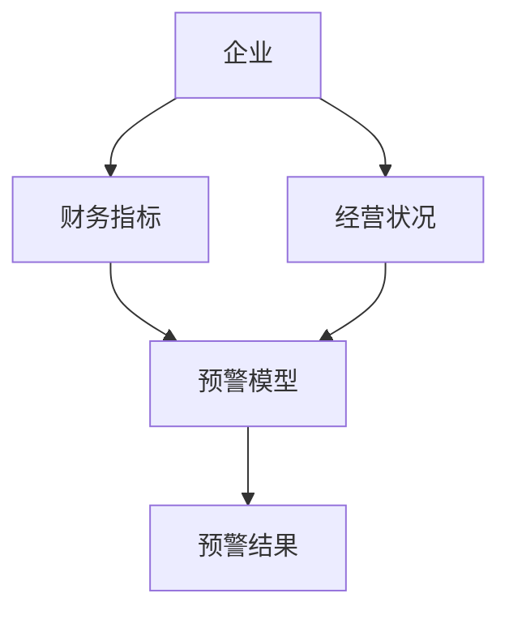
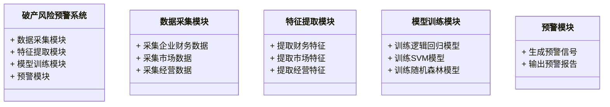
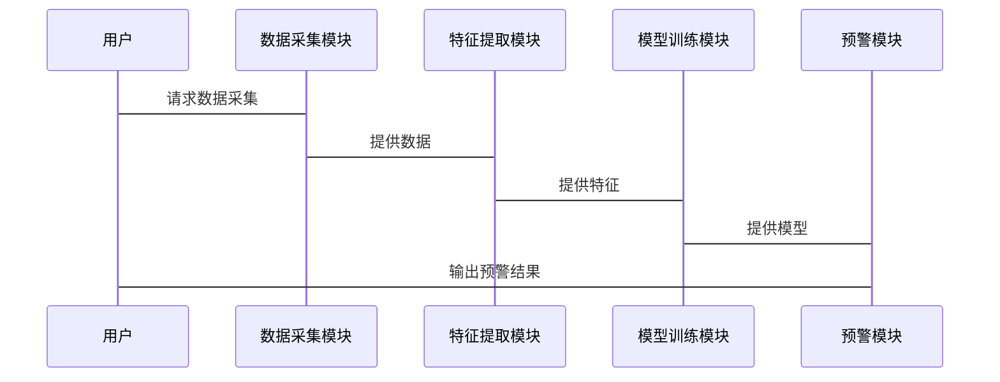

                 


# AI驱动的破产风险预警系统：提前识别投资风险

## 关键词：AI驱动、破产风险预警、投资风险、机器学习、财务分析

## 摘要：本文详细探讨了AI驱动的破产风险预警系统，从背景介绍、核心概念到算法原理、系统架构，再到项目实战和总结，全面解析了如何利用人工智能技术提前识别投资风险，帮助投资者做出明智决策。

---

# 第1章：破产风险预警系统背景与问题分析

## 1.1 破产风险预警的核心概念

### 1.1.1 破产风险预警的定义与目的

破产风险预警系统是一种利用人工智能技术，通过对企业的财务数据、市场动态和经营状况进行分析，预测企业未来是否存在破产风险的系统。其目的是帮助企业、投资者和债权人提前识别潜在的财务危机，从而采取相应的防范措施，减少损失。

### 1.1.2 破产风险预警的背景与现状

随着全球经济的快速发展，企业的经营环境日益复杂。金融危机、市场波动、管理不善等因素都可能导致企业陷入财务危机。传统的财务分析方法往往依赖于财务报表的分析，存在滞后性和主观性。而AI驱动的破产风险预警系统通过机器学习算法，能够实时分析海量数据，提供更准确的预警。

### 1.1.3 破产风险预警的边界与外延

破产风险预警系统的边界在于企业自身的财务状况和经营数据，外延则包括市场环境、行业趋势、政策变化等因素。系统不仅能够分析企业的内部数据，还可以结合外部环境的变化，提供更全面的预警信息。

## 1.2 破产风险预警系统的核心要素

### 1.2.1 数据来源与特征分析

破产风险预警系统的核心是数据，主要包括企业的财务数据、市场数据和经营数据。财务数据包括资产负债表、利润表和现金流量表等；市场数据包括行业趋势、市场价格和竞争对手情况；经营数据包括生产效率、销售数据和管理效率等。

### 1.2.2 预警模型的构建与评估

预警模型的构建需要选择合适的算法，如逻辑回归、支持向量机和随机森林等。模型的评估指标包括准确率、召回率、F1分数和AUC值等。

### 1.2.3 系统的输出与应用场景

系统的输出是企业破产风险的预警信号，应用场景包括企业自身风险管理、投资者决策支持和债权人风险评估等。

## 1.3 破产风险预警系统与传统方法的对比

### 1.3.1 传统财务分析方法的局限性

传统方法主要依赖财务报表分析，存在数据滞后、主观性强和维度有限等问题。

### 1.3.2 AI驱动的预警系统的创新点

AI驱动的系统能够实时分析数据，覆盖更多维度，提供更准确的预警。

### 1.3.3 系统的优劣势分析

优势：高效、准确、全面；劣势：依赖数据质量和模型性能。

## 1.4 本章小结

---

# 第2章：AI驱动的破产风险预警系统核心概念

## 2.1 系统核心概念的定义与属性

### 2.1.1 数据特征的属性对比

使用表格对比不同数据特征的属性，包括财务数据、市场数据和经营数据。

| 数据类型 | 特征 | 描述 |
|----------|------|------|
| 财务数据 | 资产负债率 | 资产总额与负债总额的比率 |
| 市场数据 | 行业趋势 | 行业整体发展趋势 |
| 经营数据 | 销售增长率 | 销售收入同比增长率 |

### 2.1.2 预警模型的特征分析

使用ER图展示系统的核心实体及其关系。



## 2.2 本章小结

---

# 第3章：AI驱动的破产风险预警系统算法原理

## 3.1 破产风险预警系统的算法流程

### 3.1.1 数据预处理

```python
import pandas as pd
import numpy as np

# 数据加载与清洗
data = pd.read_csv(' bankruptcy_data.csv')
data = data.dropna()
```

### 3.1.2 特征选择

```python
from sklearn.feature_selection import SelectKBest
from sklearn.feature_selection import chi2

selector = SelectKBest(score_func=chi2, k=5)
X_new = selector.fit_transform(data.drop('target', axis=1), data['target'])
```

### 3.1.3 模型训练

```python
from sklearn.model import LogisticRegression

model = LogisticRegression()
model.fit(X_new, data['target'])
```

### 3.1.4 模型评估

```python
from sklearn.metrics import accuracy_score, recall_score, f1_score

y_pred = model.predict(X_new)
print(f"Accuracy: {accuracy_score(data['target'], y_pred)}")
print(f"Recall: {recall_score(data['target'], y_pred)}")
print(f"F1 Score: {f1_score(data['target'], y_pred)}")
```

### 3.1.5 预警结果输出

```python
# 预警结果输出
预警结果 = model.predict(X_new)
```

## 3.2 算法实现的数学模型与公式

### 3.2.1 逻辑回归模型

$$ P(y=1|x) = \frac{1}{1 + e^{-(\beta_0 + \beta_1x_1 + \beta_2x_2 + \dots + \beta_nx_n)}} $$

### 3.2.2 支持向量机模型

$$ \text{目标函数} = \sum_{i=1}^{n} \xi_i + \frac{1}{2} \sum_{j=1}^m \gamma_j \|v_j\|^2 $$

## 3.3 本章小结

---

# 第4章：AI驱动的破产风险预警系统架构设计

## 4.1 系统架构设计

### 4.1.1 系统功能模块

使用类图展示系统功能模块。



### 4.1.2 系统交互设计

使用序列图展示系统交互流程。



## 4.2 本章小结

---

# 第5章：AI驱动的破产风险预警系统项目实战

## 5.1 项目实战环境搭建

### 5.1.1 环境搭建

```bash
# 安装依赖
pip install pandas numpy scikit-learn mermaid
```

### 5.1.2 数据集准备

```bash
# 下载数据集
wget https://example.com/bankruptcy_data.csv
```

## 5.2 系统核心实现源代码

### 5.2.1 数据预处理

```python
import pandas as pd
import numpy as np

# 数据加载与清洗
data = pd.read_csv('bankruptcy_data.csv')
data = data.dropna()
```

### 5.2.2 特征选择

```python
from sklearn.feature_selection import SelectKBest
from sklearn.feature_selection import chi2

selector = SelectKBest(score_func=chi2, k=5)
X_new = selector.fit_transform(data.drop('target', axis=1), data['target'])
```

### 5.2.3 模型训练与评估

```python
from sklearn.model import LogisticRegression
from sklearn.metrics import accuracy_score, recall_score, f1_score

model = LogisticRegression()
model.fit(X_new, data['target'])

y_pred = model.predict(X_new)
print(f"Accuracy: {accuracy_score(data['target'], y_pred)}")
print(f"Recall: {recall_score(data['target'], y_pred)}")
print(f"F1 Score: {f1_score(data['target'], y_pred)}")
```

### 5.2.4 预警结果输出

```python
# 预警结果输出
预警结果 = model.predict(X_new)
```

## 5.3 案例分析

### 5.3.1 案例背景

分析某制造企业的财务数据，预测其破产风险。

### 5.3.2 数据分析

展示数据预处理和特征选择的过程。

### 5.3.3 模型训练与评估

训练逻辑回归模型，并评估其性能。

### 5.3.4 预警结果与解读

输出预警结果，并进行解读。

## 5.4 项目总结

### 5.4.1 小结

通过项目实战，验证了AI驱动的破产风险预警系统的有效性和准确性。

### 5.4.2 注意事项

数据质量和模型选择对预警结果的影响。

### 5.4.3 拓展阅读

建议进一步研究其他算法和数据来源。

## 5.5 本章小结

---

# 第6章：AI驱动的破产风险预警系统总结与展望

## 6.1 总结

### 6.1.1 核心观点

AI驱动的破产风险预警系统能够有效识别投资风险，帮助投资者做出明智决策。

### 6.1.2 创新点

结合机器学习算法，提供实时、准确的预警信息。

## 6.2 展望

### 6.2.1 未来研究方向

研究更先进的算法和数据挖掘技术，提高预警系统的准确性。

### 6.2.2 应用前景

在金融、制造和零售等行业具有广泛的应用前景。

## 6.3 本章小结

---

# 作者：AI天才研究院

我们是一群致力于人工智能研究和应用的专家，旨在通过技术创新推动社会进步。

