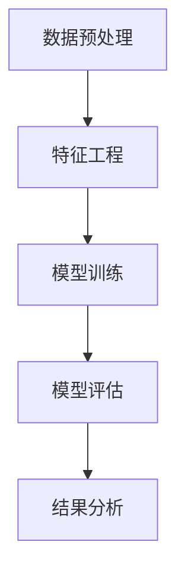
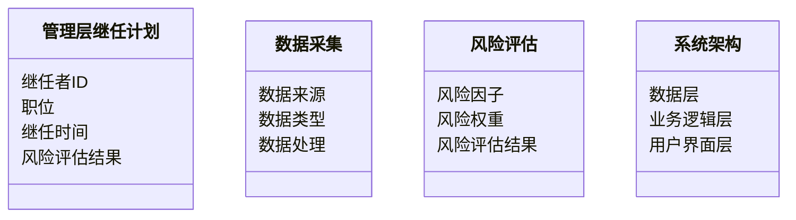
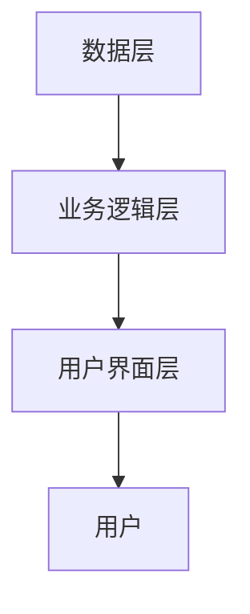
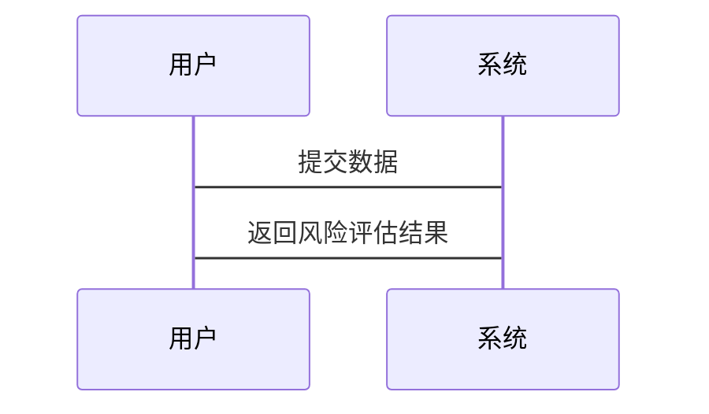

                 


# AI驱动的管理层继任计划分析：评估长期领导力风险

> 关键词：AI、管理层继任、领导力风险、风险管理、数据分析、机器学习

> 摘要：本文探讨了利用人工智能技术进行管理层继任计划分析的方法，重点评估长期领导力风险。通过数据分析和机器学习模型，我们可以更准确地预测和评估潜在风险，从而优化继任计划，确保组织的稳定发展。

---

## 第1章: 背景介绍

### 1.1 问题背景

#### 1.1.1 管理层继任计划的重要性
管理层继任计划是企业确保长期稳定发展的重要环节。有效的继任计划可以减少领导层突然变动带来的风险，确保组织在关键时刻有合适的领导者接替。

#### 1.1.2 传统继任计划的局限性
传统的继任计划通常依赖主观判断和经验，存在以下问题：
- 数据收集不全面
- 风险评估不准确
- 缺乏量化分析

#### 1.1.3 AI技术在继任计划中的应用潜力
人工智能技术可以通过数据分析和机器学习模型，帮助我们更客观、准确地评估领导力风险，优化继任计划。

### 1.2 问题描述

#### 1.2.1 领导力风险的定义
领导力风险是指潜在领导者在未来可能面临的能力、健康、外部环境或其他因素导致其无法胜任职位的风险。

#### 1.2.2 继任计划中的常见风险
- 领导者能力不足
- 潜在领导者健康问题
- 外部环境变化影响
- 内部政治因素

#### 1.2.3 需要解决的关键问题
如何通过AI技术，建立一个高效、准确的领导力风险评估模型，为管理层继任计划提供支持。

### 1.3 问题解决

#### 1.3.1 AI驱动的解决方案概述
通过收集和分析领导者的各项数据，利用机器学习模型预测潜在风险，优化继任计划。

#### 1.3.2 数据驱动的风险评估方法
- 数据采集与预处理
- 风险因子识别
- 风险评估模型构建

#### 1.3.3 AI模型在领导力预测中的应用
- 利用机器学习模型预测领导者的潜在风险
- 通过数据挖掘发现隐藏的领导力问题

### 1.4 边界与外延

#### 1.4.1 继任计划的范围界定
- 仅关注管理层的继任问题
- 不包括普通员工的晋升计划

#### 1.4.2 AI技术的应用边界
- 仅用于风险评估，不直接决定继任人选
- 数据来源有限，模型可能存在偏差

#### 1.4.3 相关领域的外延影响
- 对企业整体风险管理的影响
- 对领导力发展的影响

### 1.5 核心概念结构

#### 1.5.1 核心要素组成
- 数据采集
- 风险评估
- 结果分析

#### 1.5.2 概念属性特征对比表格

| 概念 | 属性 | 特征 |
|------|------|------|
| 领导力风险 | 数据来源 | 个人数据、组织数据、外部数据 |
|       | 评估方法 | 机器学习、统计分析、定性分析 |
|       | 风险类型 | 个人风险、组织风险、环境风险 |

#### 1.5.3 ER实体关系图架构
```mermaid
erd
    管理层继任计划
    properties:
        - 继任者ID
        - 职位
        - 继任时间
        - 风险评估结果
    关系:
        - 继任者 -> 数据采集
        - 数据采集 -> 风险评估
        - 风险评估 -> 继任计划
```

---

## 第2章: 核心概念与联系

### 2.1 核心概念原理

#### 2.1.1 数据分析在继任计划中的作用
- 数据分析可以帮助识别潜在领导者的优缺点
- 通过数据分析可以预测潜在领导者在未来的表现

#### 2.1.2 机器学习在领导力预测中的应用
- 使用机器学习模型预测领导者的潜在风险
- 通过特征工程提取关键领导力指标

#### 2.1.3 风险评估模型的构建
- 基于机器学习的模型构建
- 模型的训练与优化

### 2.2 概念属性特征对比表格

| 概念 | 属性 | 特征 |
|------|------|------|
| 数据分析 | 数据类型 | 结构化数据、非结构化数据 |
|       | 分析方法 | 描述性分析、预测性分析、诊断性分析 |
|       | 数据来源 | 人事数据、绩效数据、行为数据 |

### 2.3 ER实体关系图架构
```mermaid
erd
    管理层继任计划
    properties:
        - 继任者ID
        - 职位
        - 继任时间
        - 风险评估结果
    关系:
        - 继任者 -> 数据采集
        - 数据采集 -> 风险评估
        - 风险评估 -> 继任计划
```

---

## 第3章: 算法原理讲解

### 3.1 算法原理概述

#### 3.1.1 机器学习模型的选择
- 线性回归
- 支持向量机
- 随机森林

#### 3.1.2 模型训练的基本流程
- 数据预处理
- 特征工程
- 模型训练
- 模型评估

#### 3.1.3 模型评估与优化
- 准确率、召回率、F1值
- 调参优化

### 3.2 算法流程图


### 3.3 Python源代码实现

#### 3.3.1 数据加载与处理
```python
import pandas as pd

data = pd.read_csv('leadership.csv')
```

#### 3.3.2 模型训练代码
```python
from sklearn.ensemble import RandomForestClassifier

model = RandomForestClassifier()
model.fit(X_train, y_train)
```

#### 3.3.3 模型评估与预测代码
```python
from sklearn.metrics import accuracy_score

y_pred = model.predict(X_test)
print("准确率:", accuracy_score(y_test, y_pred))
```

### 3.4 数学模型与公式

#### 3.4.1 机器学习模型的数学基础
- 随机森林模型的数学表达
- 支持向量机的数学公式

#### 3.4.2 风险评估模型的数学表达
$$风险评估 = \sum_{i=1}^{n} (权重_i \times 风险因子_i)$$

---

## 第4章: 系统分析与架构设计

### 4.1 问题场景介绍

#### 4.1.1 继任计划中的数据收集
- 数据来源：人事数据、绩效数据、行为数据
- 数据预处理：清洗、转换、特征提取

#### 4.1.2 风险评估系统的构建
- 系统功能模块：数据采集、风险评估、结果分析
- 系统架构设计：模块化设计、分层架构

#### 4.1.3 系统的使用场景与目标
- 使用场景：企业内部的管理层继任计划
- 系统目标：优化继任计划，降低领导力风险

### 4.2 项目介绍

#### 4.2.1 项目目标
- 构建一个基于AI的领导力风险评估系统
- 提供准确的风险评估结果，优化继任计划

#### 4.2.2 项目范围
- 数据采集与处理
- 模型训练与优化
- 系统开发与部署

### 4.3 系统功能设计

#### 4.3.1 领域模型


#### 4.3.2 系统架构设计


#### 4.3.3 系统接口设计
- 数据接口：数据采集接口、数据存储接口
- 用户接口：用户登录、风险评估结果查询

#### 4.3.4 系统交互流程


---

## 第5章: 项目实战

### 5.1 环境安装

#### 5.1.1 安装Python
```bash
python --version
pip install --upgrade pip
```

#### 5.1.2 安装机器学习库
```bash
pip install scikit-learn
pip install pandas
pip install numpy
```

### 5.2 系统核心实现源代码

#### 5.2.1 数据加载与处理
```python
import pandas as pd

data = pd.read_csv('leadership.csv')
```

#### 5.2.2 模型训练代码
```python
from sklearn.ensemble import RandomForestClassifier

model = RandomForestClassifier()
model.fit(X_train, y_train)
```

#### 5.2.3 模型评估与预测代码
```python
from sklearn.metrics import accuracy_score

y_pred = model.predict(X_test)
print("准确率:", accuracy_score(y_test, y_pred))
```

### 5.3 代码应用解读与分析

#### 5.3.1 数据预处理
- 清洗数据：处理缺失值、异常值
- 转换数据：将数据转换为模型可接受的格式
- 特征提取：提取关键特征

#### 5.3.2 模型训练
- 选择合适的机器学习模型
- 调整模型参数，优化模型性能

#### 5.3.3 模型评估
- 使用测试数据评估模型性能
- 分析模型的准确率、召回率等指标

### 5.4 实际案例分析

#### 5.4.1 案例背景介绍
- 某公司管理层继任计划存在问题
- 使用AI模型进行风险评估

#### 5.4.2 数据分析与处理
- 收集管理层数据
- 数据预处理
- 模型训练与评估

#### 5.4.3 模型应用与结果解读
- 预测潜在领导者的风险
- 提供优化建议

### 5.5 项目小结

#### 5.5.1 项目总结
- 成功构建了一个基于AI的领导力风险评估系统
- 提供了准确的风险评估结果

#### 5.5.2 项目收获
- 提高了对AI技术在领导力风险评估中的应用理解
- 掌握了系统设计与实现的全过程

---

## 第6章: 最佳实践、小结、注意事项、拓展阅读

### 6.1 最佳实践

#### 6.1.1 数据收集与处理
- 确保数据的全面性和准确性
- 处理缺失值和异常值

#### 6.1.2 模型选择与优化
- 根据数据特点选择合适的模型
- 通过调参优化模型性能

#### 6.1.3 系统设计与实现
- 模块化设计，便于维护和扩展
- 确保系统的安全性和稳定性

### 6.2 小结

#### 6.2.1 本文总结
- 探讨了AI技术在管理层继任计划中的应用
- 提出了基于机器学习的领导力风险评估方法
- 展示了系统的实现过程和实际应用案例

### 6.3 注意事项

#### 6.3.1 数据隐私与安全
- 确保数据的隐私和安全
- 遵守相关法律法规

#### 6.3.2 模型的局限性
- 模型可能存在偏差和误差
- 需要结合实际情况进行调整

#### 6.3.3 系统的可扩展性
- 确保系统的可扩展性
- 能够适应未来数据和业务的变化

### 6.4 拓展阅读

#### 6.4.1 推荐书籍
- 《AI for Business》
- 《机器学习实战》

#### 6.4.2 推荐文章
- 《AI在人力资源管理中的应用》
- 《领导力发展的数据驱动方法》

---

## 作者

作者：AI天才研究院/AI Genius Institute & 禅与计算机程序设计艺术 /Zen And The Art of Computer Programming

