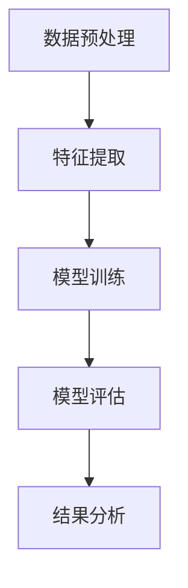
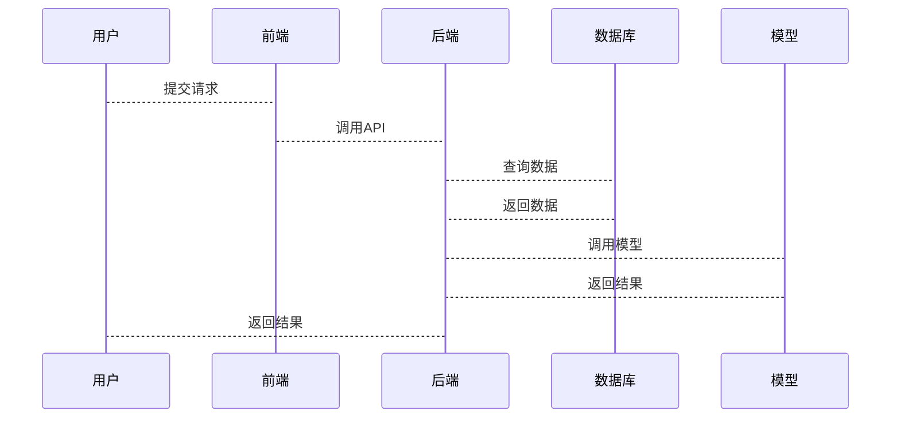

                 


# AI驱动的管理层薪酬分析：评估利益一致性

**关键词**：管理层薪酬分析，利益一致性，人工智能，机器学习，绩效评估，激励机制

**摘要**：本文探讨了如何利用人工智能技术优化管理层薪酬分析，评估其与公司利益的一致性。通过构建利益一致性评估模型，分析薪酬结构与公司绩效的关系，提出数据驱动的解决方案，强调数据预处理、特征选择和模型优化的重要性，为企业制定科学合理的激励机制提供支持。

---

# 第一章：背景与概念

## 1.1 问题背景

### 1.1.1 企业激励机制的重要性
企业的激励机制直接影响员工的绩效表现，管理层作为关键决策者，其薪酬设计尤为重要。合理的薪酬结构能够激发管理层的积极性，促进企业目标的实现。

### 1.1.2 现有薪酬体系的局限性
传统的薪酬体系往往基于主观判断，缺乏数据支持，难以准确衡量管理层绩效与公司利益的一致性。

### 1.1.3 利益一致性问题的提出
管理层的薪酬应与其绩效挂钩，但现有方法难以量化利益一致性，导致激励效果不佳，甚至引发管理层与股东的利益冲突。

## 1.2 问题描述

### 1.2.1 管理层薪酬与公司绩效的关系
薪酬过高可能导致短期行为，而薪酬过低则无法激励管理层积极投入。需要找到薪酬与绩效的最佳平衡点。

### 1.2.2 利益一致性问题的具体表现
管理层的决策可能优先考虑个人利益，忽视公司长期发展，薪酬设计需要确保其行为与公司利益一致。

### 1.2.3 当前分析方法的不足
传统方法依赖主观判断，难以量化分析，且缺乏动态调整能力，无法应对复杂的市场变化。

## 1.3 问题解决思路

### 1.3.1 引入AI技术的必要性
利用AI技术进行数据分析，构建预测模型，量化管理层行为与公司利益的一致性。

### 1.3.2 数据驱动的分析方法
通过大数据分析，提取关键绩效指标，建立量化评估体系，确保薪酬设计的科学性。

### 1.3.3 利益一致性评估框架
设计一个包含数据采集、特征提取、模型训练和结果分析的完整流程，确保分析结果的准确性和可操作性。

## 1.4 概念结构与核心要素

### 1.4.1 核心概念的定义
- **管理层薪酬**：公司支付给管理层的总报酬，包括工资、奖金、股票期权等。
- **利益一致性**：管理层的行为与公司利益保持一致的程度。
- **绩效评估**：通过对管理层的绩效进行量化评估，确保其行为与公司目标一致。

### 1.4.2 概念属性特征对比表

| 概念 | 属性 | 特征 |
|------|------|------|
| 管理层薪酬 | 计算方式 | 固定工资 + 可变奖金 |
| 利益一致性 | 评估指标 | 经济利润、股东价值 |
| 绩效评估 | 评估方法 | KPI、OKR |

### 1.4.3 ER实体关系图架构
```mermaid
er
  entity: 管理层
    attribute: 员工ID, 姓名, 职位
  entity: 薪酬数据
    attribute: 薪酬总额, 奖金比例, 股票期权
  entity: 绩效指标
    attribute: 营收增长率, 净利润, 股东回报率
  entity: 利益一致性评估结果
    attribute: 一致性评分, 改进建议
  relation: 管理层薪酬分析
    role: 管理层 -> 薪酬数据: 每个管理层对应多条薪酬数据
    role: 薪酬数据 -> 绩效指标: 每条薪酬数据对应多条绩效指标
    role: 绩效指标 -> 评估结果: 每个绩效指标对应多个评估结果
```

## 1.5 本章小结
本章介绍了管理层薪酬分析的背景，提出了利益一致性评估的必要性，并通过概念结构和ER图展示了系统的整体框架，为后续分析奠定了基础。

---

# 第二章：核心概念与联系

## 2.1 AI技术在薪酬分析中的应用

### 2.1.1 机器学习在数据处理中的作用
机器学习能够自动识别数据中的模式，提取关键特征，帮助分析管理层行为与公司绩效的关系。

### 2.1.2 自然语言处理在文本分析中的应用
通过NLP技术分析管理层的会议记录、报告等文本数据，提取隐含的信息，辅助决策。

### 2.1.3 深度学习在预测模型中的优势
深度学习能够处理复杂的非线性关系，构建更精准的预测模型，评估利益一致性。

## 2.2 利益一致性评估的AI模型

### 2.2.1 模型输入与输出
- **输入**：管理层的薪酬数据、绩效指标、市场环境数据。
- **输出**：一致性评分、改进建议。

### 2.2.2 核心算法的原理
采用回归分析预测薪酬与绩效的关系，聚类分析识别异类行为，神经网络模型捕捉复杂模式。

### 2.2.3 模型的可解释性
通过特征重要性分析，解释薪酬设计中的关键因素，确保模型结果的透明性。

## 2.3 数据特征与模型训练

### 2.3.1 数据预处理方法
- 数据清洗：处理缺失值、异常值。
- 数据标准化：统一特征尺度，便于模型训练。

### 2.3.2 特征选择策略
- 使用特征重要性分析，筛选关键绩效指标。
- 组合特征：将多个指标组合，提高模型的解释性。

### 2.3.3 数据标注与清洗
通过标注数据，识别关键事件，清洗数据，确保模型训练的质量。

## 2.4 案例分析

### 2.4.1 某公司管理层薪酬分析案例
某科技公司通过AI模型分析发现，管理层的奖金与公司净利润呈正相关，但股票期权占比过低，导致激励效果不足。

### 2.4.2 案例中的AI模型应用
使用线性回归模型预测薪酬与绩效的关系，发现股票期权的比例与公司股价波动存在显著相关性。

### 2.4.3 案例结果与启示
调整薪酬结构，增加股票期权比例，改善利益一致性，提升管理层的长期激励效果。

## 2.5 本章小结
本章详细讲解了AI技术在薪酬分析中的应用，通过案例分析展示了模型的实际应用价值，强调了数据特征与模型训练的重要性。

---

# 第三章：算法原理

## 3.1 算法概述

### 3.1.1 机器学习算法的选择
根据数据类型和分析目标选择合适的算法，如线性回归、随机森林等。

### 3.1.2 深度学习算法的适用性
适用于复杂的数据关系，如神经网络模型。

### 3.1.3 混合算法的优势
结合多种算法，提高模型的准确性和鲁棒性。

## 3.2 算法实现

### 3.2.1 线性回归模型
使用线性回归模型预测管理层薪酬与公司绩效的关系。

$$ y = \beta_0 + \beta_1x_1 + \beta_2x_2 + \dots + \beta_nx_n $$

其中，$y$ 是目标变量（如净利润），$x_i$ 是自变量（如管理层薪酬）。

### 3.2.2 聚类分析
通过聚类分析识别管理层行为中的异常值。

### 3.2.3 神经网络模型
构建神经网络模型，捕捉数据中的非线性关系。

## 3.3 算法流程图



## 3.4 数学公式与案例分析

### 3.4.1 线性回归公式
$$ y = \beta_0 + \beta_1x_1 + \beta_2x_2 + \dots + \beta_nx_n + \epsilon $$

其中，$\epsilon$ 是误差项，$\beta_i$ 是回归系数。

### 3.4.2 案例分析
某公司管理层的薪酬数据与公司绩效数据进行回归分析，发现股票期权占比与公司股价波动呈显著正相关。

## 3.5 本章小结
本章详细讲解了AI驱动的薪酬分析中常用的算法，通过数学公式和案例分析，帮助读者理解模型的实现过程。

---

# 第四章：系统架构设计

## 4.1 问题场景介绍

### 4.1.1 问题描述
需要构建一个AI驱动的薪酬分析系统，评估管理层行为与公司利益的一致性。

### 4.1.2 项目介绍
通过数据采集、特征提取、模型训练和结果分析，构建一个完整的薪酬分析系统。

## 4.2 系统功能设计

### 4.2.1 领域模型
```mermaid
classDiagram
    class 管理层 {
        员工ID
        职位
        姓名
    }
    class 薪酬数据 {
        薪酬总额
        奖金比例
        股票期权
    }
    class 绩效指标 {
        营收增长率
        净利润
        股东回报率
    }
    class 利益一致性评估结果 {
        一致性评分
        改进建议
    }
    管理层 --> 薪酬数据: 1:多
    薪酬数据 --> 绩效指标: 1:多
    绩效指标 --> 利益一致性评估结果: 1:多
```

### 4.2.2 系统架构


### 4.2.3 接口设计
- 数据接口：从数据库中获取薪酬数据和绩效指标。
- 模型接口：调用机器学习模型进行预测。

### 4.2.4 交互流程图


## 4.3 本章小结
本章通过系统架构设计，展示了如何构建一个完整的AI驱动的薪酬分析系统，包括功能设计和交互流程。

---

# 第五章：项目实战

## 5.1 环境安装

### 5.1.1 安装Python
安装Python 3.x版本，建议使用Anaconda或Miniconda。

### 5.1.2 安装依赖库
安装pandas、numpy、scikit-learn、tensorflow等库。

```bash
pip install pandas numpy scikit-learn tensorflow
```

## 5.2 核心实现

### 5.2.1 数据预处理
```python
import pandas as pd
import numpy as np

# 读取数据
data = pd.read_csv('management_compensation.csv')

# 数据清洗
data.dropna(inplace=True)
data = pd.get_dummies(data)
```

### 5.2.2 模型训练
```python
from sklearn.linear_model import LinearRegression
from sklearn.metrics import mean_squared_error

# 特征选择
X = data[['salary', 'bonus', 'stock_options']]
y = data['net_profit']

# 训练模型
model = LinearRegression()
model.fit(X, y)

# 模型评估
y_pred = model.predict(X)
print('均方误差:', mean_squared_error(y, y_pred))
```

### 5.2.3 结果分析
```python
importances = model.coef_
print('特征重要性:', importances)
```

## 5.3 案例分析

### 5.3.1 数据来源
数据来自某公司管理层的薪酬数据和公司绩效数据。

### 5.3.2 分析结果
通过模型分析发现，股票期权的比例与公司股价波动呈显著正相关，建议增加股票期权比例，改善利益一致性。

## 5.4 本章小结
本章通过实际项目展示了AI驱动的薪酬分析系统的实现过程，从数据预处理到模型训练，再到结果分析，帮助读者掌握实际操作方法。

---

# 第六章：最佳实践与总结

## 6.1 方法论总结

### 6.1.1 数据预处理的重要性
确保数据质量，提高模型准确率。

### 6.1.2 特征选择的技巧
通过特征重要性分析，筛选关键绩效指标。

### 6.1.3 模型优化的策略
结合多种算法，提高模型的准确性和鲁棒性。

## 6.2 实用建议

### 6.2.1 数据隐私保护
在处理敏感数据时，注意数据隐私保护，遵守相关法律法规。

### 6.2.2 模型解释性
选择具有高解释性的模型，确保分析结果的透明性。

### 6.2.3 持续优化
定期更新模型，根据市场变化调整分析策略。

## 6.3 未来展望

### 6.3.1 AI技术的发展
随着AI技术的进步，薪酬分析将更加智能化和个性化。

### 6.3.2 应用场景的扩展
未来，AI驱动的薪酬分析将应用于更多领域，如创业公司、跨国企业等。

## 6.4 本章小结
本章总结了AI驱动的薪酬分析方法论，提供了实用建议，并展望了未来的发展方向。

---

# 作者信息

**作者**：AI天才研究院（AI Genius Institute） & 禅与计算机程序设计艺术（Zen And The Art of Computer Programming）

---

通过本文的详细分析，您可以全面了解AI驱动的管理层薪酬分析方法，从理论到实践，掌握如何利用AI技术优化薪酬设计，确保管理层行为与公司利益一致。

