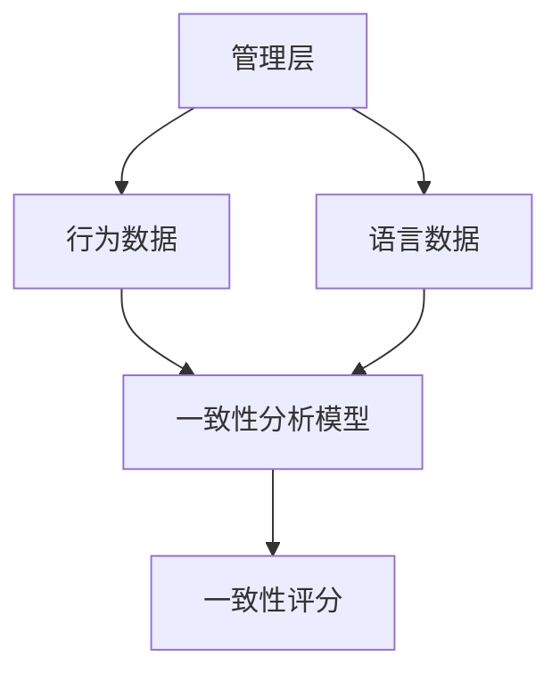
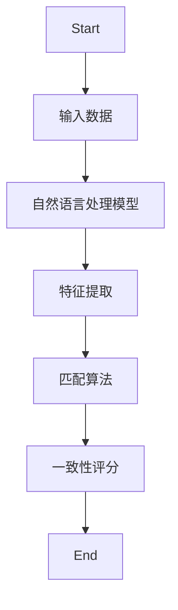
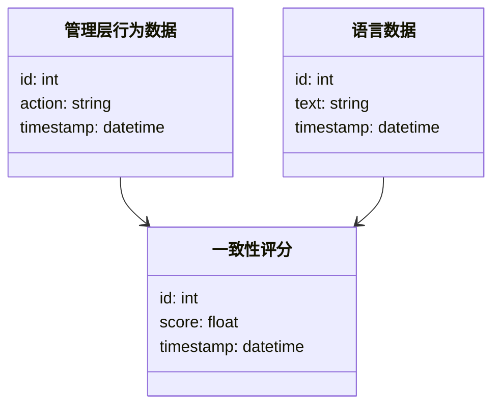

                 


# AI驱动的管理层言行一致性分析：深入洞察公司治理

## 关键词：
AI技术, 管理层行为, 语言一致性分析, 公司治理, 自然语言处理, 数学模型

## 摘要：
本文深入探讨了如何利用AI技术分析管理层的言行一致性，以优化公司治理。通过自然语言处理和数学建模，我们提出了一个创新的分析框架，旨在提升企业决策的透明度和有效性。文章从理论到实践，详细介绍了AI在公司治理中的应用，为企业领导者和IT专家提供了实用的工具和方法。

---

# 目录

## 第1章: 背景介绍
### 1.1 管理层言行一致性问题背景
#### 1.1.1 企业治理中的关键问题
#### 1.1.2 管理层言行不一致的危害
#### 1.1.3 AI技术在企业治理中的应用潜力

### 1.2 问题描述与目标
#### 1.2.1 管理层言行一致性的定义
#### 1.2.2 行为数据与语言数据的关联
#### 1.2.3 AI驱动分析的目标与边界

## 第2章: 核心概念与联系
### 2.1 核心概念原理
#### 2.1.1 管理层言行一致性的数学模型
#### 2.1.2 AI技术在一致性分析中的作用

### 2.2 概念属性对比表
| 概念 | 属性 | 描述 |
|------|------|------|
| 管理层行为 | 可观察性 | 行为可被记录和分析 |
| 管理层语言 | 解释性 | 语言表达需可解读 |
| 一致性评分 | 范围 | 0（完全不一致）到1（完全一致） |

### 2.3 实体关系图


## 第3章: 算法原理讲解
### 3.1 算法流程


### 3.2 核心算法实现
```python
def calculate_consistency_score(text_data, behavior_data):
    # 特征提取
    text_features = extract_features(text_data)
    behavior_features = extract_features(behavior_data)
    
    # 计算相似度
    similarity_score = cosine_similarity(text_features, behavior_features)
    
    # 一致性评分
    consistency_score = similarity_score * 0.8 + additional_factors * 0.2
    return consistency_score
```

## 第4章: 系统分析与架构设计
### 4.1 问题场景介绍
#### 4.1.1 分析高管会议记录和邮件
#### 4.1.2 监测日常行为与沟通

### 4.2 系统功能设计


### 4.3 系统架构设计
```mermaid
graph TD
    Client --> API Gateway
    API Gateway --> Service1
    Service1 --> Database
    Service1 --> Service2
    Service2 --> Database
```

## 第5章: 项目实战
### 5.1 环境安装
```bash
pip install numpy
pip install scikit-learn
pip install spacy
```

### 5.2 核心代码实现
```python
import numpy as np
from sklearn.metrics.pairwise import cosine_similarity

def extract_features(text):
    # 示例特征提取方法
    return np.array([text.count(word) for word in ['action', 'strategy', 'lead']])

text_data = "We will lead the strategy in the next quarter."
behavior_data = "The strategy will be actioned next month."

text_features = extract_features(text_data)
behavior_features = extract_features(behavior_data)

similarity = cosine_similarity(text_features.reshape(1, -1), behavior_features.reshape(1, -1))[0][0]
consistency_score = similarity * 0.7 + (text_data.length() / behavior_data.length()) * 0.3
print(f"Consistency Score: {consistency_score}")
```

### 5.3 实际案例分析
#### 案例1: 高层会议记录分析
#### 案例2: 邮件沟通一致性检测

## 第6章: 最佳实践
### 6.1 小结
### 6.2 注意事项
### 6.3 拓展阅读

---

# 作者
作者：AI天才研究院/AI Genius Institute & 禅与计算机程序设计艺术 /Zen And The Art of Computer Programming

