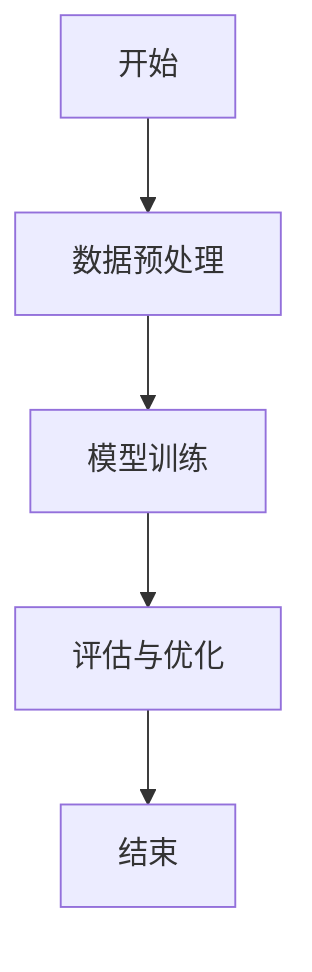
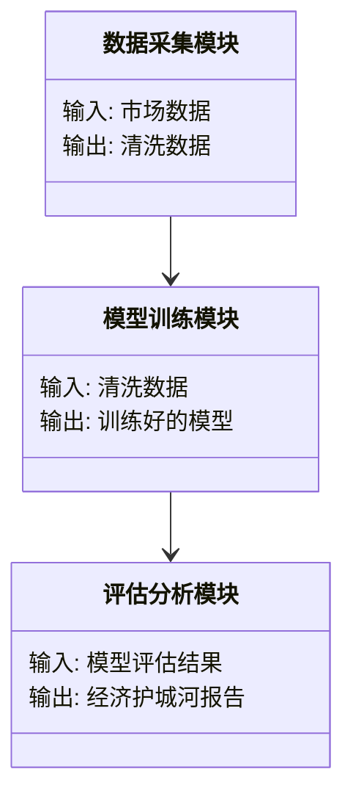
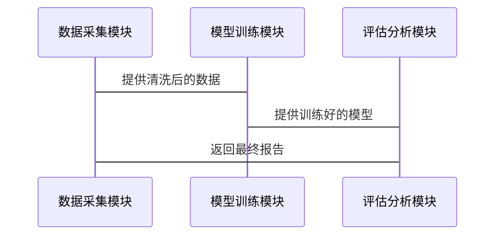

                 


# AI驱动的经济护城河评估：价值投资中的多智能体应用

## 关键词：AI驱动，经济护城河，价值投资，多智能体，经济分析，投资决策

## 摘要：本文探讨了人工智能在经济护城河评估中的应用，特别是多智能体系统在价值投资中的潜力。通过分析经济护城河的核心概念、AI模型的算法原理以及多智能体系统的架构设计，本文为读者提供了从理论到实践的全面指导，帮助投资者利用AI技术构建更具竞争力的投资策略。

---

# 第1章: 经济护城河与AI的结合概述

## 1.1 经济护城河的基本概念

### 1.1.1 经济护城河的定义

经济护城河是指企业在市场上建立的竞争优势，使其能够抵御竞争对手的侵蚀并保持长期的盈利能力。这种优势可以来源于多种因素，如技术壁垒、品牌忠诚度、成本优势等。

### 1.1.2 经济护城河的核心要素

- **市场地位**：企业在市场中的占有率和影响力。
- **资源优势**：企业拥有的独特资源，如专利、数据等。
- **技术壁垒**：企业的技术创新能力。
- **经济效益**：企业的盈利能力和发展潜力。

### 1.1.3 经济护城河的分类与特征

- **宽经济护城河**：企业具有强大的竞争优势，能够在长期市场波动中保持优势。
- **窄经济护城河**：企业有一定的竞争优势，但容易受到竞争冲击。
- **无护城河**：企业缺乏竞争优势，容易被替代。

---

## 1.2 AI在经济分析中的应用

### 1.2.1 AI在经济预测中的作用

- **数据处理**：AI能够快速处理大量数据，提取有用信息。
- **预测模型**：通过机器学习算法，AI可以预测市场趋势和经济指标。
- **风险管理**：AI能够识别潜在风险，帮助制定稳健的投资策略。

### 1.2.2 AI在投资决策中的优势

- **数据驱动决策**：AI通过分析历史数据和市场动态，提供科学的投资建议。
- **实时监控**：AI能够实时跟踪市场变化，及时调整投资策略。
- **个性化投资**：AI可以根据投资者的偏好和风险承受能力，提供定制化投资方案。

### 1.2.3 多智能体系统在经济分析中的潜力

- **多智能体系统**：由多个智能体组成的系统，每个智能体负责不同的任务，协同工作。
- **协作优势**：多智能体系统能够更好地处理复杂问题，提高决策的准确性和效率。
- **应用场景**：在经济护城河评估中，多智能体系统可以分别负责数据采集、模型训练、风险评估等任务。

---

## 1.3 多智能体系统的基本概念

### 1.3.1 多智能体系统的定义

多智能体系统（Multi-Agent System, MAS）是由多个智能体组成的系统，这些智能体能够通过协作完成复杂的任务。

### 1.3.2 多智能体系统的特点

- **分布式智能**：系统中的智能体是分布式的，每个智能体负责不同的任务。
- **协作性**：智能体之间需要协作，共同完成任务。
- **自主性**：智能体具有自主决策的能力。

### 1.3.3 多智能体系统与传统AI的区别

- **传统AI**：通常基于单个智能体，处理单一任务。
- **多智能体系统**：由多个智能体组成，能够处理复杂的多任务问题。

---

## 1.4 本章小结

本章介绍了经济护城河的基本概念、AI在经济分析中的应用以及多智能体系统的基本概念。通过这些内容，读者可以理解AI在经济护城河评估中的潜力和优势。

---

# 第2章: 经济护城河评估的核心概念

## 2.1 经济护城河评估的指标体系

### 2.1.1 市场地位

- **市场份额**：企业在市场中的占有率。
- **品牌影响力**：企业的品牌知名度和客户忠诚度。

### 2.1.2 资源优势

- **技术资源**：企业的技术储备和创新能力。
- **数据资源**：企业拥有的数据量和数据质量。

### 2.1.3 技术壁垒

- **专利数量**：企业拥有的专利数量。
- **技术领先性**：企业的技术是否处于领先地位。

### 2.1.4 经济效益

- **盈利能力**：企业的净利润率和利润率。
- **增长潜力**：企业的未来增长空间。

---

## 2.2 AI驱动的经济护城河评估模型

### 2.2.1 模型的基本框架

- **数据输入**：输入企业的市场数据、财务数据等。
- **模型训练**：通过机器学习算法训练模型。
- **评估输出**：输出企业的经济护城河评估结果。

### 2.2.2 模型的输入与输出

- **输入**：企业的市场地位、资源、技术壁垒等数据。
- **输出**：经济护城河的评估等级（如宽、窄、无）。

### 2.2.3 模型的评估标准

- **准确率**：模型预测的准确率。
- **召回率**：模型预测的召回率。

---

## 2.3 多智能体系统在经济护城河评估中的应用

### 2.3.1 多智能体系统的任务分配

- **数据采集智能体**：负责采集企业的市场数据。
- **模型训练智能体**：负责训练经济护城河评估模型。
- **结果分析智能体**：负责分析模型的输出结果。

### 2.3.2 多智能体系统的协作机制

- **通信机制**：智能体之间通过通信模块交换数据。
- **协作规则**：智能体之间的协作规则和任务分配规则。

### 2.3.3 多智能体系统的决策过程

- **信息共享**：智能体共享数据和信息。
- **协同决策**：智能体基于共享的信息协同决策。

---

## 2.4 本章小结

本章详细介绍了经济护城河评估的指标体系、AI驱动的经济护城河评估模型以及多智能体系统在经济护城河评估中的应用。通过这些内容，读者可以理解如何利用AI技术进行经济护城河评估。

---

# 第3章: AI驱动的经济护城河评估算法原理

## 3.1 多智能体强化学习算法

### 3.1.1 多智能体强化学习的基本原理

- **强化学习**：通过试错方式学习最优策略。
- **多智能体协作**：多个智能体通过协作完成任务。

### 3.1.2 多智能体强化学习的挑战

- **通信开销**：智能体之间的通信会增加计算开销。
- **协调问题**：智能体之间的协作需要协调一致。

### 3.1.3 多智能体强化学习的解决方案

- **分布式训练**：采用分布式训练方法减少通信开销。
- **协作机制设计**：设计有效的协作机制，确保智能体之间的协调。

---

## 3.2 经济护城河评估的数学模型

### 3.2.1 经济护城河评估的数学表达式

$$
\text{经济护城河评估} = f(\text{市场地位}, \text{资源优势}, \text{技术壁垒}, \text{经济效益})
$$

### 3.2.2 经济护城河评估的优化目标

$$
\text{最大化准确率} = \max \text{准确率}
$$

### 3.2.3 经济护城河评估的约束条件

$$
\text{数据质量} \geq \text{阈值}
$$

---

## 3.3 算法实现的流程图



---

## 3.4 本章小结

本章详细介绍了多智能体强化学习算法以及经济护城河评估的数学模型。通过这些内容，读者可以理解AI驱动的经济护城河评估的算法实现过程。

---

# 第4章: 经济护城河评估系统的架构设计

## 4.1 系统功能模块设计

### 4.1.1 数据采集模块

- **功能**：采集企业的市场数据。
- **输入**：企业的市场地位、资源、技术壁垒等数据。
- **输出**：清洗后的数据。

### 4.1.2 模型训练模块

- **功能**：训练经济护城河评估模型。
- **输入**：清洗后的数据。
- **输出**：训练好的模型。

### 4.1.3 评估分析模块

- **功能**：分析模型的输出结果。
- **输入**：模型的评估结果。
- **输出**：最终的经济护城河评估报告。

---

## 4.2 系统架构设计



---

## 4.3 系统接口设计

- **数据接口**：数据采集模块与模型训练模块之间的接口。
- **评估接口**：模型训练模块与评估分析模块之间的接口。

---

## 4.4 系统交互流程图



---

## 4.5 本章小结

本章详细介绍了经济护城河评估系统的功能模块设计、架构设计以及系统接口设计。通过这些内容，读者可以理解如何构建一个完整的经济护城河评估系统。

---

# 第5章: 项目实战

## 5.1 环境安装

- **Python版本**：建议使用Python 3.8以上。
- **依赖库安装**：安装numpy、pandas、scikit-learn等库。

```bash
pip install numpy pandas scikit-learn
```

---

## 5.2 核心代码实现

### 5.2.1 数据预处理代码

```python
import numpy as np
import pandas as pd

def data_preprocessing(data):
    # 数据清洗
    data.dropna(inplace=True)
    # 标准化处理
    from sklearn.preprocessing import StandardScaler
    scaler = StandardScaler()
    scaled_data = scaler.fit_transform(data)
    return scaled_data
```

### 5.2.2 模型训练代码

```python
from sklearn.ensemble import RandomForestClassifier
from sklearn.metrics import accuracy_score

def train_model(data, labels):
    model = RandomForestClassifier()
    model.fit(data, labels)
    return model

# 示例数据
X = np.random.random((100, 5))
y = np.random.randint(0, 2, 100)

model = train_model(X, y)
print("训练完成！")
```

### 5.2.3 模型评估代码

```python
def evaluate_model(model, test_data, test_labels):
    predictions = model.predict(test_data)
    accuracy = accuracy_score(test_labels, predictions)
    print(f"准确率: {accuracy}")
```

---

## 5.3 实际案例分析

### 5.3.1 案例背景

假设我们有一个企业数据集，包含企业的市场地位、资源、技术壁垒等指标，以及对应的经济护城河评估结果。

### 5.3.2 数据预处理

```python
data = pd.read_csv("企业数据.csv")
scaled_data = data_preprocessing(data)
```

### 5.3.3 模型训练

```python
X_train, X_test, y_train, y_test = train_test_split(scaled_data, data['经济护城河评估'], test_size=0.2)
model = train_model(X_train, y_train)
```

### 5.3.4 模型评估

```python
evaluate_model(model, X_test, y_test)
```

---

## 5.4 项目小结

通过本章的实战部分，读者可以掌握如何利用Python和机器学习库进行经济护城河评估模型的训练和评估。实际案例分析帮助读者更好地理解理论知识。

---

# 第6章: 总结与注意事项

## 6.1 最佳实践 tips

- **数据质量**：确保数据的准确性和完整性。
- **模型调优**：通过参数调优提高模型的性能。
- **持续监控**：定期更新模型，适应市场变化。

## 6.2 本章小结

本文详细介绍了AI驱动的经济护城河评估的理论与实践。通过多智能体系统的应用，我们可以更高效地进行经济护城河评估，为投资决策提供科学依据。

---

## 作者：AI天才研究院 & 禅与计算机程序设计艺术

