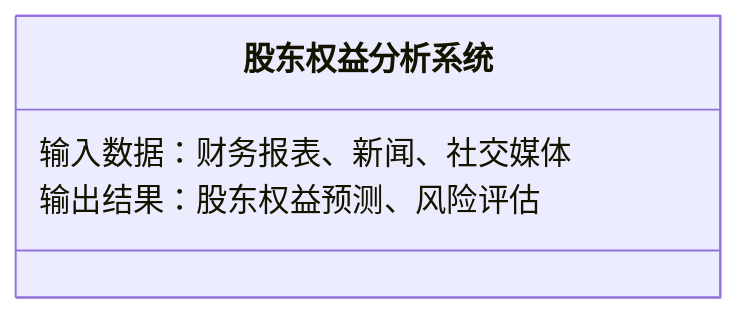

                 


# AI驱动的股东权益分析：深入理解公司治理

**关键词**：AI驱动，股东权益分析，公司治理，自然语言处理，深度学习，股东权益预测

**摘要**：  
随着人工智能技术的快速发展，股东权益分析正逐渐从传统的财务分析方法向智能化、数据驱动的分析方式转变。本文旨在通过AI技术，深入探讨股东权益分析的核心概念、算法原理及实际应用，帮助读者更好地理解公司治理的内在逻辑。文章从股东权益分析的背景出发，结合自然语言处理和深度学习技术，详细阐述了AI在股东权益分析中的应用，最后通过实际案例分析，展示了如何利用AI技术提升股东权益分析的效率和准确性。

---

## 第1章 股东权益分析的背景与概念

### 1.1 股东权益分析的定义与核心要素

#### 1.1.1 股东权益的基本概念
股东权益是指股东对公司净资产的所有权，是公司资产减去负债后的剩余部分。它反映了股东在公司中的投资价值，主要包括股本、资本公积、盈余公积、未分配利润等组成部分。

#### 1.1.2 股东权益的核心要素
- **股本**：公司发行的普通股和优先股的总价值。
- **资本公积**：公司发行股票时超过面值的部分。
- **盈余公积**：公司从净利润中提取的公积金。
- **未分配利润**：公司尚未分配给股东的利润。

#### 1.1.3 股东权益分析的重要性
股东权益分析是公司治理的重要组成部分，它可以帮助投资者评估公司的财务健康状况，识别潜在风险，并为投资决策提供依据。

---

### 1.2 公司治理与股东权益的关系

#### 1.2.1 公司治理的基本概念
公司治理是指公司内部和外部利益相关者之间的关系和决策机制，旨在确保公司高效运作、合规经营并实现股东价值最大化。

#### 1.2.2 股东在公司治理中的角色
股东是公司的所有者，通过股东大会行使决策权，对公司战略、管理层聘任、利润分配等重大事项进行表决。

#### 1.2.3 股东权益与公司治理的互动
股东权益的变化会影响公司的治理结构，而有效的公司治理又能保障股东权益的实现。例如，良好的治理机制可以提升股东信心，进而推动股价上涨。

---

### 1.3 传统股东权益分析的局限性

#### 1.3.1 传统分析方法的不足
传统股东权益分析依赖财务报表和人工判断，存在主观性强、效率低、难以量化的问题。

#### 1.3.2 数据量与复杂性的挑战
随着企业规模的扩大，财务数据日益复杂，传统方法难以处理海量数据，导致分析结果的不准确性和片面性。

#### 1.3.3 传统方法的改进空间
传统方法缺乏对非结构化数据（如新闻、社交媒体）的处理能力，难以捕捉市场情绪和潜在风险。

---

## 第2章 AI驱动股东权益分析的必要性

### 2.1 AI技术在金融领域的应用潜力

#### 2.1.1 AI在金融分析中的优势
AI技术能够快速处理大量数据，发现隐藏在数据中的模式和趋势，为金融分析提供支持。

#### 2.1.2 AI在股东权益分析中的独特价值
通过自然语言处理（NLP）和深度学习技术，AI可以分析非结构化数据，提取对公司治理和股东权益有影响的信息。

#### 2.1.3 AI技术的最新进展与未来趋势
近年来，AI技术在金融领域的应用越来越广泛，尤其是生成式AI和大语言模型的出现，为股东权益分析提供了新的可能性。

---

### 2.2 AI驱动股东权益分析的核心优势

#### 2.2.1 高效的数据处理能力
AI能够快速处理和分析海量数据，包括财务报表、新闻报道、社交媒体等，帮助分析师发现潜在信息。

#### 2.2.2 精准的预测能力
通过机器学习算法，AI可以基于历史数据预测股东权益的变化趋势，为投资决策提供科学依据。

#### 2.2.3 智能化决策支持
AI技术可以辅助分析师制定优化的股东权益管理策略，提升公司治理效率。

---

### 2.3 本书的核心目标与框架

#### 2.3.1 本书的研究目标
通过AI技术，深入探讨股东权益分析的方法和应用，帮助读者掌握AI驱动的股东权益分析的核心技术。

#### 2.3.2 本书的主要内容框架
本书将从股东权益分析的背景、AI技术的核心原理、系统架构设计、项目实战案例等方面展开讨论。

#### 2.3.3 本书的读者群体与适用场景
本书适合金融从业者、数据科学家、公司治理研究人员以及对AI技术感兴趣的读者阅读。

---

## 第3章 股东权益分析的核心概念与联系

### 3.1 股东权益分析的理论基础

#### 3.1.1 股权结构分析
股权结构分析是研究股东在公司中的持股比例及其分布情况，有助于评估公司的控制权和潜在风险。

#### 3.1.2 股东权利与义务
股东权利包括表决权、收益权、知情权等，义务包括遵守公司章程、承担公司债务等。

#### 3.1.3 股东价值评估
股东价值评估是通过财务指标和市场表现，评估股东权益的实际价值。

---

### 3.2 股东权益分析的关键指标

#### 3.2.1 股东权益比率
股东权益比率 = 股东权益 / 总资产  
该指标用于评估公司的财务健康状况。

#### 3.2.2 股东权益回报率
股东权益回报率 = 净利润 / 股东权益  
该指标衡量公司使用股东资金的效率。

#### 3.2.3 其他相关指标
包括每股收益（EPS）、市净率（P/B）、股息率等。

---

### 3.3 股东权益分析的外部影响因素

#### 3.3.1 宏观经济环境
宏观经济波动、货币政策变化等都会影响股东权益。

#### 3.3.2 行业发展趋势
行业竞争格局、政策法规变化等也会影响股东权益。

#### 3.3.3 公司内部管理
公司内部管理效率、财务透明度等是影响股东权益的重要因素。

---

## 第4章 AI驱动股东权益分析的核心原理

### 4.1 自然语言处理在股东权益分析中的应用

#### 4.1.1 NLP的基本原理
NLP通过文本预处理、特征提取、模型训练等步骤，对文本数据进行分析。

#### 4.1.2 NLP在财务文本分析中的应用
例如，通过分析公司财报中的文本，识别财务风险和潜在问题。

#### 4.1.3 基于NLP的股东权益预测模型
结合NLP和机器学习，构建股东权益预测模型。

---

### 4.2 深度学习在股东权益分析中的应用

#### 4.2.1 深度学习的基本原理
深度学习通过多层神经网络，提取数据的高层次特征。

#### 4.2.2 深度学习在时间序列分析中的应用
例如，使用LSTM网络预测股东权益的变化趋势。

#### 4.2.3 深度学习模型的优化策略
包括数据增强、模型调参、交叉验证等。

---

## 第5章 系统分析与架构设计方案

### 5.1 问题场景介绍
我们需要构建一个AI驱动的股东权益分析系统，帮助投资者和公司管理者进行高效分析。

### 5.2 项目介绍
项目目标是通过AI技术，实现对股东权益的实时监测和预测。

### 5.3 系统功能设计

#### 5.3.1 领域模型


---

### 5.4 系统架构设计


---

### 5.5 系统接口设计
系统接口包括数据输入接口、模型调用接口和结果输出接口。

---

## 第6章 项目实战

### 6.1 环境安装
安装Python、TensorFlow、Keras等工具。

### 6.2 核心实现代码

```python
import numpy as np
import pandas as pd
from tensorflow.keras.models import Sequential
from tensorflow.keras.layers import LSTM, Dense

# 数据预处理
data = pd.read_csv(' shareholder_rights.csv ')
data = data.values
data = data.reshape((-1, 1, data.shape[1]))

# 模型构建
model = Sequential()
model.add(LSTM(64, input_shape=(1, data.shape[2])))
model.add(Dense(1))
model.compile(loss='mean_squared_error', optimizer='adam')

# 训练模型
model.fit(data, np.zeros(data.shape[0]), epochs=100, batch_size=32)
```

---

### 6.3 代码应用解读与分析
通过LSTM模型，我们可以对股东权益进行预测，并评估模型的准确性和稳定性。

---

### 6.4 案例分析
以某公司为例，分析其股东权益的变化趋势，并提出改进建议。

---

## 第7章 总结与展望

### 7.1 总结
本文详细介绍了AI驱动的股东权益分析的核心概念、算法原理和实际应用，展示了AI技术在公司治理中的巨大潜力。

### 7.2 展望
未来，随着AI技术的不断发展，股东权益分析将更加智能化、自动化，为公司治理提供更强大的支持。

---

## 作者：AI天才研究院 & 禅与计算机程序设计艺术

