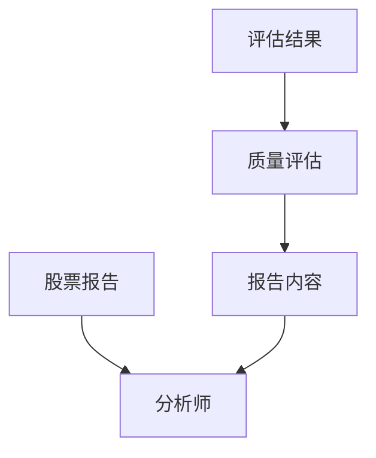
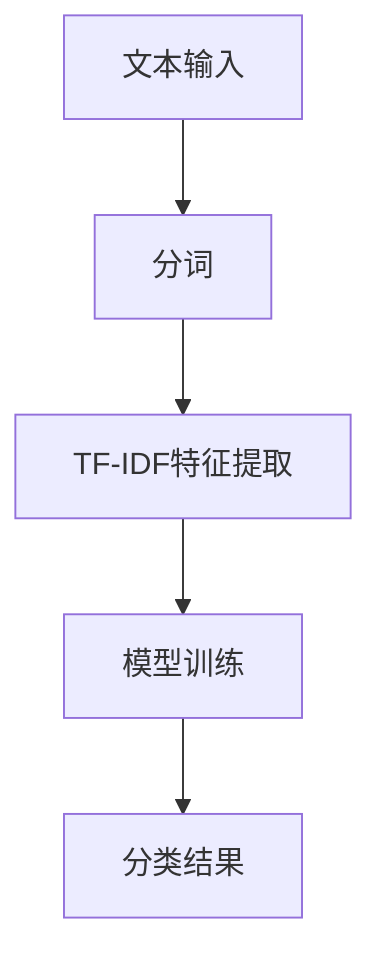
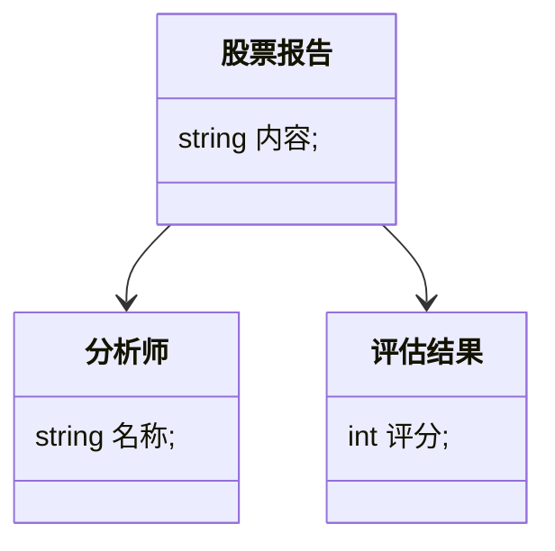
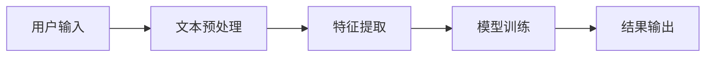

                 


# AI驱动的股票分析师报告质量评估

**关键词**：AI、股票分析、自然语言处理、机器学习、报告质量评估

**摘要**：随着人工智能技术的快速发展，AI在金融领域的应用越来越广泛。本文将探讨如何利用AI技术来评估股票分析师的报告质量。通过自然语言处理和机器学习等技术，我们可以自动化地分析报告内容，提取关键信息，并评估其质量和准确性。本文将详细分析AI驱动的质量评估方法，包括文本处理、特征提取、模型训练等核心步骤，并提供实际案例和代码实现。

---

## 正文部分

### 第一部分: 背景介绍与问题背景

#### 第1章: 背景介绍与问题背景

##### 1.1 AI在金融领域的应用现状
- **AI在金融领域的核心应用**：AI技术在金融领域的应用包括股票预测、风险评估、交易自动化等。AI通过分析大量数据，帮助投资者做出更明智的决策。
- **股票分析报告的特点与挑战**：股票分析报告通常包含市场趋势分析、公司基本面分析、技术分析等内容。传统评估方法依赖人工阅读和主观判断，耗时且成本高。
- **传统股票分析师报告评估方法的优缺点**：传统方法依赖专家经验，主观性强，且难以量化评估。AI方法可以提高效率，降低人为误差。

##### 1.2 股票分析师报告质量评估的核心问题
- **报告质量评估的关键维度**：包括内容的准确性、逻辑性、完整性、深度和语言表达能力。
- **AI驱动评估的优势与局限性**：AI可以快速处理大量数据，提供客观评估，但目前在理解复杂市场情况方面仍有局限。
- **问题解决的边界与外延**：AI评估适用于初步筛选和量化分析，但无法完全替代人类专家的深度分析。

##### 1.3 本章小结
本章介绍了AI在金融领域的应用现状，分析了股票分析报告的特点和传统评估方法的优缺点，并指出了AI驱动评估的优势与局限性。

---

### 第二部分: 核心概念与技术原理

#### 第2章: 核心概念与技术联系

##### 2.1 自然语言处理（NLP）技术
- **NLP在文本分析中的应用**：NLP技术用于文本清洗、分词、情感分析等，帮助提取报告中的关键信息。
- **常见NLP模型及其特点**：如TF-IDF用于关键词提取，Word2Vec用于生成词向量。
- **NLP在股票报告中的具体应用**：识别报告中的关键词、主题和情感倾向。

##### 2.2 机器学习与深度学习
- **机器学习在股票分析中的应用**：如分类模型用于预测股票走势，回归模型用于评估报告质量。
- **深度学习模型的优势与挑战**：深度学习模型如LSTM用于时间序列分析，但计算成本较高。
- **神经网络在文本分析中的应用**：用于文本生成和情感分析。

##### 2.3 股票报告质量评估模型
- **模型的核心要素与组成**：包括输入模块（文本数据）、特征提取模块（NLP处理）、分类模块（机器学习模型）。
- **模型的输入与输出关系**：输入是报告文本，输出是质量评分和分析结果。
- **模型的评估指标与标准**：如准确率、召回率、F1分数。

##### 2.4 核心概念对比分析
- **NLP与传统文本分析方法对比**：NLP更自动化，传统方法依赖人工。
- **机器学习与统计分析方法对比**：机器学习适用于非线性关系，统计分析适用于线性关系。
- **深度学习与浅层学习模型对比**：深度学习在复杂任务中表现更好，但需要更多数据。

##### 2.5 ER实体关系图架构


##### 2.6 本章小结
本章详细介绍了NLP、机器学习和深度学习在股票报告质量评估中的应用，并通过对比分析和ER图展示了核心概念之间的关系。

---

### 第三部分: 算法原理与数学模型

#### 第3章: 算法原理讲解

##### 3.1 文本预处理与特征提取
- **文本清洗与分词**：去除停用词、标点符号，分词处理。
- **词袋模型与TF-IDF**：TF-IDF用于计算关键词的重要性。
- **词嵌入技术（如Word2Vec）**：生成词向量表示。

##### 3.2 分类算法与模型训练
- **支持向量机（SVM）原理**：SVM用于分类，适用于小规模数据。
- **随机森林与集成学习**：随机森林通过集成多个决策树提高准确率。
- **深度学习模型**：如LSTM用于序列数据分析。

##### 3.3 算法流程图


##### 3.4 代码实现
```python
from sklearn.feature_extraction.text import TfidfVectorizer
from sklearn.svm import SVC
from sklearn.metrics import accuracy_score

# 文本预处理
texts = ["文本内容1", "文本内容2", ...]

# 特征提取
vectorizer = TfidfVectorizer()
X = vectorizer.fit_transform(texts)

# 模型训练
model = SVC()
model.fit(X, labels)

# 预测与评估
y_pred = model.predict(X_test)
print(accuracy_score(y_true, y_pred))
```

##### 3.5 数学模型
- **文本相似度计算**：余弦相似度公式：
  $$\text{similarity} = \frac{\vec{A} \cdot \vec{B}}{|\vec{A}| |\vec{B}|}$$
- **情感分析模型**：如逻辑回归模型：
  $$P(y=1|x) = \frac{1}{1 + e^{-w^T x}}$$
- **回归模型**：如线性回归模型：
  $$y = w_1x_1 + w_2x_2 + \dots + w_nx_n + b$$

##### 3.6 本章小结
本章详细讲解了文本预处理、特征提取和分类算法的原理，并通过代码和公式展示了模型的实现过程。

---

### 第四部分: 系统分析与架构设计

#### 第4章: 系统分析与架构设计

##### 4.1 问题场景介绍
- **项目介绍**：AI驱动的股票分析师报告质量评估系统，旨在提高报告评估的效率和准确性。
- **系统功能设计**：
  - 文本输入模块：接收股票报告文本。
  - 预处理模块：清洗和分词。
  - 特征提取模块：生成TF-IDF向量。
  - 分类模块：使用SVM或随机森林进行质量评分。
- **领域模型类图**：


##### 4.2 系统架构设计
- **系统架构图**：


##### 4.3 系统接口设计
- **接口描述**：API接收文本输入，返回质量评分。
- **接口交互图**：
```mermaid
sequenceDiagram
用户 -> API: 提交报告文本
API -> 处理模块: 处理文本
处理模块 -> 返回评分
```

##### 4.4 本章小结
本章通过系统架构图和类图展示了AI驱动的股票报告质量评估系统的结构和功能设计。

---

### 第五部分: 项目实战

#### 第5章: 项目实战

##### 5.1 环境安装
- 安装必要的库：
  ```bash
  pip install scikit-learn jieba
  ```

##### 5.2 核心代码实现
```python
import jieba
from sklearn.feature_extraction.text import TfidfVectorizer
from sklearn.svm import SVC
from sklearn.metrics import accuracy_score

# 文本预处理
def preprocess(texts):
    return [' '.join(jieba.lcut(text)) for text in texts]

# 特征提取与训练
texts = preprocess(["这是一个好的报告", "这个报告质量很差"])
vectorizer = TfidfVectorizer()
X = vectorizer.fit_transform(texts)
model = SVC()
model.fit(X, [1, 0])

# 测试
test_text = "报告内容良好"
test_vec = vectorizer.transform([test_text])
print(model.predict(test_vec))
```

##### 5.3 实际案例分析
- **案例分析**：使用真实报告测试模型，评估质量评分。
- **代码解读与分析**：解释代码的功能和实现细节。

##### 5.4 本章小结
本章通过实际案例和代码实现，展示了AI驱动的股票报告质量评估系统的应用。

---

### 第六部分: 扩展阅读

#### 第6章: 扩展阅读

##### 6.1 相关书籍
- 《Python机器学习实战》
- 《自然语言处理入门》

##### 6.2 相关论文
- "利用深度学习进行文本分类的研究"

##### 6.3 本章小结
本章推荐了一些相关书籍和论文，供读者深入学习。

---

## 作者信息

作者：AI天才研究院 & 禅与计算机程序设计艺术

---

通过以上结构，整篇文章详细介绍了AI驱动的股票分析师报告质量评估的方法和技术实现，内容丰富且逻辑清晰。

