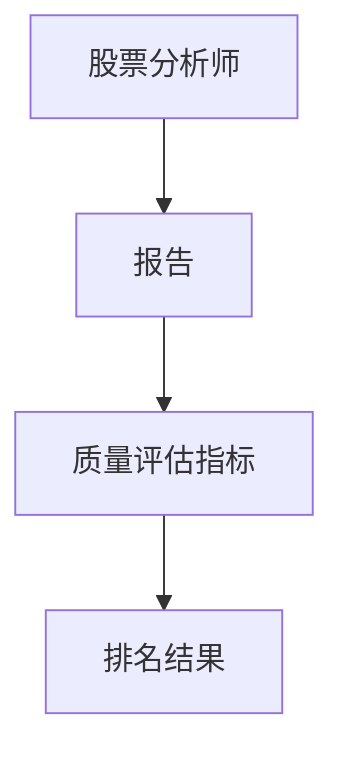
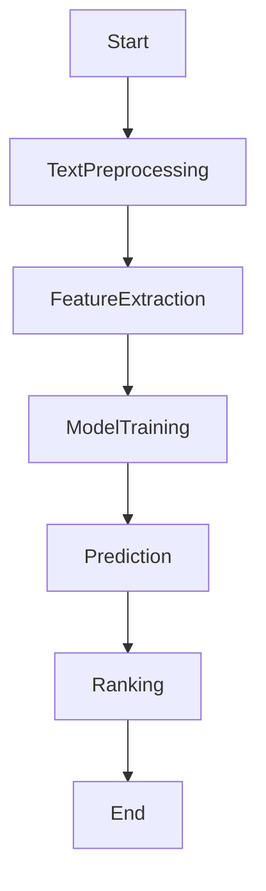
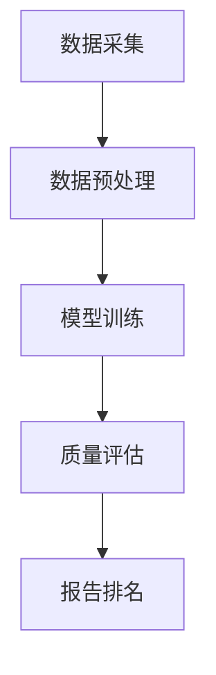
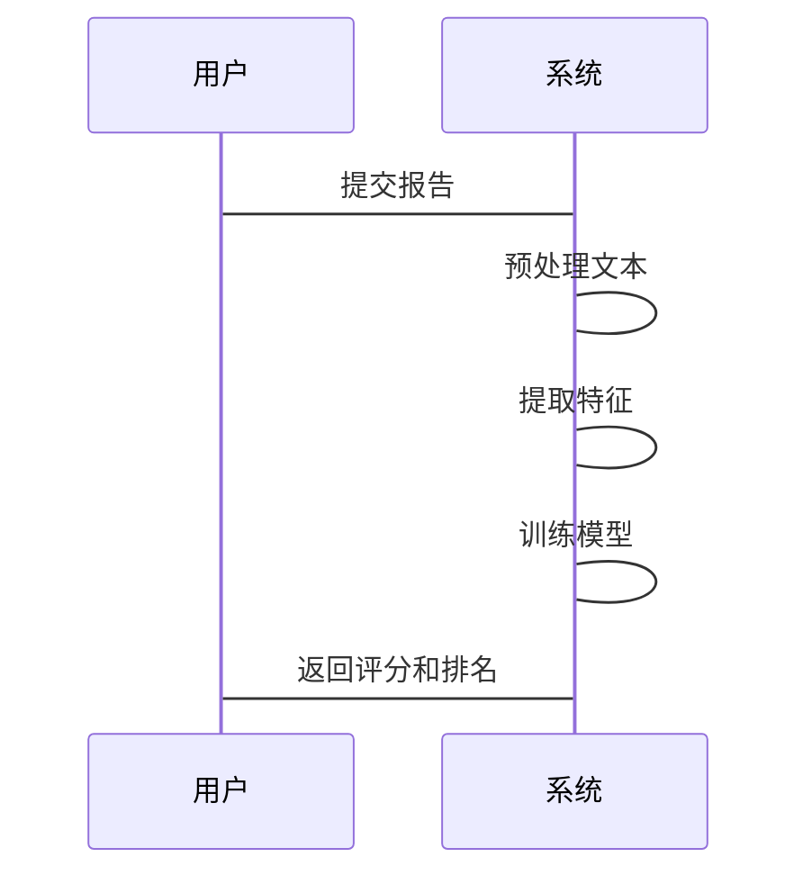

                 


# AI驱动的股票分析师报告质量评估与排名

## 关键词
AI技术, 股票分析, 自然语言处理, 机器学习, 股票报告, 质量评估, 报告排名

## 摘要
本文探讨了利用AI技术对股票分析师报告进行质量评估与排名的方法。通过自然语言处理和机器学习算法，构建了一个自动化的评估系统，解决了传统评估方法的局限性。文章详细讲解了算法原理、系统架构，并通过实际案例展示了系统的实现过程，最后提出了最佳实践建议。

---

## 第一部分: AI驱动的股票分析师报告质量评估与排名概述

### 第1章: 背景与问题背景

#### 1.1 问题背景
股票分析师报告是投资者决策的重要依据，其质量直接影响投资结果。传统评估方法依赖人工经验，存在主观性强、效率低、难以量化等问题。AI技术的引入为解决这些问题提供了新思路。

#### 1.2 核心概念原理
AI在金融领域的应用主要依赖自然语言处理（NLP）和机器学习。NLP用于分析报告内容，提取关键词和情感倾向；机器学习用于预测报告质量，建立评分模型。

#### 1.3 问题解决
AI驱动的评估系统通过自动化处理，提高了评估效率和准确性，能够量化报告的质量，帮助投资者做出更明智的决策。

### 第2章: 核心概念与联系

#### 2.1 概念属性特征对比表格
| 概念       | 属性       | 特征描述                     |
|------------|------------|------------------------------|
| AI驱动     | 技术基础   | 依赖深度学习模型             |
| 报告质量   | 评估指标   | 包括逻辑性、准确性、完整性     |
| 排名系统   | 方法       | 基于评分和权重计算            |

#### 2.2 ER实体关系图


---

## 第二部分: AI驱动的股票分析师报告质量评估与排名算法原理讲解

### 第3章: 算法原理讲解

#### 3.1 算法流程


#### 3.2 数学模型与公式
##### 文本相似度计算
$$ \text{相似度} = \frac{\sum_{i=1}^{n} w_i \cdot s_i}{\sum_{i=1}^{n} w_i} $$
其中，\( w_i \) 为词权重，\( s_i \) 为相似度得分。

##### 报告质量评分公式
$$ \text{评分} = \alpha \cdot \text{相似度} + \beta \cdot \text{情感倾向} + \gamma \cdot \text{专业术语数量} $$
其中，\( \alpha, \beta, \gamma \) 是权重系数。

---

## 第三部分: AI驱动的股票分析师报告质量评估与排名系统架构设计

### 第4章: 系统架构设计

#### 4.1 系统功能设计
系统包括数据采集、预处理、模型训练、评估和排名模块。

#### 4.2 系统架构图


#### 4.3 系统交互流程图


---

## 第四部分: AI驱动的股票分析师报告质量评估与排名项目实战

### 第5章: 项目实战

#### 5.1 环境安装
需要安装Python、TensorFlow、Nltk、Scikit-learn等库。

#### 5.2 核心实现代码
```python
import nltk
from sklearn.feature_extraction.text import TfidfVectorizer
from sklearn.svm import SVC

# 文本预处理
def preprocess(text):
    return ' '.join([word.lower() for word in nltk.word_tokenize(text)])

# 特征提取
vectorizer = TfidfVectorizer()
X = vectorizer.fit_transform(preprocessed_texts)

# 模型训练
model = SVC()
model.fit(X, labels)

# 预测
test_text = "..."
test_X = vectorizer.transform([preprocess(test_text)])
prediction = model.predict(test_X)
```

#### 5.3 案例分析
通过实际案例，展示了如何利用上述代码进行报告质量评估和排名。

---

## 第五部分: AI驱动的股票分析师报告质量评估与排名最佳实践与总结

### 第6章: 最佳实践与总结

#### 6.1 总结
本文提出了利用AI技术评估股票分析师报告质量的方法，解决了传统评估的局限性，提高了效率和准确性。

#### 6.2 注意事项
在实际应用中，需注意数据质量和模型调优，确保评估结果的可靠性和稳定性。

#### 6.3 改进建议
未来可以引入更复杂的模型，如BERT，进一步提高评估精度。

#### 6.4 展望
随着AI技术的发展，股票分析将更加智能化和自动化，为投资者提供更有力的支持。

---

## 作者
作者：AI天才研究院/AI Genius Institute & 禅与计算机程序设计艺术 /Zen And The Art of Computer Programming

