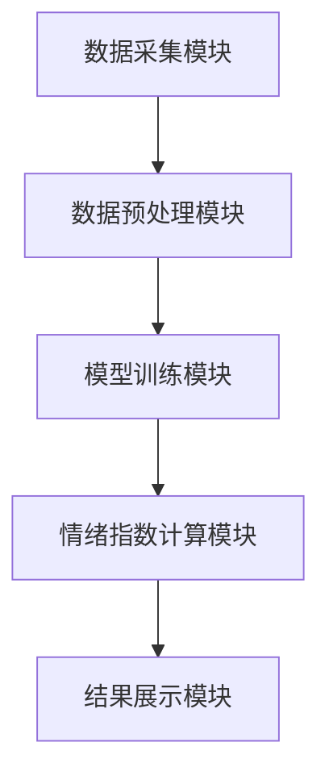

                 


# AI驱动的股票市场情绪指数开发

> 关键词：股票市场情绪指数，AI驱动，自然语言处理，情感分析，深度学习，金融数据分析

> 摘要：本文详细探讨了AI驱动的股票市场情绪指数开发的全过程，从基础概念到系统架构设计，再到项目实战，结合自然语言处理和深度学习技术，构建一个高效的情绪指数分析系统。

---

## 第一部分: AI驱动的股票市场情绪指数开发背景与基础

### 第1章: 股票市场情绪指数概述

#### 1.1 情绪指数的基本概念

股票市场情绪指数是用来量化投资者情绪的指标，反映了市场参与者对市场的乐观或悲观程度。这种情绪可以通过新闻、社交媒体、论坛等文本数据进行分析，从而转化为可量化的指数。

#### 1.2 AI在股票市场分析中的应用

人工智能技术在金融领域的应用越来越广泛，尤其是在情绪分析方面。通过自然语言处理（NLP）技术，AI能够从大量的文本数据中提取情感信息，并结合市场数据进行预测和分析。

---

### 第2章: 自然语言处理与情感分析基础

#### 2.1 自然语言处理（NLP）简介

NLP是人工智能的一个重要分支，旨在让计算机能够理解和处理人类语言。情感分析是NLP中的一个核心任务，用于判断文本的情感倾向（如积极、消极或中性）。

#### 2.2 传统情感分析算法

传统的文本分类方法，如基于词袋模型和支持向量机（SVM）的情感分析，虽然简单但效果有限。词袋模型忽略了词语的顺序，而SVM在处理高维数据时表现不佳。

#### 2.3 深度学习在情感分析中的应用

深度学习模型如LSTM和Transformer在情感分析中表现出色。LSTM能够处理序列数据，捕捉时间依赖关系；Transformer通过自注意力机制，能够更好地理解文本的语义结构。

---

### 第3章: 股票市场情绪指数开发的数据基础

#### 3.1 数据来源与采集

情绪指数的开发需要多源数据，包括新闻、社交媒体帖子、论坛评论等。这些数据需要经过清洗和预处理，去除噪声，提取有用的信息。

#### 3.2 数据特征提取

通过文本挖掘技术，提取文本中的情感特征，如情感词、情感强度等。同时，结合市场数据（如股价、成交量）进行特征融合。

#### 3.3 数据分析与可视化

通过统计分析和数据可视化，分析情绪指数与市场走势的相关性，验证模型的有效性。

---

### 第4章: 情绪指数开发的算法原理

#### 4.1 基于LSTM的情绪分析模型

LSTM通过记忆单元（Memory Cell）捕捉长期依赖关系，适合处理时间序列数据。在股票市场情绪分析中，LSTM可以捕捉文本中的情感变化趋势。

#### 4.2 基于Transformer的情绪分析模型

Transformer通过自注意力机制，能够更好地理解文本的全局语义。在处理长文本时，Transformer模型表现更优。

#### 4.3 情绪指数的计算方法

情绪指数可以通过加权平均的方式计算，权重基于模型预测的概率值。例如，使用以下公式计算情绪指数：

$$
\text{情绪指数} = \sum_{i=1}^{n} w_i \cdot s_i
$$

其中，\( w_i \) 是第 \( i \) 个文本的情感权重，\( s_i \) 是情感得分。

---

### 第5章: 系统架构与设计

#### 5.1 系统功能需求分析

系统需要实现数据采集、情感分析、情绪指数计算、结果展示等功能。目标是提供一个实时的情绪指数分析工具，帮助投资者做出决策。

#### 5.2 系统架构设计

系统架构包括数据采集模块、数据预处理模块、模型训练模块、情绪指数计算模块和结果展示模块。各模块通过接口进行交互，保证数据流的高效处理。

#### 5.3 系统架构图（Mermaid）



---

## 第二部分: 项目实战与优化

### 第6章: 项目实战

#### 6.1 环境安装与配置

安装必要的库，如Python的NLP库（spaCy、NLTK）、深度学习框架（TensorFlow、Keras）、数据处理库（Pandas、NumPy）等。

#### 6.2 核心实现代码

以下是基于LSTM的情绪分析模型代码示例：

```python
import tensorflow as tf
from tensorflow.keras.models import Sequential
from tensorflow.keras.layers import LSTM, Dense, Dropout, Embedding

model = Sequential()
model.add(Embedding(input_dim=10000, output_dim=64, input_length=500))
model.add(LSTM(units=64, return_sequences=False))
model.add(Dropout(0.5))
model.add(Dense(units=1, activation='sigmoid'))
model.compile(loss='binary_crossentropy', optimizer='adam', metrics=['accuracy'])
```

#### 6.3 案例分析与结果解读

通过具体案例分析，验证模型的预测能力。例如，分析某段时间内的新闻数据，计算情绪指数，并与实际市场走势进行对比。

---

### 第7章: 模型优化与调参

#### 7.1 模型调优

通过调整超参数（如学习率、批量大小、层数等），优化模型的性能。可以使用网格搜索或随机搜索进行调参。

#### 7.2 模型评估与验证

使用交叉验证等方法评估模型的泛化能力，确保模型在不同数据集上表现稳定。

#### 7.3 模型部署与实时监控

将模型部署到生产环境，实现实时数据处理和情绪指数计算。同时，建立监控机制，及时发现模型性能下降的问题。

---

### 第8章: 最佳实践与小结

#### 8.1 最佳实践

- 数据预处理是关键，确保数据质量和完整性。
- 选择合适的模型架构，根据任务需求权衡计算效率和准确性。
- 定期更新模型，适应市场变化。

#### 8.2 本章小结

通过本文的详细讲解，读者可以掌握AI驱动的股票市场情绪指数开发的全过程，从理论到实践，从算法选择到系统设计，全面了解情绪指数开发的核心技术。

---

## 作者信息

作者：AI天才研究院/AI Genius Institute & 禅与计算机程序设计艺术 /Zen And The Art of Computer Programming

---

以上是文章的完整结构和内容。每个章节都详细展开了相关主题，结合了理论和实践，帮助读者全面理解AI驱动的股票市场情绪指数开发。

