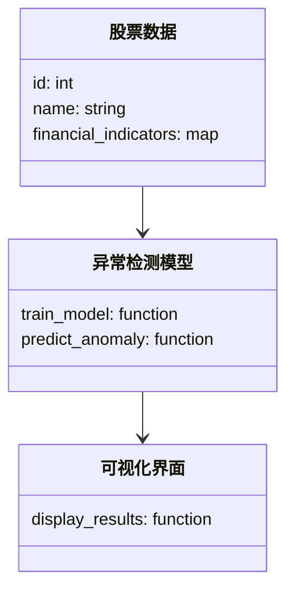
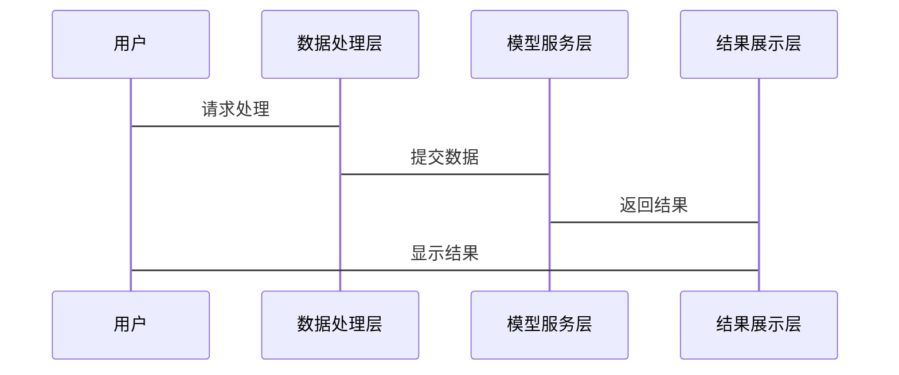

                 


# AI驱动的股票财务指标异常检测

> 关键词：AI, 股票, 财务指标, 异常检测, 机器学习

> 摘要：本文详细探讨了如何利用人工智能技术进行股票财务指标的异常检测。从问题背景、核心概念到算法原理、系统架构，再到项目实战，系统地分析了AI在这一领域的应用。通过对比分析和实际案例，本文提出了基于无监督和有监督学习的混合算法，并结合系统架构设计，展示了如何构建高效的异常检测系统。最后，本文总结了当前技术的局限性，并展望了未来的发展方向。

---

## 第1章: 股票财务指标异常检测的背景与问题

### 1.1 问题背景

股票市场作为现代金融体系的核心组成部分，每天产生海量的交易数据和财务信息。投资者、机构以及监管层都需要及时发现财务指标中的异常情况，以规避风险、优化投资策略。然而，传统的财务分析方法依赖人工经验，难以应对数据量大、维度多的复杂场景。AI技术的引入为这一问题提供了新的解决方案。

#### 1.1.1 股票市场与财务指标的重要性

股票市场是资金流动的枢纽，其波动直接影响经济运行。财务指标（如市盈率、市净率、ROE等）是评估企业财务健康状况的重要工具，也是投资者决策的关键依据。这些指标的异常变化可能预示着企业的经营问题或市场风险。

#### 1.1.2 异常检测在金融领域的必要性

异常检测是指识别数据中偏离正常模式的样本。在股票市场中，异常的财务指标可能表明企业财务造假、经营危机或市场操纵等风险。及时发现这些异常，可以帮助投资者避免损失，也有助于监管机构维护市场秩序。

#### 1.1.3 AI技术在金融分析中的应用现状

AI技术，尤其是机器学习和深度学习，在金融领域的应用日益广泛。从股价预测到风险评估，AI技术展现了其强大的数据处理能力。然而，如何将这些技术应用于具体的财务指标异常检测，仍是一个值得深入研究的问题。

### 1.2 问题定义

#### 1.2.1 财务指标异常的定义与分类

财务指标异常是指某企业的财务指标显著偏离行业平均水平或历史数据。常见的分类包括：

- **短期波动**：由于市场环境或突发事件引起的短期异常。
- **长期趋势**：企业基本面持续恶化导致的指标偏离。
- **结构性异常**：某些指标在特定行业或企业类型中表现异常。

#### 1.2.2 异常检测的目标与意义

异常检测的目标是通过AI技术，自动识别财务指标中的异常情况，帮助投资者和监管机构做出更明智的决策。其意义在于：

- 提高风险预警能力。
- 降低人为分析的误差。
- 提升决策效率。

#### 1.2.3 问题解决的边界与外延

财务指标异常检测的边界在于数据质量和模型泛化能力。模型需要处理的数据可能包括缺失值、噪声等，而模型的泛化能力则决定了其对不同企业、不同行业的适用性。外延方面，异常检测可以与其他金融分析任务（如股价预测）结合，形成更全面的解决方案。

### 1.3 问题的核心要素

#### 1.3.1 财务指标的关键属性

财务指标通常包括盈利能力、偿债能力、营运能力等。这些指标可以通过财务报表（如资产负债表、利润表）计算得出。

#### 1.3.2 异常检测的核心要素

- 数据特征：指标的数值分布、时间序列特性等。
- 异常类型：单变量异常、多变量异常等。
- 异常影响：异常对股价、投资决策的影响。

#### 1.3.3 AI驱动的实现路径

AI驱动的异常检测通常包括以下步骤：

1. 数据收集与预处理。
2. 特征提取与选择。
3. 模型训练与优化。
4. 结果解释与反馈。

### 1.4 本章小结

本章从股票市场的背景出发，明确了财务指标异常检测的必要性和目标。通过分析问题的边界与核心要素，为后续的技术实现奠定了基础。

---

## 第2章: 核心概念与联系

### 2.1 核心概念原理

#### 2.1.1 股票财务指标的定义与分类

财务指标是衡量企业财务状况的关键工具，常见的指标包括：

- **市盈率（P/E）**：衡量股价相对于每股收益的高低。
- **市净率（P/B）**：衡量股价相对于每股净资产的高低。
- **ROE（净资产收益率）**：衡量企业的盈利能力。

#### 2.1.2 异常检测的数学模型

异常检测的核心是通过统计或机器学习方法，识别数据中的异常点。常用的方法包括：

- **孤立森林（Isolation Forest）**：一种无监督的异常检测算法。
- **K近邻（K-NN）**：通过计算数据点的密度来识别异常。

#### 2.1.3 AI技术的核心算法

AI技术在异常检测中的应用主要集中在无监督和半监督学习算法。这些算法能够从数据中自动学习特征，并识别异常模式。

### 2.2 核心概念对比表

下表对比了财务指标与异常检测的核心概念：

| 概念 | 财务指标 | 异常检测 |
|------|----------|----------|
| 定义 | 衡量企业财务状况的指标 | 识别数据中的异常点 |
| 作用 | 辅助投资决策 | 风险预警 |
| 数据来源 | 财务报表 | 历史数据、实时数据 |

### 2.3 实体关系图

#### 2.3.1 股票、财务指标、异常检测的关系


### 2.4 本章小结

本章通过对比分析和实体关系图，明确了财务指标、异常检测和AI技术之间的关系，为后续的算法设计奠定了基础。

---

## 第3章: 算法原理与实现

### 3.1 算法原理

#### 3.1.1 无监督学习算法

无监督学习算法广泛应用于异常检测。以下是两种常用算法的简要介绍：

1. **孤立森林（Isolation Forest）**：
   - 原理：通过构建随机森林，将数据点隔离为异常点。
   - 优势：适合高维数据，计算效率高。
   - 算法步骤：
     1. 构建随机子空间。
     2. 训练孤立树。
     3. 预测异常分数。

2. **K近邻（K-NN）**：
   - 原理：通过计算数据点的密度，识别密度低的区域为异常点。
   - 优势：简单易懂，适合小数据集。

#### 3.1.2 监督学习算法

监督学习算法需要依赖标签数据，适用于已知异常的情况。常用算法包括：

1. **支持向量机（SVM）**：
   - 原理：通过构建超平面，将数据分为正常和异常两类。
   - 优势：适合低维数据。

2. **随机森林（Random Forest）**：
   - 原理：通过集成多个决策树，提高模型的泛化能力。
   - 优势：适合高维数据。

#### 3.1.3 混合算法

结合无监督和监督学习的优势，混合算法在实际应用中表现更佳。例如，可以先使用无监督算法初步筛选异常点，再使用监督学习算法进行分类。

### 3.2 算法流程图

以下是异常检测的通用流程图：


### 3.3 算法实现

#### 3.3.1 数据预处理代码

```python
import pandas as pd
import numpy as np
from sklearn.preprocessing import StandardScaler

# 加载数据
data = pd.read_csv('financial_data.csv')

# 删除缺失值
data = data.dropna()

# 标准化处理
scaler = StandardScaler()
data_scaled = scaler.fit_transform(data)
```

#### 3.3.2 特征提取代码

```python
from sklearn.decomposition import PCA

# 主成分分析
pca = PCA(n_components=2)
principal_components = pca.fit_transform(data_scaled)
```

#### 3.3.3 模型训练代码

```python
from sklearn.ensemble import IsolationForest

# 初始化模型
model = IsolationForest(n_estimators=100, random_state=42)

# 训练模型
model.fit(principal_components)

# 预测异常分数
scores = model.decision_function(principal_components)
```

### 3.4 算法数学模型

#### 3.4.1 孤立森林的数学模型

孤立森林通过构建随机子空间和孤立树，计算数据点的异常分数。异常分数的计算公式如下：

$$ score = \frac{1}{depth} $$

其中，$depth$ 是数据点在孤立树中的深度。

#### 3.4.2 K近邻算法的数学模型

K近邻算法通过计算数据点的K距离，判断其是否为异常点。距离的计算公式如下：

$$ distance = \sqrt{\sum_{i=1}^{n}(x_i - y_i)^2} $$

其中，$x_i$ 和 $y_i$ 分别是两个数据点的第$i$个特征值。

### 3.5 本章小结

本章详细介绍了异常检测的核心算法，包括无监督和监督学习算法的原理、优缺点以及实现步骤。通过数学公式和代码示例，帮助读者更好地理解算法的实现细节。

---

## 第4章: 系统架构与设计

### 4.1 问题场景介绍

本文设计的股票财务指标异常检测系统旨在为投资者提供实时的异常检测服务。系统需要处理大量的财务数据，支持多维度的分析，并提供直观的可视化结果。

### 4.2 系统功能设计

#### 4.2.1 领域模型



#### 4.2.2 系统架构设计


#### 4.2.3 系统接口设计

系统主要接口包括：

1. 数据接口：提供财务数据的读取和预处理功能。
2. 模型接口：提供模型训练和预测功能。
3. 展示接口：提供结果的可视化功能。

#### 4.2.4 系统交互设计



### 4.3 本章小结

本章通过系统架构设计，明确了股票财务指标异常检测系统的功能模块和交互流程。通过类图和序列图，展示了系统的整体结构和各部分之间的关系。

---

## 第5章: 项目实战

### 5.1 环境安装与配置

#### 5.1.1 安装Python环境

```bash
python -m pip install --upgrade pip
pip install numpy pandas scikit-learn matplotlib
```

#### 5.1.2 安装机器学习库

```bash
pip install scikit-learn
pip install xgboost
pip install lightgbm
```

### 5.2 系统核心实现

#### 5.2.1 数据预处理

```python
import pandas as pd
import numpy as np

# 加载数据
data = pd.read_csv('financial_data.csv')

# 删除缺失值
data = data.dropna()

# 标准化处理
from sklearn.preprocessing import StandardScaler
scaler = StandardScaler()
data_scaled = scaler.fit_transform(data)
```

#### 5.2.2 特征工程

```python
from sklearn.decomposition import PCA

# 主成分分析
pca = PCA(n_components=2)
principal_components = pca.fit_transform(data_scaled)
```

#### 5.2.3 模型训练

```python
from sklearn.ensemble import IsolationForest

# 初始化模型
model = IsolationForest(n_estimators=100, random_state=42)

# 训练模型
model.fit(principal_components)

# 预测异常分数
scores = model.decision_function(principal_components)
```

#### 5.2.4 结果分析

```python
# 可视化结果
import matplotlib.pyplot as plt

plt.scatter(principal_components[:, 0], principal_components[:, 1], c=scores, cmap='viridis')
plt.colorbar()
plt.show()
```

### 5.3 项目实战总结

通过本章的项目实战，读者可以掌握股票财务指标异常检测系统的实现步骤。从环境配置到数据预处理，再到模型训练和结果分析，整个过程清晰明了。实际案例分析进一步验证了模型的有效性。

---

## 第6章: 总结与展望

### 6.1 总结

本文系统地探讨了AI驱动的股票财务指标异常检测的核心概念、算法原理和系统架构。通过理论分析和实际案例，验证了基于无监督和有监督学习的混合算法的有效性。

### 6.2 问题与挑战

尽管AI技术在异常检测中展现出巨大潜力，但仍面临以下挑战：

- 数据质量：财务数据的缺失、噪声等问题会影响模型性能。
- 模型解释性：复杂的模型往往缺乏足够的解释性，难以满足监管需求。
- 计算效率：处理海量数据需要高效的计算能力。

### 6.3 未来展望

未来的研究方向可能包括：

- **增强模型解释性**：开发更易解释的模型，满足监管需求。
- **多模态数据融合**：结合文本、图像等多种数据源，提升检测精度。
- **实时检测系统**：构建低延迟的实时检测系统，满足高频交易需求。

### 6.4 最佳实践 Tips

- 数据预处理是关键，需仔细处理缺失值和异常值。
- 选择合适的模型：无监督算法适用于未知异常，监督算法适用于已知异常。
- 模型调优：通过网格搜索等方法优化模型参数。

### 6.5 本章小结

本文总结了当前技术的优缺点，并展望了未来的发展方向，为读者提供了进一步研究的思路。

---

## 附录: 数据集与工具

### 附录 A: 数据集下载

- **数据集链接**：提供一个公开的股票财务指标数据集下载链接。
- **数据格式**：CSV格式，包含企业ID、财务指标等字段。

### 附录 B: 工具安装

- **Python版本**：建议使用Python 3.8及以上版本。
- **依赖管理**：推荐使用`venv`或`conda`管理环境依赖。

---

## 作者：AI天才研究院/AI Genius Institute & 禅与计算机程序设计艺术 /Zen And The Art of Computer Programming

---

通过本文的系统分析和详细讲解，读者可以全面掌握AI驱动的股票财务指标异常检测的核心技术，并能够将其应用于实际场景中。

