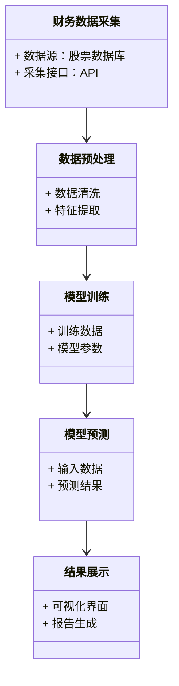
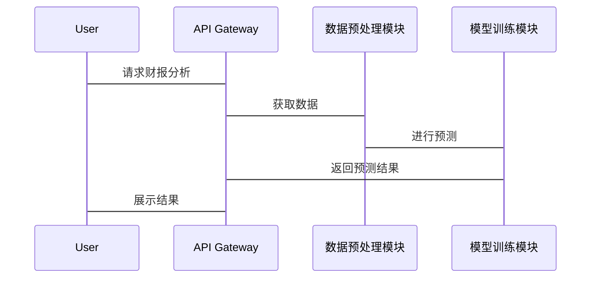

                 


# AI驱动的股票财报质量评估

> 关键词：人工智能、股票财报、财务数据分析、机器学习、自然语言处理

> 摘要：本文深入探讨了AI在股票财报质量评估中的应用，分析了传统方法的局限性，介绍了基于机器学习和自然语言处理的AI解决方案，并通过实例展示了如何构建高效可靠的财报质量评估系统。文章内容涵盖背景介绍、核心概念、算法原理、系统设计及项目实战，为读者提供了全面的指导。

---

# 第一部分: AI驱动的股票财报质量评估背景与概述

## 第1章: AI在金融领域的应用与发展

### 1.1 AI在金融领域的应用现状

#### 1.1.1 人工智能在金融行业的核心应用领域

- **股票市场分析**：AI通过分析历史数据和市场情绪，预测股票价格走势。
- **风险管理**：利用AI进行实时监控，识别潜在风险，防止金融危机。
- **智能投顾**：基于用户的投资目标和风险偏好，提供个性化的投资建议。
- **信用评估**：通过机器学习模型，快速评估客户的信用状况，降低金融风险。

#### 1.1.2 AI技术如何改变金融数据分析方式

- **自动化数据处理**：AI能够快速处理大量非结构化数据，如新闻、社交媒体信息等。
- **实时监控与预警**：通过自然语言处理和实时数据流分析，及时发现市场异动。
- **个性化服务**：AI根据用户行为和市场变化，提供定制化金融服务。

#### 1.1.3 股票市场分析中的AI技术发展趋势

- **深度学习模型的优化**：提升模型的准确性和预测能力。
- **多模态数据融合**：结合文本、图像等多种数据源，增强分析的全面性。
- **强化学习的应用**：用于智能投顾和自动化交易策略的优化。

## 第2章: 股票财报质量评估的挑战与AI解决方案

### 2.1 股票财报质量评估的基本概念

#### 2.1.1 财务报表分析的基本指标与方法

- **财务比率分析**：如ROE（净资产收益率）、毛利率等。
- **趋势分析**：分析公司财务数据随时间的变化趋势。
- **行业比较**：将公司数据与行业平均水平进行对比。

#### 2.1.2 股票市场中财报质量评估的重要性

- 财报质量直接影响投资者的决策，影响股价波动。
- 通过高质量的财报分析，投资者可以识别财务造假，降低投资风险。

#### 2.1.3 传统财报分析方法的局限性

- **数据量大**：手动分析耗时且容易出错。
- **主观性**：分析结果受分析师经验影响，存在主观偏差。
- **滞后性**：传统分析方法无法实时跟踪财务数据变化。

### 2.2 AI技术在财报质量评估中的优势

#### 2.2.1 自然语言处理在文本数据分析中的应用

- **文本挖掘**：从财报文本中提取关键信息，如收入、利润等。
- **情感分析**：分析管理层讨论与分析部分的情感倾向，预测公司前景。
- **实体识别**：识别财报中的关键实体，如公司名称、金额等。

#### 2.2.2 机器学习模型在财务预测中的优势

- **高准确性**：通过训练大量数据，模型能够识别复杂的财务模式。
- **实时更新**：机器学习模型可以实时更新，保持分析的及时性。
- **自动化处理**：自动化处理和分析财务数据，节省时间和成本。

#### 2.2.3 大数据分析能力对财报评估的支持

- **多数据源整合**：整合财务数据、市场数据、新闻数据等，提供全面的分析。
- **预测能力**：通过历史数据预测未来财务状况，帮助投资者做出明智决策。
- **异常检测**：利用AI识别财务数据中的异常值，发现潜在的财务问题。

---

# 第二部分: AI驱动的财报质量评估核心概念与联系

## 第3章: 核心概念与原理

### 3.1 数据特征提取与分析

#### 3.1.1 财务数据的特征工程方法

- **标准化与归一化**：处理财务数据中的数值差异，使模型训练更高效。
- **特征选择**：通过统计方法或模型选择重要特征，减少维度。
- **时间序列特征**：提取财务数据的时间依赖性，如趋势、周期性。

#### 3.1.2 文本数据的预处理与向量化

- **文本清洗**：去除停用词、标点符号，提取关键词。
- **分词与向量化**：使用词袋模型或词嵌模型将文本转化为向量。
- **主题模型**：如LDA，识别文本中的主题分布。

#### 3.1.3 时间序列数据的处理与建模

- **分解时间序列**：分解为趋势、季节性、随机性部分。
- **ARIMA模型**：用于预测未来值。
- **LSTM网络**：处理长序列依赖，捕捉复杂模式。

### 3.2 模型构建与评估指标

#### 3.2.1 常见的机器学习模型及其特点对比

| 模型类型       | 优点                               | 缺点                               |
|----------------|------------------------------------|------------------------------------|
| 线性回归       | 简单，易于解释                    | 不能处理非线性关系                 |
| 支持向量机     | 高精度，适合中小规模数据         | 不适合高维数据                     |
| 随机森林       | 高精度，适合高维数据             | 黑箱模型，解释性差                 |
| 神经网络       | 强大学习能力，适合复杂模式       | 需要大量数据，计算资源消耗大       |

#### 3.2.2 深度学习模型在自然语言处理中的应用

- **词嵌入**：如Word2Vec，将词转化为向量。
- **序列模型**：如RNN、LSTM，处理序列数据。
- ** transformers**：如BERT，用于上下文理解。

#### 3.2.3 模型评估与优化的常用指标与方法

- **准确率与召回率**：衡量模型的分类能力。
- **F1分数**：综合准确率和召回率的指标。
- **交叉验证**：评估模型的泛化能力。

## 第4章: 核心概念与联系

### 4.1 数据特征与模型性能的关系

#### 4.1.1 数据特征对模型准确率的影响分析

- **特征重要性**：某些特征对模型预测更为关键。
- **特征冗余**：过多无关特征可能降低模型性能。

#### 4.1.2 不同模型在不同数据特征下的表现对比

- 线性模型在低维数据表现好，非线性模型在高维数据表现好。
- LSTM在时间序列数据上有优势。

#### 4.1.3 数据特征选择的策略

- 基于统计的方法：如卡方检验。
- 基于模型的方法：如Lasso回归。

---

# 第三部分: AI驱动的财报质量评估算法原理与实现

## 第5章: 算法原理与实现

### 5.1 自然语言处理模型

#### 5.1.1 文本预处理与向量化

- 使用分词工具，如jieba。
- 使用TF-IDF或Word2Vec生成词向量。

#### 5.1.2 基于LSTM的文本分析


#### 5.1.3 模型训练与调优

- 调整LSTM层数、节点数。
- 使用早停法防止过拟合。

### 5.2 机器学习模型

#### 5.2.1 特征工程

- 标准化处理财务数据。
- 选择重要特征。

#### 5.2.2 模型选择与训练

```python
from sklearn.ensemble import RandomForestClassifier
model = RandomForestClassifier(n_estimators=100, random_state=42)
model.fit(X_train, y_train)
```

#### 5.2.3 模型评估与优化

- 使用k折交叉验证评估模型。
- 调整超参数，如学习率、树深度。

---

# 第四部分: 系统分析与架构设计方案

## 第6章: 系统设计与实现

### 6.1 问题场景介绍

- 项目目标：构建AI驱动的财报质量评估系统。
- 项目范围：涵盖数据采集、分析、预测。
- 项目利益相关者：投资者、金融机构。

### 6.2 系统功能设计

#### 6.2.1 领域模型



#### 6.2.2 系统架构设计


### 6.3 接口设计与交互

#### 6.3.1 系统接口设计

- 数据接口：提供API获取财务数据。
- 模型接口：提供API进行财报预测。

#### 6.3.2 交互设计



---

# 第五部分: 项目实战与应用

## 第7章: 项目实战

### 7.1 环境安装与配置

```bash
pip install pandas numpy scikit-learn tensorflow
```

### 7.2 系统核心实现

#### 7.2.1 数据预处理代码

```python
import pandas as pd
import numpy as np

# 加载数据
data = pd.read_csv('financial_data.csv')

# 数据清洗
data.dropna(inplace=True)
data = data[~data['收入'].isnull()]
```

#### 7.2.2 模型训练代码

```python
from sklearn.model_selection import train_test_split
from sklearn.ensemble import RandomForestClassifier

X = data.drop('目标变量', axis=1)
y = data['目标变量']

X_train, X_test, y_train, y_test = train_test_split(X, y, test_size=0.2, random_state=42)

model = RandomForestClassifier(n_estimators=100, random_state=42)
model.fit(X_train, y_train)
```

### 7.3 实际案例分析

- 数据来源：某公司财报数据。
- 预测结果：财务健康状况。
- 案例分析：通过AI模型预测财务风险，帮助投资者做出决策。

---

# 第六部分: 总结与展望

## 第8章: 总结与展望

### 8.1 总结

- AI技术在股票财报质量评估中展现出巨大潜力。
- 通过自然语言处理和机器学习，提升分析效率和准确性。
- 系统设计与实现为投资者提供可靠的决策支持。

### 8.2 展望

- 更多数据源的整合，如社交媒体数据。
- 深度学习模型的优化，提升预测精度。
- AI与人类专家的结合，实现更智能化的分析。

### 8.3 最佳实践 Tips

- 数据质量是关键，确保数据准确和完整。
- 模型选择要根据数据特点，合理调整参数。
- 结果解释性要强，便于用户理解和使用。

---

作者：AI天才研究院/AI Genius Institute & 禅与计算机程序设计艺术/Zen And The Art of Computer Programming

---

本文通过详细分析AI在股票财报质量评估中的应用，结合理论与实践，为读者提供了全面的指导。希望本文能帮助读者更好地理解AI在金融领域的作用，并为实际应用提供参考。

