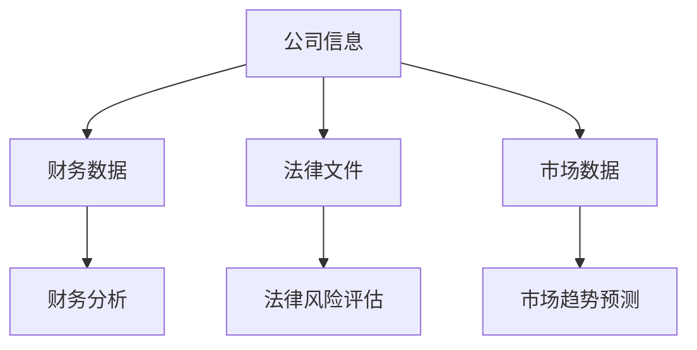
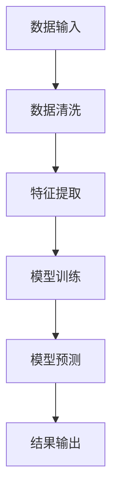
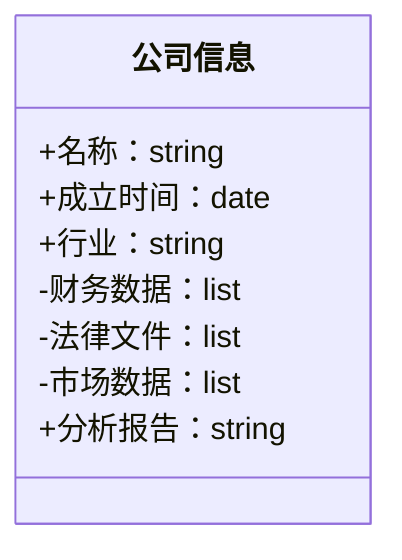
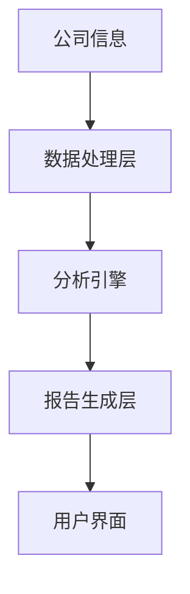
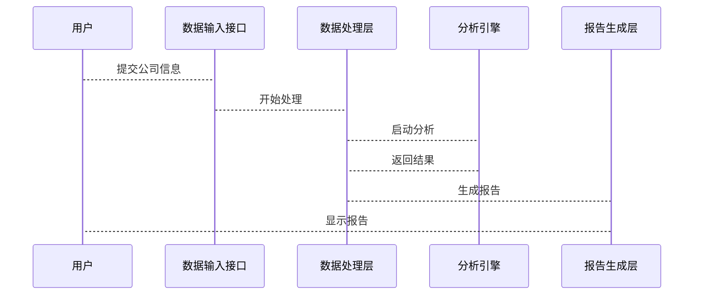

                 


# AI驱动的自动化公司尽职调查

> **关键词**：AI、公司尽职调查、自动化、机器学习、数据分析

> **摘要**：本文探讨了AI在公司尽职调查中的应用，分析了传统模式的痛点，详细讲解了AI驱动的自动化方法，包括数据收集、分析算法、系统架构和项目实战。通过案例分析和系统设计，展示了如何利用AI技术提升尽职调查的效率和准确性。

---

## 第1章: AI驱动的自动化公司尽职调查背景介绍

### 1.1 问题背景与描述

#### 1.1.1 公司尽职调查的传统模式

公司尽职调查（Due Diligence，简称DD）是企业在并购、投资或其他重大决策前，对目标公司进行全面调查的过程。传统模式依赖人工收集和分析大量数据，耗时且成本高昂，容易出现遗漏和错误。

#### 1.1.2 传统尽职调查的痛点与挑战

- 数据来源广泛且分散，难以高效整合。
- 人工分析易受主观因素影响，准确性不足。
- 时间和成本过高，影响决策效率。
- 高度依赖专业人员经验，存在知识壁垒。

#### 1.1.3 AI驱动的自动化尽职调查的优势

- 提高数据处理效率，缩短调查周期。
- 增强数据分析的准确性和全面性。
- 降低对专业人员的依赖，降低成本。
- 支持实时更新和动态分析，提升决策支持能力。

### 1.2 问题解决与边界

#### 1.2.1 AI如何解决尽职调查问题

AI技术可以自动化处理数据收集、清洗、分析和报告生成，显著提升尽职调查的效率和质量。

#### 1.2.2 AI驱动的自动化尽职调查的边界

AI驱动的尽职调查主要用于数据驱动的分析，不替代专业判断，依赖于高质量的数据输入。

#### 1.2.3 相关概念的外延与限制

AI技术的应用范围包括财务数据、法律文件、市场数据等，但无法覆盖所有类型的信息，如涉及道德或文化因素的决策仍需人工判断。

### 1.3 核心概念与组成

#### 1.3.1 AI驱动的公司尽职调查的核心要素

- 数据来源：财务数据、法律文件、市场数据。
- 数据处理：清洗、整合和预处理。
- 数据分析：NLP、机器学习模型的应用。
- 决策支持：生成分析报告和风险评估。

#### 1.3.2 相关概念的结构化分析

- 数据清洗：识别和处理错误或不完整数据。
- 特征提取：从数据中提取关键特征用于建模。
- 模型训练：训练机器学习模型进行预测和分类。

#### 1.3.3 核心要素的组成与关系

AI驱动的尽职调查通过整合多源数据，利用先进算法进行分析，为决策者提供支持。

---

## 第2章: AI驱动的自动化公司尽职调查的核心概念与联系

### 2.1 核心概念原理

#### 2.1.1 AI在数据收集中的应用

AI可以自动从多个来源收集数据，包括新闻、社交媒体和行业报告，提供全面的市场分析。

#### 2.1.2 自动化分析的核心原理

利用NLP和机器学习技术，自动识别和分类数据中的关键信息，生成结构化的分析报告。

#### 2.1.3 AI驱动的决策支持机制

通过构建预测模型，评估目标公司的风险和价值，辅助决策者制定策略。

### 2.2 核心概念属性对比表

| 核心概念 | 属性 | 描述 |
|----------|------|------|
| 数据来源 | 多样性 | 结构化与非结构化数据结合 |
| 数据处理 | 自动化 | AI驱动的清洗与预处理 |
| 数据分析 | 智能化 | 基于深度学习的模式识别 |

### 2.3 ER实体关系图



---

## 第3章: AI驱动的自动化公司尽职调查的算法原理

### 3.1 算法原理概述

#### 3.1.1 基于NLP的文本分析

使用NLP技术对法律文件和市场报告进行关键词提取和情感分析，识别潜在风险。

#### 3.1.2 基于机器学习的预测模型

构建回归模型预测公司财务状况，分类模型识别法律风险。

#### 3.1.3 算法的适用场景与选择

根据数据类型选择合适的算法，结构化数据使用回归，非结构化数据使用NLP。

### 3.2 算法流程图



### 3.3 机器学习模型实现

#### 3.3.1 线性回归模型

用于预测公司财务状况：

$$ y = \beta_0 + \beta_1x + \epsilon $$

其中，$y$是预测值，$x$是自变量，$\beta_0$和$\beta_1$是模型参数。

#### 3.3.2 支持向量机（SVM）

用于分类问题，例如识别法律风险：

$$ \text{max}(\text{distance between classes}) $$

---

## 第4章: AI驱动的自动化公司尽职调查的系统分析与架构设计

### 4.1 问题场景介绍

企业在并购时需要对目标公司进行多维度调查，涵盖财务、法律和市场因素。

### 4.2 系统功能设计

#### 4.2.1 领域模型类图



#### 4.2.2 系统架构设计



#### 4.2.3 系统接口设计

- 数据输入接口：接收结构化和非结构化数据。
- 模型调用接口：与机器学习模型交互。
- 报告生成接口：输出分析结果。

#### 4.2.4 系统交互流程



---

## 第5章: AI驱动的自动化公司尽职调查的项目实战

### 5.1 环境安装

- Python 3.8及以上
- 安装库：pandas、numpy、scikit-learn、spaCy

### 5.2 核心代码实现

#### 5.2.1 数据处理代码

```python
import pandas as pd

def load_data():
    df = pd.read_csv('company_data.csv')
    return df

def preprocess_data(df):
    # 数据清洗和预处理
    df = df.dropna()
    return df

if __name__ == '__main__':
    data = load_data()
    processed_data = preprocess_data(data)
    print(processed_data.head())
```

#### 5.2.2 模型训练代码

```python
from sklearn.model_selection import train_test_split
from sklearn.linear_model import LinearRegression

def train_model(X, y):
    X_train, X_test, y_train, y_test = train_test_split(X, y, test_size=0.2)
    model = LinearRegression()
    model.fit(X_train, y_train)
    return model

data = load_data()
processed_data = preprocess_data(data)
X = processed_data[['revenue', 'profit_margin']]
y = processed_data['valuation']
model = train_model(X, y)
print(model.score(X_test, y_test))
```

### 5.3 案例分析

分析一家科技公司的数据，模型预测其估值，并生成分析报告，指出潜在风险和机会。

### 5.4 项目总结

通过实际案例展示AI驱动尽职调查的优势，强调数据质量对模型准确性的关键作用。

---

## 第6章: 总结与展望

### 6.1 核心总结

AI驱动的自动化公司尽职调查显著提升了效率和准确性，但仍需解决数据质量和模型解释性问题。

### 6.2 小结

本文系统介绍了AI在公司尽职调查中的应用，从算法到系统设计，再到项目实战，为读者提供了全面的指导。

### 6.3 注意事项

确保数据质量和模型透明度，避免算法偏见，结合专业判断。

### 6.4 未来展望

AI技术的进一步发展将推动尽职调查的智能化，多模态数据和可解释性模型是未来研究方向。

---

## 作者

作者：AI天才研究院/AI Genius Institute & 禅与计算机程序设计艺术 /Zen And The Art of Computer Programming

---

通过以上结构化和详细的内容，读者可以全面理解AI驱动的自动化公司尽职调查的原理、实现和应用。

