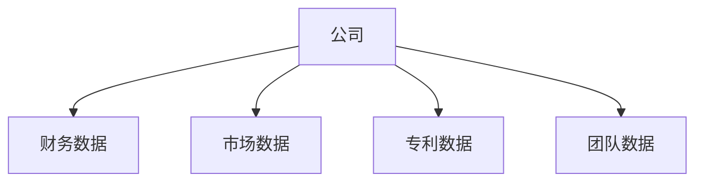
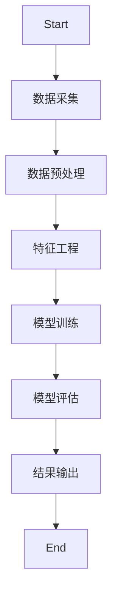
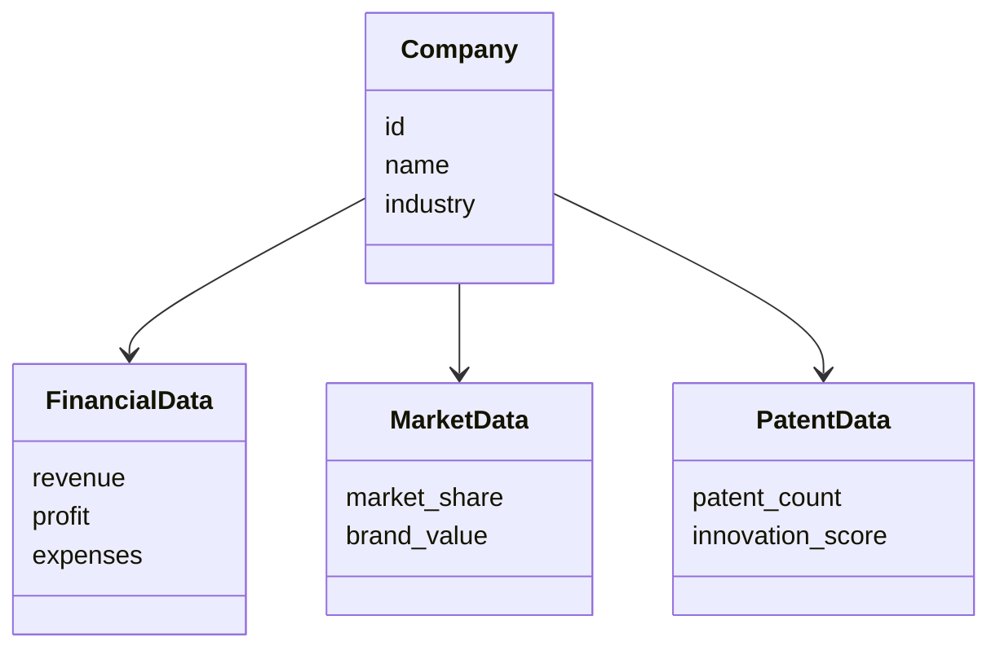

                 


# AI驱动的自动化公司质量评估

> 关键词：AI驱动，自动化评估，公司质量，数据挖掘，机器学习，系统架构

> 摘要：本文将详细探讨如何利用人工智能技术实现公司质量的自动化评估。通过分析传统评估方法的痛点，介绍AI驱动评估的核心概念、算法原理、系统架构设计，并通过实战案例展示如何实现这一目标。文章最后总结了AI驱动自动化评估的优势，并展望了未来的发展方向。

---

# 第1章 AI驱动的自动化公司质量评估概述

## 1.1 问题背景与挑战

### 1.1.1 传统公司质量评估的痛点
传统公司质量评估主要依赖人工分析，存在以下痛点：
- **数据繁杂**：需要收集大量非结构化数据，人工整理耗时耗力。
- **主观性强**：评估结果受评估人员主观因素影响较大。
- **效率低下**：人工评估难以快速响应市场变化。
- **缺乏量化**：难以用量化指标衡量公司质量，结果不够客观。

### 1.1.2 AI技术在质量评估中的应用潜力
AI技术可以通过以下方式解决上述痛点：
- **自动化数据处理**：利用自然语言处理（NLP）技术自动提取文本数据中的关键信息。
- **模型量化评估**：通过机器学习模型对数据进行建模，输出量化评估结果。
- **实时反馈优化**：AI模型可以实时更新，快速响应数据变化。

### 1.1.3 自动化评估的核心价值
- 提高评估效率，降低人工成本。
- 增强评估结果的客观性和准确性。
- 实现对公司质量的实时监控和动态评估。

## 1.2 核心概念与定义

### 1.2.1 公司质量评估的维度
公司质量评估可以从以下几个维度进行：
- **财务健康度**：通过财务数据评估公司的盈利能力。
- **市场表现**：通过市场份额和品牌影响力评估公司的市场地位。
- **技术创新能力**：通过专利数量和研发投入评估公司的技术实力。
- **团队能力**：通过员工数量和团队结构评估公司的人力资源。

### 1.2.2 AI驱动的自动化评估定义
AI驱动的自动化公司质量评估是指利用人工智能技术，从多维度数据中提取特征，构建机器学习模型，最终输出公司质量评估结果的过程。

### 1.2.3 系统边界与外延
- **系统边界**：系统仅负责数据处理、模型训练和结果输出，不涉及数据源的扩展。
- **外延**：评估结果可以用于公司评级、投资决策等场景。

## 1.3 核心要素与组成结构

### 1.3.1 数据来源与处理流程
- **数据来源**：公司财报、新闻报道、招聘信息、专利数据。
- **处理流程**：数据清洗、特征提取、数据标注。

### 1.3.2 AI模型的构建与训练
- **模型选择**：监督学习、无监督学习。
- **训练流程**：数据预处理、特征工程、模型训练、模型评估。

### 1.3.3 评估结果的输出与应用
- **输出形式**：量化评分、图表展示。
- **应用场景**：投资决策、企业并购、风险控制。

---

# 第2章 AI驱动的自动化公司质量评估核心概念与联系

## 2.1 AI驱动的自动化评估原理

### 2.1.1 数据采集与预处理
- **数据采集**：爬取公司财报、新闻数据。
- **数据清洗**：去除缺失值、异常值。

### 2.1.2 模型训练与优化
- **特征工程**：提取关键词、TF-IDF特征。
- **模型调优**：参数优化、模型融合。

### 2.1.3 结果生成与反馈
- **结果生成**：模型预测、结果解释。
- **反馈机制**：实时更新模型参数。

## 2.2 核心概念属性特征对比

### 2.2.1 数据特征对比表

| 数据特征 | 描述 | 示例 |
|----------|------|------|
| 时间性 | 数据的时间范围 | 2022年财报 |
| 空间性 | 数据的地理分布 | 北美、欧洲市场 |
| 颗粒度 | 数据的详细程度 | 月度数据、季度数据 |

### 2.2.2 模型特征对比表

| 模型特征 | 描述 | 示例 |
|----------|------|------|
| 监督性 | 是否需要标签数据 | 监督学习需要标签 |
| 可解释性 | 模型结果是否易于解释 | 线性回归模型可解释性高 |

### 2.2.3 评估结果特征对比表

| 结果特征 | 描述 | 示例 |
|----------|------|------|
| 评分范围 | 评估结果的范围 | A级、B级 |
| 评分标准 | 评分的依据 | 财务指标、技术创新能力 |

## 2.3 ER实体关系图架构



---

# 第3章 AI驱动的自动化公司质量评估算法原理

## 3.1 算法流程图



## 3.2 算法实现代码

### 3.2.1 数据预处理
```python
import pandas as pd
import numpy as np

# 数据加载
df = pd.read_csv('company_data.csv')

# 删除缺失值
df = df.dropna()

# 去除异常值
z_scores = (df - df.mean()).abs() / df.std()
df = df[(z_scores < 3).all(axis=1)]
```

### 3.2.2 特征工程
```python
from sklearn.feature_extraction.text import TfidfVectorizer

# 文本数据特征提取
vectorizer = TfidfVectorizer()
tfidf = vectorizer.fit_transform(df['news'])
```

### 3.2.3 模型训练
```python
from sklearn.linear_model import LogisticRegression
from sklearn.metrics import accuracy_score

# 模型训练
model = LogisticRegression()
model.fit(tfidf, df['label'])

# 模型评估
print(accuracy_score(model.predict(tfidf), df['label']))
```

## 3.3 数学公式

### 损失函数
$$ \text{损失函数} = -\frac{1}{N} \sum_{i=1}^{N} [y_i \ln(p_i) + (1 - y_i) \ln(1 - p_i)] $$

### 优化器
$$ \text{优化器} = \text{Adam}(\alpha=0.001, \beta_1=0.9, \beta_2=0.999) $$

---

# 第4章 AI驱动的自动化公司质量评估系统分析与架构设计

## 4.1 系统功能设计

### 4.1.1 领域模型


### 4.1.2 系统架构
```mermaid
graph TD
    User[用户] --> API Gateway
    API Gateway --> Service1[服务1]
    API Gateway --> Service2[服务2]
    Service1 --> Database[数据库]
    Service2 --> Database
```

---

# 第5章 AI驱动的自动化公司质量评估项目实战

## 5.1 环境安装
```bash
pip install numpy pandas scikit-learn
```

## 5.2 核心实现代码
```python
import pandas as pd
from sklearn.model_selection import train_test_split
from sklearn.ensemble import RandomForestClassifier
from sklearn.metrics import accuracy_score

# 数据加载
df = pd.read_csv('company_data.csv')

# 数据划分
X_train, X_test, y_train, y_test = train_test_split(df.drop('label', axis=1), df['label'], test_size=0.2)

# 模型训练
model = RandomForestClassifier()
model.fit(X_train, y_train)

# 模型评估
print(accuracy_score(model.predict(X_test), y_test))
```

---

# 第6章 总结与展望

## 6.1 总结
AI驱动的自动化公司质量评估通过技术创新解决了传统评估方法的痛点，实现了评估的自动化、量化和实时化。

## 6.2 注意事项
- 数据质量和模型选择直接影响评估结果。
- 需要定期更新模型参数，保证评估结果的准确性。

## 6.3 拓展阅读
- 《机器学习实战》
- 《深度学习入门：基于Python》

---

作者：AI天才研究院

