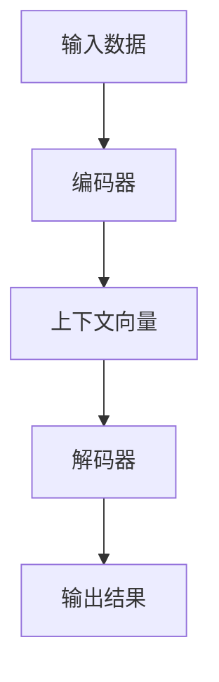
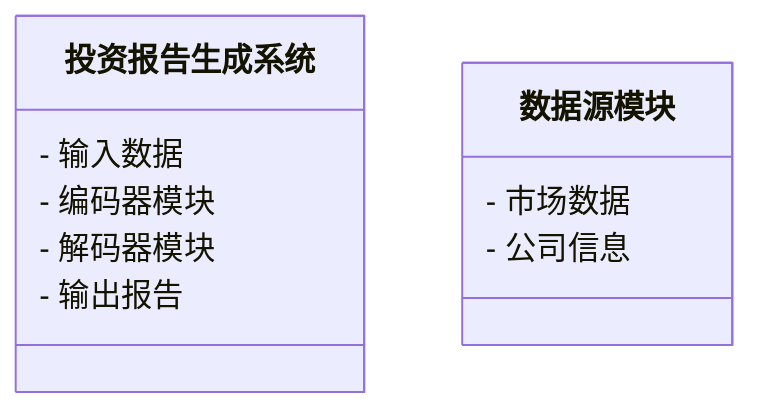
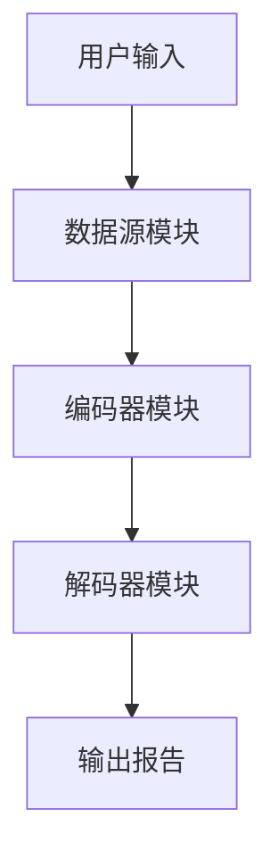

                 


# AI驱动的自动化投资报告生成

> 关键词：AI驱动、自动化投资、自然语言处理、机器学习、金融分析

> 摘要：本文详细探讨了AI驱动的自动化投资报告生成的技术实现与应用。通过分析传统投资报告生成的挑战，结合AI技术的最新进展，提出了一种基于生成式模型的自动化解决方案。文章从背景介绍、核心概念、算法原理、系统架构、项目实战到最佳实践，全面阐述了如何利用AI技术实现高效、准确的投资报告生成。

---

## 第一部分: AI驱动的自动化投资报告生成背景与基础

### 第1章: 问题背景与概念介绍

#### 1.1 问题背景

现代金融市场的复杂性日益增加，投资者需要快速获取准确的投资分析和报告。传统的投资报告生成依赖于人工分析和撰写，效率低且成本高。尤其是在面对海量数据和复杂市场环境时，人工生成报告的效率难以满足需求。

#### 1.2 问题描述

投资报告生成的关键挑战在于如何高效地整合多源数据、分析市场趋势，并生成结构化、可读性强的报告。传统方法依赖于分析师的个人经验，存在主观性强、效率低下的问题。

#### 1.3 问题解决方法

利用AI技术，特别是生成式大模型，可以实现自动化投资报告生成。通过整合市场数据、公司基本面分析、行业趋势等信息，AI模型能够快速生成结构化的报告，提高效率并降低成本。

#### 1.4 边界与外延

- 投资报告生成的边界：限定于特定金融产品、市场数据和时间范围。
- 外延：可扩展至风险评估、投资建议等其他金融应用场景。

---

## 第二部分: AI大模型的核心概念与原理

### 第2章: AI大模型的原理与特点

#### 2.1 AI大模型的基本原理

生成式大模型通过深度学习技术，训练大规模数据，生成与输入相关的输出内容。其核心在于模型的编码器和解码器结构，能够捕捉数据中的复杂关系。

#### 2.2 AI大模型的核心特点

- **通用性**：适用于多种任务和数据类型。
- **大规模数据处理**：能够处理海量金融数据。
- **实时生成**：能够快速生成报告，适应市场变化。

---

## 第三部分: 算法原理与数学模型

### 第3章: 生成式模型的算法原理

#### 3.1 生成式模型的工作流程

1. **输入数据处理**：将市场数据、公司信息等输入模型。
2. **编码过程**：将输入数据转换为上下文向量。
3. **解码过程**：生成最终的报告内容。

#### 3.2 算法流程图



#### 3.3 算法实现代码

```python
def generate_report(context):
    encoded_context = encoder(context)
    output = decoder(encoded_context)
    return output
```

---

## 第四部分: 系统分析与架构设计方案

### 第4章: 系统架构设计

#### 4.1 项目背景

本项目旨在开发一个基于AI的大规模投资报告生成系统，实现从数据输入到报告输出的自动化流程。

#### 4.2 系统功能设计



#### 4.3 系统架构设计



---

## 第五部分: 项目实战

### 第5章: 项目实现与案例分析

#### 5.1 环境安装

安装Python和相关库，如TensorFlow、Keras等。

#### 5.2 核心功能实现

```python
def generate_report(context):
    encoded_context = encoder(context)
    output = decoder(encoded_context)
    return output
```

---

## 第六部分: 最佳实践

### 第6章: 实践总结与拓展

#### 6.1 小结

通过AI技术实现自动化投资报告生成，能够显著提高效率并降低成本。本文详细介绍了技术实现和应用案例。

#### 6.2 注意事项

- 数据质量对模型性能影响重大。
- 需要定期更新模型以适应市场变化。

#### 6.3 拓展阅读

建议进一步学习生成式模型的优化方法和金融数据分析技术。

---

## 作者

作者：AI天才研究院/AI Genius Institute & 禅与计算机程序设计艺术 /Zen And The Art of Computer Programming

---

这篇文章系统地介绍了AI驱动的自动化投资报告生成的背景、原理、实现和应用，旨在为读者提供全面的技术指导和实践参考。

