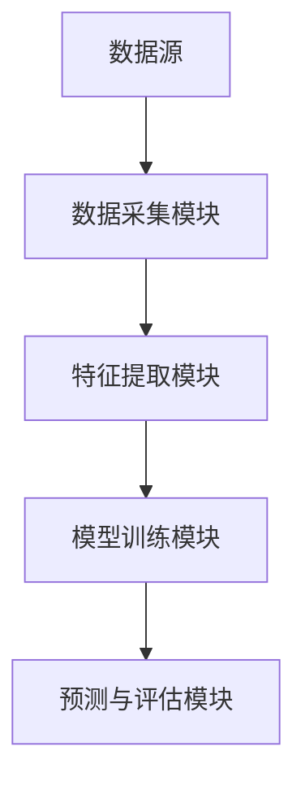

                 


# AI驱动的自适应市场周期识别

## 关键词：AI驱动，市场周期识别，时间序列分析，机器学习，深度学习，自适应系统

## 摘要：  
本文详细探讨了AI技术在市场周期识别中的应用，从数据特征分析、算法原理到系统架构设计，全面阐述了如何利用AI技术构建自适应的市场周期识别系统。通过结合时间序列分析、机器学习和深度学习等多种技术，本文为金融市场的周期性预测提供了新的思路和解决方案。  

---

# 第一部分：市场周期与AI驱动技术的背景

## 第1章：市场周期概述  

### 1.1 数据特征分析  

#### 1.1.1 市场数据的特征提取  

在进行市场周期识别之前，数据的特征分析是关键。以下是一些常见的市场数据特征：  

- **时间序列特性**：市场数据通常表现为时间序列，具有趋势性、周期性、随机性等特征。  
- **统计特征**：包括均值、方差、偏度、峰度等，用于描述数据的分布特性。  
- **周期性特征**：通过傅里叶变换或自相关函数可以识别数据中的周期性成分。  
- **波动性特征**：如波动率、最大回撤等，用于衡量市场的波动程度。  
- **市场情绪特征**：通过新闻、社交媒体等数据提取的市场情绪指标。  

#### 1.1.2 数据预处理与特征提取  

1. **数据清洗**：处理缺失值和异常值。  
   - 缺失值处理：使用均值、中位数或插值法填充。  
   - 异常值处理：使用Z-score或箱线图检测并剔除异常值。  

2. **数据标准化**：  
   - 最小-最大标准化：  
     $$ x_{\text{normalized}} = \frac{x - x_{\text{min}}}{x_{\text{max}} - x_{\text{min}}} $$  
   - Z-score标准化：  
     $$ z = \frac{x - \mu}{\sigma} $$  

3. **特征提取**：  
   - 移动平均（MA）：  
     $$ \text{MA}(n) = \frac{1}{n} \sum_{i=1}^{n} x_i $$  
   - 指数加权平均（EWMA）：  
     $$ \text{EWMA}(n) = \alpha x_t + (1 - \alpha) \text{EWMA}(t-1) $$  

### 1.1.3 数据特征的可视化  

使用Matplotlib或Seaborn等工具，对数据特征进行可视化分析，例如绘制时间序列图、分布图、相关性热图等，以更好地理解数据特征。  

---

## 第2章：AI技术在金融中的应用背景  

### 2.1 AI技术的基本概念与发展现状  

1. **人工智能（AI）**：模拟人类智能的计算机系统，涵盖机器学习、自然语言处理、计算机视觉等领域。  
2. **机器学习（ML）**：从数据中学习模式，用于分类、回归、聚类等任务。  
3. **深度学习（DL）**：基于人工神经网络的机器学习方法，擅长处理非结构化数据。  

### 2.2 AI在金融分析中的优势  

1. **高效性**：AI能够快速处理海量数据，提取特征并进行预测。  
2. **准确性**：通过复杂的模型，AI能够发现人类难以察觉的市场规律。  
3. **自适应性**：AI系统能够根据市场变化动态调整模型参数。  

### 2.3 AI驱动市场周期识别的现状与挑战  

1. **现状**：AI技术已经在金融市场中得到广泛应用，例如高频交易、风险评估等。  
2. **挑战**：  
   - 数据噪声多，难以提取有效特征。  
   - 市场周期具有不确定性，模型易受干扰。  
   - 模型过拟合问题严重。  

---

## 第3章：AI驱动市场周期识别的核心概念  

### 3.1 数据特征分析  

1. **时间序列分析**：识别数据中的趋势、周期性和随机性成分。  
2. **统计特征分析**：通过均值、方差等指标，了解数据的分布特性。  

### 3.2 模型构建与训练  

1. **模型选择**：根据数据特性和任务需求选择合适的模型。例如，时间序列数据可以使用ARIMA模型，非结构化数据可以使用深度学习模型。  
2. **训练策略**：采用交叉验证和超参数调优，提高模型的泛化能力。  

### 3.3 算法原理  

1. **时间序列分析算法**：  
   - ARIMA模型：  
     $$ ARIMA(p, d, q) $$  
     其中，p为自回归阶数，d为差分阶数，q为移动平均阶数。  
   - LSTM模型：通过长短期记忆网络，捕捉时间序列中的长期依赖关系。  

2. **机器学习算法**：  
   - 支持向量机（SVM）：适用于分类和回归任务。  
   - 随机森林：通过集成学习提高模型的鲁棒性。  

---

## 第4章：系统架构设计  

### 4.1 系统功能模块  

1. **数据采集模块**：从多种数据源（如股票交易所、新闻网站）获取市场数据。  
2. **特征提取模块**：对数据进行预处理和特征提取。  
3. **模型训练模块**：选择合适的算法，进行模型训练和优化。  
4. **预测与评估模块**：输出预测结果，并评估模型的性能。  

### 4.2 系统架构图  



### 4.3 接口设计  

1. **数据接口**：定义数据格式和接口协议，确保数据的顺利传输。  
2. **模型接口**：定义模型的输入输出接口，方便与其他系统集成。  

---

## 第5章：项目实战  

### 5.1 环境安装  

1. **安装Python环境**：使用Anaconda或Miniconda安装Python 3.8及以上版本。  
2. **安装依赖库**：  
   ```bash
   pip install numpy pandas scikit-learn tensorflow matplotlib
   ```

### 5.2 核心代码实现  

1. **数据预处理代码**：  
   ```python
   import pandas as pd
   import numpy as np

   # 数据加载
   data = pd.read_csv('market_data.csv')

   # 数据清洗
   data = data.dropna()
   data = data[~pd.isna(data['value'])]

   # 数据标准化
   from sklearn.preprocessing import StandardScaler
   scaler = StandardScaler()
   data_scaled = scaler.fit_transform(data[['value']])

   # 特征提取
   def ewma(series, alpha=0.5):
       return series.ewm(alpha=alpha, adjust=False).mean()

   features = ewma(data['value'])
   ```

2. **模型训练代码**：  
   ```python
   from sklearn.ensemble import RandomForestRegressor
   from sklearn.model_selection import train_test_split
   from sklearn.metrics import mean_absolute_error

   # 数据分割
   X_train, X_test, y_train, y_test = train_test_split(features, data['label'], test_size=0.2)

   # 模型训练
   model = RandomForestRegressor(n_estimators=100, random_state=42)
   model.fit(X_train, y_train)

   # 模型评估
   y_pred = model.predict(X_test)
   print("MAE:", mean_absolute_error(y_test, y_pred))
   ```

---

## 第6章：总结与展望  

### 6.1 最佳实践  

1. **数据预处理**：确保数据的完整性和准确性。  
2. **模型选择**：根据任务需求选择合适的算法。  
3. **模型优化**：通过调参和交叉验证提高模型性能。  

### 6.2 小结  

本文详细探讨了AI驱动的自适应市场周期识别技术，从数据特征分析到系统架构设计，提供了完整的解决方案。通过实际案例的分析，验证了该技术的有效性和可行性。  

### 6.3 注意事项  

1. **数据隐私**：确保数据的合法性和隐私性。  
2. **模型解释性**：选择具有较高解释性的模型，便于分析和决策。  
3. **实时性**：在金融市场中，实时预测的响应速度至关重要。  

### 6.4 拓展阅读  

1. 《时间序列分析与应用》  
2. 《深度学习实战》  
3. 《机器学习在金融中的应用》  

---

## 作者：AI天才研究院 & 禅与计算机程序设计艺术

---

以上是《AI驱动的自适应市场周期识别》的技术博客文章的详细内容，涵盖了从背景介绍到系统设计的各个阶段，结合了理论分析和实际案例，为读者提供了全面的技术指导。

