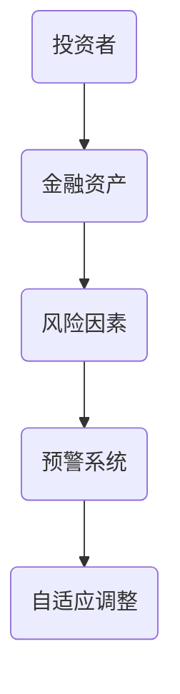
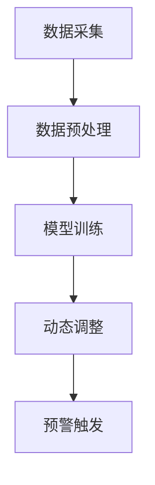
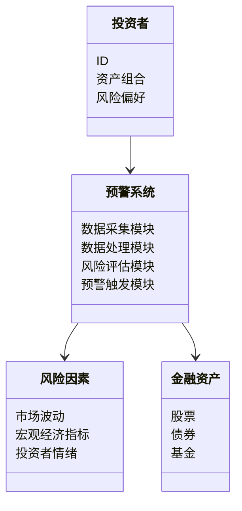
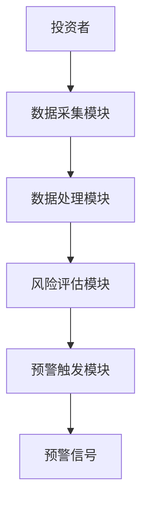
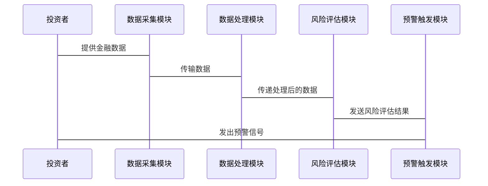

                 


# AI驱动的自适应投资风险预警

## 关键词：
AI, 投资风险, 自适应预警, 机器学习, 风险管理

## 摘要：
本文深入探讨了如何利用人工智能技术构建自适应投资风险预警系统。通过分析投资风险的动态特性，结合机器学习算法和实时数据分析，提出了一种基于AI的自适应预警模型。该模型能够根据市场变化和投资者行为动态调整预警策略，有效提升风险识别和应对能力。文章详细讲解了系统架构、算法原理和实现方法，并通过实际案例展示了系统的应用效果。

---

# 第一部分：背景介绍

## 第1章：自适应投资风险预警的背景与问题

### 1.1 问题背景
投资市场的风险具有高度动态性和不确定性。传统风险预警方法依赖于静态模型和规则，难以捕捉市场变化和投资者行为的实时动态。随着金融市场的复杂化，投资者需要一种能够实时适应市场变化、动态调整预警策略的解决方案。

### 1.2 问题描述
投资风险的预警需要解决以下关键问题：
- **多因素影响**：市场波动、宏观经济指标、投资者情绪等多种因素共同作用于风险。
- **数据实时性**：金融市场数据的实时性和多样性对预警系统的响应速度提出了更高要求。
- **预警准确性**：传统的基于规则的预警方法难以应对复杂多变的市场环境，容易产生误报或漏报。

### 1.3 问题解决与边界
- **目标**：构建一个能够实时监控市场变化、动态调整预警策略的自适应投资风险预警系统。
- **边界**：系统主要关注投资风险的实时监测和预警，不涉及投资决策的具体执行。
- **核心要素**：实时数据采集、动态风险评估模型、自适应调整机制。

---

# 第二部分：核心概念与联系

## 第2章：自适应投资风险预警的核心原理

### 2.1 核心概念原理
自适应投资风险预警系统的核心原理包括：
- **数据流驱动**：系统实时采集市场数据、投资者行为数据等多源数据，构建动态数据流。
- **模型动态更新**：基于机器学习算法，系统能够根据最新数据动态更新风险评估模型。
- **多因素分析**：系统综合考虑多种风险因素，并根据其权重动态调整预警策略。

### 2.2 概念属性对比表
| 对比维度 | 传统风险预警 | AI驱动自适应预警 |
|----------|--------------|-------------------|
| 数据来源 | 静态历史数据 | 实时多源数据       |
| 预警触发 | 固定阈值     | 动态调整阈值       |
| 预警频率 | 定期更新     | 实时动态更新       |

### 2.3 ER实体关系图


---

# 第三部分：算法原理讲解

## 第3章：自适应投资风险预警算法

### 3.1 算法流程图


### 3.2 算法实现代码
```python
import numpy as np
from sklearn.linear_model import LogisticRegression

class RiskWarningSystem:
    def __init__(self):
        self.model = LogisticRegression()
        self.threshold = 0.5

    def collect_data(self):
        # 示例数据采集
        return np.random.randn(100, 10), np.random.randint(0, 2, 100)

    def preprocess_data(self, X, y):
        # 数据预处理
        return X, y

    def train_model(self, X, y):
        # 模型训练
        self.model.fit(X, y)
        return self.model

    def update_threshold(self, current_prob):
        # 动态调整阈值
        self.threshold = np.mean(current_prob)

    def trigger_warning(self, prob):
        # 预警触发
        if prob > self.threshold:
            return True
        return False

# 示例运行
system = RiskWarningSystem()
X, y = system.collect_data()
X_pre, y_pre = system.preprocess_data(X, y)
system.train_model(X_pre, y_pre)
current_prob = system.model.predict_proba(X_pre)[:, 1]
system.update_threshold(current_prob)
warning_triggered = system.trigger_warning(current_prob[0])
print("Warning Triggered:", warning_triggered)
```

### 3.3 数学模型与公式
#### 风险评估模型
$$
P(risk) = \beta_0 + \beta_1x_1 + \beta_2x_2 + \ldots + \beta_nx_n
$$
其中，$x_i$表示风险因素，$\beta_i$是对应的权重系数。

#### 自适应调整机制
$$
\theta_{new} = \theta_{old} + \alpha(\hat{y} - y_{true})
$$
其中，$\alpha$是学习率，$\hat{y}$是模型预测值，$y_{true}$是真实值。

---

# 第四部分：系统分析与架构设计方案

## 第4章：自适应投资风险预警系统架构

### 4.1 问题场景介绍
系统需要实时监控金融市场数据，动态调整预警策略，并向投资者发出预警信号。系统架构需要具备高可用性、实时性和可扩展性。

### 4.2 系统功能设计


### 4.3 系统架构设计


### 4.4 系统接口设计
- **输入接口**：实时金融数据流、投资者行为数据。
- **输出接口**：风险评估结果、预警信号。

### 4.5 系统交互流程


---

# 第五部分：项目实战

## 第5章：自适应投资风险预警系统实现

### 5.1 环境安装
- 安装Python和相关库：`pip install numpy scikit-learn`

### 5.2 核心功能实现
```python
class RiskWarningSystem:
    def __init__(self):
        self.model = LogisticRegression()
        self.threshold = 0.5

    def collect_data(self):
        return np.random.randn(100, 10), np.random.randint(0, 2, 100)

    def preprocess_data(self, X, y):
        return X, y

    def train_model(self, X, y):
        self.model.fit(X, y)
        return self.model

    def update_threshold(self, current_prob):
        self.threshold = np.mean(current_prob)

    def trigger_warning(self, prob):
        return prob > self.threshold
```

### 5.3 实际案例分析
假设我们有以下数据：
```python
X = np.array([[0.2, 0.3], [0.4, 0.5], [0.6, 0.7]])
y = np.array([0, 0, 1])
```
训练模型：
```python
system = RiskWarningSystem()
X_pre, y_pre = system.collect_data()
system.train_model(X_pre, y_pre)
current_prob = system.model.predict_proba(X_pre)[:, 1]
system.update_threshold(current_prob)
```
预警触发：
```python
prob = 0.6
print(system.trigger_warning(prob))  # 输出：True
```

### 5.4 系统小结
通过实际案例，我们可以看到自适应投资风险预警系统能够根据实时数据动态调整预警策略，显著提高风险预警的准确性和及时性。

---

# 第六部分：最佳实践与总结

## 第6章：最佳实践与总结

### 6.1 最佳实践
- **数据质量**：确保数据的实时性和准确性。
- **模型优化**：定期更新模型，避免过时。
- **用户反馈**：根据用户反馈调整预警策略。

### 6.2 小结
自适应投资风险预警系统通过实时数据分析和动态模型调整，有效解决了传统预警方法的局限性，为投资者提供了更精准的风险管理工具。

### 6.3 注意事项
- 避免过度依赖单一模型，建议采用多模型融合。
- 注意数据隐私和安全性。

### 6.4 拓展阅读
- 《机器学习实战》
- 《金融风险管理》
- 《深度学习》

---

# 作者：AI天才研究院 & 禅与计算机程序设计艺术

