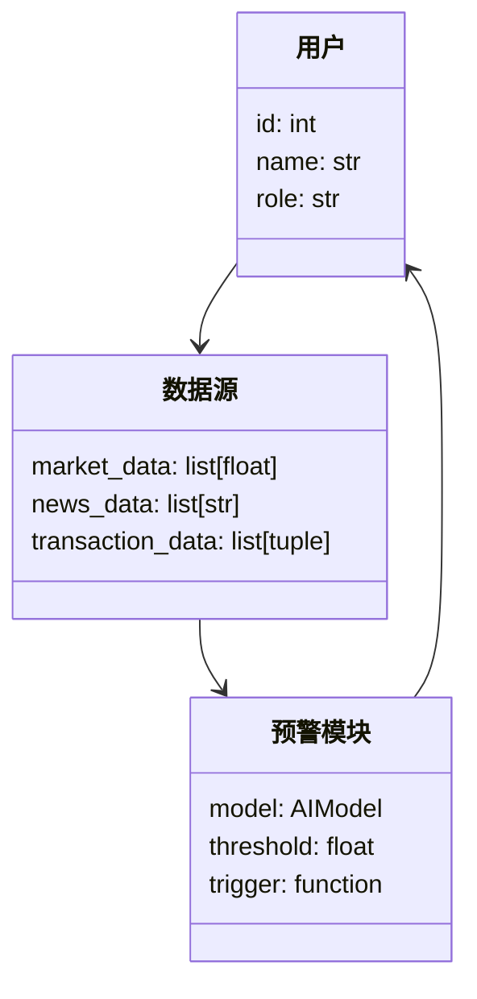
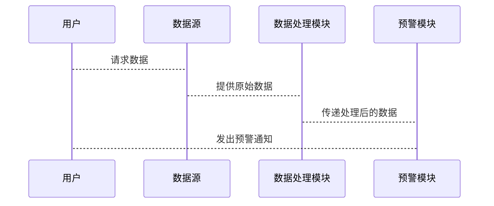

                 


# AI驱动的自适应投资风险预警

---

## 关键词：
- AI驱动
- 投资风险预警
- 自适应系统
- 金融风险管理
- 时间序列分析
- 机器学习
- 系统架构设计

---

## 摘要：
本文详细探讨了AI驱动的自适应投资风险预警系统的构建与应用。通过分析传统投资风险管理的局限性，提出了一种基于人工智能的自适应预警新方法。文章从背景、核心概念、算法原理、系统架构设计、项目实战等多个维度展开，深入讲解了如何利用时间序列分析、机器学习算法和自适应调整机制实现精准的投资风险预警。通过实际案例分析和系统实现，展示了该方法在金融领域的广泛应用潜力。

---

# 第一部分: AI驱动的自适应投资风险预警概述

## 第1章: 投资风险管理的现状与挑战

### 1.1 投资风险管理的背景
#### 1.1.1 传统投资风险管理的局限性
传统的投资风险管理主要依赖于人工分析和固定模型，存在以下问题：
- 数据处理能力有限，难以应对海量金融数据。
- 模型缺乏灵活性，难以适应市场的快速变化。
- 风险预警不够实时，往往滞后于市场变化。

#### 1.1.2 AI技术在金融领域的应用潜力
人工智能技术的快速发展为投资风险管理带来了新的可能性：
- 大数据处理能力强大，能够快速分析海量金融数据。
- 算法灵活可调，能够根据市场变化实时优化模型。
- 可实现24/7实时监控，确保风险预警的及时性。

#### 1.1.3 自适应投资风险预警的必要性
自适应投资风险预警系统能够根据市场环境的变化动态调整预警策略，显著提高了风险管理和应对能力。

---

### 1.2 自适应投资风险预警的核心概念

#### 1.2.1 自适应预警的定义
自适应投资风险预警系统是一种能够根据市场环境的变化，动态调整风险评估和预警策略的智能化系统。

#### 1.2.2 AI在风险预警中的作用
- 数据采集与处理：利用AI技术从多种数据源中提取有用信息。
- 风险识别：通过机器学习算法识别潜在风险因素。
- 自适应调整：根据市场反馈实时优化预警模型。

#### 1.2.3 自适应预警系统的边界与外延
- **边界**：系统仅关注投资风险的预警，不直接参与投资决策。
- **外延**：可以与其他投资管理系统集成，提供更全面的风险管理解决方案。

---

### 1.3 自适应投资风险预警系统的核心要素

#### 1.3.1 数据采集与处理
- 数据来源：股票价格、市场指数、经济指标、新闻情绪等。
- 数据预处理：清洗、归一化、特征提取。

#### 1.3.2 风险识别与评估
- 风险识别：通过机器学习模型识别潜在风险。
- 风险评估：量化风险程度，提供预警级别。

#### 1.3.3 自适应调整机制
- 根据市场反馈实时优化预警模型。
- 动态调整预警阈值和触发条件。

---

# 第二部分: AI驱动的自适应投资风险预警算法原理

## 第2章: 时间序列分析与风险预测

### 2.1 时间序列分析的基本原理
#### 2.1.1 时间序列的特征分析
- 趋势性：数据的长期走势。
- 季节性：周期性波动。
- 随机性：不可预测的噪声。

#### 2.1.2 常见的时间序列模型
- **ARIMA模型**：用于捕捉数据的趋势和季节性。
- **LSTM模型**：适用于捕捉长期依赖关系。
- **Prophet模型**：基于时间序列的 Prophet 方法。

#### 2.1.3 AI在时间序列预测中的应用
- 使用神经网络模型（如LSTM）进行预测。
- 结合特征工程提升模型性能。

---

### 2.2 基于机器学习的风险预测算法
#### 2.2.1 线性回归模型
- 用于简单线性关系的预测。
- 代码示例：
  ```python
  import numpy as np
  from sklearn.linear_model import LinearRegression

  X = np.array([i for i in range(100)]).reshape(-1, 1)
  y = np.array([2*i + 1 for i in range(100)])

  model = LinearRegression()
  model.fit(X, y)
  print(model.coef_)
  ```

#### 2.2.2 支持向量机模型
- 适用于非线性关系的预测。
- 代码示例：
  ```python
  from sklearn.svm import SVR

  model = SVR(kernel='rbf')
  model.fit(X, y)
  ```

#### 2.2.3 随机森林模型
- 适用于特征较多的场景。
- 代码示例：
  ```python
  from sklearn.ensemble import RandomForestRegressor

  model = RandomForestRegressor(n_estimators=100)
  model.fit(X, y)
  ```

#### 2.2.4 神经网络模型
- 使用深度学习模型进行复杂关系预测。
- 代码示例：
  ```python
  import tensorflow as tf
  from tensorflow.keras import layers

  model = tf.keras.Sequential([
      layers.Dense(64, activation='relu'),
      layers.Dense(1)
  ])
  model.compile(optimizer='adam', loss='mean_squared_error')
  model.fit(X, y, epochs=10)
  ```

---

### 2.3 基于反馈机制的自适应调整
#### 2.3.1 反馈机制的设计
- 根据实际风险事件调整模型参数。
- 使用强化学习方法优化预警策略。

#### 2.3.2 实时调整策略
- 根据市场反馈动态调整预警阈值。
- 使用在线学习方法更新模型。

#### 2.3.3 调整效果的评估
- 使用准确率、召回率、F1值等指标评估调整效果。

---

## 第3章: 风险预警系统的数学模型

### 3.1 时间序列预测模型
#### 3.1.1 ARIMA模型
- **公式**：
  $$ ARIMA(p, d, q) $$
  其中，p为自回归阶数，d为差分阶数，q为移动平均阶数。

#### 3.1.2 LSTM模型
- **公式**：
  $$ LSTM(input, hidden, cell) $$
  包括输入门、遗忘门和输出门。

#### 3.1.3 Prophet模型
- **公式**：
  $$ Prophet(t, y) $$
  其中，t为时间，y为观测值。

---

### 3.2 风险评估模型
#### 3.2.1 风险评分模型
- **公式**：
  $$ Score = \alpha \cdot \text{市场风险} + \beta \cdot \text{信用风险} + \gamma \cdot \text{操作风险} $$
  其中，$\alpha + \beta + \gamma = 1$。

#### 3.2.2 风险概率模型
- **公式**：
  $$ P(\text{风险事件}) = \sigma(aX + b) $$
  其中，$\sigma$为sigmoid函数，$a$和$b$为模型参数。

#### 3.2.3 综合风险评估模型
- **公式**：
  $$ \text{综合风险} = \sum_{i=1}^n w_i \cdot R_i $$
  其中，$w_i$为权重，$R_i$为单个风险因素的评估值。

---

# 第三部分: 系统分析与架构设计

## 第4章: 系统功能设计

### 4.1 问题场景介绍
- 系统用于实时监控金融市场动态，预警潜在投资风险。
- 用户包括机构投资者和专业投资顾问。

### 4.2 领域模型设计
#### 4.2.1 实体关系图
- 用户：投资者、机构。
- 数据：市场数据、交易数据、新闻数据。
- 预警：风险级别、预警触发条件。

#### 4.2.2 领域模型类图


---

## 第5章: 系统架构设计

### 5.1 分层架构设计
- 数据层：数据采集、存储、处理。
- 算法层：模型训练、预测、调整。
- 应用层：用户交互、预警展示。

#### 5.1.1 分层架构图


### 5.2 模块化设计
- 数据采集模块：实时获取市场数据。
- 风险评估模块：计算风险级别。
- 预警触发模块：根据阈值触发预警。

---

## 第6章: 系统接口与交互设计

### 6.1 系统接口设计
- 数据接口：RESTful API。
- 用户接口：图形化界面。

#### 6.1.1 API接口示例
- GET请求获取实时数据：
  ```bash
  curl http://api.example.com/stock_price
  ```
- POST请求提交预警设置：
  ```bash
  curl -X POST http://api.example.com/set_threshold -d "threshold=0.05"
  ```

---

### 6.2 系统交互流程图


---

# 第四部分: 项目实战

## 第7章: 项目实战

### 7.1 环境安装
- 安装Python环境。
- 安装必要的库：
  ```bash
  pip install numpy pandas scikit-learn tensorflow keras
  ```

### 7.2 核心代码实现

#### 7.2.1 数据预处理
```python
import pandas as pd
import numpy as np

# 加载数据
data = pd.read_csv('stock_data.csv')
# 数据清洗
data.dropna(inplace=True)
# 特征提取
features = data[['open', 'high', 'low', 'volume']]
```

#### 7.2.2 模型训练
```python
from sklearn.ensemble import RandomForestRegressor
from sklearn.metrics import mean_squared_error

# 训练模型
model = RandomForestRegressor(n_estimators=100)
model.fit(features, data['close'])
# 预测
predict = model.predict(features)
print(mean_squared_error(data['close'], predict))
```

### 7.3 实际案例分析
- 数据来源：股票价格数据。
- 模型训练：使用随机森林进行预测。
- 预警触发：当预测值与实际值差异超过阈值时触发预警。

---

## 第8章: 总结与最佳实践

### 8.1 小结
- AI驱动的自适应投资风险预警系统通过实时数据处理和动态模型调整，显著提高了风险预警的准确性和及时性。

### 8.2 注意事项
- 数据质量是系统性能的关键，需确保数据的完整性和准确性。
- 模型选择需根据具体场景调整，避免过度复杂化。
- 系统需定期更新和维护，以应对市场变化。

### 8.3 拓展阅读
- 《机器学习实战》：深入理解机器学习算法。
- 《时间序列分析》：掌握时间序列预测方法。
- 《金融风险管理》：了解金融风险管理的理论与实践。

---

## 作者：
AI天才研究院 & 禅与计算机程序设计艺术

