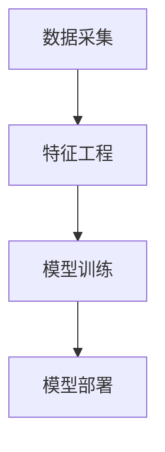

                 

# AI驱动的跨资产类别配置：价值投资中的多智能体应用

> 关键词：人工智能，跨资产配置，多智能体系统，价值投资，风险管理

> 摘要：本文探讨了人工智能在跨资产类别配置中的应用，重点介绍了多智能体系统在价值投资中的作用。通过分析多智能体系统的数学模型和算法，结合实际案例，展示了如何利用AI技术优化资产配置，降低风险，提高投资收益。

---

## 引言

### 1.1 背景介绍

在金融投资领域，传统的价值投资方法依赖于历史数据分析和专家经验，但这种方法在面对复杂多变的市场环境时，往往显得力不从心。随着人工智能（AI）技术的快速发展，AI驱动的多智能体系统在跨资产配置中的应用日益广泛，为投资者提供了更高效、更精准的投资决策支持。

### 1.2 核心概念与术语

- **跨资产配置**：将资金分配到不同资产类别（如股票、债券、房地产等）中，以分散风险并优化收益。
- **多智能体系统**：由多个智能体组成的系统，每个智能体负责不同的任务或决策，协同工作以实现整体目标。
- **价值投资**：一种投资策略，注重分析资产的内在价值，寻找被市场低估的投资机会。

### 1.3 问题描述与解决

传统的投资方法在面对复杂市场环境时，难以快速适应变化，容易受到市场波动的影响。多智能体系统通过协同决策和实时数据分析，能够更迅速地捕捉市场机会，优化资产配置，从而提高投资收益并降低风险。

### 1.4 边界与外延

本文主要探讨AI驱动的多智能体系统在跨资产配置中的应用，重点关注股票和债券市场的配置策略。虽然没有涉及其他资产类别，但相关方法可以扩展到其他领域。

### 1.5 核心要素组成

- 数据采集与处理
- 多智能体协同决策
- 强化学习算法
- 风险管理与控制

---

## 第2章：多智能体系统的核心原理

### 2.1 多智能体系统的数学模型与算法

#### 2.1.1 强化学习的基本原理

强化学习是一种通过智能体与环境交互来学习策略的方法。智能体通过试错的方式，逐步优化其行为以最大化累计奖励。

**数学模型**：

$$ R = \sum_{t=1}^{T} r_t(s_t, a_t) $$

其中，$R$ 是总奖励，$r_t$ 是第 $t$ 步的奖励，$s_t$ 是状态，$a_t$ 是动作。

#### 2.1.2 多智能体强化学习的挑战

多智能体系统中的智能体需要协调行动，避免冲突。这需要解决通信、协作和竞争问题。

#### 2.1.3 实际案例中的算法实现

以股票市场为例，智能体A负责分析技术指标，智能体B负责分析公司基本面。通过协作，两个智能体可以做出更全面的投资决策。

### 2.2 博弈论与多智能体决策

#### 2.2.1 博弈论的基本概念

博弈论研究策略互动，帮助智能体在竞争环境中做出最优决策。

#### 2.2.2 多智能体系统中的纳什均衡

纳什均衡是一种策略组合，使得每个智能体在不改变自身策略的情况下，无法通过单方面改变策略而提高收益。

#### 2.2.3 博弈论在投资决策中的应用

通过分析市场参与者的策略，智能体可以预测市场走势，优化投资组合。

### 2.3 跨资产配置的数学模型

#### 2.3.1 资产配置的优化模型

使用均值-方差优化模型，智能体可以找到风险与收益的最佳平衡点。

$$ \text{Minimize } \sigma^2 \text{ subject to } \mu \geq \text{target return} $$

其中，$\sigma^2$ 是收益的方差，$\mu$ 是期望收益。

#### 2.3.2 风险与收益的数学表达

通过CAPM模型，智能体可以评估资产的预期收益和风险。

$$ E(r_i) = r_f + \beta_i (r_m - r_f) $$

其中，$E(r_i)$ 是资产 $i$ 的预期收益，$r_f$ 是无风险利率，$\beta_i$ 是资产 $i$ 的贝塔系数，$r_m$ 是市场预期收益。

#### 2.3.3 资产权重的动态调整

智能体根据市场变化动态调整各资产的权重，以优化整体收益。

---

## 第3章：系统架构与实现

### 3.1 系统总体架构

系统分为数据采集、特征工程、模型训练和部署四个模块，各模块协同工作以实现跨资产配置。

**系统架构图**：

### 3.2 数据采集与预处理

#### 3.2.1 数据源的选择与整合

从股票、债券等市场获取实时数据，整合到统一的数据源。

#### 3.2.2 数据清洗与特征提取

去除噪声数据，提取有用的特征，如收益率、波动率等。

#### 3.2.3 数据存储与管理

使用数据库存储数据，方便后续分析和处理。

### 3.3 模型训练与部署

#### 3.3.1 模型训练流程

1. 数据预处理
2. 模型训练
3. 模型评估与优化

#### 3.3.2 模型评估与优化

通过回测和风险指标（如VaR）评估模型性能，进行参数调优。

#### 3.3.3 模型的实时部署

将训练好的模型部署到实时交易系统，实现自动化投资决策。

### 3.4 系统接口与交互设计

#### 3.4.1 系统接口的设计原则

接口设计简洁高效，便于与其他系统集成。

#### 3.4.2 用户界面的交互流程

用户输入投资目标，系统生成配置建议并实时反馈。

#### 3.4.3 系统接口的实现细节

使用API接口，支持RESTful风格，便于调用和扩展。

---

## 第4章：项目实战与案例分析

### 4.1 项目背景与目标

某资产管理公司希望利用AI技术优化其投资组合，降低风险并提高收益。

### 4.2 系统核心功能实现

#### 4.2.1 数据采集模块实现

使用API接口获取实时市场数据，存储到数据库中。

#### 4.2.2 模型训练模块实现

训练一个多智能体系统，分别负责不同资产类别的分析和决策。

#### 4.2.3 系统接口开发

开发RESTful API，支持外部系统调用。

### 4.3 项目测试与优化

#### 4.3.1 系统测试方法

采用单元测试和集成测试，确保各模块协同工作。

#### 4.3.2 测试结果分析

分析系统在不同市场环境下的表现，优化模型参数。

#### 4.3.3 系统优化建议

根据测试结果，优化算法和系统架构，提高性能。

### 4.4 实际案例分析

#### 4.4.1 案例背景介绍

2020年新冠疫情爆发期间，系统成功调整投资组合，规避了部分损失。

#### 4.4.2 案例实施过程

智能体根据市场变化，动态调整股票和债券的配置比例。

#### 4.4.3 案例结果与分析

投资组合在疫情期间表现优于市场基准，证明了系统的有效性。

---

## 第5章：系统优化与未来展望

### 5.1 系统优化策略

#### 5.1.1 系统性能优化

采用分布式计算和并行处理，提高数据处理效率。

#### 5.1.2 系统风险管理

建立风险预警机制，实时监控市场变化，及时调整投资策略。

### 5.2 未来展望

随着AI技术的不断进步，多智能体系统在跨资产配置中的应用将更加广泛和深入。未来的研究方向包括更复杂的智能体协作机制、实时数据处理能力的提升以及个性化投资策略的实现。

---

## 结论

AI驱动的多智能体系统为跨资产配置提供了新的可能性。通过强化学习和博弈论的应用，智能体能够协同工作，优化投资决策。本文通过详细分析系统架构和实际案例，展示了AI在价值投资中的巨大潜力。

---

## 作者

作者：AI天才研究院 & 禅与计算机程序设计艺术

