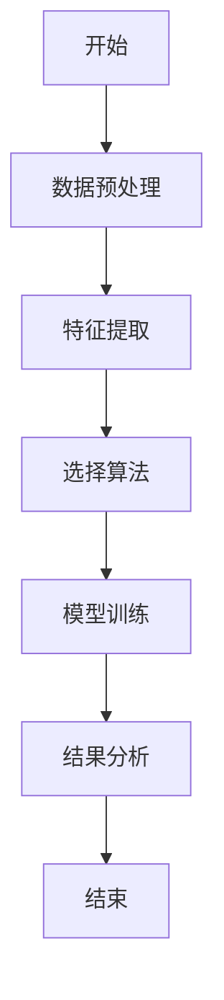
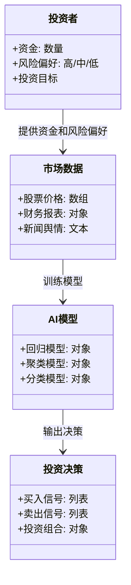
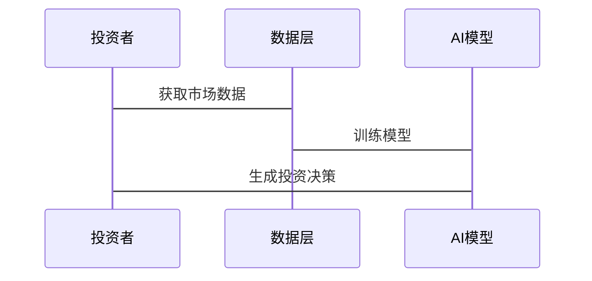

                 


# AI驱动的逆向投资策略实现

> 关键词：AI，逆向投资，机器学习，金融数据，投资策略，数学模型

> 摘要：逆向投资是一种在金融市场中寻找被低估资产的投资策略。本文探讨了如何利用人工智能技术来实现逆向投资策略，通过数据分析、模型构建和系统实现，展示了AI在金融投资中的潜力和应用。

---

# 引言

## 1.1 逆向投资的核心概念
### 1.1.1 逆向投资的定义与特征
逆向投资是一种与市场趋势相反的投资策略，寻找被市场低估的机会。其核心特征包括低估值、高风险调整后收益和逆周期性。

### 1.1.2 逆向投资的哲学与策略
逆向投资强调独立思考，寻找市场非理性带来的机会。典型策略包括价值投资和事件驱动投资。

### 1.1.3 逆向投资在金融领域的应用
主要应用于股票、债券和房地产等领域，通过识别市场错误定价来获利。

## 1.2 AI在金融投资中的作用
### 1.2.1 AI在金融数据分析中的应用
利用机器学习处理海量数据，识别市场趋势和模式。

### 1.2.2 AI在投资决策中的优势
提高决策效率和准确性，降低人为情绪影响。

### 1.2.3 逆向投资与AI的结合潜力
通过AI分析市场情绪和数据，辅助投资者识别低估资产。

## 1.3 本章小结
逆向投资结合AI技术，能够有效提升投资效率和准确性，是未来金融领域的重要趋势。

---

# 第2章：AI驱动的逆向投资策略的核心概念

## 2.1 逆向投资的特征分析
### 2.1.1 逆向投资的关键特征
- 低估值：市盈率、市净率等指标低于行业平均水平。
- 高风险调整后收益：在控制风险的前提下，追求超额收益。
- 逆周期性：在市场低迷时买入，市场繁荣时卖出。

### 2.1.2 逆向投资与传统投资的对比
| 特征 | 逆向投资 | 传统投资 |
|------|----------|----------|
| 时机 | 逆周期   | 顺势而为  |
| 风险 | 高风险   | 中低风险  |
| 策略 | 价值挖掘 | 趋势跟随 |

### 2.1.3 逆向投资的数学模型
逆向投资可以利用回归模型分析资产定价，发现偏离合理价值的情况。

## 2.2 AI在逆向投资中的应用
### 2.2.1 数据驱动的逆向投资策略
利用大数据分析市场情绪，识别低估资产。

### 2.2.2 AI算法在逆向投资中的实现
通过聚类分析发现市场异动，分类模型筛选优质标的。

### 2.2.3 逆向投资的AI模型框架
- 数据预处理：清洗和特征提取。
- 模型训练：使用机器学习算法构建定价模型。
- 策略生成：根据模型输出制定投资决策。

## 2.3 核心概念的ER实体关系图
```mermaid
er
actor: 投资者
model: 逆向投资AI模型
data: 市场数据
action: 投资决策
actor --> model: 输入需求
model --> data: 数据分析
model --> action: 输出决策
```

## 2.4 本章小结
AI通过数据处理和模型构建，为逆向投资提供科学依据，帮助投资者识别潜在机会。

---

# 第3章：逆向投资策略的数学模型与算法原理

## 3.1 逆向投资的数学模型
### 3.1.1 逆向投资的回归模型
$$y = \beta_0 + \beta_1x + \epsilon$$

### 3.1.2 逆向投资的聚类分析
$$distance = \sqrt{(x_i - x_j)^2 + (y_i - y_j)^2}$$

## 3.2 AI算法在逆向投资中的实现
### 3.2.1 线性回归模型
用于分析资产定价，发现市场定价偏差。

### 3.2.2 聚类算法
识别市场中的异类资产，寻找潜在投资机会。

### 3.2.3 分类算法
筛选符合条件的优质标的，制定投资组合。

## 3.3 算法原理的mermaid流程图


## 3.4 数学模型的详细讲解
### 3.4.1 线性回归模型
用于分析资产价格与基本面指标的关系，发现定价偏差。

### 3.4.2 聚类算法
通过K-means算法将资产分为不同类别，识别低估资产。

## 3.5 本章小结
数学模型和算法为逆向投资提供了科学依据，帮助投资者制定更有效的策略。

---

# 第4章：系统分析与架构设计方案

## 4.1 问题场景介绍
### 4.1.1 逆向投资的场景描述
在市场低迷时，利用AI技术寻找低估资产，制定投资策略。

### 4.1.2 AI驱动的系统需求
需要处理大量市场数据，构建预测模型，生成投资决策。

### 4.1.3 系统的目标与范围
目标是构建一个基于AI的逆向投资系统，范围包括数据收集、模型构建和决策生成。

## 4.2 系统功能设计
### 4.2.1 领域模型mermaid类图


### 4.2.2 系统架构设计


### 4.2.3 系统接口设计
定义API接口，实现数据获取、模型调用和决策反馈。

### 4.2.4 系统交互mermaid序列图


## 4.3 本章小结
系统架构设计为逆向投资提供了完整的解决方案，从数据处理到模型构建，再到决策输出，确保系统高效运行。

---

# 第5章：项目实战

## 5.1 环境安装
### 5.1.1 Python环境配置
安装Python、Jupyter Notebook和必要的库（如NumPy、Pandas、Scikit-learn）。

## 5.2 系统核心实现
### 5.2.1 数据预处理代码
```python
import pandas as pd
import numpy as np

# 数据加载
data = pd.read_csv('market_data.csv')

# 数据清洗
data.dropna()
data = data[~data['price'].isin([np.nan, np.inf])]
```

### 5.2.2 AI模型实现
```python
from sklearn.linear_model import LinearRegression

# 训练回归模型
model = LinearRegression()
model.fit(X_train, y_train)
```

### 5.2.3 投资决策生成
```python
# 预测并生成决策信号
predicted_price = model.predict(X_test)
# 根据预测结果生成买入或卖出信号
buy_signals = predicted_price < actual_price
```

## 5.3 案例分析
### 5.3.1 数据分析结果
展示模型预测与实际价格的对比，评估模型准确性。

### 5.3.2 投资组合优化
根据模型输出，调整投资组合，优化风险收益比。

## 5.4 项目小结
通过实际案例展示了AI在逆向投资中的应用，验证了模型的有效性。

---

# 第6章：最佳实践与总结

## 6.1 小结
AI技术为逆向投资提供了新的可能性，通过数据分析和模型构建，帮助投资者发现市场机会。

## 6.2 注意事项
- 数据质量影响模型准确性。
- 模型需定期更新，适应市场变化。
- 风险管理是投资成功的关键。

## 6.3 拓展阅读
推荐相关书籍和论文，深入学习AI在金融中的应用。

---

# 作者信息

作者：AI天才研究院 & 禅与计算机程序设计艺术

---

这篇文章通过系统性的分析和实战案例，详细介绍了AI在逆向投资中的应用，为读者提供了从理论到实践的全面指导。

