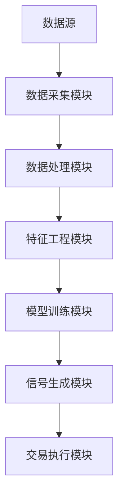

                 


# AI驱动的量化交易策略开发

## 关键词：AI、量化交易、算法、策略开发、风险管理、数据驱动、机器学习

## 摘要：  
本文详细探讨了AI在量化交易中的应用，从基础概念到高级算法，再到系统架构设计，结合实际案例，全面解析AI驱动的量化交易策略开发过程。文章首先介绍了量化交易与AI的基本概念，然后深入分析了AI在数据处理、模型选择、策略优化等关键环节的应用，通过具体算法实现与代码示例，展示了如何利用AI技术提升交易策略的开发效率与性能。最后，文章总结了AI驱动量化交易的优势与挑战，并展望了未来的发展趋势。

---

## 第1章: 量化交易与AI驱动的概述

### 1.1 量化交易的定义与特点  
量化交易是一种基于数学模型和算法的交易方式，通过计算机程序自动执行交易决策。其核心特点包括：  
- **数据驱动**：依赖大量历史数据进行分析和预测。  
- **自动化**：从数据处理到策略执行均由算法自动完成。  
- **高频交易**：依赖快速数据处理和决策能力。  

### 1.2 AI驱动的量化交易的背景  
AI技术的快速发展为量化交易带来了新的可能性。通过机器学习、深度学习等技术，交易策略可以更加灵活和高效。AI驱动的量化交易的优势包括：  
- **自动化决策**：AI能够快速分析市场数据并做出交易决策。  
- **非线性关系捕捉**：AI模型能够捕捉传统统计方法难以发现的复杂市场规律。  
- **自适应性**：AI模型可以根据市场变化动态调整策略。  

### 1.3 量化交易中的核心问题  
1. **数据处理与特征提取**：如何从海量数据中提取有效的特征。  
2. **策略开发与优化**：如何设计和优化交易策略。  
3. **风险控制与收益最大化**：如何在风险可控的前提下实现收益最大化。  

---

## 第2章: AI技术在量化交易中的核心概念  

### 2.1 AI驱动的量化交易核心概念  
1. **数据驱动的交易策略**：基于历史数据和市场行为模式构建交易策略。  
2. **AI算法在交易中的应用**：如机器学习模型、深度学习模型等。  
3. **策略优化与回测**：通过回测验证策略的有效性并进行优化。  

### 2.2 AI算法与量化交易的关系  
AI算法通过分析市场数据，识别潜在的交易机会，优化交易策略。常见的AI算法包括：  
- **机器学习**：如随机森林、支持向量机（SVM）。  
- **深度学习**：如LSTM（长短期记忆网络）。  
- **强化学习**：通过模拟市场环境进行策略优化。  

### 2.3 数据流与AI模型的关系  
数据流是AI模型的输入，AI模型通过分析数据流生成交易信号。  
- **数据流的定义与分类**：包括市场数据（如价格、成交量）、新闻数据等。  
- **数据流对AI模型的影响**：高质量的数据流是模型表现的关键。  
- **数据流的处理与优化**：如数据清洗、特征工程等。  

---

## 第3章: AI驱动的量化交易策略开发基础  

### 3.1 数据处理与特征工程  
1. **数据清洗与预处理**：去除噪声数据，填补缺失值。  
2. **特征提取与选择**：从原始数据中提取有用的特征。  
3. **数据增强与特征优化**：通过生成新特征提升模型表现。  

### 3.2 策略开发与模型选择  
1. **策略框架的设计**：包括数据输入、特征提取、模型预测、信号生成等步骤。  
2. **模型选择与评估**：选择合适的模型并进行性能评估。  
3. **策略回测与优化**：通过回测验证策略的有效性并进行优化。  

### 3.3 风险控制与收益管理  
1. **风险控制的定义与方法**：如最大回撤、VaR（Value at Risk）等。  
2. **收益与风险的平衡**：通过调整策略参数实现收益与风险的最佳平衡。  
3. **策略调整与优化**：根据回测结果和实际表现动态调整策略。  

---

## 第4章: AI算法在量化交易中的实现  

### 4.1 算法策略的实现原理  
1. **算法的基本原理**：如随机森林、LSTM等。  
2. **算法实现的步骤**：包括数据输入、特征提取、模型训练、信号生成等。  
3. **算法的优缺点分析**：如计算复杂度、模型解释性等。  

### 4.2 算法优化与调参  
1. **参数优化的方法**：如网格搜索、随机搜索。  
2. **算法调优的技巧**：如交叉验证、早停法。  
3. **算法优化的注意事项**：如过拟合问题。  

### 4.3 算法实现的代码示例  
以下是一个简单的量化交易策略代码示例：  
```python
import pandas as pd
import numpy as np
from sklearn.ensemble import RandomForestClassifier

# 数据加载与预处理
data = pd.read_csv('data.csv')
data = data.dropna()

# 特征提取
features = data[['open', 'high', 'low', 'close', 'volume']]
labels = data['target']

# 模型训练
model = RandomForestClassifier(n_estimators=100)
model.fit(features, labels)

# 信号生成
predicted_labels = model.predict(features)
signal = predicted_labels
```

---

## 第5章: 量化交易系统的架构设计  

### 5.1 系统架构的总体设计  
1. **系统架构的定义**：包括数据采集、策略开发、策略执行等模块。  
2. **系统架构的设计原则**：模块化、可扩展性、可维护性。  
3. **系统架构的组成部分**：数据采集模块、策略开发模块、策略执行模块等。  

### 5.2 系统功能模块的设计  
1. **数据采集模块**：从市场数据源获取实时数据。  
2. **策略开发模块**：包括数据处理、模型训练、信号生成等。  
3. **策略执行模块**：根据信号执行交易指令。  

### 5.3 系统架构设计的mermaid图  


---

## 第6章: 项目实战  

### 6.1 环境安装  
1. **安装Python环境**：如Anaconda。  
2. **安装相关库**：如pandas、numpy、scikit-learn、keras等。  

### 6.2 系统核心实现源代码  
以下是一个完整的量化交易策略开发代码示例：  
```python
import pandas as pd
import numpy as np
from sklearn.ensemble import RandomForestClassifier
from sklearn.metrics import accuracy_score
import yfinance as yf

# 数据加载与预处理
data = yf.download('AAPL', start='2020-01-01', end='2023-12-31')
data = data.dropna()

# 特征提取
features = data[['open', 'high', 'low', 'close', 'volume']]
labels = data['close'].pct_change().apply(lambda x: 1 if x > 0 else 0)

# 划分训练集与测试集
train_features = features.iloc[:-100]
train_labels = labels.iloc[:-100]
test_features = features.iloc[-100:]
test_labels = labels.iloc[-100:]

# 模型训练
model = RandomForestClassifier(n_estimators=100)
model.fit(train_features, train_labels)

# 预测与评估
predicted_labels = model.predict(test_features)
print(f'Accuracy: {accuracy_score(test_labels, predicted_labels)}')
```

### 6.3 代码应用解读与分析  
上述代码展示了如何利用随机森林模型进行股票价格预测。通过分析股票的历史价格数据，模型能够预测未来的价格走势，并生成相应的交易信号。  

### 6.4 实际案例分析  
以苹果股票（AAPL）为例，通过上述代码进行回测，验证策略的有效性。  

### 6.5 项目小结  
通过实际案例分析，展示了AI技术在量化交易中的应用价值，同时也指出了实际应用中的注意事项，如过拟合问题、数据质量等。  

---

## 第7章: 总结与展望  

### 7.1 本章小结  
本文详细介绍了AI驱动的量化交易策略开发的全过程，从基础概念到实际应用，全面解析了AI在量化交易中的重要作用。  

### 7.2 未来展望  
随着AI技术的不断发展，量化交易将更加智能化和自动化。未来的研究方向包括：  
- 更复杂的模型开发。  
- 更高效的交易系统优化。  
- 更精确的风险控制方法。  

---

## 作者：AI天才研究院/AI Genius Institute & 禅与计算机程序设计艺术 /Zen And The Art of Computer Programming

