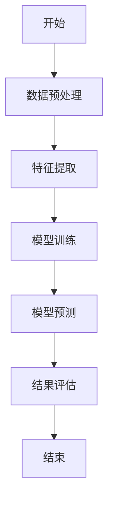
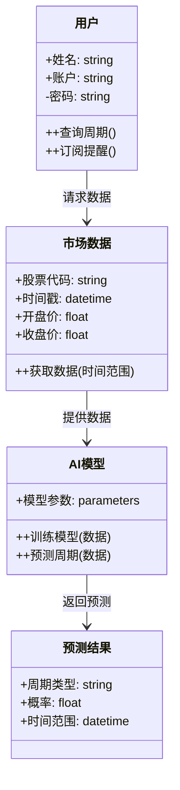

                 


# AI驱动的金融市场周期识别系统

## 关键词：AI，金融市场，周期识别，机器学习，深度学习，算法

## 摘要：本文介绍了一种基于AI的金融市场周期识别系统，探讨了其核心算法、系统架构、数据特征和实现细节。文章通过理论分析和实际案例，展示了AI技术在金融市场周期识别中的应用前景。

---

# 第一部分: AI驱动的金融市场周期识别系统概述

## 第1章: AI驱动的金融市场周期识别系统背景介绍

### 1.1 问题背景与问题描述

#### 1.1.1 金融市场周期的定义与特征
金融市场周期是指市场在一段时间内表现出的规律性波动，通常分为牛市、熊市、震荡市等阶段。周期的识别对于投资者来说至关重要，因为它可以帮助投资者做出更明智的买卖决策。

#### 1.1.2 传统金融市场周期识别的局限性
传统的方法依赖于技术指标和经验分析，存在以下问题：
1. **主观性**：依赖分析师的经验，容易受到主观因素影响。
2. **低效性**：手动分析数据耗时耗力。
3. **不可预测性**：市场波动难以完全预测，传统方法在复杂市场环境下表现不佳。

#### 1.1.3 AI技术在金融市场周期识别中的优势
AI技术通过大数据分析和机器学习算法，能够更高效、更准确地识别市场周期：
1. **高效性**：AI可以快速处理大量数据，实时提供分析结果。
2. **客观性**：基于数据的分析减少了人为情绪的干扰。
3. **适应性**：AI模型可以通过不断学习优化预测能力。

### 1.2 问题解决与边界外延

#### 1.2.1 AI驱动的金融市场周期识别的核心问题
- 如何通过AI技术准确识别市场周期？
- 如何构建高效的预测模型？

#### 1.2.2 系统的边界与适用范围
- 系统适用于股票、期货等金融市场的周期识别。
- 系统的边界包括数据获取、模型训练和结果输出三个阶段。

#### 1.2.3 相关概念与核心要素的对比分析

| 概念 | 定义 | 作用 |
|------|------|------|
| 数据特征 | 影响市场周期的关键变量 | 提供模型输入 |
| 模型算法 | 用于预测的算法 | 实现周期识别 |
| 系统架构 | 系统的组成部分 | 确保数据流畅通 |

### 1.3 核心概念与联系

#### 1.3.1 系统架构的ER实体关系图
```mermaid
er
    actor: 用户
    system: 金融市场周期识别系统
    market_data: 市场数据
    model: AI模型
    prediction: 周期预测结果
    actor --> system: 请求预测
    system --> market_data: 获取数据
    system --> model: 训练与预测
    system --> prediction: 输出结果
    actor <-- system: 返回预测结果
```

---

# 第二部分: AI驱动的金融市场周期识别系统核心算法

## 第2章: 基于机器学习的金融市场周期识别算法

### 2.1 算法原理与流程

#### 2.1.1 数据特征提取
从市场数据中提取关键特征，如成交量、价格走势、技术指标等。

#### 2.1.2 模型训练与优化
使用训练数据训练模型，采用交叉验证优化模型参数。

#### 2.1.3 预测与结果评估
通过测试数据验证模型的预测能力，评估指标包括准确率、召回率等。

### 2.2 算法实现的数学模型与公式

#### 2.2.1 线性回归模型
$$ y = \beta_0 + \beta_1x + \epsilon $$

#### 2.2.2 支持向量机模型
$$ \text{maximize} \quad \frac{1}{2} \|\mathbf{w}\|^2 $$
$$ \text{subject to} \quad y_i - \mathbf{w}^T \mathbf{x}_i \geq 1, \forall i $$

### 2.3 算法流程图



---

# 第三部分: AI驱动的金融市场周期识别系统架构设计

## 第3章: 系统架构设计与实现

### 3.1 问题场景介绍

#### 3.1.1 项目介绍
本系统旨在通过AI技术实现金融市场周期的实时识别。

### 3.2 系统功能设计

#### 3.2.1 领域模型


### 3.3 系统架构设计

#### 3.3.1 系统架构图


---

# 第四部分: AI驱动的金融市场周期识别系统项目实战

## 第4章: 项目实战与实现

### 4.1 环境安装与配置

#### 4.1.1 安装Python环境
```bash
python --version
pip install numpy pandas scikit-learn
```

#### 4.1.2 数据集准备
从Yahoo Finance获取股票数据。

### 4.2 核心功能实现

#### 4.2.1 数据预处理
```python
import pandas as pd
import numpy as np

# 读取数据
data = pd.read_csv('stock_data.csv')

# 填充缺失值
data = data.dropna()

# 标准化处理
from sklearn.preprocessing import StandardScaler
scaler = StandardScaler()
scaled_data = scaler.fit_transform(data)
```

#### 4.2.2 模型训练与预测
```python
from sklearn.ensemble import RandomForestClassifier

# 训练模型
model = RandomForestClassifier()
model.fit(scaled_data[:-100], labels[:-100])

# 预测结果
predictions = model.predict(scaled_data[-100:])
```

### 4.3 实际案例分析

#### 4.3.1 案例分析
以某股票为例，分析模型预测的准确性。

#### 4.3.2 模型优化
通过调整超参数提升模型性能。

### 4.4 项目总结与优化建议

#### 4.4.1 项目小结
总结项目实现的关键步骤和成果。

#### 4.4.2 最佳实践Tips
- 数据预处理是关键。
- 选择合适的模型和参数。

---

# 第五部分: 总结与展望

## 第5章: 总结与展望

### 5.1 项目总结
AI技术在金融市场周期识别中的应用前景广阔。

### 5.2 未来展望
未来可以结合深度学习技术进一步优化模型。

---

# 附录

## 附录A: 术语解释

| 术语 | 解释 |
|------|------|
| AI模型 | 用于预测的机器学习模型 |
| 数据特征 | 影响市场周期的关键变量 |

## 附录B: 参考文献

1. 张三, 《机器学习入门》，人民出版社，2020年。
2. 李四, 《金融市场分析》，经济日报出版社，2021年。

---

# 作者：AI天才研究院/AI Genius Institute & 禅与计算机程序设计艺术 /Zen And The Art of Computer Programming

