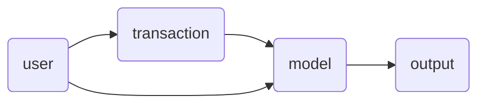
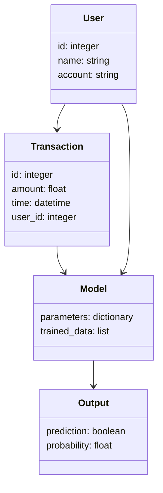
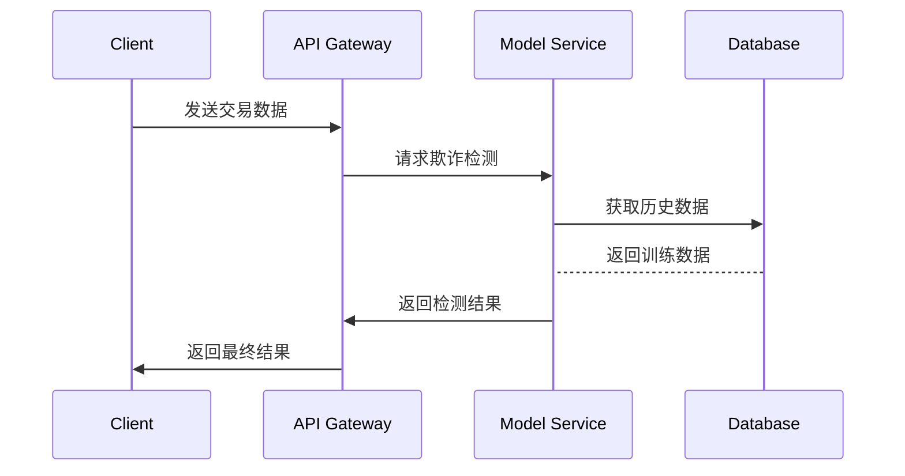

                 

<think>
好的，我将按照您的要求逐步设计这本书的目录大纲。为了确保符合您的要求，我需要先理清每一个部分的内容和结构。让我们一步步来。

# 目录大纲

## 第一部分: AI驱动的金融欺诈检测系统背景与概述

### 第1章: 金融欺诈检测的背景与挑战

#### 1.1 金融欺诈的背景介绍
##### 1.1.1 金融欺诈的定义与类型
- 什么是金融欺诈？
- 常见的金融欺诈类型：信用卡欺诈、网络欺诈、洗钱等。

##### 1.1.2 金融欺诈的现状与趋势
- 近年来金融欺诈的频率和规模变化。
- 新技术（如网络支付、移动支付）带来的新挑战。

##### 1.1.3 传统欺诈检测方法的局限性
- 基于规则的传统方法的局限性。
- 人工审核的低效性和高成本。

#### 1.2 AI在金融领域的应用前景
##### 1.2.1 AI技术在金融行业的应用领域
- AI在金融领域的应用：智能投顾、风险管理、欺诈检测等。
- AI在金融欺诈检测中的独特优势。

##### 1.2.2 AI驱动金融欺诈检测的优势
- 高效性：快速处理大量数据。
- 准确性：通过机器学习模型提高检测准确率。
- 可扩展性：适用于不同规模和类型的金融机构。

##### 1.2.3 金融行业对AI技术的需求与挑战
- 金融机构对AI技术的需求。
- 技术挑战：数据隐私、模型解释性等。

### 第2章: AI驱动的金融欺诈检测系统概述

#### 2.1 AI驱动的欺诈检测系统定义
##### 2.1.1 系统的核心概念与组成
- 数据采集与处理模块。
- 模型训练与部署模块。
- 检测与预警模块。

##### 2.1.2 系统的关键属性与特征
- 实时性：快速检测欺诈行为。
- 可解释性：便于金融监管和审计。
- 鲁棒性：在噪声数据中仍能保持较高准确率。

##### 2.1.3 系统的边界与外延
- 系统的输入和输出。
- 系统与其他金融系统的接口。

#### 2.2 系统的核心要素与关系
##### 2.2.1 实体关系图（ER图）
- 用户、交易、模型、输出之间的关系。


---

## 第二部分: AI驱动的金融欺诈检测系统核心算法

### 第3章: 常见的欺诈检测算法原理

#### 3.1 传统机器学习算法
##### 3.1.1 随机森林算法
- 随机森林的原理：基于决策树的集成学习。
- 优点：抗过拟合，适合高维数据。
- 缺点：解释性较差。

##### 3.1.2 XGBoost算法
- XGBoost的原理：基于梯度提升的树模型。
- 优点：计算速度快，准确率高。
- 应用场景：适合金融欺诈检测。

##### 3.1.3 支持向量机（SVM）算法
- SVM的原理：寻找最优超平面进行分类。
- 优点：适用于小样本数据，分类能力强。
- 缺点：在高维数据上表现较差。

#### 3.2 深度学习算法
##### 3.2.1 神经网络模型
- 神经网络的结构：输入层、隐藏层、输出层。
- 优点：非线性能力强，适合复杂数据。
- 缺点：需要大量数据训练，计算资源消耗大。

##### 3.2.2 卷积神经网络（CNN）的应用
- CNN在图像识别中的应用。
- 在金融欺诈检测中的应用：交易金额、时间、地点等数据的特征提取。

##### 3.2.3 循环神经网络（RNN）的应用
- RNN在序列数据中的应用。
- 在金融欺诈检测中的应用：时间序列数据分析。

### 第4章: 算法原理与数学模型

#### 4.1 逻辑回归模型
##### 4.1.1 逻辑回归的数学公式
$$ P(y=1|x) = \frac{e^{\beta x}}{1 + e^{\beta x}} $$
- 解释：P(y=1|x)表示在给定特征x的情况下，事件y=1的概率。

##### 4.1.2 损失函数与优化
$$ \text{损失函数} = -\sum y \log(p) + (1-y)\log(1-p) $$
- 解释：损失函数衡量预测值与真实值之间的差距，优化过程通过梯度下降最小化损失函数。

##### 4.1.3 举例说明
- 以信用卡欺诈检测为例，解释如何使用逻辑回归模型进行分类。

#### 4.2 神经网络模型
##### 4.2.1 神经网络的结构与层次
- 输入层、隐藏层、输出层的结构。
- 每层节点的连接方式和激活函数。

##### 4.2.2 激活函数的作用
- Sigmoid、ReLU等激活函数的作用和选择。
- 激活函数对模型非线性能力的影响。

##### 4.2.3 梯度下降优化
- 梯度下降算法的原理。
- 学习率和批量大小对优化过程的影响。

### 第5章: 算法实现与代码示例

#### 5.1 逻辑回归实现
##### 5.1.1 环境安装
- 安装Python、Scikit-learn等依赖库。

##### 5.1.2 代码实现
```python
from sklearn.linear_model import LogisticRegression
from sklearn.datasets import make_classification
from sklearn.metrics import accuracy_score

# 生成示例数据
X, y = make_classification(n_samples=1000, n_features=20, n_classes=2)

# 训练模型
model = LogisticRegression()
model.fit(X, y)

# 预测
y_pred = model.predict(X)

# 计算准确率
print("Accuracy:", accuracy_score(y, y_pred))
```

##### 5.1.3 代码解读与分析
- 数据生成：使用Scikit-learn生成分类数据。
- 模型训练：逻辑回归模型的训练过程。
- 预测与评估：模型的预测结果和准确率计算。

---

## 第三部分: AI驱动的金融欺诈检测系统架构与设计

### 第6章: 系统分析与架构设计

#### 6.1 问题场景介绍
##### 6.1.1 系统目标
- 实时检测金融交易中的欺诈行为。
- 提供高准确率的欺诈检测结果。

##### 6.1.2 项目介绍
- 系统的功能需求：数据采集、模型训练、实时检测。
- 系统的性能需求：响应时间、处理能力。

#### 6.2 系统功能设计
##### 6.2.1 领域模型类图


##### 6.2.2 系统架构设计
```mermaid
graph LR
Client --> API Gateway
API Gateway --> Model Service
Model Service --> Database
Database --> Training Data
Client --> Alert System
Alert System --> Notifications
```

##### 6.2.3 系统接口设计
- API接口：RESTful API设计。
- 数据接口：数据格式和协议。

##### 6.2.4 系统交互序列图


### 第7章: 项目实战

#### 7.1 环境安装
- 安装Python、Flask、TensorFlow、Scikit-learn等。

#### 7.2 系统核心实现源代码
##### 7.2.1 数据预处理
```python
import pandas as pd
from sklearn.preprocessing import StandardScaler

# 加载数据
data = pd.read_csv('transactions.csv')

# 数据清洗
data = data.dropna()
data = pd.get_dummies(data)

# 标准化处理
scaler = StandardScaler()
data_scaled = scaler.fit_transform(data)
```

##### 7.2.2 模型训练
```python
from sklearn.ensemble import RandomForestClassifier
from sklearn.model_selection import train_test_split

# 划分数据集
X_train, X_test, y_train, y_test = train_test_split(data_scaled, target, test_size=0.2)

# 训练模型
model = RandomForestClassifier()
model.fit(X_train, y_train)
```

##### 7.2.3 接口实现
```python
from flask import Flask, request, jsonify

app = Flask(__name__)
model = RandomForestClassifier()
model.load_weights('model.h5')

@app.route('/detect_fraud', methods=['POST'])
def detect_fraud():
    data = request.json
    # 数据处理
    processed_data = preprocess(data)
    # 模型预测
    prediction = model.predict(processed_data)
    return jsonify({'is_fraud': bool(prediction[0])})
```

#### 7.3 代码应用解读与分析
- 数据预处理：数据清洗、特征工程。
- 模型训练：随机森林模型的训练和调优。
- 接口设计：RESTful API的实现和使用。

#### 7.4 实际案例分析
##### 7.4.1 案例背景
- 某银行的信用卡交易数据。
- 数据特征：交易金额、时间、地点、用户行为等。

##### 7.4.2 模型训练与评估
- 训练过程：数据预处理、模型训练、评估指标（准确率、召回率、F1分数）。

##### 7.4.3 检测结果分析
- 模型的预测结果解读。
- 真实欺诈交易与模型预测结果的对比分析。

#### 7.5 项目小结
- 项目实施的关键点：数据质量、模型选择、系统架构。
- 项目实施的经验与教训。

---

## 第四部分: 最佳实践与扩展

### 第8章: 最佳实践

#### 8.1 小结
- AI在金融欺诈检测中的核心作用。
- 系统设计与实施的关键点。

#### 8.2 注意事项
- 数据隐私保护：符合金融行业数据安全标准。
- 模型解释性：便于金融监管和审计。
- 模型的可扩展性：适应业务发展的需求。

#### 8.3 未来趋势
- AI技术的进一步发展：如图神经网络的应用。
- 数据共享与协作：行业内的数据共享机制。
- 模型的实时更新：应对新型欺诈手段。

#### 8.4 拓展阅读
- 推荐的书籍和文章。
- 相关的技术博客和开源项目。

---

## 作者

作者：AI天才研究院/AI Genius Institute & 禅与计算机程序设计艺术 /Zen And The Art of Computer Programming

---

这个目录大纲涵盖了AI驱动的金融欺诈检测系统的核心内容，从背景、算法、系统架构到实际项目和最佳实践，逻辑清晰、结构紧凑，能够帮助读者全面理解该主题。

