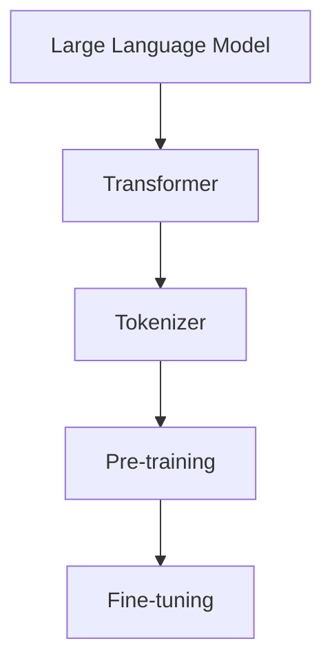
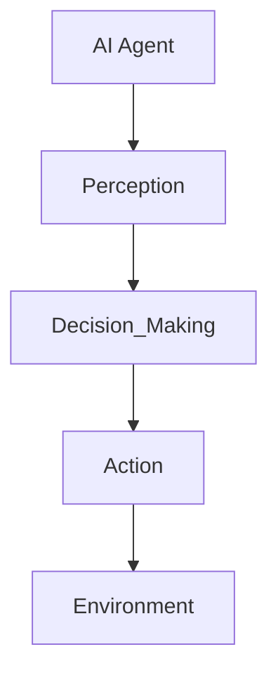
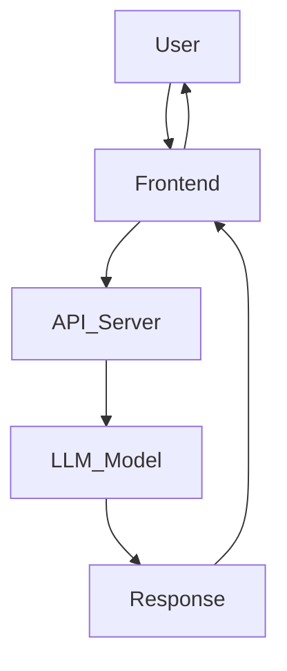

                 


# LLM 驱动的 AI Agent：核心原理与技术栈详解

## 关键词
- LLM, AI Agent, 大语言模型, 人工智能代理, 技术栈, 系统架构, 项目实战

## 摘要
本文详细探讨了LLM（大语言模型）驱动的AI代理的核心原理与技术实现。从背景介绍到核心原理，从技术栈分析到系统架构设计，再到项目实战与优化扩展，全面解析了LLM驱动的AI代理的实现过程。通过具体案例分析，帮助读者深入理解如何构建一个高效的LLM驱动AI代理系统，并展望了未来的发展趋势。

---

## 第一部分：背景介绍

### 第1章：LLM 和 AI Agent 的基本概念

#### 1.1 LLM 的定义与特点

**1.1.1 大语言模型的定义**
大语言模型（Large Language Model，LLM）是一种基于深度学习的自然语言处理模型，旨在理解和生成人类语言。LLM通常使用Transformer架构，通过大量的训练数据进行预训练，能够处理复杂的语言任务，如文本生成、问答系统、机器翻译等。

**1.1.2 LLM 的核心特点**
- **大规模数据训练**：LLM通常使用数百万甚至数十亿的训练样本，通过自监督学习方式捕获语言的规律。
- **深度神经网络**：采用多层Transformer结构，能够捕捉长距离依赖关系。
- **上下文理解**：通过注意力机制，模型可以理解输入文本的上下文信息。
- **多任务能力**：通过微调或提示工程技术，LLM可以适应多种不同的语言任务。

**1.1.3 LLM 与传统语言模型的区别**
传统的语言模型（如n-gram模型）通常基于统计方法，依赖于固定的n-gram窗口，无法捕捉长距离依赖关系。而LLM使用深度学习架构，能够处理更复杂的语言模式，且具有更强的泛化能力。



#### 1.2 AI Agent 的定义与特点

**1.2.1 AI Agent 的定义**
AI Agent（人工智能代理）是一种智能体，能够感知环境、执行任务并做出决策。AI Agent可以是软件程序或硬件设备，通过与环境交互，完成特定目标。

**1.2.2 AI Agent 的核心特点**
- **自主性**：AI Agent能够在没有外部干预的情况下自主决策。
- **反应性**：能够实时感知环境并做出反应。
- **目标导向**：基于预设的目标执行任务。
- **学习能力**：通过与环境交互，学习新的知识和技能。

**1.2.3 AI Agent 与传统代理的区别**
传统代理通常基于规则或预定义的逻辑进行操作，而AI Agent能够通过机器学习技术，动态调整行为策略，具有更强的适应性和学习能力。



#### 1.3 LLM 驱动的 AI Agent 的应用场景

**1.3.1 自然语言处理场景**
- **文本生成**：自动生成新闻报道、营销文案等。
- **问答系统**：提供智能客服、在线问答服务。
- **机器翻译**：实现多语言翻译。

**1.3.2 人机交互场景**
- **智能对话**：提供智能聊天机器人服务。
- **语音助手**：如Siri、Alexa等。

**1.3.3 智能决策场景**
- **推荐系统**：基于用户行为推荐商品或内容。
- **风险管理**：识别潜在风险，优化决策流程。

---

## 第二部分：核心原理

### 第2章：LLM 的核心原理

#### 2.1 模型结构

**2.1.1 深度神经网络结构**
- **编码器**：将输入文本转换为向量表示。
- **解码器**：根据编码器的输出生成目标文本。

**2.1.2 注意力机制**
- **自注意力机制**：计算输入序列中每个位置的重要性，用于捕捉长距离依赖关系。
- **位置编码**：为每个词添加位置信息，帮助模型理解词的位置关系。

**2.1.3 解码器结构**
- **多层Transformer**：解码器通常由多层Transformer组成，每一层都包含自注意力和前馈网络。

#### 2.2 模型训练

**2.2.1 预训练目标**
- **自监督学习**：模型通过预测下一个词或填充空缺词来学习语言的规律。
- **对比学习**：通过对比正样本和负样本，优化模型的表示能力。

**2.2.2 优化算法**
- **Adam优化器**：结合动量和学习率调整，加速收敛。
- **学习率调度器**：动态调整学习率，避免陷入局部最优。

**2.2.3 并行训练技术**
- **数据并行**：将训练数据分片到不同的GPU上，加速训练过程。
- **模型并行**：将模型的不同部分分配到不同的GPU上，充分利用计算资源。

#### 2.3 模型推理

**2.3.1 解码策略**
- **贪心解码**：每次选择概率最高的词生成下一个词。
- **采样解码**：通过采样方法生成多样化的输出。

**2.3.2 生成评估**
- **困惑度**：评估生成文本的质量，困惑度越低表示生成文本越合理。
- **BLEU分数**：基于n-gram的精确匹配，评估生成文本与参考文本的相似性。

### 第3章：AI Agent 的核心原理

#### 3.1 代理的感知与决策

**3.1.1 状态表示**
- **输入表示**：将输入文本转换为模型可以理解的向量形式。
- **上下文表示**：通过注意力机制捕捉输入文本的上下文信息。

**3.1.2 行动选择**
- **策略网络**：基于当前状态，选择最优的行动。
- **Q-learning**：通过奖励机制，优化行动策略。

**3.1.3 环境交互**
- **输入输出接口**：与环境进行交互，获取反馈信息。
- **反馈机制**：根据环境反馈，调整行动策略。

#### 3.2 LLM 在代理中的角色

**3.2.1 作为知识库**
- **知识存储**：模型通过预训练掌握了大量知识，可以用于回答问题、生成内容。
- **动态更新**：通过持续学习，模型可以不断更新知识库，保持信息的准确性。

**3.2.2 作为决策支持**
- **情境理解**：通过上下文分析，理解当前场景的需求。
- **生成建议**：基于模型生成的能力，为决策提供支持。

**3.2.3 与环境交互**
- **多轮对话**：模型通过多轮对话，逐步理解用户需求。
- **任务执行**：根据用户指令，执行具体任务。

---

## 第三部分：技术栈

### 第4章：前端技术

#### 4.1 前端框架
- **React**：用于构建动态交互界面。
- **Vue.js**：用于构建响应式用户界面。
- **Angular**：用于构建大型单页应用。

#### 4.2 API 接口
- **RESTful API**：前后端通信的标准接口。
- **GraphQL**：灵活的查询语言，适合复杂的数据请求。

#### 4.3 第三方服务
- **自然语言处理库**：如spaCy、NLTK。
- **图表库**：如D3.js、Chart.js。

### 第5章：后端技术

#### 5.1 语言与框架
- **Python**：常用的编程语言，支持丰富的机器学习库。
- **TensorFlow**：深度学习框架，适合模型训练。
- **PyTorch**：动态计算图框架，适合快速原型开发。

#### 5.2 模型部署
- **Flask**：轻量级Web框架，适合部署小型服务。
- **Django**：全栈框架，适合复杂的后端逻辑。
- **FastAPI**：高性能异步API框架。

#### 5.3 服务部署
- **Docker**：容器化部署，确保环境一致性。
- **Kubernetes**：容器编排，管理大规模应用。
- **云服务**：如AWS、Azure，提供弹性计算资源。

---

## 第四部分：系统架构与设计

### 第6章：系统设计与架构

#### 6.1 功能需求
- **用户交互**：支持多轮对话，提供智能客服服务。
- **任务执行**：根据用户指令，执行具体任务。
- **知识库管理**：维护模型的知识库，支持动态更新。

#### 6.2 架构设计



#### 6.3 接口设计
- **输入接口**：用户输入文本，传递给前端。
- **输出接口**：生成文本返回给用户，支持JSON格式。

#### 6.4 交互设计
- **多轮对话**：记录对话历史，维护上下文。
- **用户反馈**：支持用户对生成结果进行评价和调整。

---

## 第五部分：项目实战

### 第7章：项目实现

#### 7.1 环境搭建

```bash
pip install flask
pip install transformers
pip install torch
```

#### 7.2 核心代码实现

```python
from flask import Flask, request, jsonify
from transformers import AutoTokenizer, AutoModelForCausalLM

app = Flask(__name__)

tokenizer = AutoTokenizer.from_pretrained('gpt2')
model = AutoModelForCausalLM.from_pretrained('gpt2')

@app.route('/generate', methods=['POST'])
def generate():
    data = request.json
    prompt = data['prompt']
    inputs = tokenizer(prompt, return_tensors='np')
    outputs = model.generate(inputs.input_ids, max_length=50)
    response = tokenizer.decode(outputs[0])
    return jsonify({'response': response})

if __name__ == '__main__':
    app.run(debug=True)
```

#### 7.3 测试与部署

```bash
python app.py
curl -X POST -H "Content-Type: application/json" -d '{"prompt": "帮我写一段关于人工智能的介绍"}' http://localhost:5000/generate
```

---

## 第六部分：优化与扩展

### 第8章：优化与扩展

#### 8.1 性能优化

- **模型压缩**：通过剪枝、量化等技术，减少模型参数。
- **并行计算**：利用多GPU加速模型推理。

#### 8.2 复杂场景处理

- **多轮对话**：通过维护对话历史，优化生成质量。
- **上下文管理**：处理长文本输入，确保模型理解上下文。

#### 8.3 未来趋势

- **多模态模型**：结合视觉、听觉等多模态信息，提升生成效果。
- **可解释性增强**：通过可解释的生成过程，提升用户信任度。

---

## 作者

作者：AI天才研究院/AI Genius Institute & 禅与计算机程序设计艺术 /Zen And The Art of Computer Programming

---

通过以上内容，我们详细探讨了LLM驱动的AI代理的核心原理与技术实现，从理论到实践，从基础到高级，全面解析了如何构建一个高效的LLM驱动AI代理系统。希望本文能为读者提供有价值的参考和启发。

