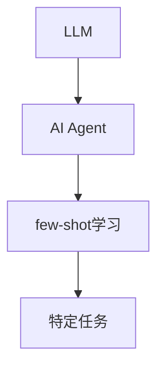
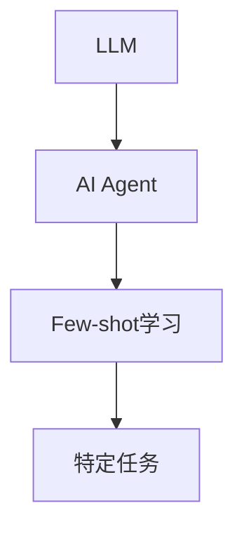
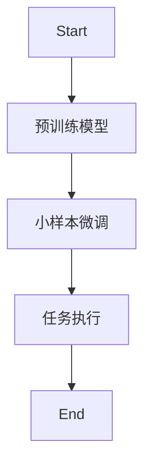
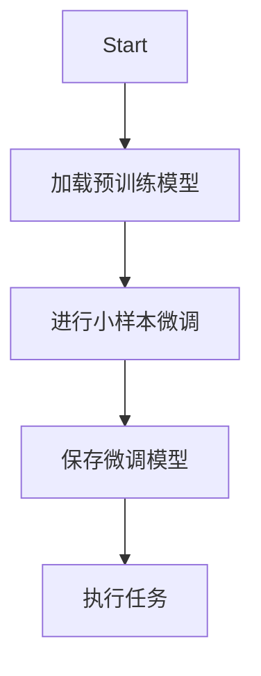
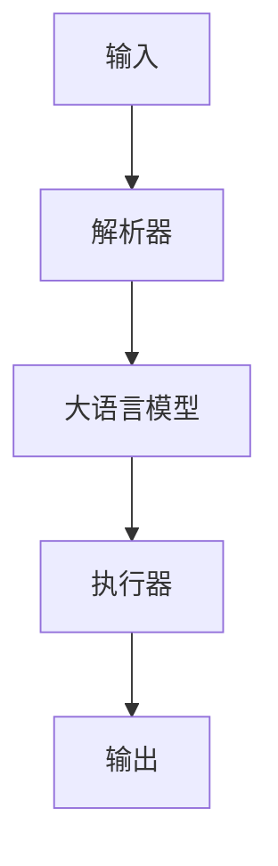

                 


---

# LLM在AI Agent中的few-shot学习应用

> 关键词：LLM, AI Agent, few-shot学习, 人工智能, 智能体, 机器学习

> 摘要：本文探讨了大语言模型（LLM）在AI Agent中的few-shot学习应用，详细分析了few-shot学习的核心原理、LLM与AI Agent的结合机制、算法实现、系统架构设计以及实际应用场景。通过理论与实践相结合的方式，本文旨在为读者提供一个全面的技术视角，帮助其理解并掌握如何在AI Agent中有效应用few-shot学习技术。

---

# 第1章: 背景介绍

## 1.1 问题背景

### 1.1.1 LLM与AI Agent的基本概念

- **大语言模型（LLM, Large Language Model）**：一种基于深度学习的自然语言处理模型，能够理解和生成人类语言，如GPT系列、BERT系列等。
- **AI Agent（人工智能代理）**：一种智能体，能够感知环境、执行任务并做出决策，旨在为用户提供智能化的服务或解决方案。

### 1.1.2 few-shot学习的定义与特点

- **few-shot学习**：一种机器学习方法，仅需少量标注样本即可完成模型训练，适用于数据量有限的场景。
- **特点**：
  - 样本需求少
  - 依赖模型的泛化能力
  - 适用于特定任务的快速学习

### 1.1.3 问题背景与实际应用场景

- **问题背景**：AI Agent需要处理的任务通常具有多样性、复杂性和实时性，传统的监督学习方法难以应对数据不足的情况。
- **实际应用场景**：
  - 客服系统中的对话生成
  - 智能助手的任务执行
  - 个性化推荐系统

## 1.2 问题描述

### 1.2.1 LLM在AI Agent中的作用

- LLM为AI Agent提供了强大的自然语言处理能力，使其能够理解用户意图、生成自然语言回复。
- LLM的上下文理解和生成能力是AI Agent实现复杂任务的关键。

### 1.2.2 few-shot学习在AI Agent中的必要性

- 在实际场景中，任务可能涉及领域特定的数据，数据收集和标注成本高。
- few-shot学习可以利用少量样本快速构建适用于特定任务的模型。

### 1.2.3 当前技术的挑战与不足

- LLM的训练需要大量数据，难以适应特定领域的少量样本。
- few-shot学习的性能依赖于模型的迁移能力和任务的相似性。

## 1.3 问题解决

### 1.3.1 few-shot学习的核心思想

- 利用预训练模型的特征提取能力，通过少量样本微调模型，使其适应特定任务。

### 1.3.2 LLM在AI Agent中的实现路径

- 利用LLM的生成能力，通过few-shot学习快速适应特定任务。
- 在AI Agent中引入few-shot学习机制，使其能够快速学习和执行新任务。

### 1.3.3 few-shot学习在AI Agent中的具体应用

- 通过few-shot学习实现对话生成、任务执行等任务。
- 在AI Agent中使用few-shot学习提升模型的适应性和灵活性。

## 1.4 边界与外延

### 1.4.1 LLM与AI Agent的边界

- LLM是AI Agent的核心组件之一，但AI Agent还包括感知、决策和执行模块。
- LLM的作用是提供自然语言处理能力，而AI Agent的其他部分负责任务规划和执行。

### 1.4.2 few-shot学习的适用范围与限制

- 适用于数据量有限的任务。
- 适用于与预训练任务相似的领域。
- 对于完全不同的任务或领域，few-shot学习的效果可能有限。

### 1.4.3 相关技术的对比与区分

- 对比技术：监督学习、无监督学习、迁移学习。
- 区分：few-shot学习依赖少量样本和预训练模型，适用于快速适应特定任务。

## 1.5 概念结构与核心要素

### 1.5.1 概念结构图



### 1.5.2 核心要素组成

- LLM：提供自然语言处理能力。
- AI Agent：整合LLM和其他模块，实现任务执行。
- few-shot学习：通过少量样本快速适应特定任务。

---

# 第2章: 核心概念与联系

## 2.1 LLM与AI Agent的核心原理

### 2.1.1 LLM的工作原理

- **预训练**：通过大量数据训练模型，提取语言特征。
- **微调**：根据特定任务调整模型参数。

### 2.1.2 AI Agent的核心机制

- **感知**：通过输入获取环境信息。
- **决策**：基于模型生成行动计划。
- **执行**：通过输出模块执行任务。

### 2.1.3 两者的结合与协同

- LLM为AI Agent提供语言理解和生成能力。
- AI Agent利用LLM的能力完成复杂任务。

## 2.2 few-shot学习的原理与实现

### 2.2.1 few-shot学习的基本原理

- **小样本训练**：利用少量样本对模型进行微调。
- **知识迁移**：依赖预训练模型的知识。

### 2.2.2 基于LLM的few-shot学习实现

- 使用LLM的预训练参数，通过少量样本进行微调。
- 在AI Agent中，利用few-shot学习快速适应新任务。

### 2.2.3 few-shot学习的关键技术

- **小样本训练方法**：如元学习、迁移学习。
- **模型调整策略**：如参数微调、任务适配。

## 2.3 核心概念对比与联系

### 2.3.1 概念属性特征对比表格

| 概念       | 描述                                                                 |
|------------|----------------------------------------------------------------------|
| LLM        | 大型预训练语言模型，用于理解和生成自然语言。                         |
| AI Agent    | 智能代理，通过感知环境、决策和执行完成任务。                         |
| few-shot学习 | 利用少量样本快速适应特定任务的机器学习方法。                       |

### 2.3.2 ER实体关系图架构



---

# 第3章: 算法原理与实现

## 3.1 算法原理

### 3.1.1 few-shot学习的算法流程



### 3.1.2 LLM在算法中的角色

- **预训练阶段**：提供通用语言特征。
- **微调阶段**：基于特定任务进行参数调整。

## 3.2 算法实现

### 3.2.1 算法实现步骤



### 3.2.2 算法实现的数学模型

- **预训练模型**：利用大规模数据训练得到的参数 $\theta$。
- **微调阶段**：在特定任务上优化参数 $\theta$，得到 $\theta_{\text{new}}$。

---

# 第4章: 系统分析与架构设计

## 4.1 系统架构设计

### 4.1.1 系统功能设计

- **输入处理模块**：接收用户输入并解析。
- **模型调用模块**：调用微调后的LLM模型。
- **任务执行模块**：根据模型输出执行任务。

### 4.1.2 系统架构图



---

# 第5章: 项目实战

## 5.1 项目介绍

### 5.1.1 项目场景描述

- **项目名称**：基于LLM的智能客服系统。
- **场景描述**：用户与AI Agent进行对话，AI Agent通过LLM理解和生成回复。

### 5.1.2 项目实现目标

- 实现AI Agent的对话生成功能。
- 验证few-shot学习在特定任务中的效果。

## 5.2 系统核心实现

### 5.2.1 环境安装

```bash
pip install transformers
```

### 5.2.2 核心代码实现

```python
from transformers import AutoTokenizer, AutoModelForCausalLM

model_name = "gpt2"
tokenizer = AutoTokenizer.from_pretrained(model_name)
model = AutoModelForCausalLM.from_pretrained(model_name)

def generate_response(input_text):
    inputs = tokenizer(input_text, return_tensors="np")
    outputs = model.generate(inputs.input_ids, max_length=50)
    return tokenizer.decode(outputs[0].tolist(), skip_special_tokens=True)
```

---

# 第6章: 总结与展望

## 6.1 小结

- 本文详细介绍了LLM在AI Agent中的few-shot学习应用。
- 探讨了算法原理、系统架构设计和实际应用场景。

## 6.2 注意事项

- 在实际应用中，需注意数据质量对模型性能的影响。
- 需合理选择微调样本的数量和多样性。

## 6.3 拓展阅读

- 推荐阅读《Large Language Models: A Survey》和《Few-shot Learning: Theory and Practice》。

---

作者：AI天才研究院/AI Genius Institute & 禅与计算机程序设计艺术 /Zen And The Art of Computer Programming

