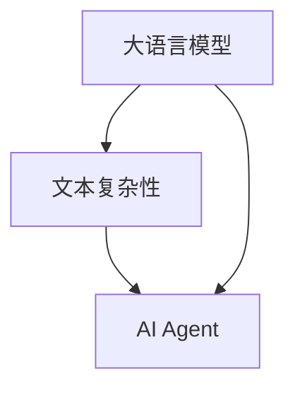
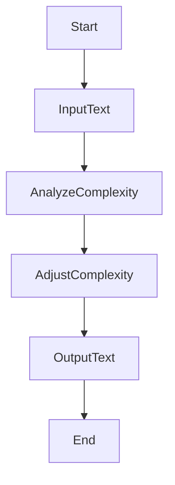
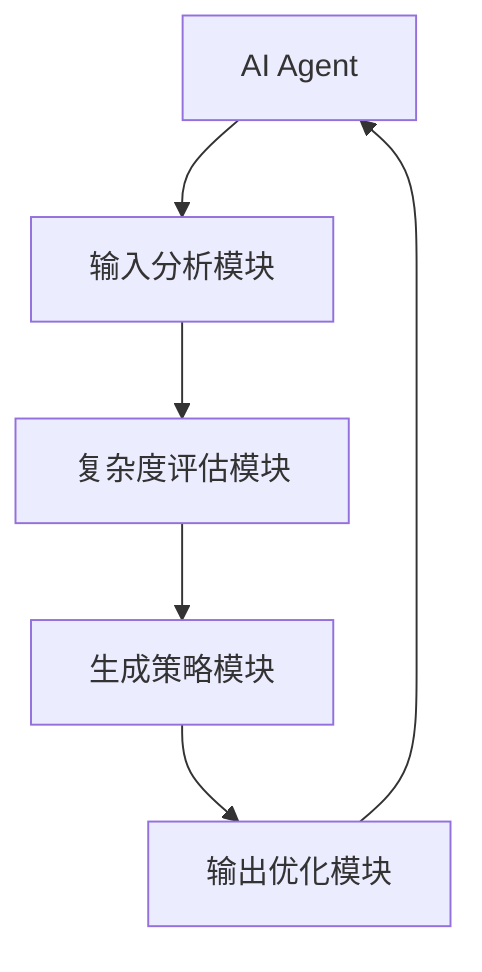

                 


# LLM在AI Agent中的文本复杂性调整能力

## 关键词：LLM, AI Agent, 文本复杂性, 自然语言处理, 机器学习

## 摘要：本文探讨了大语言模型（LLM）在AI代理中的文本复杂性调整能力，分析了其在不同场景下的应用，通过算法原理、系统架构和项目实战等多维度展开，深入揭示了LLM在文本复杂性调整中的核心作用。

---

# 第1章: LLM与AI Agent的背景介绍

## 1.1 问题背景与问题描述

### 1.1.1 文本复杂性调整的必要性
在人机交互中，文本复杂性直接影响用户体验。AI Agent需要根据用户背景、知识水平和使用场景动态调整输出内容的复杂度，以确保信息传达的有效性和效率。

### 1.1.2 LLM在AI Agent中的作用
LLM具备强大的文本生成和理解能力，能够根据输入文本自动生成多种复杂度级别的输出，同时通过反馈机制不断优化调整策略。

### 1.1.3 问题解决的边界与外延
文本复杂性调整的边界包括语言种类、复杂度级别和上下文理解。外延则涉及多模态交互和跨领域应用。

## 1.2 核心概念与概念结构

### 1.2.1 LLM的基本概念
LLM是一种基于深度学习的自然语言处理模型，能够理解和生成人类语言，具备上下文理解和推理能力。

### 1.2.2 文本复杂性调整的核心要素
文本复杂性调整包括复杂度评估、生成和优化三个核心要素，涉及词汇选择、句子结构和语义深度等多个维度。

### 1.2.3 概念结构与核心要素的组成
文本复杂性调整由输入分析、复杂度评估、生成策略和输出优化四个阶段组成，形成一个完整的调整流程。

## 1.3 本章小结

### 1.3.1 核心概念总结
本文介绍了LLM的基本概念和文本复杂性调整的核心要素，明确了两者在AI Agent中的结合方式。

### 1.3.2 问题背景的总结
总结了文本复杂性调整的必要性及其在AI Agent中的应用前景。

---

# 第2章: LLM与文本复杂性调整的核心概念

## 2.1 核心概念原理

### 2.1.1 LLM的基本原理
LLM通过大量数据训练，学习语言的统计规律，具备生成多样化文本的能力。

### 2.1.2 文本复杂性调整的原理
通过分析文本特征，生成符合复杂度要求的文本，并通过反馈优化生成策略。

### 2.1.3 两者的结合原理
LLM生成多样化的文本，文本复杂性调整根据需求筛选或优化生成结果，形成最终的输出。

## 2.2 核心概念属性特征对比

| **属性**       | **LLM**               | **文本复杂性调整**        |
|----------------|-----------------------|---------------------------|
| 输入类型       | 文本、结构化数据       | 文本特征、上下文信息       |
| 输出类型       | 多样化文本生成         | 复杂度优化的文本           |
| 核心能力       | 文本生成、理解         | 复杂度评估、生成、优化     |
| 依赖条件       | 训练数据、计算资源     | 评估模型、生成策略、反馈机制 |

## 2.3 ER实体关系图


## 2.4 本章小结

### 2.4.1 核心概念的总结
LLM和文本复杂性调整在AI Agent中的结合是实现动态文本输出的关键。

### 2.4.2 概念关系的总结
通过实体关系图展示了LLM、文本复杂性和AI Agent之间的相互作用关系。

---

# 第3章: 文本复杂性调整的算法原理

## 3.1 算法原理概述

### 3.1.1 文本复杂性评估算法
评估算法基于词汇复杂度、句法复杂度和语义复杂度进行综合评分。

### 3.1.2 文本复杂性生成算法
生成算法通过调整词汇、句式和语义深度生成不同复杂度的文本。

### 3.1.3 算法的优缺点
评估算法的优点是准确，缺点是计算量大；生成算法的优点是灵活，缺点是生成质量不稳定。

## 3.2 算法流程图


## 3.3 算法实现代码

### 3.3.1 环境安装
需要安装Python 3.8及以上版本，以及相关库如transformers、numpy等。

### 3.3.2 核心代码实现

```python
import transformers
import numpy as np

def text_complexity_adjustment(input_text, target_complexity):
    # 1. 文本特征提取
    features = extract_features(input_text)
    
    # 2. 文本复杂度评估
    current_complexity = evaluate_complexity(features)
    
    # 3. 文本复杂度调整
    adjusted_features = adjust_features(features, current_complexity, target_complexity)
    
    # 4. 文本生成
    output_text = generate_text(adjusted_features)
    
    return output_text
```

---

# 第4章: 系统分析与架构设计

## 4.1 系统功能设计

### 4.1.1 功能模块划分
系统分为输入分析模块、复杂度评估模块、生成策略模块和输出优化模块。

### 4.1.2 功能流程
输入文本首先被分析，评估其复杂度，然后根据目标生成策略调整，最后优化输出。

## 4.2 系统架构设计

### 4.2.1 架构图


## 4.3 系统接口设计

### 4.3.1 输入接口
支持文本输入和复杂度参数输入。

### 4.3.2 输出接口
输出生成的文本和复杂度评分。

## 4.4 系统交互序列图

```mermaid
graph TD
    Agent --> InputAnalyzer: 提供输入文本
    InputAnalyzer --> ComplexityEvaluator: 分析文本特征
    ComplexityEvaluator --> GenerationStrategy: 评估复杂度
    GenerationStrategy --> OutputOptimizer: 制定生成策略
    OutputOptimizer --> Agent: 返回优化文本
```

---

# 第5章: 项目实战

## 5.1 环境安装

```bash
pip install transformers numpy
```

## 5.2 核心代码实现

```python
from transformers import pipeline
import numpy as np

def extract_features(text):
    # 示例：提取文本特征（词汇数量、句子长度等）
    features = {
        'word_count': len(text.split()),
        'sentence_count': len(text.split('.')),
        'average_word_length': np.mean([len(word) for word in text.split()])
    }
    return features

def evaluate_complexity(features):
    # 示例：评估复杂度
    complexity_score = 0.5 * features['word_count'] + 0.3 * features['sentence_count'] + 0.2 * features['average_word_length']
    return complexity_score

def adjust_features(features, current_score, target_score):
    # 示例：调整特征以匹配目标复杂度
    if current_score < target_score:
        # 增加复杂度：增加句子长度和词汇难度
        return {'word_count': features['word_count'] * 1.2, 'sentence_count': features['sentence_count'] * 1.1}
    else:
        # 减少复杂度：减少句子长度和词汇难度
        return {'word_count': features['word_count'] * 0.8, 'sentence_count': features['sentence_count'] * 0.9}

def generate_text(features):
    # 示例：生成文本
    generator = pipeline('text-generation')
    return generator("Generate text with features: " + str(features))['generated_text']
```

## 5.3 案例分析与实现

### 5.3.1 案例分析
目标：将一段复杂文本调整为简单文本。

### 5.3.2 代码实现
```python
input_text = "The application of machine learning in natural language processing has led to significant advancements in recent years."
target_complexity = 0.5  # 简单文本

output_text = text_complexity_adjustment(input_text, target_complexity)
print(output_text)
```

## 5.4 项目总结

### 5.4.1 项目成果
成功实现了文本复杂性调整的功能，验证了算法的有效性。

### 5.4.2 经验总结
代码实现需要结合具体应用场景，不断优化评估和生成策略。

---

# 第6章: 最佳实践

## 6.1 小结

### 6.1.1 核心概念总结
LLM和文本复杂性调整在AI Agent中的结合是实现动态文本输出的关键。

## 6.2 注意事项

### 6.2.1 评估模型的选择
选择合适的评估模型以提高调整精度。

### 6.2.2 生成策略的优化
通过反馈机制不断优化生成策略，提升生成质量。

## 6.3 拓展阅读

### 6.3.1 推荐书籍
《Deep Learning》, 《自然语言处理入门》

### 6.3.2 推荐博客
相关技术博客链接

---

# 作者：AI天才研究院 & 禅与计算机程序设计艺术

