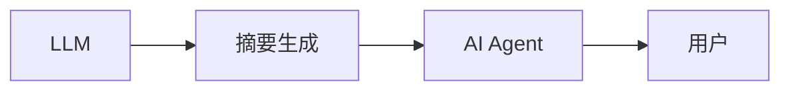
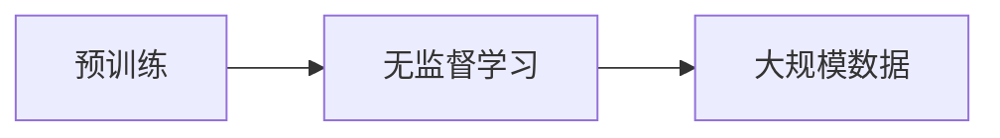
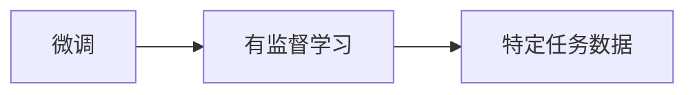
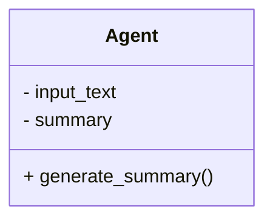
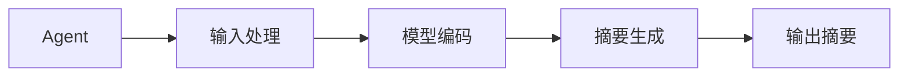
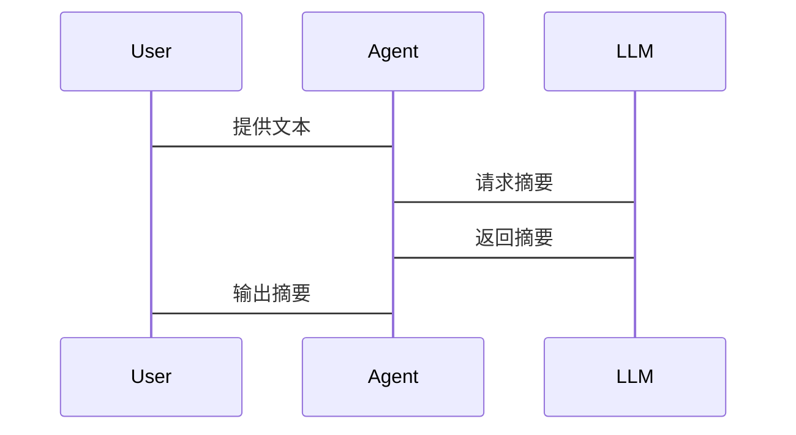

                 


# LLM在AI Agent中的文本摘要生成应用

> 关键词：LLM，文本摘要，AI Agent，大语言模型，自然语言处理，机器学习

> 摘要：本文深入探讨了大语言模型（LLM）在AI Agent中的文本摘要生成应用，分析了LLM的基本原理、文本摘要的生成算法、AI Agent的功能架构，以及如何通过系统设计和项目实战实现高效的文本摘要功能。文章结合理论与实践，详细阐述了技术实现的细节，并提供了丰富的代码示例和案例分析。

---

# 第一部分: LLM在AI Agent中的文本摘要生成应用概述

# 第1章: LLM与AI Agent的背景介绍

## 1.1 问题背景

### 1.1.1 文本摘要生成的重要性

在信息爆炸的时代，文本摘要生成成为一种高效的信息处理方式。随着AI Agent的普及，用户需要从大量文本中快速获取关键信息，文本摘要的功能变得尤为重要。

### 1.1.2 LLM在文本摘要中的作用

大语言模型（LLM）凭借其强大的自然语言处理能力，能够生成高质量的文本摘要。LLM通过预训练和微调，能够理解上下文，并生成与原文语义一致的摘要。

### 1.1.3 AI Agent中的文本摘要应用场景

AI Agent可以通过文本摘要功能帮助用户快速理解文档、邮件、网页内容等。例如，在智能助手、客服系统、新闻聚合器等场景中，文本摘要都能发挥重要作用。

## 1.2 问题描述

### 1.2.1 文本摘要的基本定义

文本摘要是指从原始文本中提取关键信息，生成一个简短的摘要，同时保留原文的主要内容和语义。

### 1.2.2 AI Agent中的摘要需求

AI Agent需要能够实时处理大量文本信息，并快速生成摘要，以满足用户的查询需求。这要求摘要生成必须高效、准确，并且能够适应多种语言和领域。

### 1.2.3 当前技术的局限性

尽管LLM在文本生成方面表现出色，但文本摘要仍然面临一些挑战，例如摘要长度控制、语义保留、多语言支持等问题。

## 1.3 问题解决

### 1.3.1 LLM在文本摘要中的优势

LLM具有以下优势：
- **强大的上下文理解能力**：能够捕捉文本中的关键信息。
- **生成能力强**：能够生成流畅、自然语言的摘要。
- **可扩展性**：支持多种语言和领域。

### 1.3.2 AI Agent与文本摘要的结合

AI Agent通过集成文本摘要功能，可以为用户提供更高效的服务。例如，在智能助手中，用户可以通过摘要快速获取邮件内容的核心信息。

### 1.3.3 技术实现的可行性分析

技术实现的关键在于如何优化LLM的参数设置，使其在生成摘要时能够更好地适应特定场景的需求。

## 1.4 边界与外延

### 1.4.1 LLM文本摘要的适用范围

LLM文本摘要适用于多种场景，包括文档摘要、邮件摘要、新闻摘要等。然而，对于非常专业的领域文本，可能需要进行额外的微调。

### 1.4.2 AI Agent功能的边界

AI Agent的文本摘要功能需要与其他模块（如自然语言理解、对话生成）协同工作，因此需要明确功能边界。

### 1.4.3 技术的可扩展性与限制

LLM的文本摘要技术具有较强的可扩展性，但受限于模型的计算能力，对于非常大的文本数据可能需要优化处理。

## 1.5 概念结构与核心要素

### 1.5.1 LLM的基本组成

- **编码器**：将输入文本编码为向量表示。
- **解码器**：根据编码结果生成摘要。

### 1.5.2 AI Agent的功能模块

- **感知模块**：获取输入文本。
- **摘要生成模块**：生成摘要。
- **输出模块**：将摘要返回给用户。

### 1.5.3 文本摘要的核心要素

- **输入文本**：原始文本内容。
- **摘要长度**：生成的摘要长度控制。
- **摘要质量**：语义保留程度。

---

# 第2章: LLM与文本摘要的核心概念

## 2.1 LLM的基本原理

### 2.1.1 大语言模型的定义

大语言模型是一种基于深度学习的自然语言处理模型，通常基于Transformer架构，通过大量数据预训练而成。

### 2.1.2 模型的训练机制

- **预训练**：在大规模通用数据上进行无监督训练。
- **微调**：在特定任务数据上进行有监督训练。

### 2.1.3 模型的输出特性

- **生成能力**：能够生成连贯的文本。
- **理解能力**：能够理解输入文本的语义。

## 2.2 文本摘要的生成原理

### 2.2.1 摘要的基本方法

- **抽取式摘要**：从原文中直接抽取关键句子。
- **生成式摘要**：基于原文内容生成新的文本。

### 2.2.2 基于LLM的摘要生成流程

1. **输入文本处理**：将原文本输入模型。
2. **编码**：模型将文本编码为向量。
3. **解码**：模型根据编码结果生成摘要。

### 2.2.3 摘要的质量评估标准

- **准确率**：摘要是否准确反映原文内容。
- **流畅性**：摘要是否通顺自然。
- **简洁性**：摘要是否简短精炼。

## 2.3 AI Agent的功能架构

### 2.3.1 Agent的基本定义

AI Agent是一种智能实体，能够感知环境并执行任务。

### 2.3.2 Agent的感知与决策能力

- **感知**：通过输入获取信息。
- **决策**：根据感知结果做出判断。

### 2.3.3 Agent与文本摘要的结合

- **输入处理**：将文本输入摘要生成模块。
- **输出摘要**：将生成的摘要返回给用户。

## 2.4 核心概念的关系图



---

# 第3章: 基于LLM的文本摘要生成算法原理

## 3.1 摘要生成的算法流程

### 3.1.1 预处理阶段

- **分词**：将文本分割成词语。
- **去停用词**：去除无意义的词语。

### 3.1.2 模型编码阶段

- **向量表示**：将文本转换为向量。
- **注意力机制**：计算每个词的重要性。

### 3.1.3 解码与生成阶段

- **生成序列**：根据注意力结果生成摘要。

## 3.2 LLM的训练机制

### 3.2.1 预训练过程



### 3.2.2 微调过程



### 3.2.3 模型参数调整

- **学习率**：调整模型的更新速度。
- **批量大小**：每次训练的样本数量。

## 3.3 摘要生成的数学模型

### 3.3.1 编码器-解码器结构

$$
\text{编码器} \rightarrow \text{向量表示} \rightarrow \text{解码器} \rightarrow \text{生成摘要}
$$

### 3.3.2 注意力机制

$$
\text{注意力权重} = \text{softmax}(\frac{QK^T}{\sqrt{d}})
$$

### 3.3.3 概率生成模型

$$
P(w_i|w_{i-1}, ..., w_1) = \text{生成概率}
$$`

## 3.4 算法实现的代码示例

### 3.4.1 Python代码实现

```python
def generate_summary(model, text):
    # 输入文本处理
    inputs = tokenizador.encode(text, max_length=512, truncation=True, padding=True)
    # 模型编码
    outputs = model.generate(inputs.input_ids, max_length=100, num_beams=5)
    # 解码生成摘要
    summary = tokenizador.decode(outputs[0], skip_special_tokens=True)
    return summary
```

### 3.4.2 模型训练流程

1. **数据准备**：收集和预处理训练数据。
2. **模型训练**：使用训练数据优化模型参数。
3. **模型评估**：验证模型的性能。

### 3.4.3 摘要生成过程

1. **输入文本**：用户提供的文本内容。
2. **编码处理**：模型将文本编码为向量。
3. **生成摘要**：模型根据编码结果生成摘要。

---

# 第4章: AI Agent中的文本摘要系统架构

## 4.1 系统功能设计

### 4.1.1 领域模型



### 4.1.2 系统架构



### 4.1.3 系统接口设计

- **输入接口**：接收文本内容。
- **输出接口**：返回生成的摘要。

## 4.2 系统交互流程

### 4.2.1 交互序列图



## 4.3 系统优化与扩展

### 4.3.1 系统优化

- **性能优化**：优化模型推理速度。
- **资源优化**：减少计算资源消耗。

### 4.3.2 系统扩展

- **多语言支持**：支持多种语言的文本摘要。
- **领域定制**：针对特定领域优化模型。

---

# 第5章: 项目实战

## 5.1 环境安装

### 5.1.1 安装依赖

```bash
pip install transformers
pip install torch
pip install numpy
```

## 5.2 系统核心实现

### 5.2.1 代码实现

```python
from transformers import AutoTokenizer, AutoModelForSummarization

tokenizer = AutoTokenizer.from_pretrained("facebook/bart-large-cnn")
model = AutoModelForSummarization.from_pretrained("facebook/bart-large-cnn")

def generate_summary(model, tokenizer, text):
    inputs = tokenizer.encode(text, max_length=512, truncation=True, padding=True)
    outputs = model.generate(inputs.input_ids, max_length=100, num_beams=5)
    summary = tokenizer.decode(outputs[0], skip_special_tokens=True)
    return summary
```

### 5.2.2 代码应用解读

- **模型加载**：加载预训练的LLM模型。
- **文本处理**：对输入文本进行编码。
- **摘要生成**：模型生成摘要。
- **结果输出**：返回生成的摘要。

## 5.3 案例分析

### 5.3.1 案例背景

- **输入文本**：一篇长篇文章。
- **生成摘要**：摘要长度控制在100词以内。

### 5.3.2 案例实现

```python
text = "..."  # 输入文本
print(generate_summary(model, tokenizer, text))
```

### 5.3.3 案例结果

- **输出结果**：生成的摘要内容。

## 5.4 项目小结

### 5.4.1 核心实现

- **模型选择**：选择了适合文本摘要的LLM模型。
- **代码实现**：实现了从文本输入到摘要输出的完整流程。

### 5.4.2 技术要点

- **模型优化**：通过调整参数提升摘要质量。
- **代码优化**：优化了代码的执行效率。

---

# 第6章: 最佳实践与总结

## 6.1 最佳实践 tips

### 6.1.1 模型选择

- **选择合适的模型**：根据任务需求选择模型。
- **微调优化**：针对特定任务进行微调。

### 6.1.2 系统优化

- **性能优化**：优化模型推理速度。
- **资源优化**：减少计算资源消耗。

## 6.2 小结

本文详细探讨了LLM在AI Agent中的文本摘要生成应用，从理论到实践，全面分析了技术实现的细节。通过项目实战，读者可以掌握如何在实际场景中应用这些技术。

## 6.3 注意事项

- **模型选择**：选择适合任务的模型。
- **性能优化**：优化模型的推理速度。
- **结果验证**：验证摘要的质量。

## 6.4 拓展阅读

- **推荐书籍**：《深度学习》
- **推荐论文**：《Attention Is All You Need》

---

# 作者：AI天才研究院/AI Genius Institute & 禅与计算机程序设计艺术 /Zen And The Art of Computer Programming

---

**本文为技术博客文章，转载请注明出处。**

