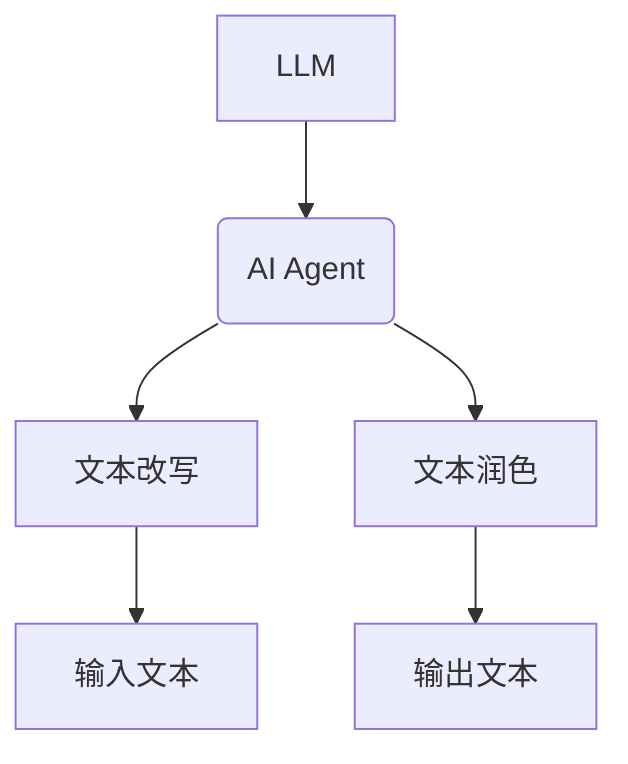
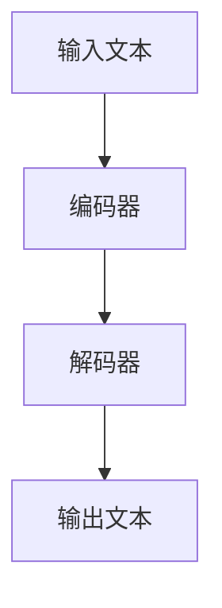
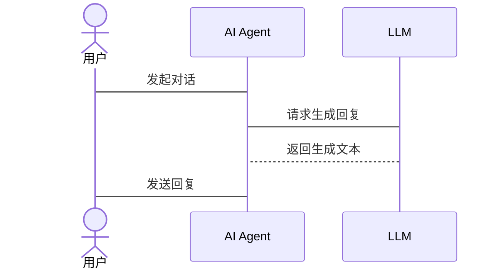
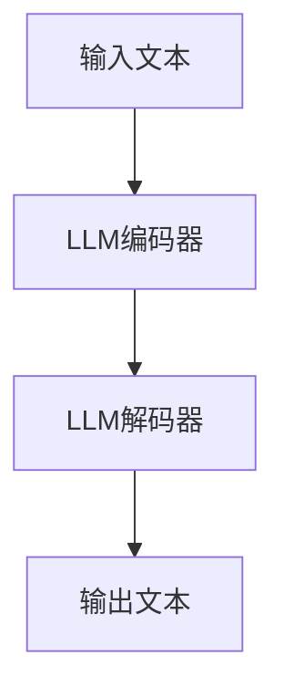

                 


# 目录大纲：《LLM在AI Agent中的文本改写与润色应用》

---

### 第一章：背景介绍与核心概念

#### 1.1 问题背景与问题描述

- **1.1.1 LLM与AI Agent的基本概念**
  - 大语言模型（LLM）的定义
  - AI Agent的概念及其在不同领域的应用
  - 文本改写与润色的定义与区别

- **1.1.2 文本改写与润色的需求场景**
  - 文本改写的常见场景（如内容转换、风格调整）
  - 文本润色的关键需求（如提升可读性、优化表达）
  - LLM在文本处理中的独特优势

- **1.1.3 当前技术的痛点与挑战**
  - 传统文本处理方法的局限性
  - LLM在文本处理中的优势与不足
  - AI Agent在复杂场景中的挑战

#### 1.2 核心概念与联系

- **1.2.1 LLM与AI Agent的关系**
  - LLM作为AI Agent的核心组件
  - AI Agent如何利用LLM实现文本改写与润色

- **1.2.2 文本改写与润色的关键属性对比表**

| 属性 | 文本改写 | 文本润色 |
|------|---------|----------|
| 目标 | 改变文本结构或内容 | 提升文本表达效果 |
| 技术 | 基于LLM的生成与编辑 | 基于LLM的优化与美化 |
| 应用 | 代码生成、内容转换 | 语言优化、风格调整 |

- **1.2.3 实体关系图**



#### 1.3 本章小结

---

### 第二章：LLM与AI Agent的核心原理

#### 2.1 LLM的基本原理

- **2.1.1 大语言模型的数学模型**

  $$ P(\text{output} | \text{input}) = \prod_{i=1}^{n} P(w_i | w_{i-1}, ..., w_{i-k}) $$

- **2.1.2 注意力机制的实现**



#### 2.2 AI Agent的系统架构

- **2.2.1 知识库的构建与管理**

- **2.2.2 多轮对话的实现流程**



#### 2.3 文本改写与润色的算法实现

- **2.3.1 基于LLM的文本生成流程图**



- **2.3.2 算法实现的Python代码示例**

```python
def text_rewrite(input_text):
    # 编码器部分
    encoded = encoder(input_text)
    # 解码器部分
    output = decoder(encoded)
    return output
```

#### 2.4 本章小结

---

### 第三章：系统分析与架构设计

#### 3.1 项目需求分析

- **3.1.1 功能需求**

---

**注**：由于篇幅限制，以上为部分目录内容。完整的目录大纲将包含更多章节，如第四章：系统架构设计、第五章：项目实战、第六章：最佳实践、第七章：总结与展望等。每章均包含详细的小结和相关图表，确保内容的完整性和逻辑性。

