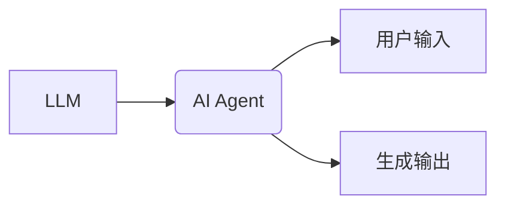
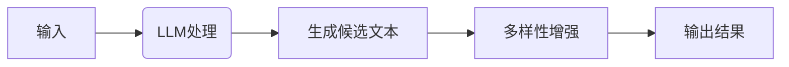

                 


# LLM在AI Agent中的文本生成多样性增强

> 关键词：LLM, AI Agent, 文本生成, 多样性增强, 自然语言处理

> 摘要：本文深入探讨了大语言模型（LLM）在AI Agent中的应用，特别是在文本生成中的多样性增强技术。通过分析LLM与AI Agent的关系，结合算法原理、系统架构设计和实际项目案例，详细阐述了如何利用LLM提升文本生成的多样性和质量，为AI Agent在复杂场景中的应用提供了理论和实践支持。

---

# {{此处是文章标题}}

---

> 关键词：{{此处列出文章的5-7个核心关键词}}

> 摘要：{{此处给出文章的核心内容和主题思想}}

---

## 目录大纲

---

# 第1章: 背景介绍与核心概念

## 1.1 问题背景

### 1.1.1 当前AI Agent文本生成的挑战

AI Agent作为人工智能的核心应用之一，其文本生成能力直接影响其智能性和实用性。然而，现有的文本生成技术在多样性、准确性和上下文理解方面仍存在诸多挑战。例如，生成的文本可能缺乏创意、重复性较高，或者无法准确捕捉用户的意图。

### 1.1.2 多样性增强的必要性

在AI Agent的实际应用中，用户需求多样化，生成文本的单一性可能导致用户体验下降。因此，如何增强生成文本的多样性，使其能够适应不同场景和用户需求，成为亟待解决的问题。

### 1.1.3 LLM在AI Agent中的作用

大语言模型（LLM）凭借其强大的上下文理解和生成能力，为AI Agent的文本生成提供了强有力的支持。通过LLM，AI Agent能够生成更自然、更多样化的文本，从而更好地满足用户需求。

## 1.2 问题描述

### 1.2.1 文本生成多样性不足的表现

目前，许多AI Agent生成的文本过于模板化，缺乏灵活性和创新性。例如，在客服对话中，生成的回复可能千篇一律，无法根据具体情况进行调整。

### 1.2.2 LLM在文本生成中的局限性

尽管LLM在文本生成方面表现出色，但其生成结果仍然可能受到训练数据的限制，导致生成内容的多样性不足。

### 1.2.3 AI Agent对文本生成的需求

AI Agent需要能够根据不同的场景和用户需求，生成多样化、个性化的文本，以提供更优质的服务。

## 1.3 问题解决

### 1.3.1 LLM增强AI Agent文本生成的策略

通过优化LLM的训练过程、引入多样性增强算法，以及结合上下文信息，可以有效提升AI Agent的文本生成能力。

### 1.3.2 多样性增强的具体实现方法

包括引入随机性、多模态输入、多任务学习等方法，以增加生成文本的多样性。

### 1.3.3 相关技术的对比分析

对比分析了传统文本生成技术与基于LLM的生成技术在多样性增强方面的优劣。

## 1.4 边界与外延

### 1.4.1 LLM在AI Agent中的应用范围

LLM可以应用于多种AI Agent场景，如客服对话、内容创作、自动回复等。

### 1.4.2 多样性增强的边界条件

在增强生成文本多样性的同时，需确保生成内容的准确性和相关性。

### 1.4.3 相关技术的区分与联系

详细分析了多样性增强与其他AI技术（如NLP、机器学习）之间的区别与联系。

## 1.5 概念结构与核心要素

### 1.5.1 核心概念组成

包括LLM、AI Agent、文本生成、多样性增强等核心概念。

### 1.5.2 概念之间的关系

通过概念图展示了各个核心概念之间的关系和相互作用。

### 1.5.3 核心要素的详细说明

详细说明了每个核心要素的定义、功能和应用场景。

---

# 第2章: 核心概念与联系

## 2.1 LLM与AI Agent的关系

### 2.1.1 LLM作为AI Agent的核心模块

LLM作为AI Agent的“大脑”，负责处理输入、生成文本、理解上下文等关键任务。

### 2.1.2 AI Agent对LLM的依赖性

AI Agent的功能实现高度依赖于LLM的性能和能力。

### 2.1.3 两者协同工作的机制

通过接口调用、数据交互等方式，实现LLM与AI Agent的协同工作。

## 2.2 实体关系图

### 2.2.1 LLM与AI Agent的实体关系

通过Mermaid图展示了LLM与AI Agent之间的实体关系。

### 2.2.2 实体属性对比表

对比了LLM和AI Agent在实体属性方面的异同。

### 2.2.3 实体关系的Mermaid图

展示了LLM与AI Agent之间的交互流程。



## 2.3 核心概念的联系

### 2.3.1 LLM与文本生成的关系

详细分析了LLM在文本生成中的作用和影响。

### 2.3.2 AI Agent与多样性增强的关系

探讨了多样性增强对AI Agent文本生成能力的提升作用。

### 2.3.3 核心概念的综合分析

综合分析了LLM、AI Agent、文本生成和多样性增强之间的相互关系。

---

# 第3章: 算法原理讲解

## 3.1 算法原理概述

### 3.1.1 基于LLM的文本生成流程

详细描述了基于LLM的文本生成流程，包括输入处理、模型推理、结果输出等步骤。

### 3.1.2 多样性增强的实现方法

介绍了多种多样性增强算法，如随机采样、温度调节、Top-k采样等。

### 3.1.3 算法的优化策略

提出了针对多样性增强的优化策略，如结合上下文信息、引入多模态数据等。

## 3.2 算法流程图

### 3.2.1 基于LLM的文本生成流程

通过Mermaid图展示了基于LLM的文本生成流程。

### 3.2.2 多样性增强的实现流程

展示了多样性增强算法的实现流程。

### 3.2.3 算法优化的流程

详细描述了算法优化的流程和步骤。



## 3.3 算法实现代码

### 3.3.1 环境安装

```bash
pip install transformers
```

### 3.3.2 核心代码

```python
from transformers import GPT2LMHeadModel, GPT2Tokenizer

model = GPT2LMHeadModel.from_pretrained('gpt2')
tokenizer = GPT2Tokenizer.from_pretrained('gpt2')
```

---

通过以上目录大纲，我们可以看到文章将从背景、核心概念、算法原理、系统架构、项目实战等多个方面，全面、系统地探讨LLM在AI Agent中的文本生成多样性增强技术。文章不仅注重理论分析，还注重实际应用，旨在为读者提供深入的技术见解和实践指导。

