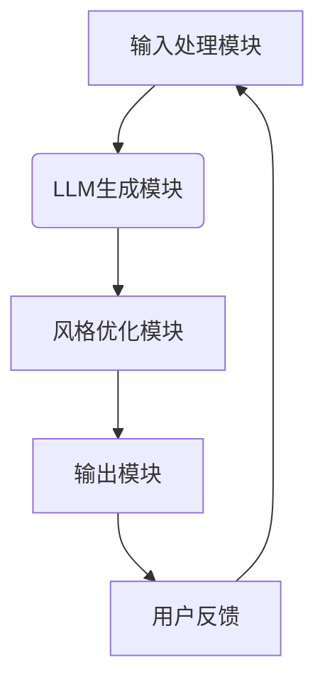
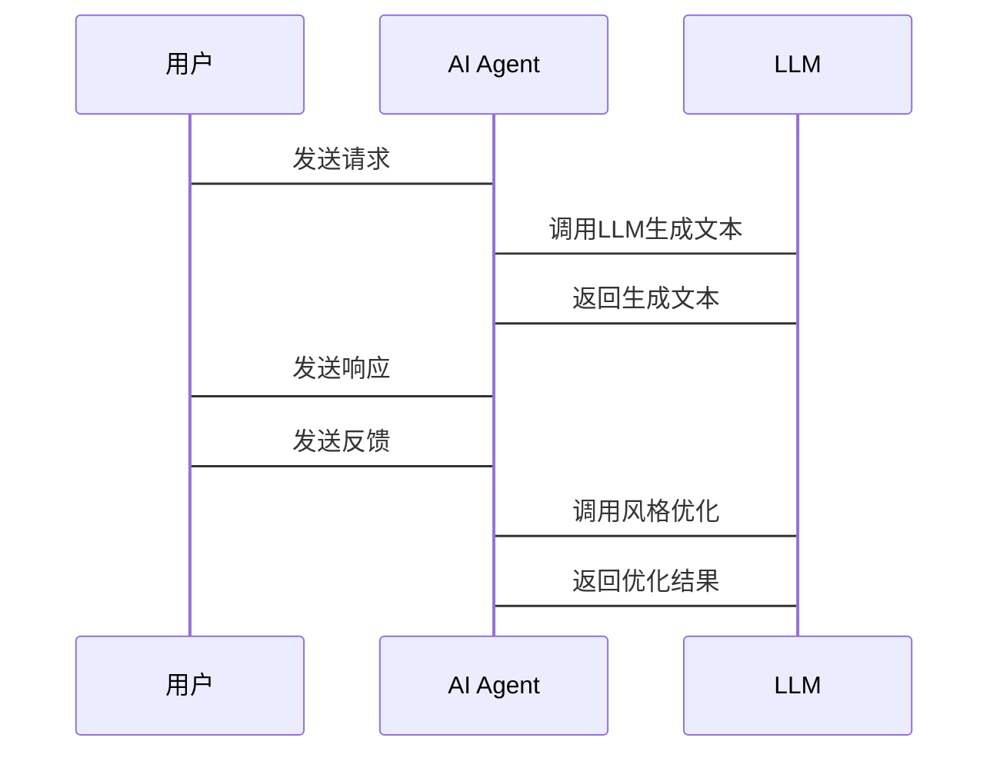

                 


# LLM在AI Agent中的文本风格一致性保持

> 关键词：LLM, AI Agent, 文本风格一致性, 自然语言处理, 人工智能, 对齐技术

> 摘要：本文深入探讨了大语言模型（LLM）在AI Agent中的文本风格一致性保持问题，从理论到实践，结合实际案例，详细分析了LLM在AI Agent中的作用、挑战以及解决方案。文章首先介绍了LLM和AI Agent的基本概念和核心特点，然后分析了文本风格一致性的重要性及其在LLM中的常见问题。接着，详细阐述了保持文本风格一致性的技术方法，包括预训练策略和对齐技术。最后，通过实际案例展示了LLM在不同场景下的应用，并提出了系统设计与实现的具体方案，为读者提供了全面的视角和实践指导。

---

# 第一部分: LLM与AI Agent基础

## 第1章: LLM与AI Agent概述

### 1.1 LLM的定义与特点

#### 1.1.1 大语言模型的定义
大语言模型（Large Language Model, LLM）是指基于深度学习技术构建的、具有大规模参数的自然语言处理模型，如GPT系列、BERT系列等。这些模型通过大量数据的预训练，能够理解和生成自然语言文本。

$$LLM = f_{\theta}(x)$$

其中，$x$表示输入文本，$f_{\theta}$表示模型的参数化函数。

#### 1.1.2 LLM的核心特点
- **大规模参数**：通常拥有数亿甚至更多的参数，能够捕捉复杂的语言模式。
- **多任务能力**：一个模型可以同时处理多种NLP任务，如文本生成、问答、翻译等。
- **上下文理解**：能够处理长上下文，理解文本的语境和关系。

#### 1.1.3 LLM与传统NLP模型的区别
传统NLP模型通常针对特定任务训练，如CRF用于分词，而LLM是通用模型，通过预训练可以适应多种任务。

### 1.2 AI Agent的定义与特点

#### 1.2.1 AI Agent的基本概念
AI Agent（人工智能代理）是指能够感知环境、自主决策并执行任务的智能实体。AI Agent可以是软件程序、机器人或其他智能系统。

$$AI\ Agent = \{s, \pi, P\}$$

其中，$s$表示状态，$\pi$表示策略，$P$表示环境。

#### 1.2.2 AI Agent的核心功能
- **感知**：通过传感器或API获取环境信息。
- **决策**：基于感知信息做出决策。
- **执行**：通过执行器或API完成任务。

#### 1.2.3 AI Agent与传统程序的区别
AI Agent具有自主性、反应性和社会性，能够适应环境变化，而传统程序通常是静态的、固定的。

### 1.3 LLM在AI Agent中的作用

#### 1.3.1 LLM作为AI Agent的核心模块
LLM可以作为AI Agent的“大脑”，负责理解和生成自然语言文本，处理复杂的语言任务。

#### 1.3.2 LLM在自然语言处理中的优势
- **强大的文本生成能力**：能够生成连贯、自然的文本。
- **多语言支持**：能够处理多种语言，支持全球化应用。
- **上下文理解**：能够处理长上下文，理解复杂的语言关系。

#### 1.3.3 LLM在AI Agent中的应用场景
- **对话型AI Agent**：如智能客服、虚拟助手。
- **任务型AI Agent**：如自动写作、内容生成。
- **混合型AI Agent**：结合多种能力的智能系统。

## 第2章: LLM与AI Agent的结合

### 2.1 LLM在AI Agent中的应用

#### 2.1.1 任务型AI Agent中的LLM应用
任务型AI Agent通过LLM生成任务相关的文本，如生成报告、撰写邮件。

#### 2.1.2 对话型AI Agent中的LLM应用
对话型AI Agent通过LLM与用户进行自然语言对话，如智能客服、虚拟助手。

#### 2.1.3 内容生成型AI Agent中的LLM应用
内容生成型AI Agent通过LLM生成高质量的内容，如文章、广告文案。

### 2.2 LLM与AI Agent的交互流程

#### 2.2.1 用户输入处理
AI Agent接收用户的输入，将其转化为模型可处理的格式。

#### 2.2.2 LLM生成响应
模型根据输入生成响应文本。

#### 2.2.3 响应优化与反馈
根据用户反馈优化响应，确保一致性。

---

# 第二部分: 文本风格一致性保持的挑战与解决方案

## 第3章: 文本风格一致性问题的背景与挑战

### 3.1 文本风格一致性的重要性

#### 3.1.1 不一致性的负面影响
- **用户体验下降**：文本风格不一致会影响用户体验。
- **信任度降低**：不一致的文本可能导致用户不信任。
- **目标偏离**：风格不一致可能偏离任务目标。

#### 3.1.2 不一致性的常见原因
- **模型训练偏差**：训练数据中的偏差导致输出不一致。
- **上下文影响**：不同上下文可能导致风格变化。
- **任务切换**：不同任务切换时的风格不一致。

#### 3.1.3 保持一致性的目标与意义
保持一致性的目标是确保AI Agent生成的文本在风格、语气、用词等方面的一致性，提升用户体验和任务完成度。

### 3.2 LLM在文本风格一致性中的问题

#### 3.2.1 LLM的训练偏差
模型在训练过程中可能学到不一致的风格。

#### 3.2.2 LLM的输出多样性
模型的生成能力可能导致风格多样性。

#### 3.2.3 不同上下文中的风格差异
不同上下文可能导致模型生成的风格不一致。

## 第4章: 文本风格一致性保持的技术方法

### 4.1 预训练策略

#### 4.1.1 预训练目标的设计
通过设计特定的预训练目标，引导模型生成一致的风格。

#### 4.1.2 预训练数据的处理
选择特定风格的数据进行预训练，如专业术语、语气等。

#### 4.1.3 预训练模型的优化
通过优化预训练过程，减少风格偏差。

### 4.2 对齐技术

#### 4.2.1 对齐策略的选择
选择合适的对齐策略，确保模型生成的文本与目标风格一致。

#### 4.2.2 对齐过程中的挑战
对齐过程中可能遇到数据不足、风格漂移等问题。

#### 4.2.3 对齐效果的评估
通过评估指标，如BLEU、ROUGE等，评估对齐效果。

---

# 第三部分: LLM在AI Agent中的风格一致性应用

## 第5章: LLM在AI Agent中的风格一致性实现

### 5.1 LLM的风格控制

#### 5.1.1 风格控制的实现方法
通过调整模型的参数或输入指令，控制生成的风格。

#### 5.1.2 风格控制的效果评估
通过人工评估或自动化指标，评估风格控制的效果。

#### 5.1.3 风格控制的优化策略
通过反馈机制优化风格控制，确保生成文本的一致性。

### 5.2 AI Agent中的风格一致性优化

#### 5.2.1 风格一致性优化的步骤
- **需求分析**：明确目标风格。
- **模型训练**：针对目标风格进行微调。
- **生成优化**：通过后处理优化生成文本。

#### 5.2.2 风格一致性优化的工具
- **风格检测工具**：检测文本风格一致性。
- **风格调整工具**：调整生成文本的风格。

#### 5.2.3 风格一致性优化的案例分析
通过具体案例分析，展示如何优化AI Agent的风格一致性。

## 第6章: LLM在不同场景下的风格一致性应用

### 6.1 客服场景中的风格一致性

#### 6.1.1 客服对话中的风格一致性要求
- **礼貌性**：对话中保持礼貌。
- **专业性**：对话中保持专业。

#### 6.1.2 LLM在客服场景中的应用
通过LLM生成一致的客服回复，提升用户体验。

#### 6.1.3 案例分析
分析一个具体的客服场景，展示LLM在风格一致性中的应用。

### 6.2 教育场景中的风格一致性

#### 6.2.1 教育场景中的风格一致性要求
- **清晰性**：文本清晰易懂。
- **专业性**：文本专业准确。

#### 6.2.2 LLM在教育场景中的应用
通过LLM生成教育内容，如课程说明、教学方案。

#### 6.2.3 案例分析
分析一个具体的教育场景，展示LLM在风格一致性中的应用。

### 6.3 金融场景中的风格一致性

#### 6.3.1 金融场景中的风格一致性要求
- **正式性**：文本正式严谨。
- **专业性**：文本专业准确。

#### 6.3.2 LLM在金融场景中的应用
通过LLM生成金融报告、分析文本。

#### 6.3.3 案例分析
分析一个具体的金融场景，展示LLM在风格一致性中的应用。

---

# 第四部分: 系统设计与实现

## 第7章: 系统设计与实现

### 7.1 系统架构设计

#### 7.1.1 系统功能模块
- **输入处理模块**：接收用户输入。
- **LLM生成模块**：生成文本。
- **风格优化模块**：优化生成文本的风格。
- **反馈模块**：收集用户反馈。

#### 7.1.2 系统架构图
展示系统架构的mermaid图：



### 7.2 系统接口设计

#### 7.2.1 输入接口
- **输入格式**：文本或结构化数据。
- **接口协议**：HTTP、WebSocket等。

#### 7.2.2 输出接口
- **输出格式**：文本或结构化数据。
- **接口协议**：HTTP、WebSocket等。

### 7.3 系统交互流程

#### 7.3.1 交互流程图
展示系统交互流程的mermaid图：



---

# 第五部分: 项目实战

## 第8章: 项目实战

### 8.1 环境搭建

#### 8.1.1 系统环境
- **操作系统**：Linux/Windows/MacOS
- **Python版本**：3.8+

#### 8.1.2 工具安装
- **Python库**：安装`transformers`, `torch`, `tensorflow`等。

### 8.2 核心实现

#### 8.2.1 LLM的加载与调用
```python
from transformers import AutoTokenizer, AutoModelForCausalLM

tokenizer = AutoTokenizer.from_pretrained("gpt2")
model = AutoModelForCausalLM.from_pretrained("gpt2")
```

#### 8.2.2 风格控制的实现
```python
def generate_text(model, tokenizer, prompt, style):
    inputs = tokenizer.encode(prompt, return_tensors="pt")
    outputs = model.generate(inputs, max_length=50, do_sample=True)
    response = tokenizer.decode(outputs[0], skip_special_tokens=True)
    return response
```

### 8.3 案例分析

#### 8.3.1 客服场景
```python
prompt = "用户询问关于订单的问题，请以礼貌且专业的语气回答。"
response = generate_text(model, tokenizer, prompt, "polite")
print(response)
```

#### 8.3.2 教育场景
```python
prompt = "解释量子力学的基本概念，以清晰易懂的方式。"
response = generate_text(model, tokenizer, prompt, "clear")
print(response)
```

### 8.4 项目小结

#### 8.4.1 实验结果
展示不同场景下生成文本的风格一致性。

#### 8.4.2 经验总结
总结在项目中遇到的问题和解决方法。

---

# 第六部分: 总结与展望

## 第9章: 总结与展望

### 9.1 总结
本文详细探讨了LLM在AI Agent中的文本风格一致性保持问题，从理论到实践，结合实际案例，展示了如何通过预训练策略和对齐技术实现风格一致性。

### 9.2 展望
未来的研究方向可能包括更高效的风格控制方法、多模态风格一致性保持等。

---

作者：AI天才研究院/AI Genius Institute & 禅与计算机程序设计艺术 /Zen And The Art of Computer Programming

