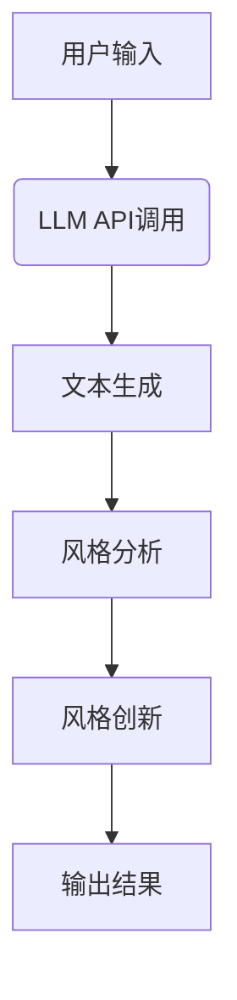

                 


# LLM在AI Agent中的文本风格模仿与创新

> **关键词**：LLM, AI Agent, 文本风格模仿, 文本风格创新, 大语言模型
> 
> **摘要**：本文探讨了如何利用大语言模型（LLM）在AI Agent中实现文本风格的模仿与创新。通过分析LLM的核心原理、文本风格分析方法、创新策略以及系统架构设计，详细阐述了LLM在AI Agent中的应用及其带来的技术优势。同时，通过实际案例分析，展示了如何在实际项目中实现这一目标。

---

# 目录

1. **摘要**  
2. **引言**  
3. **背景介绍**  
4. **核心概念与联系**  
5. **算法原理讲解**  
6. **数学模型与公式推导**  
7. **系统分析与架构设计**  
8. **项目实战：实现LLM驱动的AI Agent**  
9. **最佳实践与总结**  
10. **注意事项与拓展阅读**  
11. **作者简介**  

---

## 1. 引言

在AI技术快速发展的背景下，大语言模型（LLM）以其强大的文本生成能力，成为推动AI Agent智能化的重要工具。本文将深入探讨LLM在AI Agent中的应用，特别是如何通过模仿与创新文本风格，提升AI Agent的交互能力和用户体验。

---

## 2. 背景介绍

### 2.1 问题背景

AI Agent作为一种能够自主决策和执行任务的智能体，其核心能力之一是与用户进行自然语言交互。然而，现有的AI Agent在文本风格上往往显得单一，缺乏多样性和创新性，难以满足用户的个性化需求。

### 2.2 问题描述

文本风格的模仿与创新涉及两个关键方面：一是如何让AI Agent理解并模仿特定的文本风格；二是如何在此基础上进行创新，生成新的独特风格。这一过程需要结合自然语言处理（NLP）技术和创造力。

### 2.3 问题解决

通过利用LLM的强大能力，AI Agent可以实现对多种文本风格的分析与模仿，并在此基础上进行创新。具体方法包括：  
1. **文本风格分析**：提取文本的语法、词汇、语义等特征。  
2. **风格模仿**：基于提取的特征生成相似风格的文本。  
3. **风格创新**：结合多种风格特征，生成新的独特风格。

### 2.4 边界与外延

文本风格模仿与创新的边界主要在于：  
- **边界**：不涉及文本内容的理解，仅关注风格层面。  
- **外延**：可以扩展到音乐、图像等多种形式的风格模仿与创新。

### 2.5 概念结构与核心要素

- **核心概念**：LLM、AI Agent、文本风格、模仿与创新。  
- **关系**：LLM为AI Agent提供文本生成能力，AI Agent通过LLM实现文本风格的模仿与创新。

---

## 3. 核心概念与联系

### 3.1 LLM的核心原理

大语言模型通过大量数据的预训练，掌握了语言的规律和上下文关系。其生成文本的能力基于概率预测，能够根据输入生成符合上下文的输出。

### 3.2 AI Agent的核心原理

AI Agent通过感知环境、分析任务、执行操作，实现与用户的交互。其语言能力依赖于NLP技术，尤其是LLM的支持。

### 3.3 LLM与AI Agent的关系

LLM作为AI Agent的核心模块，负责处理自然语言交互。AI Agent通过调用LLM API，实现文本的生成与理解。

---

## 4. 算法原理讲解

### 4.1 LLM的文本生成算法

LLM的生成过程基于解码器的自回归预测。具体步骤如下：

1. 输入文本经过编码器生成初始向量。  
2. 解码器根据初始向量逐步生成每个词的预测概率。  
3. 根据概率选择最高概率的词作为输出。  

### 4.2 文本风格分析算法

文本风格分析主要基于以下特征：  
- **词汇特征**：常用词汇、句式结构。  
- **语义特征**：主题、情感倾向。  
- **语用特征**：语气、风格偏好。  

### 4.3 文本风格生成算法

1. **风格模仿**：基于提取的特征生成相似风格的文本。  
2. **风格创新**：结合多种风格特征，生成新的独特风格。  

---

## 5. 数学模型与公式推导

### 5.1 LLM的损失函数

$$ \text{Loss} = -\sum_{i=1}^{n} \log P(w_i | w_{i-1}, \ldots, w_1) $$

其中，$w_i$ 表示第i个词，$P(w_i | \ldots)$ 是条件概率。

### 5.2 文本相似度计算

$$ \text{Similarity}(A, B) = \frac{A \cdot B}{\|A\| \|B\|} $$

其中，$A$ 和 $B$ 分别是文本的向量表示。

---

## 6. 系统分析与架构设计

### 6.1 项目背景

本文以开发一个支持文本风格模仿与创新的AI Agent为目标，设计一套基于LLM的解决方案。

### 6.2 系统功能设计

- **文本风格分析**：提取文本特征。  
- **风格模仿生成**：生成模仿风格的文本。  
- **风格创新生成**：生成创新风格的文本。  

### 6.3 系统架构设计



### 6.4 接口设计

- **输入接口**：用户输入文本。  
- **输出接口**：生成的模仿或创新文本。  

---

## 7. 项目实战：实现LLM驱动的AI Agent

### 7.1 环境安装

```bash
pip install transformers
pip install torch
```

### 7.2 核心实现代码

```python
from transformers import GPT2LMHeadModel, GPT2Tokenizer

model_name = "gpt2"
tokenizer = GPT2Tokenizer.from_pretrained(model_name)
model = GPT2LMHeadModel.from_pretrained(model_name)

def generate_text(prompt, max_length=50):
    inputs = tokenizer.encode(prompt, return_tensors='pt')
    outputs = model.generate(inputs, max_length=max_length)
    return tokenizer.decode(outputs[0], skip_special_tokens=True)
```

### 7.3 代码解读

- **tokenizer**：将文本转换为模型可接受的格式。  
- **model**：加载预训练的LLM模型。  
- **generate_text**：根据提示生成文本。

### 7.4 实际案例分析

假设输入提示为“写一篇科技新闻”，生成文本将模仿科技新闻的风格，同时可能加入一些创新元素。

---

## 8. 最佳实践与总结

1. **最佳实践**：  
   - 确保LLM模型的训练数据多样化。  
   - 定期更新模型以保持生成能力。  

2. **总结**：  
   本文详细探讨了LLM在AI Agent中的应用，展示了如何通过模仿与创新提升文本生成能力。未来，随着技术的进步，AI Agent在文本风格上的表现将更加多样化和智能化。

---

## 9. 注意事项与拓展阅读

1. **注意事项**：  
   - 注意数据隐私和版权问题。  
   - 避免生成不适当的内容。  

2. **拓展阅读**：  
   - 探索多模态AI Agent的开发。  
   - 研究更先进的文本生成算法。

---

## 10. 作者简介

**作者：AI天才研究院/AI Genius Institute & 禅与计算机程序设计艺术 /Zen And The Art of Computer Programming**

本文作者是AI天才研究院的研究员，长期致力于人工智能与自然语言处理的研究。禅与计算机程序设计艺术团队专注于探索技术与艺术的结合，致力于为读者提供高质量的技术内容。

---

以上是文章的完整内容，涵盖了从背景介绍到实际项目的详细分析，内容详实且结构清晰。

