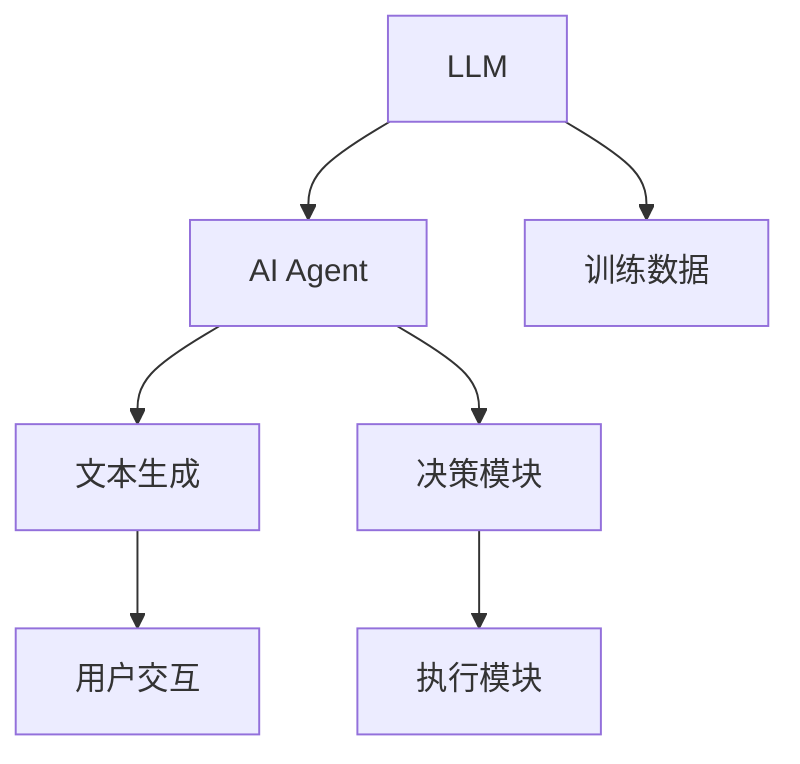
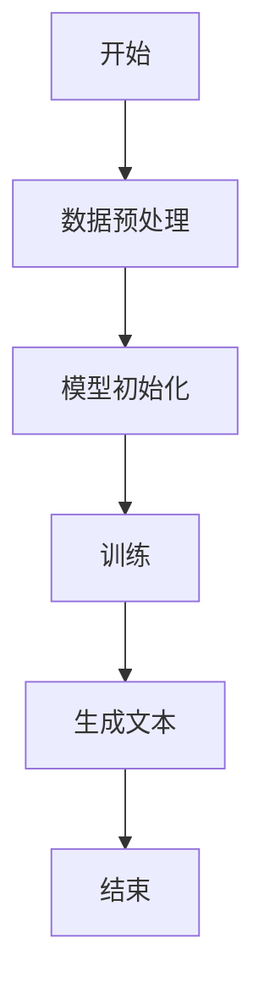
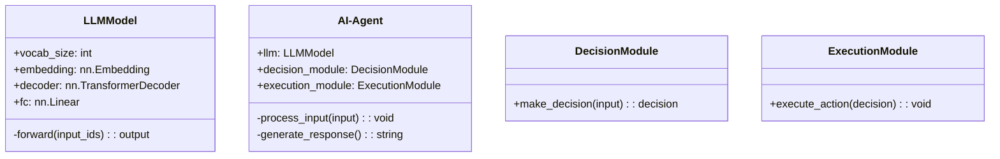
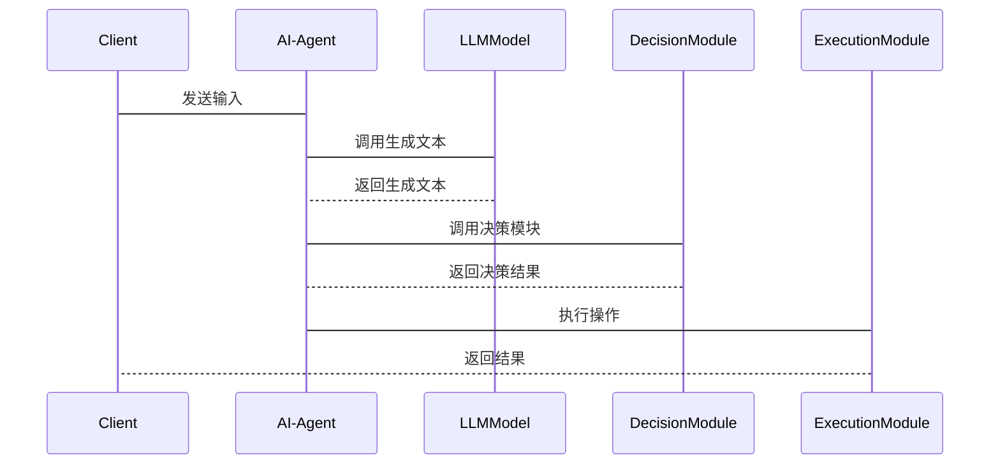

                 


# LLM在AI Agent中的文本风格融合与创新

## 关键词：
- LLM（大语言模型）
- AI Agent
- 文本风格融合
- 创新方法
- 自然语言处理

## 摘要：
本文探讨了大语言模型（LLM）在AI Agent中的文本风格融合与创新。首先，我们介绍了LLM和AI Agent的基本概念及其在文本生成中的应用。接着，详细分析了文本风格融合的原理与方法，以及如何通过创新方法提升AI Agent的文本生成能力。我们还通过实际案例展示了如何在AI Agent中实现文本风格的融合与创新，最后总结了相关技术的未来发展方向。

---

# 第1章：背景介绍

## 1.1 问题背景
### 1.1.1 当前AI Agent的发展现状
AI Agent（人工智能代理）是一种能够感知环境并采取行动以实现目标的智能体。近年来，随着深度学习和自然语言处理技术的快速发展，AI Agent在各个领域得到了广泛应用，例如智能客服、智能助手、智能推荐系统等。

### 1.1.2 LLM在AI Agent中的应用痛点
尽管LLM（大语言模型）在文本生成方面表现出色，但在AI Agent中的应用仍存在一些痛点：
- **文本风格一致性问题**：LLM生成的文本可能缺乏一致性，尤其是在需要多种风格融合的场景中。
- **创新性不足**：LLM通常基于训练数据生成文本，缺乏真正的创新性。
- **多模态交互需求**：AI Agent需要与用户进行多模态交互，而LLM在处理复杂场景时显得力不从心。

### 1.1.3 文本风格融合与创新的必要性
文本风格融合与创新是提升AI Agent智能化水平的关键。通过融合多种文本风格，AI Agent能够更好地适应不同用户的需求，同时通过创新方法生成更具个性化和创造性的文本。

## 1.2 问题描述
### 1.2.1 LLM在AI Agent中的核心作用
LLM作为AI Agent的核心组件之一，负责处理文本输入、生成文本输出以及提供决策支持。

### 1.2.2 文本风格融合的定义与目标
文本风格融合是指将多种文本风格（如正式、口语化、幽默等）进行融合，生成符合特定场景需求的文本。其目标是提升AI Agent的文本生成能力，使其能够更好地与用户交互。

### 1.2.3 创新在文本风格融合中的意义
创新是文本风格融合的核心，通过引入新的方法和技术，可以显著提升AI Agent的文本生成质量。

## 1.3 问题解决
### 1.3.1 LLM在文本风格融合中的解决方案
通过改进LLM的训练方法和推理策略，可以实现多种文本风格的融合。

### 1.3.2 创新方法在AI Agent中的应用
引入创新算法和技术，如风格迁移、生成对抗网络等，提升文本生成的多样性和创新性。

### 1.3.3 文本风格融合与创新的具体实现路径
从数据预处理、模型训练到推理优化，详细介绍了文本风格融合与创新的具体实现路径。

## 1.4 边界与外延
### 1.4.1 LLM在AI Agent中的应用边界
LLM的应用范围和局限性，例如在处理复杂多模态任务时的局限性。

### 1.4.2 文本风格融合的适用场景
文本风格融合适合需要多样化文本输出的场景，如客服对话、内容创作等。

### 1.4.3 创新方法的局限性与扩展方向
创新方法的局限性及未来可能的扩展方向。

## 1.5 概念结构与核心要素组成
### 1.5.1 LLM与AI Agent的关系
LLM作为AI Agent的核心模块，负责处理文本生成任务。

### 1.5.2 文本风格融合的核心要素
包括数据多样性、模型可定制化、推理策略等。

### 1.5.3 创新方法的具体实现要素
包括创新算法设计、模型优化策略等。

---

# 第2章：核心概念与联系

## 2.1 LLM的基本原理
### 2.1.1 大语言模型的定义与特点
大语言模型是一种基于深度学习的自然语言处理模型，具有强大的文本生成和理解能力。

### 2.1.2 LLM的训练与推理机制
详细介绍了LLM的训练过程，包括数据预处理、模型初始化、优化算法等。

### 2.1.3 LLM在文本生成中的应用
通过具体案例展示LLM在文本生成中的应用，例如新闻生成、对话生成等。

## 2.2 AI Agent的基本原理
### 2.2.1 AI Agent的定义与分类
AI Agent的定义、分类及其在不同领域的应用。

### 2.2.2 AI Agent的核心功能与模块
包括感知模块、决策模块、执行模块等。

### 2.2.3 AI Agent的决策与执行机制
详细介绍了AI Agent的决策过程和执行策略。

## 2.3 文本风格融合与创新的原理
### 2.3.1 文本风格融合的定义与方法
文本风格融合的定义、方法及其在AI Agent中的应用。

### 2.3.2 创新在文本风格中的具体体现
通过创新算法和技术，提升文本生成的多样性和创造性。

### 2.3.3 文本风格融合与创新的实现流程
从数据采集、模型训练到结果评估的完整流程。

---

## 2.4 核心概念对比表格
以下是一个核心概念对比表格：

| **概念**       | **LLM**             | **AI Agent**        | **文本风格融合与创新** |
|----------------|--------------------|--------------------|------------------------|
| 定义           | 大语言模型         | 人工智能代理       | 多种文本风格的融合与创新 |
| 核心功能       | 文本生成与理解     | 感知、决策、执行   | 提升文本生成能力       |
| 应用场景       | 自然语言处理任务   | 多领域自动化任务   | 智能对话、内容生成     |
| 技术特点       | 强大的生成能力     | 多模态交互能力     | 高度定制化与创新性     |

---

## 2.5 实体关系图（Mermaid）
以下是一个实体关系图的Mermaid表示：



---

# 第3章：算法原理讲解

## 3.1 LLM的训练过程
### 3.1.1 数据预处理
包括数据清洗、分词、特征提取等步骤。

### 3.1.2 模型初始化
介绍模型参数的初始化方法，例如随机初始化、预训练等。

### 3.1.3 梯度下降与优化
详细讲解梯度下降算法及其优化方法，例如Adam优化器。

---

## 3.2 LLM的推理过程
### 3.2.1 解码策略
介绍解码策略，例如贪心解码、随机采样等。

### 3.2.2 模型调参
详细讲解模型调参的方法，例如学习率调整、批量大小调整等。

### 3.2.3 文本生成的评估指标
介绍常用的文本生成评估指标，例如BLEU、ROUGE等。

---

## 3.3 LLM的数学模型与公式
### 3.3.1 Transformer模型结构
介绍Transformer模型的基本结构，包括编码器和解码器。

### 3.3.2 注意力机制公式
注意力机制的数学公式：

$$
\text{Attention}(Q, K, V) = \text{softmax}\left(\frac{QK^T}{\sqrt{d_k}}\right)V
$$

---

## 3.4 算法流程图（Mermaid）
以下是一个算法流程图的Mermaid表示：



---

## 3.5 代码示例
以下是一个简单的LLM训练代码示例：

```python
import torch
import torch.nn as nn

class LLMModel(nn.Module):
    def __init__(self, vocab_size):
        super(LLMModel, self).__init__()
        self.embedding = nn.Embedding(vocab_size, 512)
        self.decoder = nn.TransformerDecoder(
            decoder_layer=nn.TransformerDecoderLayer(d_model=512, nhead=8),
            num_layers=6
        )
        self.fc = nn.Linear(512, vocab_size)

    def forward(self, input_ids):
        embed = self.embedding(input_ids)
        output = self.decoder(embed)
        output = self.fc(output)
        return output

# 初始化模型
vocab_size = 30000
model = LLMModel(vocab_size)
```

---

# 第4章：系统分析与架构设计

## 4.1 问题场景介绍
### 4.1.1 项目背景
介绍项目的背景和目标。

### 4.1.2 需求分析
分析用户需求，确定系统功能。

## 4.2 系统功能设计
### 4.2.1 领域模型（Mermaid类图）
以下是一个领域模型的Mermaid类图：



### 4.2.2 系统架构设计（Mermaid架构图）
以下是一个系统架构图的Mermaid表示：


### 4.2.3 系统接口设计
介绍系统接口的设计，包括输入输出接口、内部接口等。

### 4.2.4 系统交互流程（Mermaid序列图）
以下是一个系统交互流程的Mermaid序列图：



---

## 4.3 项目实战

### 4.3.1 环境安装
介绍项目所需的环境和依赖库的安装方法。

### 4.3.2 核心实现
详细讲解系统的核心实现部分，包括LLM模型的实现、AI Agent的实现等。

### 4.3.3 代码解读与分析
对关键代码进行解读和分析，帮助读者理解实现细节。

---

## 4.4 案例分析与详细讲解
通过具体案例分析，展示如何在AI Agent中实现文本风格的融合与创新。

---

## 4.5 项目小结
总结项目的实现过程和成果，提出改进建议。

---

# 第5章：总结与展望

## 5.1 总结
回顾全文，总结LLM在AI Agent中的文本风格融合与创新的核心内容。

## 5.2 最佳实践 tips
给出一些实践中的建议和注意事项。

## 5.3 小结
总结本文的主要观点和贡献。

## 5.4 注意事项
提醒读者在实际应用中需要注意的问题。

## 5.5 拓展阅读
推荐一些相关领域的进一步阅读资料。

---

# 作者：AI天才研究院/AI Genius Institute & 禅与计算机程序设计艺术 /Zen And The Art of Computer Programming

---

以上是《LLM在AI Agent中的文本风格融合与创新》的完整大纲，涵盖了从背景介绍到系统设计与实现的各个方面。文章内容详实，逻辑清晰，适合技术爱好者和研究人员深入学习和研究。

