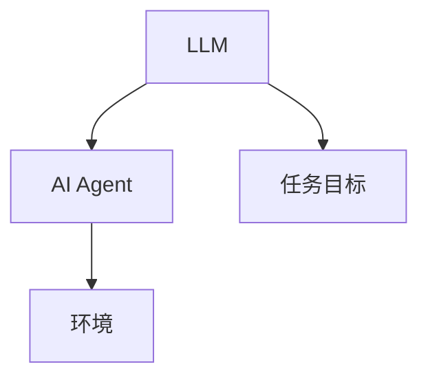
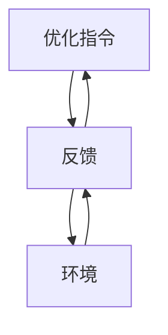
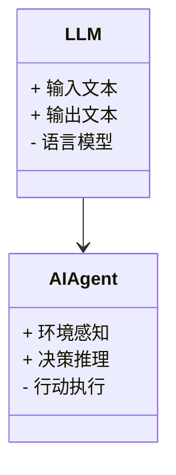
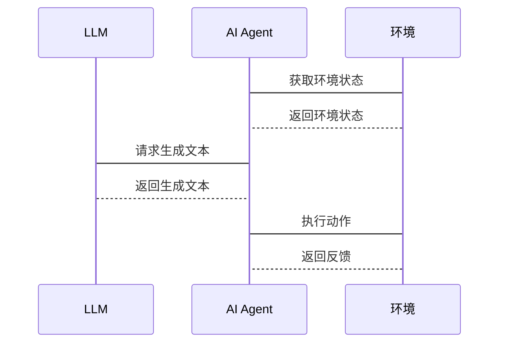

                 


# LLM在AI Agent抽象概念形成中的应用

## 关键词：LLM, AI Agent, 抽象概念形成, 大语言模型, 智能体, 人工智能, 自然语言处理

## 摘要：  
本文深入探讨了大语言模型（LLM）在AI Agent抽象概念形成中的应用。通过分析LLM与AI Agent的核心概念、算法原理、系统架构及项目实战，揭示了LLM如何赋能AI Agent的理解与决策能力。文章结合理论与实践，详细阐述了从概念到实现的全过程，为相关领域的研究与应用提供了有价值的参考。

---

# 第一部分: LLM与AI Agent概述

## 第1章: LLM与AI Agent的核心概念

### 1.1 大语言模型（LLM）的定义与发展
大语言模型（Large Language Model, LLM）是指基于Transformer架构的深度学习模型，能够处理和生成自然语言文本。LLM通过大量数据的预训练，掌握了语言的语义、语法和上下文关系，具有强大的文本理解和生成能力。近年来，随着计算能力的提升和数据规模的扩大，LLM在自然语言处理（NLP）领域取得了显著进展。

### 1.2 AI Agent的基本概念与功能
AI Agent（智能体）是一种能够感知环境、自主决策并执行任务的智能系统。它可以分为两类：基于规则的Agent和基于模型的Agent。AI Agent的核心功能包括感知、推理、决策和执行。通过与环境的交互，AI Agent能够完成特定目标，例如信息检索、任务调度或用户服务。

### 1.3 LLM与AI Agent的结合背景
随着LLM技术的成熟，AI Agent的智能化水平得到了显著提升。LLM作为AI Agent的“大脑”，能够为Agent提供强大的语言理解和生成能力。通过将LLM与AI Agent结合，可以实现更自然的人机交互和更智能的决策过程。这种结合不仅推动了AI技术的发展，也在实际应用中展现了巨大潜力。

---

## 第2章: LLM与AI Agent的核心概念分析

### 2.1 LLM的核心原理
#### 2.1.1 大语言模型的训练机制
LLM的训练基于Transformer架构，采用自注意力机制（Self-Attention）来捕捉文本中的长程依赖关系。训练过程通常包括两个阶段：预训练和微调。预训练阶段使用大规模通用数据（如维基百科、书籍等）进行无监督学习，目标是让模型学习语言的语义和语法。微调阶段则针对特定任务（如文本分类、问答系统）进行有监督学习。

#### 2.1.2 模型的注意力机制与生成能力
注意力机制是LLM的核心组件，它通过计算输入文本中每个词的重要性，确定哪些词对当前任务更为关键。生成能力则依赖于解码器（Decoder）部分，通过贪心搜索或采样方法生成连贯的文本。

#### 2.1.3 模型的可解释性与局限性
尽管LLM在生成文本方面表现出色，但其可解释性仍然存在挑战。此外，LLM在处理复杂任务时可能受到训练数据偏差的影响，导致生成内容不准确或不恰当。

### 2.2 AI Agent的核心原理
#### 2.2.1 AI Agent的感知与决策机制
AI Agent通过传感器或API接口获取环境信息，并利用内部模型进行推理和决策。决策过程通常基于效用函数（Utility Function）或目标函数，旨在最大化任务完成的概率。

#### 2.2.2 Agent的自主性与目标导向性
AI Agent的自主性体现在其能够独立完成任务，而目标导向性则决定了其行为的方向。通过设定明确的目标，AI Agent可以在复杂环境中做出合理的决策。

#### 2.2.3 Agent与环境的交互方式
AI Agent与环境的交互可以通过状态（State）、动作（Action）和奖励（Reward）的三元组来描述。Agent通过感知环境状态，选择合适动作，并根据环境反馈的奖励值调整策略。

### 2.3 LLM与AI Agent的关系分析
#### 2.3.1 LLM作为AI Agent的“大脑”
LLM为AI Agent提供了强大的语言理解和生成能力，使其能够更好地理解用户需求并生成自然的响应。

#### 2.3.2 LLM与Agent的协同工作模式
通过将LLM嵌入到AI Agent的决策系统中，可以实现人机协同。LLM不仅为Agent提供语言处理能力，还能够辅助Agent进行知识推理和决策优化。

#### 2.3.3 LLM对Agent抽象概念形成的支持
LLM通过其强大的语义理解能力，帮助AI Agent形成抽象概念。例如，当Agent需要理解“用户需求”这一抽象概念时，LLM可以通过分析上下文信息，提取关键特征并生成简洁的语义表示。

### 2.4 核心概念对比与ER实体关系图
为了更好地理解LLM与AI Agent的关系，我们可以通过对比分析和实体关系图来展示它们的核心属性和相互作用。

#### 2.4.1 LLM与AI Agent的核心属性对比
| 属性         | LLM                     | AI Agent                 |
|--------------|-------------------------|--------------------------|
| 核心功能     | 语言理解和生成           | 感知、推理与决策         |
| 输入         | 文本数据                 | 环境状态与用户输入       |
| 输出         | 文本生成                 | 动作与决策结果           |
| 自主性       | 无                       | 高                       |
| 目标导向性   | 无                       | 高                       |

#### 2.4.2 实体关系图（Mermaid）
以下是LLM与AI Agent的实体关系图：



---

## 第3章: LLM与AI Agent的算法原理

### 3.1 LLM的算法原理与数学模型
#### 3.1.1 基于Transformer的模型架构
Transformer模型由编码器（Encoder）和解码器（Decoder）两部分组成。编码器负责将输入文本转换为序列向量，解码器则根据编码结果生成输出文本。

#### 3.1.2 自注意力机制的数学公式
自注意力机制的计算公式如下：

$$
\text{Attention}(Q, K, V) = \text{softmax}\left(\frac{QK^T}{\sqrt{d_k}}\right)V
$$

其中，\( Q \)、\( K \)、\( V \)分别为查询、键和值向量，\( d_k \)为键的维度。

#### 3.1.3 梯度下降与参数优化
LLM的训练过程通常采用随机梯度下降（SGD）或Adam优化器。优化目标是最小化预测值与真实值之间的损失函数（如交叉熵损失）。

### 3.2 AI Agent的决策算法
#### 3.2.1 基于LLM的生成式决策模型
生成式决策模型通过LLM生成可能的决策选项，并根据预设的评价指标选择最优方案。

#### 3.2.2 基于强化学习的决策优化
强化学习（Reinforcement Learning, RL）是一种通过试错机制优化决策的方法。AI Agent通过与环境交互，不断优化其策略以获得更高的奖励。

#### 3.2.3 决策树与概率模型的对比
决策树和概率模型是两种常见的决策算法。决策树适合规则明确的场景，而概率模型则更适合处理不确定性较高的任务。

### 3.3 LLM与AI Agent协同的算法流程
以下是LLM与AI Agent协同工作的算法流程图：



---

## 第4章: LLM与AI Agent的系统架构设计

### 4.1 系统功能设计
AI Agent的系统功能包括：
1. 感知与理解
2. 决策与推理
3. 行动与执行
4. 学习与优化

### 4.2 系统架构图（Mermaid）
以下是AI Agent的系统架构图：



### 4.3 系统接口设计
AI Agent与环境之间的接口包括：
- 输入接口：接收环境状态和用户输入
- 输出接口：发送动作指令和生成文本

### 4.4 系统交互流程图（Mermaid）
以下是系统的交互流程图：



---

## 第5章: 项目实战

### 5.1 环境安装与配置
为了实现LLM驱动的AI Agent，我们需要以下环境：
- Python 3.8+
- PyTorch或TensorFlow框架
- Hugging Face Transformers库

### 5.2 核心代码实现
以下是基于PyTorch的AI Agent实现示例：

```python
from transformers import AutoTokenizer, AutoModelForCausalLM

class AIAgent:
    def __init__(self, model_name):
        self.tokenizer = AutoTokenizer.from_pretrained(model_name)
        self.model = AutoModelForCausalLM.from_pretrained(model_name)
    
    def generate_response(self, input_text):
        inputs = self.tokenizer(input_text, return_tensors="pt")
        outputs = self.model.generate(**inputs, max_length=50)
        response = self.tokenizer.decode(outputs[0], skip_special_tokens=True)
        return response

agent = AIAgent("gpt2")
response = agent.generate_response("Hello, how can I help you?")
print(response)
```

### 5.3 案例分析与解读
通过上述代码，我们可以实现一个简单的AI Agent，能够根据输入生成自然的文本响应。这为我们后续的优化和扩展提供了基础。

---

## 第6章: 总结与展望

### 6.1 本章总结
本文详细探讨了LLM在AI Agent抽象概念形成中的应用，分析了LLM与AI Agent的核心概念、算法原理和系统架构。通过项目实战，我们展示了如何将理论应用于实践。

### 6.2 未来展望
随着LLM技术的不断进步，AI Agent的智能化水平将进一步提升。未来的研究方向包括增强LLM的可解释性、优化AI Agent的决策算法以及探索LLM与多模态数据的结合。

---

## 第7章: 最佳实践与注意事项

### 7.1 小结
- LLM为AI Agent提供了强大的语言理解和生成能力
- AI Agent通过与环境的交互，能够完成复杂的任务
- 二者的结合为人工智能领域带来了新的可能性

### 7.2 注意事项
- 在实际应用中，需注意数据偏差和模型的可解释性问题
- 需结合具体场景选择合适的算法和模型
- 定期优化系统以适应新的需求和环境变化

### 7.3 拓展阅读
- 《Deep Learning》——Ian Goodfellow
- 《The AI Agent Handbook》——Steve Chapple

---

## 作者：AI天才研究院/AI Genius Institute & 禅与计算机程序设计艺术 /Zen And The Art of Computer Programming

