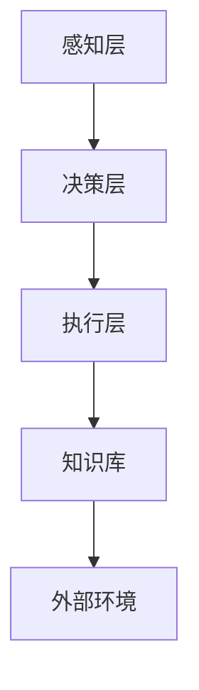
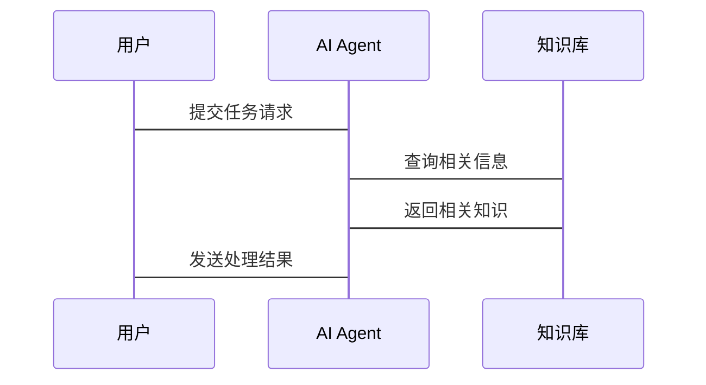

                 


# LLM在AI Agent抽象概念操作中的应用

> 关键词：LLM, AI Agent, 抽象概念操作, 人工智能, 智能体技术

> 摘要：本文深入探讨了大语言模型（LLM）在AI Agent中的应用，特别是如何通过抽象概念操作实现智能体的功能优化与创新。文章从背景、原理、算法、系统架构等多个维度展开分析，结合实际案例，详细阐述了LLM与AI Agent的结合方式、技术实现及未来发展方向。

---

## 第1章: 背景介绍

### 1.1 问题背景

#### 1.1.1 人工智能与智能体技术的发展
人工智能（AI）技术的快速发展，使得智能体（AI Agent）在各个领域的应用越来越广泛。智能体是一种能够感知环境、自主决策并执行任务的实体，它可以是一个软件程序、机器人或任何具备智能行为的系统。

#### 1.1.2 大语言模型的崛起
大语言模型（LLM，Large Language Model）是近年来人工智能领域的重要突破之一。LLM通过深度学习技术，能够理解并生成人类语言，具备强大的自然语言处理能力。其核心在于通过大量数据的训练，掌握了语言的规律和语义关系。

#### 1.1.3 LLM与AI Agent的结合趋势
随着LLM技术的成熟，越来越多的研究开始关注如何将LLM应用于AI Agent中。LLM的强大语言理解和生成能力，为AI Agent的抽象概念操作提供了新的可能性。

---

### 1.2 问题描述

#### 1.2.1 AI Agent的核心功能与挑战
AI Agent的核心功能包括感知环境、理解任务目标、进行推理与决策、执行操作等。然而，如何在复杂环境中实现高效的抽象概念操作，是当前AI Agent技术面临的重要挑战。

#### 1.2.2 LLM在AI Agent中的作用
LLM通过其强大的语言处理能力，可以帮助AI Agent更好地理解任务需求、进行语义分析和生成合理的操作步骤。LLM的引入，使得AI Agent在处理复杂任务时更加智能化和高效。

#### 1.2.3 抽象概念操作的定义与意义
抽象概念操作是指AI Agent在处理任务时，能够将具体的问题转化为抽象的概念表示，并在概念空间中进行操作。这种能力使得AI Agent能够更好地理解任务的本质，从而做出更合理的决策。

---

### 1.3 问题解决

#### 1.3.1 LLM如何实现抽象概念操作
通过LLM的自然语言处理能力，AI Agent可以将具体的问题描述转化为抽象的概念表示。例如，将“预约医生”转化为“医疗预约服务”的概念。

#### 1.3.2 AI Agent中的概念表示与推理
AI Agent需要将抽象概念表示为某种形式的知识结构，并通过推理能力进行概念间的关联分析，从而得出合理的操作步骤。

#### 1.3.3 抽象概念操作的具体应用场景
在实际应用中，抽象概念操作可以用于任务规划、语义理解、知识推理等多个方面。例如，在智能客服系统中，AI Agent可以通过抽象概念操作快速理解用户需求并生成解决方案。

---

### 1.4 边界与外延

#### 1.4.1 LLM在AI Agent中的能力边界
尽管LLM在语言处理方面表现出色，但在处理复杂逻辑推理和具体操作时仍存在局限性。因此，AI Agent需要结合其他技术（如知识图谱、规则引擎）来弥补LLM的不足。

#### 1.4.2 抽象概念操作的适用范围
抽象概念操作适用于需要高度语义理解的任务，但不适用于需要精确逻辑推理或具体操作的场景。例如，在需要精确数学计算的任务中，抽象概念操作可能并不适用。

#### 1.4.3 LLM与AI Agent结合的未来发展
未来，随着LLM技术的不断进步和AI Agent能力的扩展，两者结合的应用场景将更加广泛。例如，在教育、医疗、金融等领域，LLM与AI Agent的结合将带来更多的创新应用。

---

### 1.5 核心概念结构与组成

#### 1.5.1 LLM的基本组成
- **输入层**：接收原始文本输入。
- **编码层**：将输入文本转化为向量表示。
- **解码层**：根据向量表示生成输出文本。
- **训练层**：通过监督学习或无监督学习优化模型参数。

#### 1.5.2 AI Agent的结构与功能
- **感知层**：通过传感器或输入接口获取环境信息。
- **决策层**：基于感知信息进行推理与决策。
- **执行层**：根据决策结果执行具体操作。
- **学习层**：通过经验不断优化自身能力。

#### 1.5.3 抽象概念操作的核心要素
- **概念表示**：将具体问题转化为抽象概念。
- **概念推理**：在概念空间中进行逻辑推理。
- **概念操作**：基于推理结果执行具体操作。

---

## 第2章: 核心概念与联系

### 2.1 LLM的基本原理

#### 2.1.1 LLM的训练机制
- **监督学习**：通过标注数据进行模型训练。
- **无监督学习**：通过大量未标注数据进行自监督学习。
- **强化学习**：通过奖励机制优化模型输出。

#### 2.1.2 LLM的输入输出机制
- **输入**：原始文本或用户指令。
- **输出**：生成的文本或操作指令。

#### 2.1.3 LLM的上下文理解能力
- **上下文感知**：通过上下文信息理解语义。
- **多轮对话**：通过对话历史进行推理。

---

### 2.2 AI Agent的基本原理

#### 2.2.1 AI Agent的目标与决策机制
- **目标设定**：明确AI Agent的任务目标。
- **决策推理**：基于当前状态和目标进行决策。
- **策略选择**：选择最优策略以实现目标。

#### 2.2.2 AI Agent与环境的交互方式
- **输入输出接口**：与外部环境进行信息交互。
- **状态更新**：根据环境反馈更新内部状态。
- **动作执行**：根据决策结果执行具体动作。

---

### 2.3 抽象概念操作的原理

#### 2.3.1 抽象概念的定义与特征
- **定义**：抽象概念是对具体事物的概括和总结。
- **特征**：抽象概念通常不具备具体形态，但具有较强的语义关联性。

#### 2.3.2 抽象概念的操作过程
- **概念提取**：从具体问题中提取抽象概念。
- **概念关联**：分析概念之间的关联关系。
- **概念操作**：基于关联关系进行推理和决策。

---

### 2.4 核心概念的联系

#### 2.4.1 LLM如何赋能AI Agent
- **语义理解**：通过LLM理解用户需求。
- **任务规划**：通过LLM生成任务执行步骤。
- **知识推理**：通过LLM进行知识推理和概念关联。

#### 2.4.2 LLM与AI Agent的协同工作
- **协同模式**：LLM作为AI Agent的核心模块，负责语义理解和知识推理。
- **数据共享**：AI Agent通过LLM获取知识库中的信息。
- **任务分工**：AI Agent负责具体操作，LLM负责语义分析和知识推理。

---

## 第3章: 算法原理讲解

### 3.1 LLM的训练流程

#### 3.1.1 数据预处理
- **清洗数据**：去除噪声数据，保留高质量文本。
- **分词处理**：将文本切分为词汇或短语。
- **向量化**：将文本转化为向量表示。

#### 3.1.2 模型训练
- **编码器训练**：训练模型将输入文本转化为向量表示。
- **解码器训练**：训练模型根据向量表示生成输出文本。
- **联合训练**：同时训练编码器和解码器，优化整体性能。

---

### 3.2 AI Agent的决策算法

#### 3.2.1 状态表示
- **状态空间**：表示当前环境的状态。
- **状态表示方法**：使用向量、符号或知识图谱表示状态。

#### 3.2.2 动作选择
- **动作空间**：所有可能执行的动作。
- **动作选择算法**：基于当前状态选择最优动作。

#### 3.2.3 状态更新
- **状态转移**：根据执行的动作更新环境状态。
- **反馈机制**：根据环境反馈调整决策策略。

---

### 3.3 抽象概念操作的算法实现

#### 3.3.1 概念提取
- **关键词提取**：从文本中提取关键概念。
- **主题建模**：通过主题模型提取文本主题。

#### 3.3.2 概念关联
- **语义网络构建**：构建概念之间的语义网络。
- **关联规则挖掘**：挖掘概念之间的关联规则。

#### 3.3.3 概念操作
- **逻辑推理**：基于概念关联进行逻辑推理。
- **决策生成**：根据推理结果生成具体操作指令。

---

## 第4章: 系统分析与架构设计

### 4.1 系统功能设计

#### 4.1.1 领域模型设计
- **领域模型**：AI Agent在特定领域的知识表示模型。
- **模型设计方法**：基于知识图谱或语义网络构建领域模型。

#### 4.1.2 系统架构设计
- **分层架构**：感知层、决策层、执行层。
- **模块化设计**：功能模块化，便于维护和扩展。

#### 4.1.3 接口设计
- **输入接口**：接收外部输入数据。
- **输出接口**：输出决策结果或操作指令。

---

### 4.2 系统架构图



---

### 4.3 系统交互流程



---

## 第5章: 项目实战

### 5.1 环境安装

#### 5.1.1 安装Python
```bash
# 安装Python
sudo apt-get install python3
```

#### 5.1.2 安装LLM框架
```bash
# 安装Transformers库
pip install transformers
```

---

### 5.2 核心代码实现

#### 5.2.1 LLM模型实现
```python
from transformers import AutoTokenizer, AutoModelForCausalLM

model_name = "gpt2"
tokenizer = AutoTokenizer.from_pretrained(model_name)
model = AutoModelForCausalLM.from_pretrained(model_name)
```

#### 5.2.2 AI Agent实现
```python
class AIAgent:
    def __init__(self, model, tokenizer):
        self.model = model
        self.tokenizer = tokenizer

    def generate_response(self, input_text):
        inputs = self.tokenizer.encode(input_text, return_tensors="pt")
        outputs = self.model.generate(inputs, max_length=100)
        response = self.tokenizer.decode(outputs[0], skip_special_tokens=True)
        return response
```

---

### 5.3 代码解读与分析

#### 5.3.1 LLM模型实现
- **Tokenizer**：将输入文本转化为模型可理解的向量表示。
- **Model**：生成对应的输出文本。

#### 5.3.2 AI Agent实现
- **初始化**：加载预训练好的LLM模型和tokenizer。
- **生成响应**：将输入文本转化为向量表示，通过模型生成响应文本。

---

### 5.4 案例分析

#### 5.4.1 智能客服场景
- **用户输入**：我需要预约医生。
- **模型处理**：生成预约医生的具体步骤。

#### 5.4.2 投资顾问场景
- **用户输入**：我想投资科技公司。
- **模型处理**：生成投资建议和相关分析。

---

## 第6章: 总结与展望

### 6.1 最佳实践

#### 6.1.1 技术实现
- **模型优化**：通过微调等方式优化LLM模型性能。
- **知识库构建**：构建领域知识库，提升AI Agent的理解能力。

#### 6.1.2 应用场景
- **智能化客服**：提升用户体验。
- **智能投资顾问**：提供个性化投资建议。
- **教育辅助工具**：帮助学生学习和解决问题。

---

### 6.2 小结

本文详细探讨了LLM在AI Agent中的应用，特别是抽象概念操作的具体实现。通过理论分析和实践案例，展示了LLM如何赋能AI Agent，提升其智能化水平。

---

### 6.3 注意事项

- **数据隐私**：在实际应用中，需注意数据隐私和安全问题。
- **模型性能**：需根据具体任务选择合适的模型和参数设置。
- **用户体验**：优化用户交互界面，提升用户体验。

---

### 6.4 拓展阅读

- **推荐书籍**：《深度学习》（Deep Learning, Ian Goodfellow等著）
- **推荐论文**：《Attention Is All You Need》
- **推荐博客**：Towards Data Science

---

## 作者

作者：AI天才研究院/AI Genius Institute & 禅与计算机程序设计艺术 /Zen And The Art of Computer Programming

