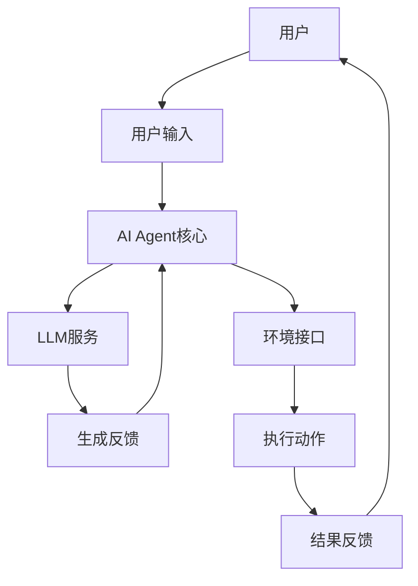

                 


# LLM在AI Agent概念形成与抽象中的作用

> 关键词：大语言模型，AI Agent，概念形成，抽象，协同作用

> 摘要：本文探讨了大语言模型（LLM）在AI Agent概念形成与抽象中的关键作用，详细分析了LLM与AI Agent的核心概念、算法原理、系统架构设计以及实际应用案例。通过本篇文章，读者将深入了解如何利用LLM技术提升AI Agent的智能化水平。

---

# 第1章: 背景介绍

## 1.1 LLM与AI Agent的基本概念

### 1.1.1 大语言模型（LLM）的定义
大语言模型（Large Language Model, LLM）是指基于深度学习技术构建的自然语言处理模型，具有大规模参数量和强大的语言理解与生成能力。LLM能够通过大量数据训练，掌握语言的语义、语法和上下文关系，从而实现类似人类的对话和文本生成。

### 1.1.2 AI Agent的定义与分类
AI Agent（人工智能代理）是指能够感知环境、自主决策并执行任务的智能实体。AI Agent可以根据任务类型分为任务型Agent、对话型Agent和协作型Agent等。它们通常具备感知、推理、规划和执行的能力。

### 1.1.3 LLM与AI Agent的关系
LLM为AI Agent提供了强大的语言理解和生成能力，使得AI Agent能够更好地与人类交互、理解任务需求并生成自然语言反馈。AI Agent则为LLM提供了应用场景和决策支持，使其能够服务于实际问题的解决。

## 1.2 LLM与AI Agent的演进历程

### 1.2.1 AI Agent的历史发展
AI Agent的概念起源于20世纪70年代，早期的AI Agent主要应用于专家系统和自动推理领域。随着计算能力的提升，AI Agent逐渐融入了机器学习技术，变得更加智能化和动态化。

### 1.2.2 LLM技术的崛起
随着深度学习技术的发展，尤其是Transformer架构的提出，LLM在NLP领域取得了突破性进展。以GPT系列模型为代表，LLM的生成能力和理解能力得到了显著提升。

### 1.2.3 LLM与AI Agent的结合
近年来，AI Agent逐渐与LLM技术结合，形成了一种新的范式。LLM为AI Agent提供了强大的语言处理能力，使其能够更自然地与人类交互，同时AI Agent也为LLM提供了丰富的应用场景。

## 1.3 相关技术与背景

### 1.3.1 自然语言处理（NLP）的基础
NLP是研究如何让计算机理解和生成人类语言的学科。LLM是NLP技术的重要组成部分，能够实现文本的生成、翻译、问答等任务。

### 1.3.2 AI Agent的核心技术
AI Agent的核心技术包括感知、推理、规划和执行。感知技术帮助AI Agent获取环境信息，推理技术帮助其理解信息之间的关系，规划技术帮助其制定行动策略，执行技术则使其能够执行具体的任务。

### 1.3.3 LLM在AI Agent中的应用背景
随着LLM技术的成熟，AI Agent的应用场景变得更加广泛。LLM为AI Agent提供了强大的语言处理能力，使其能够更好地服务于教育、医疗、金融等领域。

---

# 第2章: LLM与AI Agent的核心概念

## 2.1 核心概念原理

### 2.1.1 LLM的工作原理
LLM基于Transformer架构，通过自注意力机制和前馈网络来实现文本的生成和理解。自注意力机制使得模型能够关注输入中的重要部分，从而生成相关性更高的文本。

### 2.1.2 AI Agent的行为机制
AI Agent的行为机制包括感知、决策、执行和反馈四个环节。感知阶段通过传感器或接口获取环境信息，决策阶段通过算法制定行动策略，执行阶段通过执行机构完成任务，反馈阶段通过结果评估调整行为。

### 2.1.3 LLM在AI Agent中的作用
LLM作为AI Agent的语言处理核心，负责理解和生成自然语言。它能够帮助AI Agent更好地与人类交互，理解任务需求，并生成符合上下文的反馈。

## 2.2 概念属性特征对比

| 概念 | 属性 | 特征 |
|------|------|------|
| LLM  | 输入 | 文本数据 |
|       | 输出 | 生成文本 |
|       | 能力 | 语言理解与生成 |
| AI Agent | 输入 | 环境信息 |
|          | 输出 | 行动指令 |
|          | 能力 | 感知、推理、规划 |

### 2.2.3 ER实体关系图架构
```mermaid
er
  actor: 用户
  model: LLM
  agent: AI Agent
  action: 行为
  relation: 关联
  actor -|> action: 下达指令
  action -|> agent: 执行指令
  agent -|> model: 调用模型
  model -|> action: 提供反馈
```

---

# 第3章: 算法原理讲解

## 3.1 LLM的算法原理

### 3.1.1 变压器模型（Transformer）概述
Transformer由编码器和解码器两部分组成，编码器负责将输入文本转换为向量表示，解码器负责根据编码器的输出生成目标文本。

### 3.1.2 注意力机制（Attention）
注意力机制通过计算输入序列中每个位置的重要性，使得模型能够关注输入中的关键部分。注意力机制的公式如下：

$$
\text{Attention}(Q, K, V) = \text{softmax}\left(\frac{QK^T}{\sqrt{d_k}}\right)V
$$

其中，$Q$是查询向量，$K$是键向量，$V$是值向量，$d_k$是键的维度。

### 3.1.3 梯度下降优化算法
常见的梯度下降优化算法包括随机梯度下降（SGD）和Adam优化器。Adam优化器的公式如下：

$$
m_t = \beta_1 m_{t-1} + (1 - \beta_1)g_t
$$

$$
v_t = \beta_2 v_{t-1} + (1 - \beta_2)g_t^2
$$

$$
\theta_{t} = \theta_{t-1} - \frac{\eta}{\sqrt{v_t + \epsilon}}m_t
$$

其中，$m_t$是梯度的移动平均，$v_t$是梯度平方的移动平均，$\eta$是学习率，$\epsilon$是防止除以零的常数。

## 3.2 AI Agent的算法原理

### 3.2.1 状态空间与动作空间
状态空间（S）表示环境的所有可能状态，动作空间（A）表示AI Agent在给定状态下可以执行的所有动作。

### 3.2.2 策略网络（Policy Network）
策略网络负责根据当前状态输出概率分布，选择一个动作进行执行。策略网络的输出可以表示为：

$$
\pi(a|s) = \text{softmax}(W s + b)
$$

其中，$W$和$b$是网络的参数，$s$是当前状态。

### 3.2.3 值函数（Value Function）
值函数负责评估当前状态的价值，帮助策略网络做出更优决策。值函数的输出可以表示为：

$$
V(s) = W^T \text{ReLU}(W s + b)
$$

其中，$\text{ReLU}$是激活函数，$W$和$b$是网络参数。

## 3.3 LLM与AI Agent的协同算法

### 3.3.1 模型调用流程
AI Agent根据用户输入生成指令，调用LLM生成自然语言反馈，再根据反馈调整自身行为。

### 3.3.2 行为决策机制
AI Agent结合LLM生成的反馈和环境信息，通过策略网络选择最优动作。

### 3.3.3 反馈优化
LLM根据AI Agent的反馈不断优化自身的生成策略，提高生成文本的质量。

---

# 第4章: 系统分析与架构设计方案

## 4.1 问题场景介绍
本文将设计一个基于LLM的AI Agent系统，用于帮助用户完成日常任务，如日程管理、信息查询等。

## 4.2 项目介绍

### 4.2.1 系统功能设计
系统功能包括用户输入解析、LLM调用、行为决策和结果反馈。

### 4.2.2 系统架构设计
系统架构包括用户界面、AI Agent核心、LLM服务和环境接口。



### 4.2.3 系统接口设计
系统接口包括用户输入接口、LLM调用接口和环境交互接口。

### 4.2.4 系统交互流程
用户通过输入接口下达指令，AI Agent核心解析指令，调用LLM生成反馈，根据反馈通过环境接口执行动作，并将结果反馈给用户。

---

# 第5章: 项目实战

## 5.1 环境安装

### 5.1.1 安装Python
```bash
python --version
```

### 5.1.2 安装必要的库
```bash
pip install torch transformers
```

## 5.2 系统核心实现源代码

### 5.2.1 AI Agent核心代码
```python
class AIAssistant:
    def __init__(self, model_name):
        self.model_name = model_name
        self.model = AutoModelForCausalLM.from_pretrained(model_name)
        self.tokenizer = AutoTokenizer.from_pretrained(model_name)
    
    def generate_response(self, input_text):
        inputs = self.tokenizer.encode(input_text, return_tensors="pt")
        outputs = self.model.generate(inputs, max_length=50, do_sample=True)
        response = self.tokenizer.decode(outputs[0], skip_special_tokens=True)
        return response
```

### 5.2.2 行为决策代码
```python
class BehaviorDecision:
    def __init__(self):
        self.policy_weights = torch.randn(10, 10)
    
    def decide_action(self, state):
        action_prob = torch.softmax(self.policy_weights[state, :], dim=0)
        action = torch.multinomial(action_prob, num_samples=1).item()
        return action
```

## 5.3 代码应用解读与分析
上述代码展示了如何将LLM集成到AI Agent中，AIAssistant类负责与LLM服务交互，生成自然语言反馈，BehaviorDecision类负责基于当前状态决策下一步动作。

---

# 第6章: 最佳实践与小结

## 6.1 最佳实践 tips
1. 在实际应用中，建议根据具体场景调整LLM的调用频率和参数。
2. 定期更新AI Agent的行为策略，以应对环境的变化。
3. 注意保护用户隐私，确保数据安全。

## 6.2 小结
本文详细探讨了LLM在AI Agent概念形成与抽象中的作用，从背景介绍到算法原理，再到系统架构设计和项目实战，为读者提供了全面的视角。

---

# 附录

## 附录A: 工具安装指南
提供详细的工具安装步骤和依赖管理建议。

## 附录B: 术语表
列出文章中涉及的核心术语及其定义。

## 附录C: 参考文献
列出文章中引用的相关文献和资源。

---

作者：AI天才研究院/AI Genius Institute & 禅与计算机程序设计艺术 /Zen And The Art of Computer Programming

