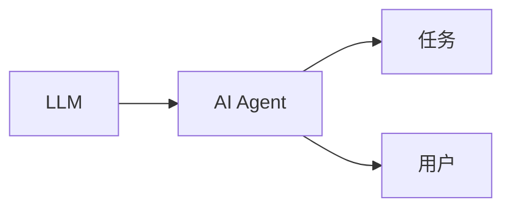
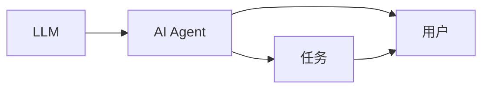

                 


```
# LLM在AI Agent概念形成与泛化中的作用

> 关键词：LLM, AI Agent, 概念形成, 泛化, 人工智能, 语言模型, 大语言模型

> 摘要：本文探讨了大语言模型（LLM）在AI Agent概念形成与泛化中的作用，分析了LLM在知识表示、推理、对话生成等方面的能力，以及其在多领域任务中的应用。通过详细分析LLM与AI Agent的核心概念与联系，结合实际案例，展示了如何将LLM应用到AI Agent的开发中，为读者提供了一个全面的视角来理解这一前沿技术。

---

# 第1章: LLM与AI Agent的背景与概念

## 1.1 LLM的基本概念
### 1.1.1 大语言模型的定义与特点
- 大语言模型（LLM）是一种基于深度学习的自然语言处理模型，具有以下特点：
  - 大规模：通常使用海量数据进行训练。
  - 多任务：能够处理多种自然语言处理任务（如分类、生成、问答等）。
  - 强大的上下文理解能力。
  - 可泛化性：能够在未见过的数据上表现出一定的推理能力。

### 1.1.2 LLM的核心技术与发展趋势
- 基于Transformer的架构。
- 预训练与微调的技术路线。
- 多模态化：结合图像、语音等多种模态信息。
- 可解释性与安全性：提升模型的透明度和可靠性。

### 1.1.3 LLM在AI Agent中的潜在价值
- 提供强大的自然语言理解和生成能力。
- 支持复杂任务的推理和决策。
- 实现人机交互的自然对话能力。

## 1.2 AI Agent的基本概念
### 1.2.1 AI Agent的定义与分类
- AI Agent：一种能够感知环境、自主决策并执行任务的智能体。
- 分类：
  - 按智能水平：反应式Agent、认知式Agent。
  - 按应用场景：服务型Agent、监控型Agent。

### 1.2.2 AI Agent的核心功能与应用场景
- 核心功能：
  - 感知环境：通过传感器或接口获取信息。
  - 决策与规划：基于信息做出决策并制定执行计划。
  - 执行任务：通过动作或输出完成目标。
- 应用场景：
  - 智能助手（如Siri、Alexa）。
  - 机器人控制。
  - 自动交易系统。

### 1.2.3 AI Agent与传统AI的区别
- AI Agent强调自主性和适应性。
- 传统AI更多关注特定任务的解决，而AI Agent注重动态环境中的实时决策。

## 1.3 LLM与AI Agent的关系
### 1.3.1 LLM如何赋能AI Agent
- 提供强大的语言理解和生成能力。
- 支持复杂的推理和决策过程。
- 实现自然的人机交互。

### 1.3.2 LLM在AI Agent概念形成中的作用
- 通过大规模预训练，LLM掌握了丰富的知识和语言规则。
- 在AI Agent的概念形成过程中，LLM充当了知识库和推理引擎的角色。

### 1.3.3 LLM在AI Agent泛化中的应用
- LLM的泛化能力使AI Agent能够处理多种语言和领域任务。
- 通过微调或提示工程，LLM可以快速适应新的应用场景。

## 1.4 本章小结
- 本章介绍了LLM和AI Agent的基本概念，分析了它们之间的关系，并探讨了LLM在AI Agent概念形成与泛化中的潜在价值。

---

# 第2章: LLM在AI Agent概念形成中的核心作用

## 2.1 LLM的知识表示能力
### 2.1.1 知识表示的基本概念
- 知识表示：将知识以某种形式表示出来，以便计算机理解和使用。
- 常见的知识表示方法：符号逻辑、向量表示、图结构等。

### 2.1.2 LLM在知识表示中的优势
- LLM通过大规模预训练掌握了丰富的语义信息。
- 能够将知识表示为连续的向量，便于计算和推理。

### 2.1.3 知识表示的数学模型与公式
- 以Word2Vec为例，通过上下文信息生成词向量：
  $$v_i = f(word_i)$$
  其中$f$是编码函数。

## 2.2 LLM的推理能力
### 2.2.1 推理的基本原理
- 基于概率的推理：通过计算条件概率进行决策。
- 基于符号逻辑的推理：通过逻辑规则进行推导。

### 2.2.2 LLM在推理中的应用
- 文本摘要：通过理解上下文生成摘要。
- 问题回答：基于上下文回答问题。
- 逻辑推理：通过语言模型进行逻辑推理。

### 2.2.3 推理的数学模型与公式
- 基于Transformer的推理模型：
  $$P(y|x) = \text{Transformer}(x)$$

## 2.3 LLM的对话生成能力
### 2.3.1 对话生成的基本原理
- 基于序列到序列模型（Seq2Seq）。
- 使用注意力机制生成连贯的对话。

### 2.3.2 LLM在对话生成中的优势
- 能够理解上下文并生成连贯的回答。
- 支持多轮对话，具备记忆能力。

### 2.3.3 对话生成的数学模型与公式
- 对话生成的条件概率公式：
  $$P(y|x) = \prod_{i=1}^{n} P(y_i|x_{<i}, y_{<i})$$

## 2.4 本章小结
- 本章详细探讨了LLM在知识表示、推理和对话生成方面的能力，分析了这些能力如何支持AI Agent的概念形成。

---

# 第3章: LLM在AI Agent泛化中的应用

## 3.1 LLM的泛化能力
### 3.1.1 泛化的基本概念
- 泛化：模型在未见过的数据上表现出的能力。
- 泛化能力的关键因素：数据多样性、模型复杂度。

### 3.1.2 LLM在泛化中的优势
- 大规模预训练使LLM具备强大的泛化能力。
- 通过微调或提示工程可以快速适应新任务。

### 3.1.3 泛化的数学模型与公式
- 泛化的损失函数：
  $$\mathcal{L}(\theta) = \mathbb{E}_{x,y}[-\log P(y|x; \theta)]$$
  其中$\theta$是模型参数。

## 3.2 LLM在多领域任务中的应用
### 3.2.1 多领域任务的基本概念
- 多领域任务：涉及多个不同领域的任务（如问答、翻译、文本分类）。

### 3.2.2 LLM在多领域任务中的应用案例
- 跨語言翻译：支持多种语言的互译。
- 多领域问答系统：回答不同领域的用户问题。

### 3.2.3 多领域任务的数学模型与公式
- 多领域任务的损失函数：
  $$\mathcal{L}(\theta) = \sum_{d=1}^{D} \mathcal{L}_d(\theta)$$
  其中$D$是领域数量，$\mathcal{L}_d$是第$d$个领域的损失函数。

## 3.3 LLM在复杂场景中的应用
### 3.3.1 复杂场景的基本概念
- 复杂场景：涉及多个任务、数据源或模态的场景。

### 3.3.2 LLM在复杂场景中的应用案例
- 多模态对话系统：结合图像和文本进行对话。
- 智能客服系统：结合用户历史行为进行个性化服务。

### 3.3.3 复杂场景的数学模型与公式
- 多模态模型的损失函数：
  $$\mathcal{L}(\theta) = \mathcal{L}_{\text{text}} + \mathcal{L}_{\text{image}}$$
  其中$\mathcal{L}_{\text{text}}$是文本任务的损失，$\mathcal{L}_{\text{image}}$是图像任务的损失。

## 3.4 本章小结
- 本章探讨了LLM在多领域任务和复杂场景中的应用，分析了其泛化能力如何支持AI Agent在不同场景中的应用。

---

# 第4章: LLM与AI Agent的核心概念与联系

## 4.1 LLM的核心概念
### 4.1.1 LLM的训练原理
- 预训练：基于大规模数据的无监督学习。
- 微调：针对特定任务的有监督学习。

### 4.1.2 LLM的推理机制
- 基于Transformer的自注意力机制。
- 解码器端的生成过程。

### 4.1.3 LLM的优化方法
- 参数优化：使用Adam或SGD等优化器。
- 模型压缩：减少模型参数量以降低计算成本。

## 4.2 AI Agent的核心概念
### 4.2.1 AI Agent的感知与决策
- 感知：通过传感器获取环境信息。
- 决策：基于感知信息做出行动决策。

### 4.2.2 AI Agent的交互与反馈
- 与用户或环境进行交互。
- 基于反馈调整行为策略。

### 4.2.3 AI Agent的自适应能力
- 根据环境变化动态调整策略。
- 学习新知识以适应新任务。

## 4.3 LLM与AI Agent的实体关系图
### 4.3.1 实体关系图的定义
- 通过图结构展示实体之间的关系。

### 4.3.2 LLM与AI Agent的实体关系


### 4.3.3 实体关系图的Mermaid流程图


## 4.4 本章小结
- 本章分析了LLM和AI Agent的核心概念，并通过实体关系图展示了它们之间的联系。

---

# 第5章: 项目实战——将LLM应用到AI Agent中

## 5.1 环境安装
### 5.1.1 安装Python和必要的库
- 使用Anaconda或虚拟环境管理工具。
- 安装PyTorch、Hugging Face Transformers等库。

### 5.1.2 下载LLM模型
- 使用Hugging Face Hub获取预训练模型。
- 下载如GPT-2、GPT-3等模型。

## 5.2 核心代码实现
### 5.2.1 加载模型和tokenizer
```python
from transformers import AutoModelForCausalLM, AutoTokenizer

model_name = "gpt2"
model = AutoModelForCausalLM.from_pretrained(model_name)
tokenizer = AutoTokenizer.from_pretrained(model_name)
```

### 5.2.2 定义生成函数
```python
def generate_response(prompt, max_length=50):
    inputs = tokenizer.encode(prompt, return_tensors="pt")
    outputs = model.generate(inputs, max_length=max_length, do_sample=True)
    response = tokenizer.decode(outputs[0], skip_special_tokens=True)
    return response
```

### 5.2.3 应用到AI Agent中
```python
class AIAssistant:
    def __init__(self):
        self.llm = AutoModelForCausalLM.from_pretrained("gpt2")
        self.tokenizer = AutoTokenizer.from_pretrained("gpt2")

    def respond(self, prompt):
        return generate_response(prompt)
```

## 5.3 代码应用解读与分析
- 通过LLM生成自然语言回答。
- 将LLM集成到AI Agent中，实现人机对话功能。

## 5.4 案例分析
### 5.4.1 案例1：智能客服
- 用户：我的订单在哪里？
- AI Agent：您的订单可以通过订单号在我们的网站上查询。

### 5.4.2 案例2：多语言翻译
- 用户：如何翻译“Hello”？
- AI Agent：在中文中，“Hello”翻译为“你好”。

## 5.5 本章小结
- 本章通过实际案例展示了如何将LLM应用到AI Agent中，实现自然语言处理和生成功能。

---

# 第6章: 总结与展望

## 6.1 总结
- LLM在AI Agent的概念形成与泛化中发挥了重要作用。
- LLM的能力包括知识表示、推理、对话生成和多领域任务处理。
- 通过将LLM与AI Agent结合，可以实现更智能、更自然的人机交互。

## 6.2 展望
- LLM的持续优化将提升AI Agent的性能和能力。
- 多模态LLM的应用将进一步扩展AI Agent的应用场景。
- 可解释性和安全性将是未来研究的重要方向。

---

# 作者：AI天才研究院/AI Genius Institute & 禅与计算机程序设计艺术 /Zen And The Art of Computer Programming
```

