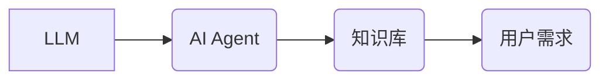
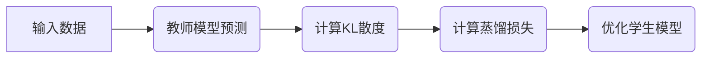
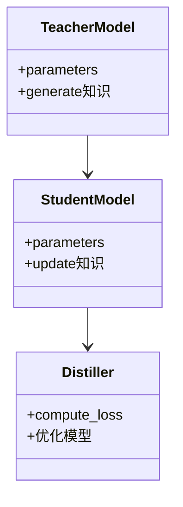
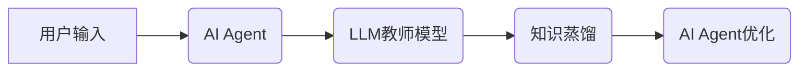

                 


# LLM在AI Agent知识蒸馏中的应用

## 关键词：LLM, AI Agent, 知识蒸馏, 机器学习, 智能系统

## 摘要：  
本文深入探讨了大语言模型（LLM）在AI Agent知识蒸馏中的应用，分析了知识蒸馏的基本原理、LLM的优势，以及在不同场景下的应用策略。通过系统化的分析与实践，本文为AI Agent的知识获取与优化提供了新的视角和方法。

---

# 第1章: 问题背景与核心概念

## 1.1 问题背景

### 1.1.1 AI Agent的发展现状  
AI Agent（人工智能代理）是一种能够感知环境、执行任务、与用户交互的智能系统。随着技术的发展，AI Agent已广泛应用于客服、智能助手、推荐系统等领域。然而，传统AI Agent的知识获取方式存在效率低、依赖大量数据的挑战。

### 1.1.2 大语言模型的崛起  
大语言模型（LLM）如GPT-3、PaLM等，凭借其强大的语言理解和生成能力，成为AI领域的焦点。LLM不仅能够处理复杂任务，还能通过蒸馏技术将知识传递给更小、更高效的模型。

### 1.1.3 知识蒸馏的必要性  
知识蒸馏是一种将复杂模型的知识迁移到简单模型的技术。通过蒸馏，AI Agent可以快速获取高质量的知识，同时降低计算和存储成本。

## 1.2 问题描述

### 1.2.1 AI Agent的知识获取挑战  
AI Agent需要从大量数据中提取知识，但传统方法效率低下，且难以适应动态变化的需求。

### 1.2.2 LLM在知识蒸馏中的独特优势  
LLM具有强大的知识表示能力和通用性，能够为AI Agent提供高质量的知识蒸馏源。

### 1.2.3 知识蒸馏的目标与边界  
知识蒸馏的目标是将LLM的知识迁移到AI Agent，使其具备高效解决问题的能力。其边界包括数据安全、知识适用性和蒸馏效率。

## 1.3 问题解决与核心要素

### 1.3.1 知识蒸馏的基本原理  
知识蒸馏通过教师模型（LLM）和学生模型（AI Agent）的交互，将知识从教师模型迁移到学生模型。

### 1.3.2 LLM在知识蒸馏中的角色  
LLM作为教师模型，负责生成高质量的知识表示，AI Agent作为学生模型，通过蒸馏过程学习这些知识。

### 1.3.3 核心要素与系统架构  
知识蒸馏系统的核心要素包括教师模型、学生模型、蒸馏算法和评估指标。系统架构涉及数据流、模型交互和知识传递。

## 1.4 本章小结  
本章从问题背景出发，分析了AI Agent的知识获取挑战，探讨了LLM在知识蒸馏中的优势，并明确了系统的核心要素。

---

# 第2章: LLM与AI Agent的知识蒸馏关系

## 2.1 核心概念原理

### 2.1.1 LLM的知识表示方式  
LLM通过概率分布和上下文理解，将知识表示为语义向量或概率分布。

### 2.1.2 AI Agent的知识需求特点  
AI Agent需要实时响应、高效推理和个性化服务，对知识的准确性和适用性要求高。

### 2.1.3 知识蒸馏的核心机制  
知识蒸馏通过损失函数优化，将教师模型的知识迁移到学生模型，同时保持知识的完整性和简洁性。

## 2.2 核心概念对比分析

### 2.2.1 传统知识蒸馏与LLM蒸馏的对比  
传统蒸馏依赖专家知识，LLM蒸馏利用模型生成能力，效率更高。

### 2.2.2 不同LLM模型的蒸馏效果分析  
不同LLM模型在蒸馏效果上存在差异，如GPT-3和PaLM在特定任务上的表现不同。

### 2.2.3 AI Agent应用场景中的蒸馏策略  
根据应用场景选择合适的蒸馏策略，如客服场景下的对话蒸馏。

## 2.3 实体关系图



## 2.4 本章小结  
本章通过对比分析和实体关系图，详细探讨了LLM与AI Agent的知识蒸馏关系。

---

# 第3章: 知识蒸馏算法的数学模型

## 3.1 算法原理概述

### 3.1.1 知识蒸馏的基本流程  
教师模型生成知识表示，学生模型通过损失函数优化，逐步逼近教师模型的知识。

### 3.1.2 LLM蒸馏的核心步骤  
包括知识提取、蒸馏损失计算和模型优化。

### 3.1.3 算法的输入输出关系  
输入包括教师模型和学生模型，输出为优化后的学生模型参数。

## 3.2 数学模型与公式

### 3.2.1 概率分布的KL散度公式  
$$D_{KL}(P||Q) = \sum P(i) \log \frac{P(i)}{Q(i)}$$

### 3.2.2 蒸馏损失函数  
$$L = \alpha D_{KL}(P||Q) + (1-\alpha)CE(P, Y)$$

### 3.2.3 模型压缩的优化目标  
$$\min_{\theta} \frac{1}{N}\sum_{i=1}^{N} L_i$$

## 3.3 算法流程图



## 3.4 本章小结  
本章通过数学公式和流程图，详细讲解了知识蒸馏算法的原理。

---

# 第4章: 系统分析与架构设计

## 4.1 问题场景介绍  
AI Agent需要在复杂场景中快速响应，依赖高效的知识蒸馏系统。

## 4.2 项目介绍  
本项目旨在设计一个基于LLM的知识蒸馏系统，提升AI Agent的知识获取效率。

## 4.3 系统功能设计

### 4.3.1 领域模型类图  


## 4.4 系统架构设计

### 4.4.1 系统架构图  


## 4.5 系统接口设计  
定义接口：知识蒸馏模块与教师模型、学生模型的交互接口。

## 4.6 系统交互流程图


## 4.7 本章小结  
本章通过系统设计和架构图，详细分析了知识蒸馏系统的实现方式。

---

# 第5章: 项目实战

## 5.1 环境安装  
安装Python、TensorFlow、Keras等工具。

## 5.2 核心代码实现

### 5.2.1 教师模型代码  
```python
def teacher_model():
    model = Sequential()
    model.add(Dense(64, activation='relu'))
    model.add(Dense(10, activation='softmax'))
    model.compile(optimizer='adam', loss='categorical_crossentropy', metrics=['accuracy'])
    return model
```

### 5.2.2 学生模型代码  
```python
def student_model():
    model = Sequential()
    model.add(Dense(32, activation='relu'))
    model.add(Dense(10, activation='softmax'))
    model.compile(optimizer='adam', loss='categorical_crossentropy', metrics=['accuracy'])
    return model
```

### 5.2.3 蒸馏过程代码  
```python
def distillation_process(teacher, student, X_train, y_train, y_distill):
    # 训练教师模型
    teacher.fit(X_train, y_train, epochs=10)
    # 生成蒸馏数据
    y_teacher = teacher.predict(X_train)
    # 蒸馏学生模型
    student.fit(X_train, y_distill, epochs=10)
```

## 5.3 代码解读与分析  
详细解读代码实现，分析蒸馏过程中的关键步骤。

## 5.4 实际案例分析  
以客服场景为例，分析蒸馏过程中的数据处理和模型优化。

## 5.5 本章小结  
本章通过实际项目，详细讲解了知识蒸馏的实现过程。

---

# 第6章: 最佳实践与总结

## 6.1 最佳实践

### 6.1.1 小结  
总结知识蒸馏的关键点和实际应用中的注意事项。

### 6.1.2 注意事项  
包括数据质量、模型选择和蒸馏参数的调优。

### 6.1.3 拓展阅读  
推荐相关书籍和论文，帮助读者深入学习。

## 6.2 本章小结  
本章总结了知识蒸馏的应用经验，为读者提供了实践指导。

---

# 作者：AI天才研究院 & 禅与计算机程序设计艺术

