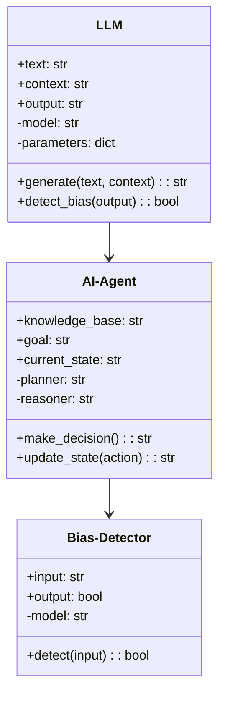
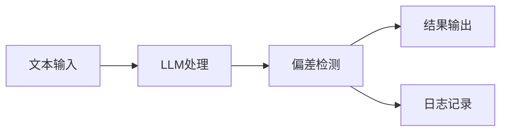

                 


# 第4章: 系统分析与架构设计

## 4.1 应用场景介绍
### 4.1.1 LLM在AI Agent中的应用场景
### 4.1.2 认知偏差识别的具体需求
### 4.1.3 系统设计的目标与范围

## 4.2 系统功能设计
### 4.2.1 领域模型设计


### 4.2.2 系统功能模块划分
- 文本输入模块
- 偏差检测模块
- 结果输出模块
- 系统管理模块

### 4.2.3 功能模块流程
- 文本输入模块接收用户的输入
- 偏差检测模块对输入进行处理并返回检测结果
- 结果输出模块将结果呈现给用户
- 系统管理模块负责系统的运行与维护

## 4.3 系统架构设计
### 4.3.1 系统架构图


### 4.3.2 系统组件与接口设计
- 输入接口：接收文本输入
- 输出接口：返回检测结果
- 日志接口：记录检测过程

## 4.4 系统交互流程
### 4.4.1 交互流程图
```mermaid
graph LR
    User->A[输入文本]
    A->B[LLM处理]
    B->C[偏差检测]
    C->D[返回结果]
    C->E[记录日志]
```

### 4.4.2 交互过程说明
- 用户输入文本
- 系统调用LLM进行处理
- LLM返回处理结果
- 系统进行偏差检测
- 返回检测结果并记录日志

## 4.5 本章小结

# 第5章: 项目实战

## 5.1 环境安装
### 5.1.1 安装Python环境
```bash
python --version
pip install --upgrade pip
```

### 5.1.2 安装LLM库
```bash
pip install transformers
pip install torch
```

### 5.1.3 安装其他依赖
```bash
pip install mermaid
pip install matplotlib
```

## 5.2 核心代码实现
### 5.2.1 LLM调用代码
```python
from transformers import AutoModelForTokenClassification, AutoTokenizer
import torch

model_name = "bert-base-uncased"
model = AutoModelForTokenClassification.from_pretrained(model_name)
tokenizer = AutoTokenizer.from_pretrained(model_name)
```

### 5.2.2 偏差检测代码
```python
def detect_bias(text):
    inputs = tokenizer(text, return_tensors="pt")
    outputs = model(**inputs)
    logits = outputs.logits
    predicted_class = torch.argmax(logits, dim=1)
    return predicted_class
```

### 5.2.3 结果输出代码
```python
text = "The sky is blue"
result = detect_bias(text)
print(f"Predicted class index: {result.item()}")
```

## 5.3 案例分析
### 5.3.1 案例背景
### 5.3.2 案例数据准备
```python
test_cases = [
    "Men are better than women in leadership roles.",
    "Women are better than men in leadership roles.",
    "Leadership roles are gender-neutral."
]
```

### 5.3.3 案例运行与结果分析
```python
for case in test_cases:
    print(f"Input: {case}")
    result = detect_bias(case)
    print(f"Predicted class index: {result.item()}\n")
```

## 5.4 项目总结
### 5.4.1 项目实现的关键点
### 5.4.2 项目中的问题与解决
### 5.4.3 项目成果与意义

## 5.5 本章小结

# 第6章: 总结与展望

## 6.1 研究总结
### 6.1.1 主要研究成果
### 6.1.2 创新点与不足
### 6.1.3 研究意义

## 6.2 未来展望
### 6.2.1 技术发展的方向
### 6.2.2 研究领域的拓展
### 6.2.3 实际应用的潜力

## 6.3 注意事项
### 6.3.1 使用中的常见问题
### 6.3.2 解决方法与建议
### 6.3.3 使用注意事项

## 6.4 拓展阅读
### 6.4.1 推荐书籍
### 6.4.2 推荐论文
### 6.4.3 推荐技术博客

## 6.5 本章小结

# 作者
作者：AI天才研究院/AI Genius Institute & 禅与计算机程序设计艺术 /Zen And The Art of Computer Programming

