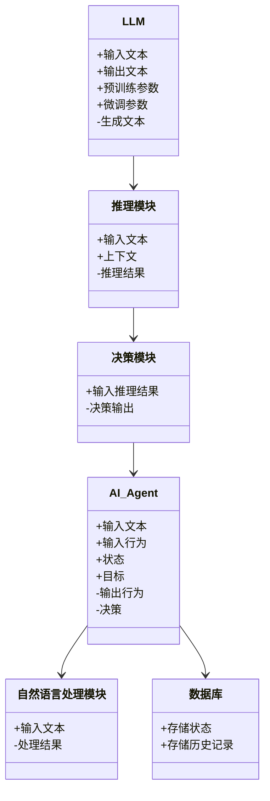
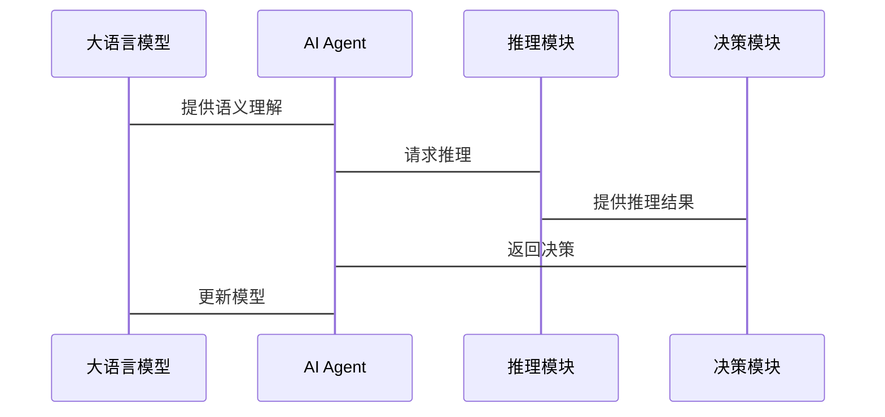

                 


# LLM在AI Agent语义推理能力上的应用

> 关键词：大语言模型，AI Agent，语义推理，自然语言处理，智能体，深度学习

> 摘要：本文将详细探讨大语言模型（LLM）在AI Agent语义推理能力上的应用。从LLM的基本概念和AI Agent的结构功能出发，逐步分析LLM如何赋能AI Agent的语义推理能力。文章涵盖核心概念对比、算法原理、系统架构设计、项目实战以及最佳实践等方面，结合数学公式、代码示例和图表，深入剖析LLM在AI Agent中的应用价值和实现细节。

---

# 第三部分: LLM与AI Agent的系统分析与架构设计

# 第4章: 系统分析与架构设计

## 4.1 问题场景介绍
### 4.1.1 项目背景
### 4.1.2 项目目标
### 4.1.3 项目范围
### 4.1.4 项目约束

## 4.2 系统功能设计
### 4.2.1 领域模型设计


### 4.2.2 功能模块划分
- 自然语言处理模块
- 推理模块
- 决策模块
- 数据库

## 4.3 系统架构设计
### 4.3.1 系统架构图


### 4.3.2 系统组件交互
- 输入：LLM处理自然语言输入
- 输出：AI Agent执行决策
- 数据流：推理模块与决策模块交互

## 4.4 系统接口设计
### 4.4.1 接口定义


## 4.5 系统交互流程
### 4.5.1 系统交互序列图


## 4.6 本章小结

---

# 第五部分: 项目实战与应用案例

# 第5章: 项目实战

## 5.1 项目环境安装
### 5.1.1 安装Python
```bash
python --version
pip install --upgrade pip
```

### 5.1.2 安装依赖库
```bash
pip install transformers torch
```

## 5.2 系统核心实现
### 5.2.1 加载LLM模型
```python
from transformers import AutoTokenizer, AutoModelForCausalLM
tokenizer = AutoTokenizer.from_pretrained("gpt2")
model = AutoModelForCausalLM.from_pretrained("gpt2")
```

### 5.2.2 实现推理模块
```python
def semantic_reasoning(input_text):
    inputs = tokenizer.encode(input_text, return_tensors="pt")
    outputs = model.generate(inputs, max_length=50)
    return tokenizer.decode(outputs[0], skip_special_tokens=True)
```

### 5.2.3 实现决策模块
```python
def decision_making(inference_result):
    # 简单决策逻辑示例
    if "需要帮助" in inference_result:
        return "提供帮助"
    else:
        return "继续执行其他任务"
```

### 5.2.4 整合到AI Agent
```python
class AI_Agent:
    def __init__(self):
        self.llm = AutoModelForCausalLM.from_pretrained("gpt2")
        self.tokenizer = AutoTokenizer.from_pretrained("gpt2")
    
    def process_input(self, input_text):
        inference_result = semantic_reasoning(input_text)
        decision = decision_making(inference_result)
        return decision

agent = AI_Agent()
result = agent.process_input("帮我写一封邮件")
print(result)
```

## 5.3 项目应用案例
### 5.3.1 案例分析
```python
input_text = "帮我写一封邮件"
print(agent.process_input(input_text))
```

### 5.3.2 代码实现解读
- 加载模型
- 推理模块实现
- 决策模块实现
- 整合到AI Agent

## 5.4 项目小结

---

# 第六部分: 总结与展望

# 第6章: 总结与展望

## 6.1 核心概念回顾
### 6.1.1 LLM的作用
### 6.1.2 AI Agent的功能
### 6.1.3 语义推理的重要性

## 6.2 算法与系统总结
### 6.2.1 算法总结
### 6.2.2 系统设计总结
### 6.2.3 项目实战总结

## 6.3 未来展望
### 6.3.1 技术发展趋势
### 6.3.2 研究方向
### 6.3.3 应用前景

## 6.4 最佳实践tips
- 模型选择
- 数据处理
- 性能优化
- 持续学习

## 6.5 小结

---

# 作者

作者：AI天才研究院/AI Genius Institute & 禅与计算机程序设计艺术 /Zen And The Art of Computer Programming

