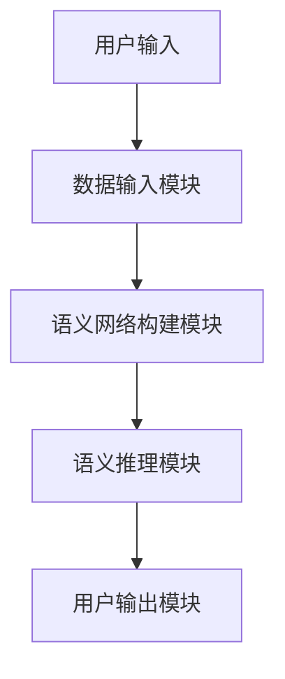

                 


# LLM在AI Agent语义网络构建中的应用

> 关键词：大语言模型, AI Agent, 语义网络, 知识图谱, 自然语言处理, 智能系统

> 摘要：本文系统地探讨了大语言模型（LLM）在AI Agent语义网络构建中的应用，分析了语义网络的核心概念、构建算法、系统架构设计以及实际项目实现。通过结合理论与实践，详细阐述了LLM如何驱动语义网络的构建与优化，为AI Agent的智能决策提供坚实的基础。文章内容涵盖从基础概念到高级算法，从系统设计到项目实战，旨在帮助读者全面理解和掌握LLM在语义网络构建中的应用。

---

## 第一部分: LLM与AI Agent语义网络构建基础

### 第1章: LLM与AI Agent概述

#### 1.1 LLM的基本概念
- **1.1.1 大语言模型的定义**
  - LLM（Large Language Model）是指基于深度学习的自然语言处理模型，具有大规模参数和丰富的语料库训练背景。
- **1.1.2 LLM的核心特点**
  - 大规模参数：通常拥有数十亿甚至更多的参数。
  - 预训练与微调：基于大规模通用数据预训练，然后针对特定任务进行微调。
  - 智能对话能力：能够理解和生成人类语言，支持多轮对话和上下文理解。
- **1.1.3 LLM与传统NLP模型的区别**
  - LLM具有更强的上下文理解和生成能力，能够处理复杂的语义关系。

#### 1.2 AI Agent的基本概念
- **1.2.1 AI Agent的定义**
  - AI Agent（人工智能代理）是指能够感知环境、自主决策并执行任务的智能实体。
- **1.2.2 AI Agent的主要类型**
  - 简单反射型：基于规则的简单响应。
  - 目标驱动型：基于明确目标执行任务。
  - 学习驱动型：通过机器学习模型实现智能决策。
- **1.2.3 AI Agent的应用场景**
  - 智能客服：通过对话系统解决用户问题。
  - 自动驾驶：通过环境感知和决策系统控制车辆。
  - 智能助手：帮助用户完成日程管理、信息检索等任务。

#### 1.3 语义网络的基本概念
- **1.3.1 语义网络的定义**
  - 语义网络是一种知识表示方法，通过节点（概念）和边（关系）描述实体之间的语义关联。
- **1.3.2 语义网络的特点**
  - 可视化：通过图结构展示知识关系。
  - 动态更新：能够根据新信息实时更新。
  - 多粒度：支持从微观到宏观的知识表示。
- **1.3.3 语义网络与知识图谱的区别**
  - 知识图谱：大规模结构化知识库，通常由人工或半自动方式构建。
  - 语义网络：动态生成的知识图谱，支持实时语义推理。

#### 1.4 本章小结
本章介绍了LLM、AI Agent和语义网络的基本概念，分析了它们之间的关系，为后续章节的深入探讨奠定了基础。

---

## 第二部分: LLM在AI Agent语义网络构建中的应用

### 第2章: LLM与语义网络的关系

#### 2.1 LLM如何生成语义信息
- **2.1.1 基于LLM的语义表示**
  - 使用LLM生成语义向量，表示词语、句子或段落的语义信息。
- **2.1.2 LLM与语义网络的结合**
  - 通过LLM生成语义向量，构建语义网络的节点和边。
  - 使用LLM进行语义推理，增强语义网络的智能性。

#### 2.2 LLM在AI Agent中的应用
- **2.2.1 语义网络在对话系统中的应用**
  - 基于语义网络进行对话上下文理解与关联。
  - 通过语义网络实现多轮对话的连贯性。
- **2.2.2 语义网络在任务规划中的应用**
  - 基于语义网络进行任务分解与优先级排序。
  - 使用语义网络进行任务相关性分析。
- **2.2.3 语义网络在知识检索中的应用**
  - 基于语义网络进行知识关联与推理。
  - 使用语义网络实现知识图谱的动态更新。

#### 2.3 本章小结
本章分析了LLM在语义网络构建中的核心作用，探讨了语义网络在AI Agent中的具体应用场景。

---

## 第三部分: 语义网络构建的核心算法与实现

### 第3章: 语义网络构建的核心算法

#### 3.1 基于向量的语义表示方法
- **3.1.1 词嵌入（Word Embedding）**
  - 使用Word2Vec、GloVe等模型生成词向量。
- **3.1.2 句子嵌入（Sentence Embedding）**
  - 使用BERT、RoBERTa等模型生成句子向量。
- **3.1.3 段落嵌入（Paragraph Embedding）**
  - 使用Doc2Vec等模型生成段落向量。

#### 3.2 基于图结构的语义网络构建
- **3.2.1 图结构表示**
  - 使用节点表示概念，边表示概念之间的关系。
- **3.2.2 图构建算法**
  - 基于相似度的图构建：计算节点之间的相似度，添加边。
  - 基于关联规则的图构建：根据语义关联规则生成边。

#### 3.3 基于概率的语义关联计算
- **3.3.1 语义关联概率计算**
  - 使用LLM生成语义关联概率。
  - 基于条件概率公式计算语义关联强度。
- **3.3.2 语义网络优化算法**
  - 基于拉普拉斯矩阵的语义网络优化。
  - 基于随机游走的语义网络优化。

#### 3.4 本章小结
本章详细介绍了语义网络构建的核心算法，包括向量表示方法、图结构构建算法和语义关联概率计算方法。

---

## 第四章: 基于LLM的语义网络系统架构设计

### 4.1 系统架构概述
- **4.1.1 系统功能模块划分**
  - 数据输入模块：接收用户输入或外部数据。
  - 语义网络构建模块：基于LLM构建语义网络。
  - 语义推理模块：基于语义网络进行推理。
  - 用户输出模块：输出推理结果或响应。

#### 4.2 系统架构设计
- **4.2.1 系统输入输出接口设计**
  - 输入接口：支持文本输入、语音输入等。
  - 输出接口：支持文本输出、语音输出等。
- **4.2.2 系统交互流程**
  - 用户输入查询请求。
  - 系统解析请求，生成语义网络。
  - 系统基于语义网络进行推理，生成响应。
  - 系统输出响应。

#### 4.3 系统架构图


#### 4.4 本章小结
本章详细描述了基于LLM的语义网络系统的架构设计，包括功能模块划分和系统交互流程。

---

## 第五章: 项目实战

### 5.1 项目背景与目标
- **项目背景**
  - 构建一个基于LLM的AI Agent，支持语义网络构建与推理。
- **项目目标**
  - 实现语义网络的动态构建与优化。
  - 实现基于语义网络的智能对话与任务规划。

### 5.2 项目实现
#### 5.2.1 环境搭建
- **Python环境**
  - 安装Python 3.8及以上版本。
  - 安装必要的库：transformers、networkx、numpy。
- **LLM模型选择**
  - 使用预训练的GPT-3模型。
  - 使用Hugging Face提供的模型接口。

#### 5.2.2 核心代码实现
- **语义网络构建代码**
```python
import networkx as nx
from transformers import AutoModelForMaskedLM, AutoTokenizer

model_name = "gpt2"
tokenizer = AutoTokenizer.from_pretrained(model_name)
model = AutoModelForMaskedLM.from_pretrained(model_name)

def build_semantic_network(text):
    tokens = tokenizer.encode(text, add_special_tokens=True)
    # 构建语义网络
    pass
```

- **语义推理代码**
```python
def semantic_reasoning(graph, query):
    # 基于图结构进行语义推理
    pass
```

#### 5.2.3 项目小结
本章通过实际项目展示了基于LLM的语义网络构建与推理的实现过程，帮助读者理解理论与实践的结合。

---

## 第六章: 高级应用与未来展望

### 6.1 高级应用
- **6.1.1 语义网络的优化与增强**
  - 基于多模态数据的语义网络构建。
  - 基于强化学习的语义网络优化。
- **6.1.2 个性化语义网络构建**
  - 基于用户偏好构建个性化语义网络。
  - 基于用户行为数据动态更新语义网络。

### 6.2 未来展望
- **6.2.1 新型LLM的发展**
  - 更大规模的模型：如GPT-4的出现。
  - 更高效的模型：如PaLM的出现。
- **6.2.2 语义网络的扩展应用**
  - 在智能城市中的应用。
  - 在医疗健康中的应用。

### 6.3 本章小结
本章探讨了语义网络的高级应用与未来发展方向，为读者提供了更广阔的视野。

---

## 第七章: 总结与展望

### 7.1 核心总结
- 本文系统地探讨了LLM在AI Agent语义网络构建中的应用。
- 详细分析了语义网络的核心算法与系统架构设计。
- 展示了基于LLM的语义网络构建与推理的项目实现。

### 7.2 未来展望
- 深入研究LLM与语义网络的结合。
- 探索语义网络的多模态应用。
- 推动语义网络在更多领域的应用。

### 7.3 本章小结
本章总结了全文的核心内容，并展望了未来的发展方向。

---

## 作者：AI天才研究院/AI Genius Institute & 禅与计算机程序设计艺术 /Zen And The Art of Computer Programming

---

这篇文章系统地探讨了LLM在AI Agent语义网络构建中的应用，内容涵盖从基础概念到高级算法，从系统设计到项目实战，旨在帮助读者全面理解和掌握LLM在语义网络构建中的应用。

