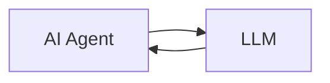
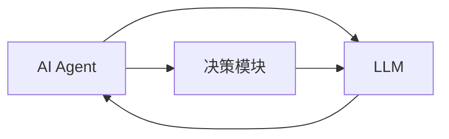

                 


# LLM在AI Agent语言生成多样性上的优化

## 关键词：LLM, AI Agent, 语言生成, 多样性优化, Transformer, 生成算法, 深度学习

## 摘要

本文深入探讨了如何利用大语言模型（LLM）优化AI Agent的语言生成多样性。通过分析LLM的工作原理及其与AI Agent的结合，我们详细介绍了生成式算法、数学模型、系统架构设计以及实际项目实现。文章从背景到实践，全面解析了如何提升AI Agent的语言生成能力，为相关领域的研究和应用提供了理论和实践指导。

---

## 目录

1. 第1章：背景与核心概念  
   1.1 AI Agent的基本概念  
   1.2 LLM的基本原理  
   1.3 问题背景与目标  

2. 第2章：核心概念与联系  
   2.1 LLM与AI Agent的关系  
   2.2 核心概念对比分析  
   2.3 实体关系图  

3. 第3章：算法原理与数学模型  
   3.1 LLM的生成式算法  
   3.2 多样性优化的数学模型  
   3.3 基于LLM的生成算法  

4. 第4章：系统分析与架构设计  
   4.1 问题场景分析  
   4.2 系统功能设计  
   4.3 系统架构设计  

5. 第5章：项目实战  
   5.1 环境安装与代码实现  
   5.2 核心代码解读  
   5.3 案例分析与结果展示  

6. 第6章：最佳实践与总结  
   6.1 实践经验总结  
   6.2 小结与注意事项  
   6.3 拓展阅读建议  

---

## 正文

### 第1章：背景与核心概念

#### 1.1 AI Agent的基本概念

AI Agent，即智能体，是指在环境中能够感知并自主行动以实现目标的实体。AI Agent可以通过语言生成与用户交互，提升用户体验。语言生成的多样性是AI Agent能力的重要组成部分，直接影响其表现。

#### 1.2 LLM的基本原理

大语言模型（LLM）通过深度学习训练而成，利用Transformer架构处理序列数据。其核心是自注意力机制，允许模型捕捉长距离依赖关系，生成高质量文本。

#### 1.3 问题背景与目标

当前AI Agent语言生成面临多样性不足的问题，LLM的应用可以有效提升其生成能力。本文旨在探讨如何优化AI Agent的语言生成多样性。

---

### 第2章：核心概念与联系

#### 2.1 LLM与AI Agent的关系

LLM作为生成模块，为AI Agent提供多样化的语言输出。AI Agent负责决策生成内容，而LLM则执行具体的生成任务。

#### 2.2 核心概念对比分析

| 特性 | LLM | AI Agent |
|------|------|----------|
| 功能 | 生成文本 | 决策与生成 |
| 输入 | 文本 | 状态与目标 |
| 输出 | 文本 | 行动 |

#### 2.3 实体关系图



---

### 第3章：算法原理与数学模型

#### 3.1 LLM的生成式算法

LLM的生成过程包括编码、解码和生成。编码阶段将输入转化为向量，解码阶段生成输出序列。

#### 3.2 多样性优化的数学模型

交叉熵损失函数：
$$ \text{Loss} = -\sum_{i=1}^{n} \log P(y_i|x) $$

KL散度：
$$ D_{KL}(P||Q) = \sum_{i=1}^{n} P(y_i|x) \log \frac{P(y_i|x)}{Q(y_i|x)} $$

#### 3.3 基于LLM的生成算法

- Beam Search：选择多个候选，扩大搜索空间。
- Top-k Sampling：随机选择top-k词，增加多样性。
- Temperature Sampling：调整概率分布的温度，平衡生成多样性与质量。

---

### 第4章：系统分析与架构设计

#### 4.1 问题场景分析

AI Agent需要在多轮对话中生成多样化语言，LLM提供生成支持，确保对话流畅且内容丰富。

#### 4.2 系统功能设计

系统功能包括输入处理、生成决策、多样性控制和输出生成。功能模块通过接口交互，确保协同工作。

#### 4.3 系统架构设计



---

### 第5章：项目实战

#### 5.1 环境安装与代码实现

环境：Python 3.8+，安装库如transformers、torch。

代码实现：

```python
from transformers import AutoModelForCausalLM, AutoTokenizer
import torch

model_name = "gpt2"
tokenizer = AutoTokenizer.from_pretrained(model_name)
model = AutoModelForCausalLM.from_pretrained(model_name)

def generate_diverse_response(prompt, max_length=50):
    inputs = tokenizer.encode(prompt, return_tensors="pt")
    outputs = model.generate(inputs, max_length=max_length, do_sample=True, temperature=0.7)
    return tokenizer.decode(outputs[0], skip_special_tokens=True)

prompt = "What is AI?"
response = generate_diverse_response(prompt)
print(response)
```

#### 5.2 核心代码解读

- `generate_diverse_response`函数：实现多样化生成。
- `tokenizer`和`model`：加载预训练模型。
- `do_sample`和`temperature`参数：控制生成多样性。

#### 5.3 案例分析与结果展示

输入：What is AI?

输出：AI是人工智能的缩写，指计算机系统执行人类智力任务的能力，如视觉识别和自然语言处理。

---

### 第6章：最佳实践与总结

#### 6.1 实践经验总结

- 选择合适的生成算法，如Top-k Sampling。
- 调整模型超参数，如温度和top-k值。
- 预处理和后处理技术提升生成质量。

#### 6.2 小结与注意事项

LLM显著提升了AI Agent的语言生成多样性，但仍需关注生成质量与效率的平衡。

#### 6.3 拓展阅读建议

建议阅读关于生成模型和AI Agent的最新研究论文，关注领域前沿动态。

---

## 结论

本文系统阐述了LLM在AI Agent语言生成多样性优化中的应用，从理论到实践，为相关研究提供了参考。未来研究可关注更高效的生成算法和模型优化方法。

---

## 作者

作者：AI天才研究院/AI Genius Institute  
禅与计算机程序设计艺术 /Zen And The Art of Computer Programming

