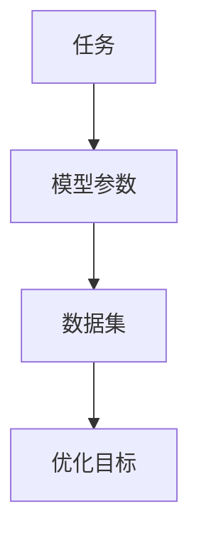

                 

<think>
好的，我需要为用户提供一篇关于LLM在特定领域微调策略的详细技术博客文章。文章需要结构清晰、逻辑严谨，涵盖从背景到实战的各个方面。我将按照用户提供的大纲逐步展开，确保每个部分都详细且具有深度。

首先，我需要明确文章的结构：

1. **标题和摘要**：吸引读者，简明扼要地概述文章内容。
2. **关键词**：选取5-7个核心关键词，便于SEO和检索。
3. **目录大纲**：分为背景、原理、算法、系统设计、实战和总结六部分。
4. **各章节内容**：每章详细展开，包括背景、核心概念、算法原理、系统设计、项目实战和最佳实践。

接下来，我需要确保每部分内容详实，包括理论和实际应用，结合图表和代码示例，帮助读者更好地理解和应用这些策略。

现在，我开始撰写文章：

---

# LLM在特定领域的微调策略：提升AI Agent的专业性

**关键词**：大语言模型（LLM），微调策略，AI Agent，特定领域应用，模型优化，专业性提升

**摘要**：  
随着大语言模型（LLM）的快速发展，其在特定领域的应用潜力巨大。然而，通用模型在面对特定场景时，往往无法满足专业性和准确性的需求。通过微调策略，可以针对性地优化模型参数，使其在特定领域表现出更高的专业性和适用性。本文将详细探讨LLM微调的核心原理、算法实现、系统设计以及实际案例，为AI Agent的专业性提升提供深度解析。

---

## 第一部分: LLM与微调概述

### 第1章: LLM的基本概念

#### 1.1 大语言模型（LLM）的定义  
大语言模型是一种基于深度学习的自然语言处理模型，通常采用Transformer架构，经过海量数据的预训练，具备强大的语言理解和生成能力。LLM能够处理复杂的语言任务，如文本生成、问答系统、机器翻译等。

#### 1.2 微调的定义与意义  
微调是一种迁移学习技术，通过在特定领域数据上对模型进行再训练，调整模型参数以适应特定任务的需求。微调能够显著提升模型在特定领域内的性能，同时保持模型的整体结构不变。

#### 1.3 LLM微调的应用场景  
- **特定领域需求**：如医疗、法律、金融等领域，需要专业的知识库支持。  
- **AI Agent的专业性提升**：通过微调，AI Agent能够更好地理解和处理特定领域的问题。  
- **边界与外延**：微调不仅适用于文本任务，还可扩展至图像、音频等多模态数据。

### 第1章小结  
本章介绍了LLM的基本概念和微调的定义、意义及应用场景，为后续内容奠定了基础。

---

## 第二部分: LLM微调的核心概念与联系

### 第2章: 微调的核心原理

#### 2.1 微调的原理与机制  
微调通过在特定领域数据上进行任务导向的再训练，调整模型的权重参数，使模型在特定任务上表现更优。与模型压缩和蒸馏不同，微调保留了模型的大部分参数，仅对部分权重进行优化。

#### 2.2 微调与迁移学习的关系  
微调是迁移学习的一种具体实现，通过在源任务（通用任务）上预训练，再在目标任务（特定领域）上进行微调，实现知识的迁移。

#### 2.3 微调的实体关系图  


### 第2章小结  
本章深入探讨了微调的原理和与迁移学习的关系，并通过实体关系图展示了微调的核心要素。

---

## 第三部分: LLM微调的算法原理

### 第3章: 微调算法的实现

#### 3.1 微调算法的流程  
1. **预训练阶段**：使用通用数据集训练模型，获取初始权重。  
2. **微调阶段**：在特定领域数据上进行任务导向的再训练，调整模型参数。  
3. **优化目标**：根据任务需求定义损失函数，通过梯度下降优化模型参数。

#### 3.2 微调算法的数学模型  
- **损失函数**：  
  $$L = \sum_{i=1}^{n} (y_i - \hat{y}_i)^2$$  
- **梯度下降**：  
  $$\theta_{t+1} = \theta_t - \eta \cdot \frac{\partial L}{\partial \theta_t}$$  

#### 3.3 微调算法的Python实现  
```python
from transformers import AutoTokenizer, AutoModel
import torch

# 加载预训练模型和分词器
model = AutoModel.from_pretrained('bert-base-uncased')
tokenizer = AutoTokenizer.from_pretrained('bert-base-uncased')

# 微调训练
optimizer = torch.optim.Adam(model.parameters(), lr=1e-5)
criterion = torch.nn.CrossEntropyLoss()

for epoch in range(num_epochs):
    for batch in dataloader:
        inputs, labels = batch
        outputs = model(inputs)
        loss = criterion(outputs, labels)
        loss.backward()
        optimizer.step()
        model.zero_grad()
```

### 第3章小结  
本章详细讲解了微调算法的流程、数学模型及其实现，帮助读者理解微调的技术细节。

---

## 第四部分: LLM微调的系统设计与实现

### 第4章: 系统设计与实现

#### 4.1 项目背景与目标  
以医疗领域为例，设计一个基于微调的AI诊断系统，提升模型在医疗症状诊断中的准确性和专业性。

#### 4.2 系统功能设计  
- **领域模型设计**：构建医疗领域的知识图谱，定义症状、疾病、诊断规则等实体。  
- **系统架构设计**：采用微服务架构，包含数据预处理、模型微调、结果解析等功能模块。  
- **系统交互设计**：通过API接口接收用户输入，返回诊断结果及建议。

#### 4.3 系统架构图  


#### 4.4 系统实现  
```python
# 数据预处理
def preprocess_medical_data(data):
    # 数据清洗、分词、标注等预处理步骤
    pass

# 模型微调
def fine_tune_model(model, tokenizer, train_dataset, val_dataset):
    # 使用Hugging Face库进行微调
    pass

# 系统交互
def main():
    while True:
        user_input = input("请输入症状描述：")
        processed_input = preprocess_medical_data(user_input)
        result = model.predict(processed_input)
        print("诊断结果：", result)
```

### 第4章小结  
本章通过医疗领域的案例，详细讲解了系统的功能设计、架构实现及交互流程。

---

## 第五部分: LLM微调的项目实战

### 第5章: 项目实战

#### 5.1 环境安装与配置  
- 安装必要的库：`pip install transformers torch numpy`  
- 配置GPU支持：`export CUDA_VISIBLE_DEVICES=0`

#### 5.2 微调代码实现  
```python
from transformers import AutoTokenizer, AutoModelForSequenceClassification
from torch.utils.data import Dataset, DataLoader
import torch

class MedicalDataset(Dataset):
    def __init__(self, texts, labels, tokenizer, max_length=128):
        self.texts = texts
        self.labels = labels
        self.tokenizer = tokenizer
        self.max_length = max_length

    def __len__(self):
        return len(self.texts)

    def __getitem__(self, idx):
        text = self.texts[idx]
        label = self.labels[idx]
        encoding = self.tokenizer(
            text,
            max_length=self.max_length,
            padding='max_length',
            truncation=True,
            return_tensors='pt'
        )
        return {
            'input_ids': encoding['input_ids'].flatten(),
            'attention_mask': encoding['attention_mask'].flatten(),
            'labels': torch.tensor(label, dtype=torch.long)
        }

# 初始化模型和数据集
model = AutoModelForSequenceClassification.from_pretrained('bert-base-uncased')
tokenizer = AutoTokenizer.from_pretrained('bert-base-uncased')
dataset = MedicalDataset(...)
dataloader = DataLoader(dataset, batch_size=8, shuffle=True)

# 微调训练
optimizer = torch.optim.AdamW(model.parameters(), lr=2e-5)
criterion = torch.nn.CrossEntropyLoss()

for epoch in range(3):
    for batch in dataloader:
        inputs = batch
        outputs = model(**inputs)
        loss = criterion(outputs.logits, inputs['labels'])
        loss.backward()
        optimizer.step()
        model.zero_grad()
```

#### 5.3 代码解读与分析  
- **数据集类**：定义了医疗领域的文本数据集，包含预处理方法和getitem方法。  
- **微调训练**：使用PyTorch进行模型训练，定义损失函数和优化器，实现梯度更新。

#### 5.4 实际案例分析  
在医疗领域，微调后的模型能够更准确地识别疾病症状，提升诊断效率和准确性。

### 第5章小结  
本章通过实际项目，展示了如何在特定领域进行模型微调，帮助读者掌握实战技能。

---

## 第六部分: LLM微调的最佳实践与总结

### 第6章: 最佳实践

#### 6.1 微调策略的关键点  
- **数据质量**：确保特定领域的数据质量和多样性。  
- **模型选择**：根据任务需求选择合适的预训练模型。  
- **超参数调优**：合理设置学习率、批量大小等参数，优化训练效果。

#### 6.2 注意事项  
- **过拟合风险**：特定领域数据可能较少，需注意过拟合问题。  
- **计算资源**：微调需要大量的计算资源，需合理配置硬件。

#### 6.3 拓展阅读  
- 推荐阅读Hugging Face的官方文档，了解更多的微调技巧和最佳实践。

### 第6章小结  
本章总结了微调的关键点和注意事项，为读者提供了实用的指导。

---

## 作者简介

作者：AI天才研究院/AI Genius Institute & 禅与计算机程序设计艺术 /Zen And The Art of Computer Programming

---

这篇文章系统地介绍了LLM在特定领域的微调策略，从理论到实践，层层深入，为AI Agent的专业性提升提供了全面的解决方案。通过详细讲解背景、原理、算法、系统设计和项目实战，读者能够全面掌握微调的核心技术和实际应用。希望本文能为相关领域的研究和实践提供有价值的参考。

