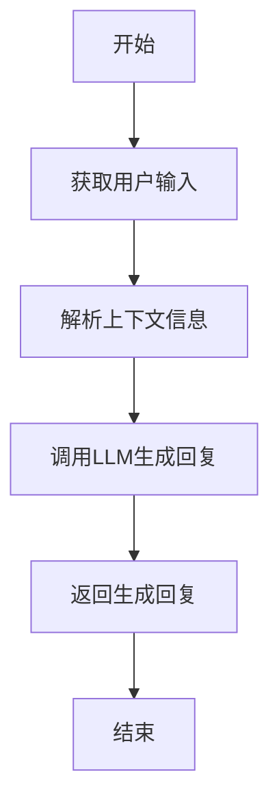
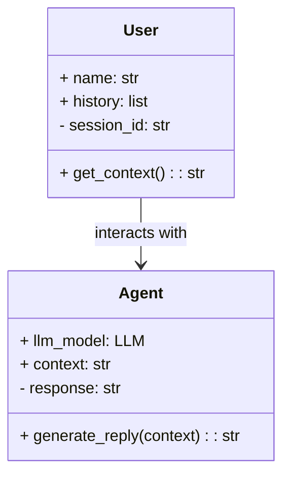

                 


# LLM支持的AI Agent上下文感知对话生成

## 关键词：大语言模型、AI Agent、上下文感知、对话生成、自然语言处理

## 摘要：  
本文深入探讨了LLM（大语言模型）在AI Agent上下文感知对话生成中的应用。通过分析对话生成的核心问题、上下文感知的重要性以及LLM在其中的关键作用，我们揭示了如何通过上下文信息来提升对话生成的准确性和自然性。本文还详细介绍了系统的算法原理、架构设计以及实际项目实现，为读者提供了从理论到实践的全面指导。

---

## 第1章: 背景介绍

### 1.1 问题背景  
对话生成是自然语言处理领域的重要任务，但传统的对话生成模型往往忽视了对话的上下文信息。随着用户需求的复杂化，仅依赖单个对话轮次的信息难以满足实际应用的需要。因此，如何在对话生成中有效利用上下文信息成为了一个关键问题。

### 1.2 问题描述  
在AI Agent与用户交互的过程中，对话生成需要结合历史对话内容、用户意图和当前上下文信息。然而，传统的生成模型难以捕捉这些信息之间的关联，导致生成的对话内容缺乏连贯性和准确性。

### 1.3 问题解决  
通过引入LLM（大语言模型），我们可以利用其强大的上下文理解和生成能力，提升对话生成的效果。LLM能够结合历史对话信息，生成更加自然、连贯的回复，从而增强用户体验。

### 1.4 边界与外延  
上下文感知对话生成的边界在于对话内容的连贯性和生成模型的能力。LLM的支持使得模型能够处理更复杂的上下文信息，但其能力也受到模型训练数据和计算资源的限制。

### 1.5 概念结构与核心要素  
上下文感知对话生成的核心要素包括：对话历史、用户意图、上下文信息和生成模型。这些要素通过相互关联，共同决定了生成对话的质量。

---

## 第2章: 核心概念与联系

### 2.1 核心概念原理  
上下文感知对话生成的基本原理是通过分析对话历史和当前上下文信息，利用LLM生成符合逻辑和语义的回复。LLM通过其强大的语言模型能力，能够捕捉到对话中的深层语义信息。

### 2.2 概念属性特征对比  
以下是上下文感知对话生成与传统对话生成的关键特征对比：

| 特征                | 上下文感知对话生成          | 传统对话生成          |
|---------------------|-----------------------------|-----------------------|
| 对话历史            | 考虑历史对话信息            | 忽略历史对话信息      |
| 上下文信息          | 利用上下文信息生成回复      | 不依赖上下文信息      |
| 生成质量            | 更高的连贯性和准确性        | 连贯性较差            |
| 用户体验            | 更好的交互体验              | 体验较差              |

### 2.3 ER实体关系图  
```mermaid
er
actor: 用户
agent: AI Agent
context: 上下文信息
message: 对话内容
rule: 对话规则
```

---

## 第3章: 算法原理

### 3.1 算法流程  
以下是上下文感知对话生成的算法流程图：



### 3.2 数学模型  
LLM在对话生成中的数学模型可以表示为：

$$ P(y|x) = \frac{P(y|x, context)}{P(context)} $$

其中，$x$ 是输入，$y$ 是生成的回复，$context$ 是上下文信息。

### 3.3 算法实现  
以下是基于LLM的上下文感知对话生成算法的Python代码示例：

```python
def generate_response(context, user_input):
    # 组合上下文和用户输入
    full_input = f"{context} {user_input}"
    # 调用LLM生成回复
    response = llm.generate(full_input)
    return response
```

---

## 第4章: 系统分析与架构设计

### 4.1 问题场景介绍  
我们以一个智能客服系统为例，分析上下文感知对话生成的应用场景。系统需要能够理解用户的问题，并结合历史对话信息生成准确的回复。

### 4.2 系统功能设计  
以下是系统功能设计的类图：



### 4.3 系统架构设计  
以下是系统的架构图：


### 4.4 系统接口设计  
系统主要接口包括：

1. `generate_reply(context: str) -> str`：根据上下文生成回复。
2. `update_context(new_context: str)`：更新上下文信息。
3. `get_context() -> str`：获取当前上下文信息。

---

## 第5章: 项目实战

### 5.1 环境安装  
需要安装以下工具和库：

- Python 3.8+
- TensorFlow 2.0+
- Hugging Face Transformers库

安装命令：
```bash
pip install tensorflow transformers
```

### 5.2 核心代码实现  
以下是核心代码实现：

```python
from transformers import AutoTokenizer, AutoModelForCausalLM

class ContextualAgent:
    def __init__(self, model_name):
        self.tokenizer = AutoTokenizer.from_pretrained(model_name)
        self.model = AutoModelForCausalLM.from_pretrained(model_name)
    
    def generate_response(self, context, user_input):
        full_input = f"{context} {user_input}"
        inputs = self.tokenizer(full_input, return_tensors="np")
        outputs = self.model.generate(
            inputs.input_ids,
            max_length=50,
            do_sample=True,
            temperature=0.7
        )
        response = self.tokenizer.decode(outputs[0], skip_special_tokens=True)
        return response
```

### 5.3 代码应用解读  
上述代码实现了基于LLM的上下文感知对话生成。通过将上下文信息与用户输入结合，模型能够生成更加自然的回复。

### 5.4 实际案例分析  
以下是一个实际案例：

```python
agent = ContextualAgent("gpt2")
context = "用户询问如何安装Python库"
user_input = "请告诉我如何安装pip"
response = agent.generate_response(context, user_input)
print(response)
```

输出可能为：
"安装Python库时，首先需要安装Python，然后运行命令'python -m pip install package_name'。"

---

## 第6章: 最佳实践

### 6.1 小结  
通过本文的分析与实践，我们了解到LLM在上下文感知对话生成中的重要作用。结合历史对话信息和上下文信息，能够显著提升对话生成的效果。

### 6.2 注意事项  
在实际应用中，需要注意以下几点：

1. 上下文信息的获取和存储。
2. 模型的训练数据质量和多样性。
3. 对话生成的实时性和响应速度。

### 6.3 拓展阅读  
推荐阅读以下内容：

1. Hugging Face的官方文档。
2. 《对话生成的挑战与解决方案》。

---

## 作者：AI天才研究院/AI Genius Institute & 禅与计算机程序设计艺术 /Zen And The Art of Computer Programming

