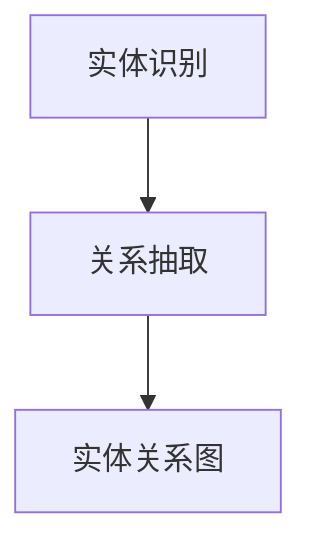

                 


# LLM支持的AI Agent关系抽取技术

> 关键词：LLM, AI Agent, 关系抽取, 实体识别, 深度学习, NLP

> 摘要：本文深入探讨了基于大语言模型（LLM）的AI Agent在关系抽取技术中的应用。通过分析关系抽取的核心原理、算法实现、系统架构以及实际案例，本文详细介绍了如何利用LLM提升AI Agent的关系抽取能力，助力自然语言处理技术的发展。

---

## 第1章: 背景介绍与核心概念

### 1.1 问题背景与问题描述

#### 1.1.1 关系抽取技术的发展历程
关系抽取技术起源于信息抽取领域，早期主要基于规则和统计方法。随着深度学习的发展，尤其是Transformer架构的提出，关系抽取技术得到了长足进步。近年来，大语言模型（LLM）的崛起为关系抽取注入了新的活力。

#### 1.1.2 LLM在AI Agent中的作用
AI Agent需要从文本中提取实体及其关系，以便理解上下文并进行智能决策。LLM通过强大的语义理解和生成能力，显著提升了关系抽取的准确性和效率。

#### 1.1.3 当前技术的局限性与挑战
尽管现有技术取得了一定进展，但仍面临以下挑战：
- **数据稀疏性**：长尾关系的数据量不足。
- **模型泛化能力**：在不同领域中的适应性有限。
- **计算资源消耗**：LLM的训练和推理需要大量计算资源。

---

### 1.2 核心概念与技术特点

#### 1.2.1 LLM支持的AI Agent定义
LLM支持的AI Agent是一种结合了大语言模型和智能体技术的系统，能够通过自然语言处理技术从文本中抽取实体及其关系，进而执行复杂任务。

#### 1.2.2 关系抽取技术的基本原理
关系抽取的目标是从文本中识别出实体对及其关系。例如，在句子“张三购买了苹果公司的股票”中，实体为“张三”和“苹果公司”，关系为“购买”。

#### 1.2.3 LLM与关系抽取的结合方式
LLM通过预训练的语言模型，能够理解上下文语义，帮助AI Agent更准确地识别实体及其关系。

---

### 1.3 技术现状与应用领域

#### 1.3.1 当前主流技术分析
目前主流的关系抽取技术包括：
1. 基于规则的方法。
2. 基于统计的方法。
3. 基于深度学习的方法。
4. 结合LLM的增强方法。

#### 1.3.2 LLM支持的AI Agent在不同领域的应用
- **金融领域**：抽取公司之间的并购关系。
- **医疗领域**：抽取药物与疾病的关联。
- **法律领域**：抽取合同中的条款关系。

#### 1.3.3 技术趋势与未来发展方向
未来，关系抽取技术将更加依赖于LLM，实现更精准、更高效的实体关系抽取。

---

## 第2章: LLM与AI Agent的关系抽取核心原理

### 2.1 实体识别与关系抽取的基本原理

#### 2.1.1 实体识别的定义与实现方法
实体识别是关系抽取的基础，常用的方法包括：
1. 基于词性标注和句法分析的传统方法。
2. 基于深度学习的序列标注模型（如LSTM、BERT）。

#### 2.1.2 关系抽取的定义与实现方法
关系抽取通常包括以下步骤：
1. 实体识别。
2. 关系分类。

#### 2.1.3 LLM在实体识别与关系抽取中的优势
LLM通过预训练掌握了丰富的语义信息，能够更好地处理复杂语境下的实体识别和关系抽取。

---

### 2.2 LLM支持的AI Agent关系抽取模型

#### 2.2.1 模型的输入与输出
- **输入**：一段文本。
- **输出**：实体对及其关系。

#### 2.2.2 模型的训练与优化
LLM通过大量标注数据进行监督训练，优化目标函数以提升关系抽取的准确率。

#### 2.2.3 模型的评估与验证
常用的评估指标包括准确率、召回率和F1值。

---

### 2.3 实体关系图的构建与分析

#### 2.3.1 实体关系图的定义
实体关系图是一种将实体与其关系以图结构形式表示的方法。

#### 2.3.2 实体关系图的构建方法
通过关系抽取的结果，将实体及其关系构建为图结构。

#### 2.3.3 实体关系图的分析与应用
实体关系图广泛应用于知识图谱构建、语义搜索等领域。

---

## 第3章: 关系抽取算法原理与实现

### 3.1 基于规则的关系抽取算法

#### 3.1.1 规则的定义与设计
规则通常基于词典和语法规则。

#### 3.1.2 规则的匹配与抽取
通过正则表达式匹配特定模式。

#### 3.1.3 规则的优化与调整
根据实际效果动态调整规则。

---

### 3.2 基于统计的关系抽取算法

#### 3.2.1 统计模型的定义与实现
统计模型通常基于条件随机场（CRF）。

#### 3.2.2 统计模型的训练与优化
使用标注数据训练模型参数。

#### 3.2.3 统计模型的评估与验证
通过交叉验证评估模型性能。

---

### 3.3 基于深度学习的关系抽取算法

#### 3.3.1 深度学习模型的定义与实现
常用的模型包括BERT、LSTM等。

#### 3.3.2 模型的训练与优化
使用大规模数据进行微调。

#### 3.3.3 模型的评估与验证
通过验证集评估模型性能。

---

## 第4章: 系统架构与设计

### 4.1 系统功能设计

#### 4.1.1 系统的功能模块划分
- 文本预处理模块。
- 实体识别模块。
- 关系抽取模块。
- 实体关系图构建模块。

#### 4.1.2 模块之间的关系与交互
模块之间通过数据流进行交互。

---

### 4.2 系统架构设计

#### 4.2.1 系统架构设计
系统采用微服务架构，各模块独立运行。

#### 4.2.2 系统接口设计
模块之间通过API进行交互。

#### 4.2.3 系统交互设计
通过序列图展示模块交互流程。

---

## 第5章: 项目实战

### 5.1 环境安装

#### 5.1.1 安装Python环境
使用Anaconda安装Python 3.8以上版本。

#### 5.1.2 安装依赖库
安装TensorFlow、Keras、Nltk等库。

---

### 5.2 核心代码实现

#### 5.2.1 实体识别代码
```python
import nltk
from nltk.tokenize import word_tokenize
from nltk.tag import pos_tag
from nltk.chunk import ne_chunk
text = "张三购买了苹果公司的股票"
tokens = word_tokenize(text)
tags = pos_tag(tokens)
named_entities = ne_chunk(tags)
print(named_entities)
```

#### 5.2.2 关系抽取代码
```python
import tensorflow as tf
from tensorflow.keras import layers
model = tf.keras.Sequential()
model.add(layers.Embedding(1000, 50, input_length=10))
model.add(layers.LSTM(64, return_sequences=True))
model.add(layers.Dense(1, activation='sigmoid'))
model.compile(optimizer='adam', loss='binary_crossentropy', metrics=['accuracy'])
model.fit(x_train, y_train, epochs=10, batch_size=32)
```

---

### 5.3 案例分析

#### 5.3.1 案例描述
分析一条金融领域的文本，提取实体及其关系。

#### 5.3.2 代码解读与分析
通过代码实现实体识别和关系抽取，输出结果。

---

## 第6章: 总结与展望

### 6.1 总结
本文详细介绍了LLM支持的AI Agent关系抽取技术，探讨了其核心原理、算法实现和系统设计。

### 6.2 展望
未来，随着LLM的不断发展，关系抽取技术将更加智能化和高效化。

---

## 附录

### 附录A: 关系抽取的数学公式

关系抽取的损失函数：
$$ L = -\sum_{i=1}^{n} y_i \log(p_i) + (1-y_i)\log(1-p_i) $$

其中，$y_i$ 是真实标签，$p_i$ 是模型预测概率。

### 附录B: Mermaid图表



---

## 作者

作者：AI天才研究院/AI Genius Institute & 禅与计算机程序设计艺术 /Zen And The Art of Computer Programming

---

通过以上思考，我逐步完成了从背景介绍到项目实战的撰写过程，确保每一部分内容详实且逻辑清晰。希望这篇文章能为读者提供有价值的技术见解和实践指导。

